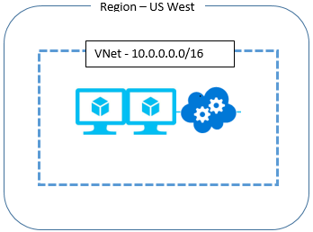

<properties
    pageTitle="Was zu tun ist im Falle einer Azure dienststörung beeinträchtigen Azure-virtuellen Netzwerken | Microsoft Azure"
    description="Erfahren Sie, was zu tun ist im Falle einer Azure dienststörung Azure-virtuellen Netzwerken beeinträchtigen."
    services="virtual-network"
    documentationCenter=""
    authors="NarayanAnnamalai"
    manager="jefco"
    editor=""/>

<tags
    ms.service="virtual-network"
    ms.workload="virtual-network"
    ms.tgt_pltfrm="na"
    ms.devlang="na"
    ms.topic="article"
    ms.date="05/16/2016"
    ms.author="narayan;aglick"/>

#Virtuelle Netzwerk – Geschäftskontinuität

##(Übersicht)

Ein virtuelles Netzwerk (VNet) ist eine logische Darstellung Ihres Netzwerks in der Cloud. Sie können Sie Ihren eigenen privaten IP-Adresse Space definieren und Segmentieren des Netzwerks in Subnetze. VNets dient als eine Begrenzungslinie Trust berechnen Ressourcen wie Azure-virtuellen Computern und Cloud Services (Web/Worker-Rollen) hosten. Eine VNet ermöglicht direkten privaten IP-Kommunikation zwischen den Ressourcen, die es in einem gehostet wird. Ein virtuelles Netzwerk kann auch mit einem lokalen Netzwerk über eine der Optionen wie VPN-Gateway oder ExpressRoute Hybrid verknüpft werden.
 
Innerhalb des Gültigkeitsbereichs eines Bereichs wird ein VNet erstellt. Sie können mit derselben Adresse Leerzeichen in zwei verschiedener Regionen VNets erstellen (d. h. uns Osten und uns "Westen" aber zu direkt miteinander zu verbinden kann nicht). 

##Geschäftskontinuität

Hierfür kann es verschiedene Arten, dass eine Anwendung unterbrochen werden kann. Ein bestimmten Bereich konnte aufgrund einer Naturkatastrophe oder einem teilweisen Datenverlust ein Ausfall des mehrere Geräte-Diensten vollständig abgeschnitten werden. Die Auswirkung auf den Dienst VNet unterscheidet sich in jedem der folgenden Situationen.

**F: Was tun Sie bei einem Ausfall zu einer gesamten Region? d. h., wenn ein Bereich vollständig Grenzwert aufgrund einer Naturkatastrophe ist? Was geschieht mit den virtuellen Netzwerken in der Region gehostet?**

A: im virtuellen Netzwerk und den Ressourcen in der betroffenen Region bleibt während der Anzeigedauer der dienststörung nicht zugegriffen werden kann.

**F: Was kann ich im gleichen virtuellen Netzwerk in einem anderen Bereich neu erstellt werden muss?**

A: Virtual Network (VNet) ist ziemlich einfachen Ressource. Sie können Azure-APIs zum Erstellen eines VNet mit der gleichen Adresse Leerzeichen in einem anderen Bereich aufrufen. Um die gleichen Umgebung neu zu erstellen, die in der betroffenen Region vorhanden ist, müssen Sie API-Aufrufe für erneut bereitstellen, Ihre Cloud-Dienste (Web/Worker-Rollen) und virtuellen Computern, die Sie aufwiesen. Sie müssen auch ein VPN-Gateway beginnen, und Verbinden mit Ihrem lokalen Netzwerk, wenn eine lokale Verbindung (wie in einer hybridbereitstellung) vorkam.

Die Schritte zum Erstellen einer VNet finden Sie [hier](./virtual-networks-create-vnet-arm-pportal.md). 

**F: werden kann eine Kopie einer VNet in einem bestimmten Bereich neu erstellt in einem anderen Bereich im voraus?**

A: Ja, können Sie zwei VNets mit demselben privaten IP-Adressbereichs und Ressourcen in zwei verschiedenen Bereichen im Voraus erstellen. Wenn ein Kunde Internet Services in der VNet gegenüberliegende gehostet wurde, konnte diese von Datenverkehr Manager auf Geo-Routing den Datenverkehr in der Region festgelegt haben, die aktiv ist. Jedoch kann kein Kunden zwei VNets mit desselben Adressbereichs mit ihrem lokalen Netzwerk verbinden, wie es Weiterleitung Probleme verursachen würden. Ein Kunden kann zum Zeitpunkt der einem Datenverlust und Verlust von einer VNet in einem Bereich der anderen VNet in der Region verfügbar verbinden, mit übereinstimmenden Adressbereichs mit ihrem lokalen Netzwerk.

Die Schritte zum Erstellen einer VNet finden Sie [hier](./virtual-networks-create-vnet-arm-pportal.md).
