<properties 
   pageTitle="Verwalten von NSGs mithilfe von des Preview-Portals in Ressourcenmanager | Microsoft Azure"
   description="Erfahren Sie, wie bereits vorhandene NSGs mithilfe von des Preview-Portals in Ressourcenmanager verwalten"
   services="virtual-network"
   documentationCenter="na"
   authors="jimdial"
   manager="carmonm"
   editor=""
   tags="azure-resource-manager"
/>
<tags  
   ms.service="virtual-network"
   ms.devlang="na"
   ms.topic="article"
   ms.tgt_pltfrm="na"
   ms.workload="infrastructure-services"
   ms.date="03/14/2016"
   ms.author="jdial" />

# Verwalten von NSGs mithilfe von des Preview-Portals

> [AZURE.SELECTOR]
- [Portal](virtual-network-manage-nsg-arm-portal.md)
- [PowerShell](virtual-network-manage-nsg-arm-ps.md)
- [Azure CLI](virtual-network-manage-nsg-arm-cli.md)

[AZURE.INCLUDE [virtual-network-manage-nsg-intro-include.md](../../includes/virtual-network-manage-nsg-intro-include.md)]

[AZURE.INCLUDE [azure-arm-classic-important-include](../../includes/learn-about-deployment-models-rm-include.md)]Klassische Bereitstellungsmodell.

[AZURE.INCLUDE [virtual-network-manage-nsg-arm-scenario-include.md](../../includes/virtual-network-manage-nsg-arm-scenario-include.md)]

## Abrufen von Informationen

Sie können Ihre vorhandene NSGs anzeigen, Regeln für eine vorhandene NSG abrufen und finden Sie heraus, welche Ressourcen ein NSG zugeordnet ist.

### Vorhandene NSGs anzeigen
Führen Sie zum Anzeigen aller vorhandenen NSGs in einem Abonnement die folgenden Schritte aus.

1. Mithilfe eines Browsers und navigieren Sie zu http://portal.azure.com und, falls notwendig, melden Sie sich mit Ihrem Azure-Konto.
2. Klicken Sie auf **Durchsuchen >** > **Netzwerk Sicherheitsgruppen**.

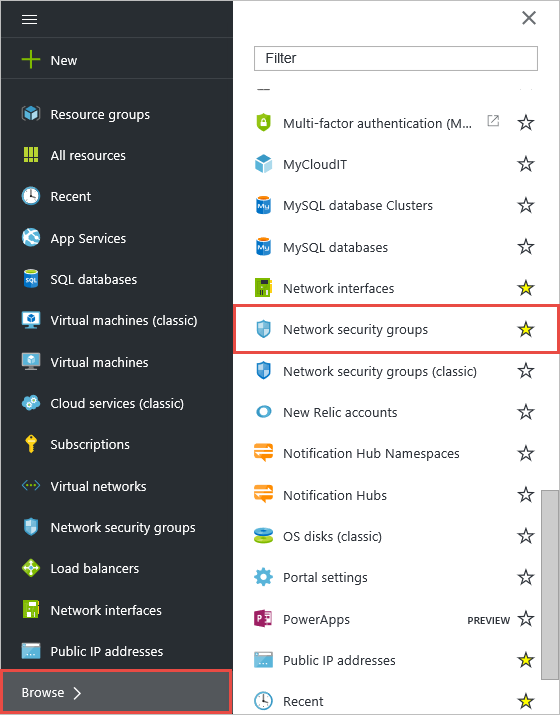

3. Überprüfen Sie die Liste der NSGs in das **Netzwerk Sicherheitsgruppen** Blade.

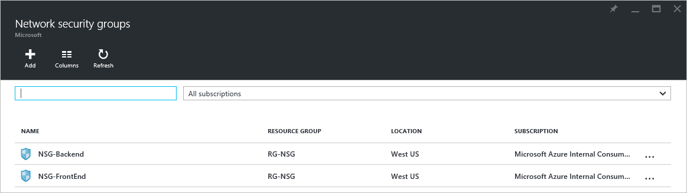

Zum Anzeigen der Liste der NSGs in der Ressourcengruppe **RG-NSG** führen Sie die folgenden Schritte aus. 

1. Klicken Sie auf **Ressourcengruppen >** > **RG-NSG** > **...**.

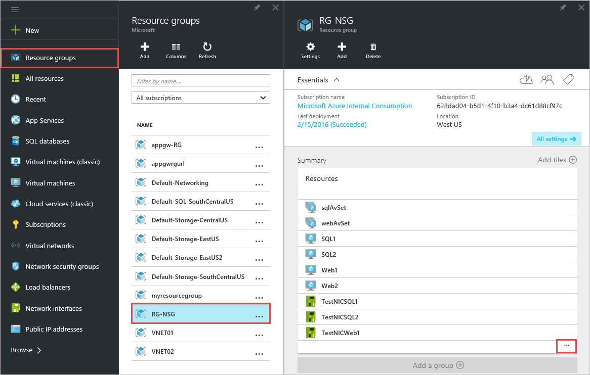

2. Suchen Sie in der Liste der Ressourcen für Elemente das Symbol NSG anzeigen, wie in den folgenden **Ressourcen** Blade dargestellt.

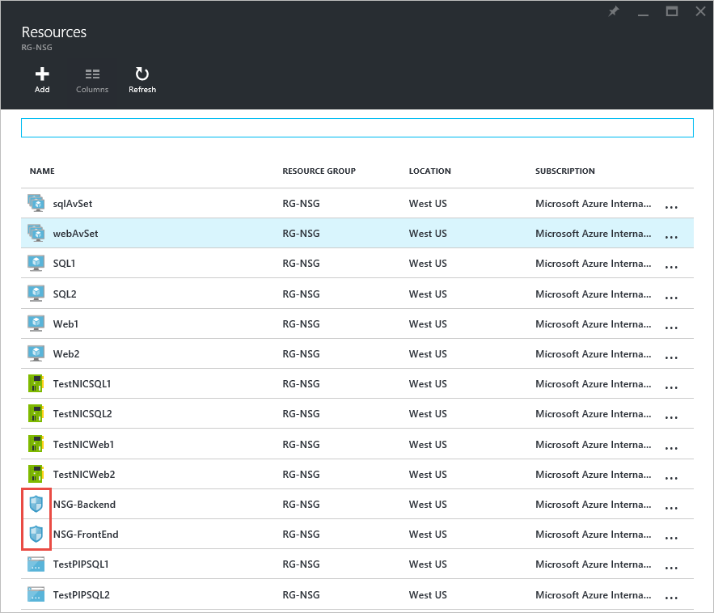
         
### Alle Regeln für ein NSG Liste

Um Regeln von einer NSG benannte **NSG-Front-End**anzeigen möchten, führen Sie die folgenden Schritte aus. 

1. Klicken Sie über das **Netzwerk Sicherheitsgruppen** Blade oder das **Ressourcen** Blade abgebildet auf **NSG-Front-End**.
2. Klicken Sie auf der Registerkarte **Einstellungen** auf **eingehende Sicherheitsregeln**.

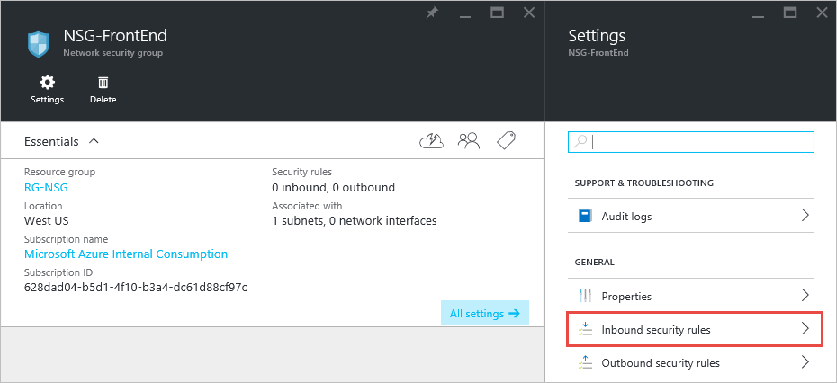

3. Das **eingehende Sicherheitsregeln** Blade wird angezeigt, wie unten dargestellt.

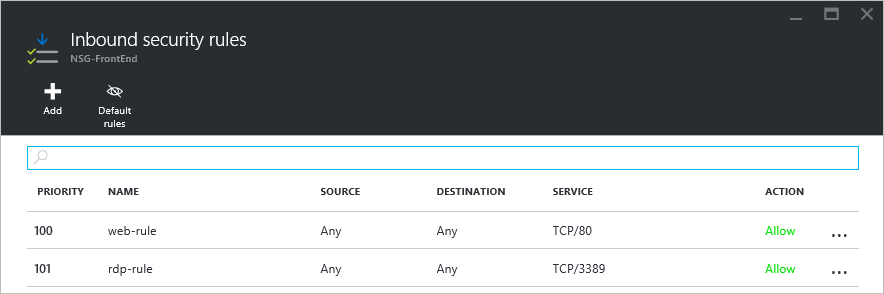

4. Klicken Sie auf der Registerkarte **Einstellungen** auf **Regeln für ausgehende Sicherheit** , um die ausgehenden Regeln finden Sie unter.

>[AZURE.NOTE] Um Regeln für das standardmäßige anzeigen möchten, klicken Sie auf das Symbol **Regeln für das standardmäßige** am oberen Rand der Blade, das die Regeln angezeigt werden.

### NSGs Zuordnungen anzeigen

Führen Sie zum Anzeigen der Ressourcen, die die **NSG-Front-End** -NSG ist zuordnen, die folgenden Schritte aus.

1. Klicken Sie über das **Netzwerk Sicherheitsgruppen** Blade oder das **Ressourcen** Blade abgebildet auf **NSG-Front-End**.
2. Klicken Sie auf der Registerkarte **Einstellungen** auf **Subnetze** , um anzuzeigen, welche Subnetze mit der NSG verknüpft sind.

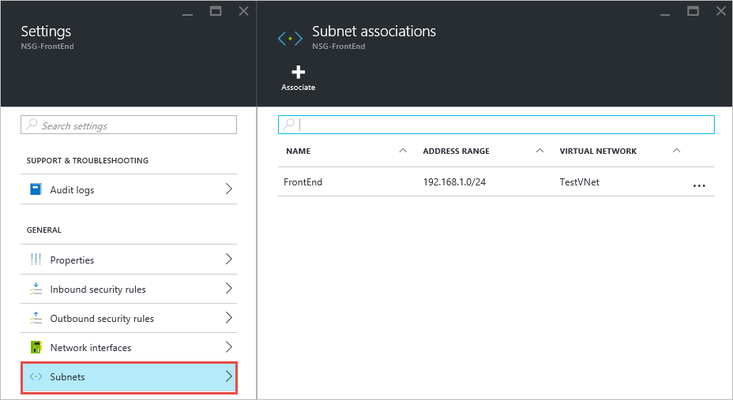

3. Klicken Sie auf der Registerkarte **Einstellungen** auf **Netzwerk-Schnittstellen** , um anzuzeigen, was NICs mit den NSG verknüpft sind.

## Verwalten von Regeln

Sie können Hinzufügen von Regeln zu einer vorhandenen NSG, bearbeiten vorhandene Regeln und Entfernen von Regeln.

### Hinzufügen einer Regel

Gehen Sie wie folgt vor um eine Regel zulassen **eingehenden** Datenverkehrs von einem beliebigen Computer zu **NSG-Front-End** NSG an Port **443** hinzuzufügen.

1. Klicken Sie über das **Netzwerk Sicherheitsgruppen** Blade oder das **Ressourcen** Blade abgebildet auf **NSG-Front-End**.
2. Klicken Sie auf der Registerkarte **Einstellungen** auf **eingehende Sicherheitsregeln**.
3. Klicken Sie in das Blade **eingehende Sicherheitsregeln** auf **Hinzufügen**. Klicken Sie dann in das Blade **die eingehende Sicherheitsregel hinzufügen** füllen Sie die Werte aus, wie unten dargestellt, und klicken Sie dann auf **OK**.

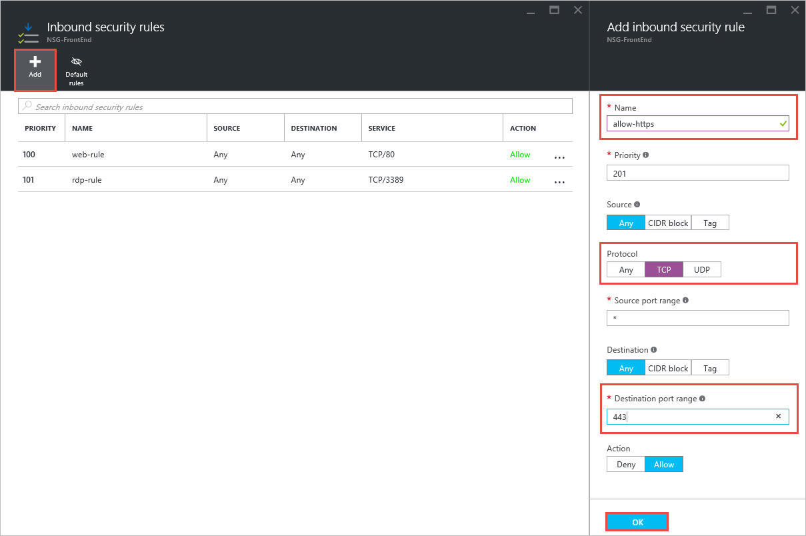

4. Beachten Sie die neue Regel in das **eingehende Sicherheitsregeln** Blade nach ein paar Sekunden.

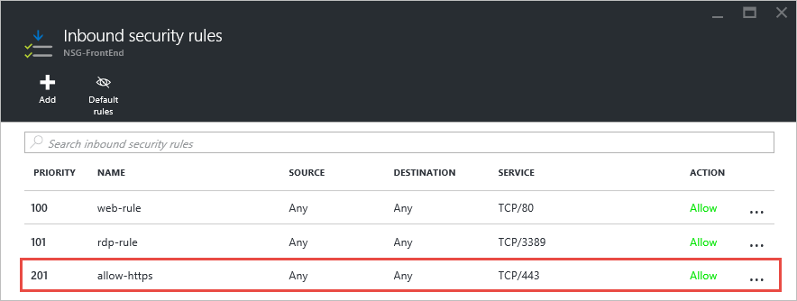

### Ändern einer Regel

Führen Sie zum Ändern der eingehenden Datenverkehr aus dem **Internet** nur zulassen oben erstellten Regel die folgenden Schritte aus.

1. Klicken Sie über das **Netzwerk Sicherheitsgruppen** Blade oder das **Ressourcen** Blade abgebildet auf **NSG-Front-End**.
2. Klicken Sie auf der Registerkarte **Einstellungen** auf die oben erstellte Regel.
3. Klicken Sie in das Blade **Zulassen Https** ändern Sie die **Source** -Eigenschaft, wie unten dargestellt, und klicken Sie dann auf **Speichern**.

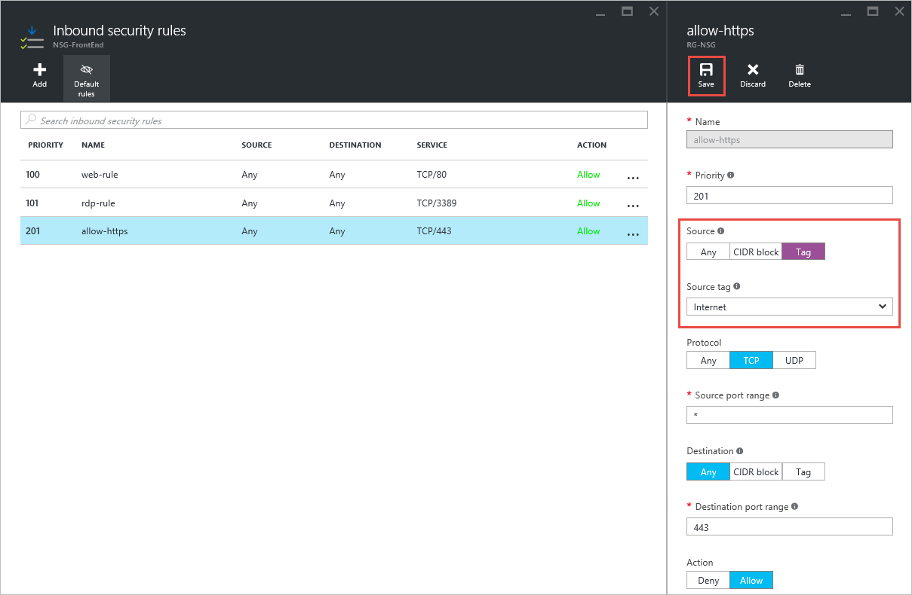

### Löschen einer Regel

Gehen Sie wie folgt vor um die oben erstellte Regel löschen.

1. Klicken Sie über das **Netzwerk Sicherheitsgruppen** Blade oder das **Ressourcen** Blade abgebildet auf **NSG-Front-End**.
2. Klicken Sie auf der Registerkarte **Einstellungen** auf die oben erstellte Regel.
3. Klicken Sie in das Blade **Zulassen Https** klicken Sie auf **Löschen**, und klicken Sie dann auf **Ja**.

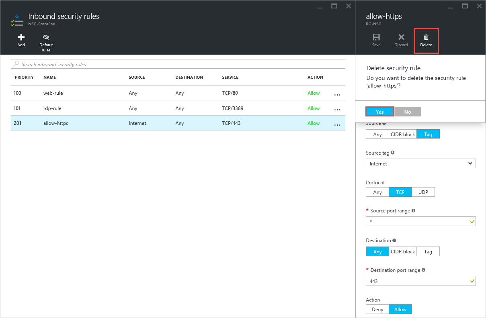

## Verwalten von Zuordnungen

Sie können eine NSG mit Subnetzen und NICs zuordnen. Sie können auch eine NSG aus jeder Ressource Zuordnung aufzuheben, um Sie verbunden ist.

### Zuordnen einer NSG an einen Netzwerkadapter

Gehen Sie wie folgt vor um **NSG-Front-End** NSG zu **TestNICWeb1** NIC zuzuordnen.

1. Klicken Sie über das **Netzwerk Sicherheitsgruppen** Blade oder das **Ressourcen** Blade abgebildet auf **NSG-Front-End**.
2. Klicken Sie auf der Registerkarte **Einstellungen** auf **Netzwerk-Schnittstellen** > **zuordnen** > **TestNICWeb1**.

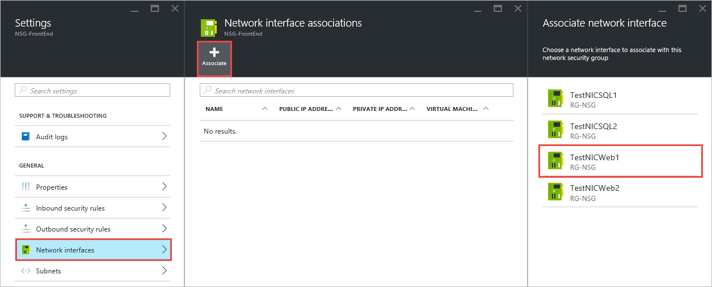

### Heben Sie eine NSG aus einen Netzwerkadapter Zuweisung

Um die **NSG-Front-End** NSG aus **TestNICWeb1** NIC Zuordnung aufzuheben, führen Sie die folgenden Schritte aus.

1. Klicken Sie im Azure-Portal auf **Ressourcengruppen >** > **RG-NSG** > **...**  >  **TestNICWeb1**.
2. Klicken Sie in das Blade **TestNICWeb1** auf **Ändern Sicherheit...**  > **None**.

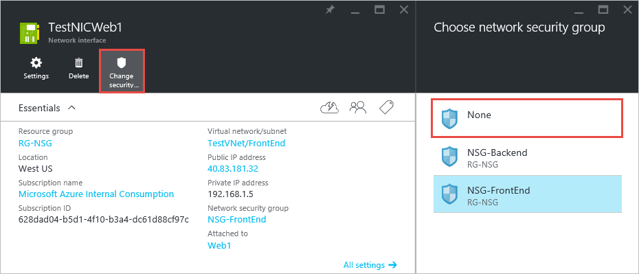

>[AZURE.NOTE] Diese Blade können Sie auch die Zuweisung an eine beliebige vorhandene NSG zugeordnet werden soll.

### Heben Sie eine NSG aus einem Subnetz Zuweisung

Um die aus dem **Front-End** -Subnetz **NSG-Front-End** NSG Zuordnung aufzuheben, führen Sie die folgenden Schritte aus.

1. Klicken Sie im Azure-Portal auf **Ressourcengruppen >** > **RG-NSG** > **...**  >  **TestVNet**.
2. Klicken Sie in das Blade **Einstellungen** auf **Subnets** > **Front-End** > **Netzwerk-Sicherheitsgruppe** > **keine**.

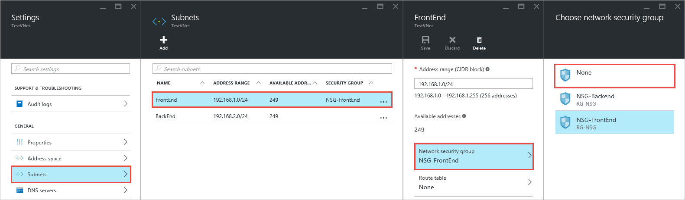

3. Klicken Sie in der **Front-End** -Blade auf **Speichern**.

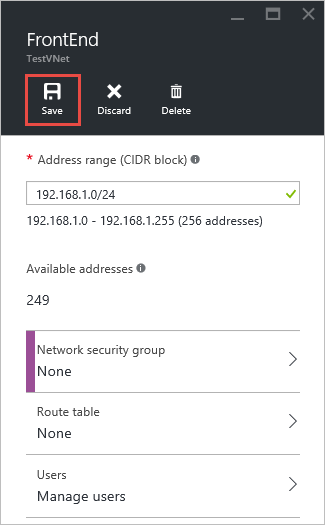

### Zuordnen einer NSG mit einem Subnetz

Gehen Sie wie folgt vor um **NSG-Front-End** NSG mit dem Subnetz **FronEnd** zuzuordnen.

1. Klicken Sie im Azure-Portal auf **Ressourcengruppen >** > **RG-NSG** > **...**  >  **TestVNet**.
2. Klicken Sie in das Blade **Einstellungen** auf **Subnets** > **Front-End** > **Netzwerk-Sicherheitsgruppe** > **NSG-Front-End**.
3. Klicken Sie in der **Front-End** -Blade auf **Speichern**.

>[AZURE.NOTE] Sie können auch eine NSG mit einem Subnetz aus den Thh NSG **Einstellungen** Blade zuordnen.

## Löschen einer NSG

Sie können nur eine NSG löschen, wenn es nicht auf eine beliebige Ressource zugeordnet sind. Zum Löschen einer NSG führen Sie die folgenden Schritte aus.

1. Klicken Sie im Azure-Portal auf **Ressourcengruppen >** > **RG-NSG** > **...**  >  **NSG-Front-End**.
2. Klicken Sie in das Blade **Einstellungen** auf **Netzwerk-Schnittstellen**.
3. Wenn alle NICs aufgelistet sind, klicken Sie auf die NIC, und führen Sie Schritt 2 im [Dissociate einer NSG aus einen Netzwerkadapter](#Dissociate-an-NSG-from-a-NIC).
4. Wiederholen Sie Schritt 3 für jede Netzwerkkarte.
5. Klicken Sie in das Blade **Einstellungen** auf **Subnets**.
6. Wenn aufgeführt Teilnetzwerken, klicken Sie auf das Subnetz, und führen Sie die Schritte 2 und 3 in [Dissociate eine NSG aus einem Subnetz](#Dissociate-an-NSG-from-a-subnet).
7. Führt einen Bildlauf nach links an die **NSG-Front-End** -Blade, klicken Sie dann auf **Löschen** > **Ja**.

[Azure-Portal - NSGs](./media/virtual-network-manage-nsg-arm-portal/figure16.png)

## Nächste Schritte

- [Aktivieren der Protokollierung](virtual-network-nsg-manage-log.md) für NSGs.
