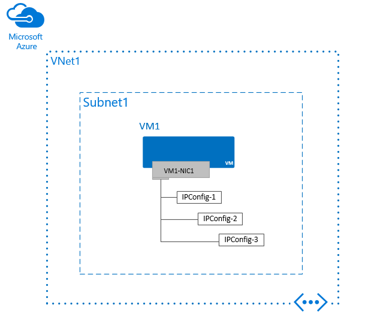

<properties
   pageTitle="Mehrere IP-Adressen für virtuelle Computer - PowerShell | Microsoft Azure"
   description="Erfahren Sie, wie mehrere IP-Adressen mit einem virtuellen Computer mithilfe der PowerShell Azure zuweisen."
   services="virtual-network"
   documentationCenter="na"
   authors="jimdial"
   manager="carmonm"
   editor=""
   tags="azure-resource-manager"
/>
<tags
   ms.service="virtual-network"
   ms.devlang="na"
   ms.topic="article"
   ms.tgt_pltfrm="na"
   ms.workload="infrastructure-services"
   ms.date="10/05/2016"
   ms.author="jdial;annahar" />

# Weisen Sie mehrere IP-Adressen zu virtuellen Computern

Ein Azure-virtuellen Computern (VM) kann eine oder mehrere Netzwerk-Schnittstellen (NIC) beigefügt haben. Alle NIC kann eine oder mehrere öffentliche oder private IP-Adressen zugewiesen haben. Wenn Sie nicht mit IP-Adressen in Azure vertraut sind, lesen Sie den [IP-Adressen in Azure](virtual-network-ip-addresses-overview-arm.md) -Artikel erfahren Sie mehr über diese. In diesem Artikel wird erläutert, wie Azure-PowerShell verwenden, um mehrere IP-Adressen eines virtuellen Computers in das Modell zur Bereitstellung von Azure Ressourcenmanager zuweisen.

Ein virtueller Computer mehrere IP-Adressen zuweisen, wird die folgenden Funktionen können:

- Hosten von mehreren Websites oder Diensten mit unterschiedlichen IP-Adressen und SSL-Zertifikate auf einem Server.
- Sie dienen als eine virtuelle Netzwerk-Anwendung, beispielsweise eine Firewall oder Lastenausgleich.
- Die Möglichkeit, eine private IP-Adressen nach jedem der NICs ein Lastenausgleich Azure Back-End-Pool hinzufügen. In der Vergangenheit konnte nur die primäre IP-Adresse für den primären Netzwerkadapter an einen Back-End-Pool hinzugefügt werden.

[AZURE.INCLUDE [virtual-network-preview](../../includes/virtual-network-preview.md)]

Um die Vorschau zu registrieren, senden Sie eine e-Mail-Nachricht an [Mehrere IP -Adressen](mailto:MultipleIPsPreview@microsoft.com?subject=Request%20to%20enable%20subscription%20%3csubscription%20id%3e) mit Ihrem Abonnement-ID und vorgesehen verwenden.

## Szenario

In diesem Artikel ordnen Sie drei IP-Konfigurationen vornehmen, um eine Netzwerkschnittstelle.
Im folgenden Beispielkonfigurationen werden erstellt und zugewiesen einen Netzwerkadapter, die drei privaten IP-Adressen und eine öffentliche IP-Adresse zugewiesen werden:

- IPConfig-1: Eine dynamische private IP-Adresse (Standard) und eine öffentliche IP-Adresse aus der öffentlichen IP-Adressressource mit dem Namen PIP1.
- IPConfig Basis 2 zurück: Eine statische private IP-Adresse und keine öffentliche IP-Adresse.
- IPConfig-3: Eine dynamische private IP-Adresse und keine öffentliche IP-Adresse.

    

Dieses Szenario setzt voraus, dass Sie eine Ressourcengruppe *RG1* innerhalb der vorhanden ist, eine VNet aufgerufen *VNet1* und einem Subnetz aufgerufen *Subnet1*aufgerufen haben. Darüber hinaus wird ein virtuellen Computers aufgerufen *VM1*stehen Ihnen, aufgerufen *VM1 NIC1* Netzwerk-Schnittstelle zugeordnet und eine öffentliche IP-Adresse bezeichnet *PIP1*ausgegeben.

[In diesem Artikel](./virtual-machines/virtual-machines-windows-ps-create.md ) durchläuft zum Erstellen der Ressourcen weiter oben erwähnten, für den Fall, dass Sie sie zuvor erstellt haben.

## Erstellen eines virtuellen Computers mit mehreren IP-Adressen

1. Öffnen Sie ein Eingabeaufforderungsfenster PowerShell, und führen Sie die verbleibenden Schritte in diesem Abschnitt innerhalb einer einzelnen PowerShell-Sitzung. Wenn Sie noch keine PowerShell installiert und konfiguriert haben, führen Sie die Schritte im Artikel [zum Installieren und Konfigurieren von Azure PowerShell](../powershell-install-configure.md) .

2. Ändern Sie die "Werte" die folgenden $Variables in den Azure [Speicherort](https://azure.microsoft.com/regions) virtuelle ist Ihr Netzwerk, den Namen der [Ressourcengruppe](../azure-resource-manager/resource-group-overview.md#resource-groups), die VNet innerhalb der Ressourcengruppe, das Subnetz die Zuweisung an eine Verbindung herstellen möchten, und den Namen des Netzwerkschnittstellenadapters Führen Sie die Schritte zum Hinzufügen von mehrere IP-Adressen zu NICs angefügter eines virtuellen Computers, wie Sie benötigen.

        $Location = "westcentralus"
        $RgName   = "RG1"
        $VNetName   = "VNet1"
        $SubnetName = "Subnet1"
        $NicName     = "VM1-NIC1"
        $PIP = "PIP"

    Wenn Sie nicht, dass der Name einer vorhandenen Azure Speicherort oder Ressourcengruppe wissen, geben Sie die folgenden Befehle:

        Get-AzureRmLocation      | Format-Table Location
        Get-AzureRmResourceGroup | Format-Table ResourceGroupName

    Die NIC muss mit einem Subnetz in einem vorhandenen Azure virtuelle Netzwerk (VNet) verbunden sein. Die drei Komponenten: NIC, Subnetz und VNet, müssen alle vorhanden sein, in der gleichen Region und [Abonnements](../azure-glossary-cloud-terminology.md#subscription).  Wenn Sie nicht mit VNets vertraut sind, lesen Sie den Artikel [virtuellen Netzwerk Übersicht](virtual-networks-overview.md) erfahren mehr über diese oder finden Sie im Artikel [Erstellen eines VNet](virtual-networks-create-vnet-arm-ps.md) erfahren Sie, wie Sie einen erstellen.

    Wenn Sie den Namen eines vorhandenen VNet nicht kennen, geben Sie den folgenden Befehl ein und Ersetzen Sie *VNet1* in der vorherigen Variablen mit den Namen eines VNet:

        Get-AzureRmVirtualNetwork | Format-Table Name

    Wenn die zurückgegebene Liste leer ist, müssen Sie eine VNet erstellen. Informationen wie, lesen Sie im Artikel [Erstellen eines virtuellen Netzwerks](virtual-networks-create-vnet-arm-ps.md) .

    Geben Sie die folgenden Befehle zum Abrufen der Name der vorhandenen Subnetze innerhalb der VNet und Ersetzen von *Subnet1* über mit dem Namen der ein Subnetz:

        $VNet = Get-AzureRmVirtualNetwork -Name $VNetName -ResourceGroupName $RgName
        $VNet.Subnets | Format-Table Name, AddressPrefix

4. Geben Sie den folgenden Befehl zum Abrufen des Subnetzes und einer Variablen zuweisen.

        $Subnet = $VNet.Subnets | Where-Object { $_.Name -eq $SubnetName }

5. Definieren Sie die IP-Konfigurationen, die Sie an die Netzwerkkarte zuweisen möchten. Jede Konfiguration kann eine statische oder dynamische private IP-Adresse und eine eine statische oder dynamische Adresse öffentlichen IP-Adressenressource zugeordnet.

    Fügen Sie hinzu oder entfernen Sie eine beliebige Anzahl der Konfigurationen, die folgen, je nachdem, wie viele IP-Adressen, die Sie zu der Netzwerkkarte und die Einstellungen zuordnen möchten, die Sie konfigurieren möchten.

    **IPConfig-1**

    Ändern Sie den Wert *PIP1* auf den Namen einer vorhandenen öffentlichen IP-Adresse Ressource, die an der Position vorhanden ist, die Sie die NIC in erstellen möchten, und ist, die nicht mit einem anderen NIC aktuell zugeordneten Änderung *RG1* auf den Namen der Ressourcengruppe der öffentlichen IP-Adressressource in vorhanden ist. Ändern Sie *IPConfig-1* auf den Namen, die, den Sie auf die erste IP-Konfiguration gewähren möchten. Geben Sie die folgenden Befehle aus:

        $PIP1 = Get-AzureRmPublicIPAddress -Name "PIP1" -ResourceGroupName $RgName

        $IpConfigName1 = "IPConfig-1"
        $IPConfig1     = New-AzureRmNetworkInterfaceIpConfig -Name $IPConfigName1 -Subnet $Subnet -PublicIpAddress $PIP1 -Primary

    Hinweis Die *-primäre* wechseln. Wenn Sie einen Netzwerkadapter mehrere IP-Konfigurationen zuweisen, muss eine Konfiguration als *Primärschlüssel*zugewiesen werden. Wenn Sie den Namen einer vorhandenen öffentlichen IP-Adresse Ressource nicht kennen, geben Sie den folgenden Befehl aus: Get-AzureRMPublicIPAddress | Format-Tabellenname, Speicherort, IP-Adresse, IPKonfigurationsdateiSPI

    Wenn die Spalte **IPKonfigurationsdateiSPI** in der Ausgabe zurückgegeben keinen Wert aufweist, wird die öffentliche IP-Adressen-Ressource ist nicht mit einer vorhandenen NIC verknüpft und kann verwendet werden. Wenn die Liste leer ist oder es keine verfügbaren öffentlichen IP-Adressressourcen sind, können Sie eine mithilfe des Befehls **New-AzureRmPublicIPAddress** erstellen.

    >[AZURE.NOTE] Öffentliche IP-Adressen verfügen über eine geringe Gebühr. Weitere Informationen zum IP-Adresse Preise zu finden, lesen Sie die [IP-Adresse Preise](https://azure.microsoft.com/pricing/details/ip-addresses) .

    **IPConfig Basis 2 zurück**

    Ändern Sie *IPConfig Basis 2 zurück* , auf den Namen, die, den Sie verwenden möchten, geben Sie an der zweiten IP-Konfiguration, und ändern *10.0.0.5* in eine nicht verwendete gültige IP-Adresse für das Subnetz, dem Sie die Zuweisung an zuweisen möchten. Geben Sie die folgenden Befehle aus:

        $IPConfigName2 = "IPConfig-2"
        $IPAddress = 10.0.0.5

        $IPConfig2 = New-AzureRmNetworkInterfaceIpConfig -Name $IPConfigName2 -Subnet $Subnet -PrivateIpAddress $IPAddress

    Geben Sie den folgenden Befehl aus, wenn Sie nicht, dass den IP wissen-Adressenbereich mit dem Subnetz zugewiesen:

        $VNet.Subnets | Format-Table Name, AddressPrefix

    **IPConfig-3**

    Ändern Sie auf den Namen, die, den Sie verwenden möchten, geben Sie an der dritten IP-Konfiguration, und geben die folgenden Befehle, *IPConfig-3* :

        $IPConfigName3 = "IPConfig-3"
        $IPConfig3 = New-AzureRmNetworkInterfaceIpConfig -Name $IPConfigName3 -Subnet $Subnet

    >[AZURE.NOTE] Sie können bis zu 250 private IP-Adresse einer Netzwerkkarte zuweisen. Es gibt eine hinsichtlich der Anzahl von öffentlichen IP-Adressen, die innerhalb eines Abonnements verwendet werden können. Weitere Informationen hierzu im Artikel [Azure beschränkt](../azure-subscription-service-limits.md#networking-limits---azure-resource-manager) .

6. Erstellen Sie die NIC, verwenden die IP-Konfigurationen im vorherigen Schritt definiert.

        $nic = New-AzureRmNetworkInterface -Name $NicName -ResourceGroupName $RgName -Location $Location -IpConfiguration $IpConfig1,$IpConfig2,$IpConfig3

7. Fügen Sie die NIC aus, wann ein virtuellen Computers zu erstellen, indem Sie die Schritte im Artikel [Erstellen eines virtuellen Computers](../virtual-machines/virtual-machines-windows-ps-create.md) . Obwohl im Artikel ein virtuellen Computers unter Windows Server erstellt hat, sind die Schritte für eine Linux VM, bis auf das Auswählen von eines anderen Betriebssystems gleich aus. Führen Sie die Schritte 1 bis 3 dieses Artikels. Überspringen Sie die Schritte 4 und 5, und klicken Sie dann Beenden von Schritt 6 Erstellen eines Artikels virtueller Computer.

    >[AZURE.WARNING] Schritt 6 Erstellen eines Artikels virtueller Computer schlägt fehl, wenn Sie die Variable mit dem Namen $nic in einen anderen in Schritt 6 dieses Artikels geändert oder die vorherigen Schritte in diesem Artikel noch nicht abgeschlossen.

8. Anzeigen der privaten IP Adressen dieser Azure DHCP der Netzwerkschnittstellenkarte zugewiesene und öffentliche IP-Adresse zugeordnete Ressource die NIC durch Eingeben von den folgenden Befehl aus:

        $nic.IpConfigurations | Format-Table Name, PrivateIPAddress, PublicIPAddress, Primary

9. Fügen Sie alle die privaten IP-Adressen (einschließlich den primären hinzu) können TCP/IP-Konfiguration in das Betriebssystem manuell. 

**Windows**

1. Geben Sie über eine Befehlszeile *Ipconfig/all*.  Nur die *primäre* private IP-Adresse (über DHCP) angezeigt.
2. Geben Sie als Nächstes *ncpa.cpl* im Eingabeaufforderungsfenster ein. Dadurch wird ein neues Fenster geöffnet.
3. Öffnen Sie die Eigenschaften für **LAN-Verbindung**aus.
4. Doppelklicken Sie auf Internet Protocol Version 4 (IPv4) klicken Sie auf
5. Wählen Sie **folgende IP-Adresse verwenden** aus, und geben Sie die folgenden Werte:
    - **IP-Adresse**: Geben Sie die *primäre* private IP-Adresse
    - **Subnetzmaske**: Satz basierend auf Ihrem Subnetz gehören. Beispielsweise ist das Subnetz eines /24 Subnetz die Subnetzmaske ist 255.255.255.0.
    - **Standard-Gateway**: die erste IP-Adresse im Subnetz. Ist Ihr Subnetz 10.0.0.0/24, ist die Gateway IP-Adresse 10.0.0.1.
    - Klicken Sie auf **die folgenden DNS-Server-Adressen verwenden** , und geben Sie die folgenden Werte:
        - **Bevorzugte DNS-Server:** Geben Sie 168.63.129.16, wenn Sie Ihre eigenen DNS-Server nicht verwenden.  Wenn Sie sind, geben Sie die IP-Adresse für Ihren DNS-Server.
    - Klicken Sie auf die Schaltfläche **Erweitert** , und fügen Sie weitere IP-Adressen hinzu. Fügen Sie der sekundären privaten IP-Adressen in Schritt 8, um die NIC mit demselben Subnetz für die primäre IP-Adresse angegebenen aufgeführt.
    - Klicken Sie auf **OK** , um die TCP/IP Einstellungen zu schließen, und klicken Sie dann **OK** erneut aus, um die Einstellungen Netzwerkadapter schließen. Dies wird dann Ihre RDP-Verbindung wiederherzustellen.

6. Geben Sie über eine Befehlszeile *Ipconfig/all*. Alle IP-Adressen, die Sie hinzugefügt werden angezeigt, und DHCP deaktiviert ist.

**Linux (Ubuntu)**

1. Öffnen Sie ein terminal-Fenster an.
2. Stellen Sie sicher, dass Sie der Stammbenutzer sind. Wenn Sie nicht sind, können Sie dazu verwenden den folgenden Befehl aus:

            sudo -i
3. Aktualisieren Sie die Konfigurationsdatei der Netzwerkschnittstelle (vorausgesetzt 'eth0').
    - Beibehalten des vorhandenen Linie Elements für Dhcp. Dadurch wird die primäre IP-Adresse konfiguriert, wie er in der früheren sein verwendet.
    - Fügen Sie eine Konfiguration für eine weitere statische IP-Adresse mit den folgenden Befehlen hinzu:

                cd /etc/network/interfaces.d/
                ls

        Es sollte eine cfg-Datei angezeigt.
4. Öffnen Sie die Datei: vi *Filename*.

    Sie sollten die folgenden Zeilen am Ende der Datei finden Sie unter:

            auto eth0
            iface eth0 inet dhcp
5. Fügen Sie die folgenden Zeilen nach den Zeilen, die in dieser Datei vorhanden sind:

            iface eth0 inet static
            address <your private IP address here>
6. Speichern Sie die Datei mit dem folgenden Befehl aus:

            :wq
7.  Zurücksetzen der Schnittstelle mit den folgenden Befehl aus:

            sudo ifdown eth0 && sudo ifup eth0

    >[AZURE.IMPORTANT] Führen Sie sowohl Ifdown und Ifup in derselben Zeile ein, wenn eine Verbindung mit.
8. Stellen Sie sicher, dass die IP-Adresse der Schnittstelle mit dem folgenden Befehl hinzugefügt wird:

            ip addr list eth0

    Es sollte die IP-Adresse angezeigt, die Sie als Teil der Liste hinzugefügt.

**Linux (Red hat, CentOS und andere)**

1. Öffnen Sie ein terminal-Fenster an.
2. Stellen Sie sicher, dass Sie der Stammbenutzer sind. Wenn Sie nicht sind, können Sie dazu verwenden den folgenden Befehl aus:

            sudo -i
3. Geben Sie Ihr Kennwort ein, und befolgen Sie die Anleitung, wie dazu aufgefordert werden. Nachdem Sie die Root-Benutzer sind, navigieren Sie zu den Skripts Netzwerkordner mit den folgenden Befehl aus:

            cd /etc/sysconfig/network-scripts
4. Listen Sie die zugehörigen Ifcfg Dateien mit dem folgenden Befehl ein:

            ls ifcfg-*

    *Ifcfg-eth0* sollte als eine der Dateien angezeigt werden.
5. Kopieren Sie die Datei *Ifcfg-eth0* , und nennen Sie es *Ifcfg-Eth0:0* mit den folgenden Befehl aus:

            cp ifcfg-eth0 ifcfg-eth0:0
6. Bearbeiten der *Ifcfg-Eth0:0* Datei mit den folgenden Befehl aus:

            vi ifcfg-eth1
7. Ändern Sie das Gerät auf den entsprechenden Namen in der Datei ein. *Eth0:0* in diesem Fall mit den folgenden Befehl aus:

            DEVICE=eth0:0
8. Ändern der *IPADDR = YourPrivateIPAddress* Linie wirken sich auf die IP-Adresse aus.
9. Speichern Sie die Datei mit den folgenden Befehl aus:

            :wq
10. Starten Sie das Netzwerkdienste, und stellen Sie sicher, dass die Änderungen erfolgreich werden durch Ausführen der folgenden Befehle:

            /etc/init.d/network restart
            Ipconfig

    Sie sollten finden Sie unter IP-Adresse, die Sie hinzugefügt haben, *Eth0:0*, in der Liste zurückgegeben.

## Hinzufügen von IP-Adressen zu einer vorhandenen virtuellen Computer

Führen Sie die folgenden Schritte aus, um weitere IP-Adressen zu einer vorhandenen Netzwerkkarte hinzuzufügen:

1. Öffnen Sie ein Eingabeaufforderungsfenster PowerShell, und führen Sie die verbleibenden Schritte in diesem Abschnitt innerhalb einer einzelnen PowerShell-Sitzung. Wenn Sie noch keine PowerShell installiert und konfiguriert haben, führen Sie die Schritte im Artikel [zum Installieren und Konfigurieren von Azure PowerShell](../powershell-install-configure.md) .

2. Ändern Sie die "Werte" die folgenden $Variables auf den Namen der NIC IP-Adressen hinzugefügt werden sollen und Ressourcengruppe und Speicherort die NIC im vorhanden ist:

        $NicName     = "RG1-VM1-NIC1"
        $RgName   = "RG1"
        $NicLocation = "westcentralus"

    Wenn Sie den Namen der NIC nicht, die Sie ändern möchten kennen, geben die folgenden Befehle, ändern Sie die Werte der vorherigen Variablen:

        Get-AzureRmNetworkInterface | Format-Table Name, ResourceGroupName, Location

3. Erstellen Sie eine Variable, und legen Sie ihn auf vorhandenen Netzwerkschnittstellenkarte, indem Sie den folgenden Befehl eingeben:

        $nic = Get-AzureRmNetworkInterface -Name $NicName -ResourceGroupName $RgName

4. Abrufen der Subnetz-ID, die die NIC mit [Schritt 3](#subnet) zum Erstellen eines virtuellen Computers mit mehreren IP-Adressen in diesem Artikel Abschnitt durchführen verbunden ist.

5. Erstellen Sie die IP-Konfigurationen, die Sie mit dem Netzwerk hinzufügen anhand der Anweisungen in [Schritt 5](#ipconfigs) des erstellen möchten eines virtuellen Computers mit mehreren IP-Adressen im Abschnitt dieses Artikels.

6. Ändern Sie *$IPConfigName4* auf den Namen der IP-Konfiguration, die Sie im vorherigen Schritt erstellt haben. Um die Konfiguration hinzuzufügen, geben Sie den folgenden Befehl aus:

        Add-AzureRmNetworkInterfaceIpConfig -Name $IPConfigName4 -NetworkInterface $nic -Subnet $Subnet1

7. Wenn die NIC mit der IP-Konfiguration festlegen möchten, geben Sie den folgenden Befehl aus:

        Set-AzureRmNetworkInterface -NetworkInterface $nic

8. Fügen Sie die IP-Adressen, die Sie die Zuweisung an das Betriebssystem virtueller Computer anhand der Anweisungen in [Schritt 9](#os) für das Erstellen eines virtuellen Computers mit mehreren IP-Adressen in diesem Artikel Abschnitt hinzugefügt.
