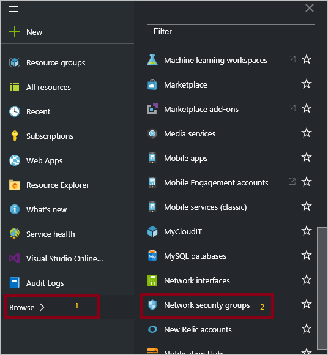
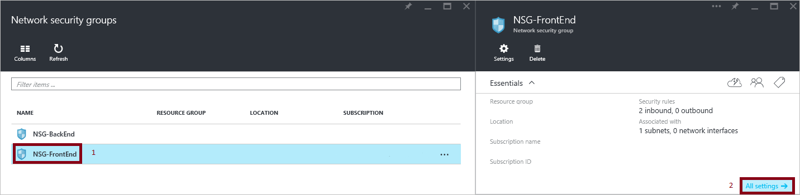
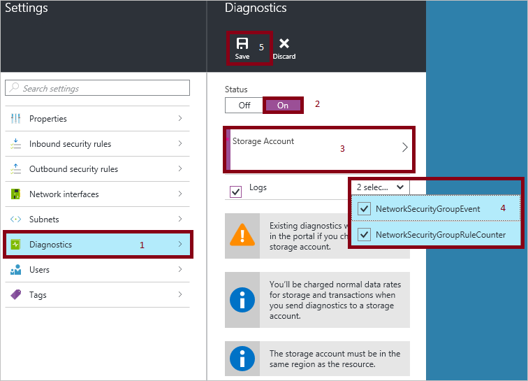

<properties
   pageTitle="Überwachen von Vorgängen, Ereignisse und Indikatoren für NSGs | Microsoft Azure"
   description="Informationen Sie zum Aktivieren der Indikatoren, Ereignisse und Betrieb Protokollierung für NSGs"
   services="virtual-network"
   documentationCenter="na"
   authors="jimdial"
   manager="carmonm"
   editor="tysonn"
   tags="azure-resource-manager"
/>
<tags
   ms.service="virtual-network"
   ms.devlang="na"
   ms.topic="article"
   ms.tgt_pltfrm="na"
   ms.workload="infrastructure-services"
   ms.date="07/14/2016"
   ms.author="jdial" />

#Log Analytics für Netzwerk-Sicherheitsgruppen (NSGs)

Sie können verschiedene Arten von Protokollen in Azure verwalten und Behandeln von Problemen mit NSGs verwenden. Einige dieser Protokolle über das Portal zugegriffen werden kann, und alle Protokolle können aus einer Azure Blob-Speicher extrahiert und in andere Tools, wie etwa [Log Analytics](../log-analytics/log-analytics-azure-networking-analytics.md), Excel und PowerBI angezeigt werden. Sie erhalten weitere Informationen zu den verschiedenen Arten von Protokollen in der nachstehenden Liste aus.

- **Überwachungsprotokolle:** Sie können [Überwachungsprotokolle Azure](../monitoring-and-diagnostics/insights-debugging-with-events.md) (ehemals Betriebsprotokolle) verwenden, um alle Vorgänge, die auf Ihre Azure-Abonnements und deren Status übermittelt anzuzeigen. Überwachungsprotokolle sind standardmäßig aktiviert, und Sie können im Portal Azure Vorschau angezeigt werden.
- **Ereignisprotokollen:** Sie können dieses Protokoll verwenden, um anzuzeigen, welche NSG Regeln auf virtuellen Computern und Instanz Rollen basierend auf dem MAC-Adresse angewendet werden. Der Status für diese Regeln werden alle 60 Sekunden erfasst.
- **Protokolle zu begegnen:** Sie können dieses Protokoll verwenden, um wie oft anzuzeigen, jede NSG Regel zum verweigern, oder lassen Sie den Datenverkehr angewendet wurde.

>[AZURE.WARNING] Protokolle sind nur verfügbar für Ressourcen, die im Bereitstellungsmodell Ressourcenmanager bereitgestellt. Sie können keine Protokolle für Ressourcen im Bereitstellungsmodell klassischen verwenden. Ein besseres Verständnis der beiden Modelle, finden Sie im Artikel [Grundlegendes zu Ressourcenmanager und klassischen Bereitstellung](../resource-manager-deployment-model.md) auf.

##Aktivieren der Protokollierung
Überwachungsprotokollierung wird automatisch in allen Zeiten für jede Ressource Ressourcenmanager aktiviert. Sie müssen Ereignis und Zähler zum Sammeln von Daten über diese Protokolle verfügbar starten Protokollierung aktivieren. Um die Protokollierung zu aktivieren, führen Sie die folgenden Schritte aus.

1.  Anmelden Sie bei der [Azure-Portal](https://portal.azure.com). Wenn Sie keine vorhandenen Netzwerk-Sicherheitsgruppe, [Erstellen Sie eine NSG noch](virtual-networks-create-nsg-arm-ps.md) , bevor Sie fortfahren.

2.  Klicken Sie auf **Durchsuchen**, im Vorschau-Portal >> **Netzwerk Sicherheitsgruppen**.

    

3. Wählen Sie eine vorhandene Netzwerk-Sicherheitsgruppe aus.

    

4. Klicken Sie in der Blade- **Einstellungen** auf **Diagnose**, und **Klicken Sie dann auf **Diagnose** im Bereich neben dem **Status****
5. Klicken Sie in das Blade **Einstellungen** auf **Speicher-Konto**, und wählen Sie eine vorhandene Speicherplatz zu berücksichtigen, oder Erstellen eines neuen Kontos.  

>[AZURE.INFORMATION] Überwachungsprotokolle keiner separaten Speicher-Konto erforderlich. Die Verwendung von Speicherplatz für das Ereignis und Regel Protokollierung wird Dienst anfallen.

6. Wählen Sie in der Dropdown-Liste nur unter **Speicher-Konto**, ob Sie verwenden möchten, melden Sie sich Ereignisse und/oder Indikatoren, und klicken Sie dann auf **Speichern**.

    

## Überwachungsprotokoll
Dieses Protokoll (früher als "Betrieb Log" bezeichnet) wird standardmäßig von Azure generiert.  Die Protokolle werden 90 Tage lang in der Azure-Ereignisprotokollen Store beibehalten. Weitere Informationen zu diesen Protokollen durch [Ereignisse anzeigen und Überwachungsprotokolle](../monitoring-and-diagnostics/insights-debugging-with-events.md) Artikel lesen.

## Indikator log
Dieses Protokoll wird nur ausgelöst, wenn Sie es auf Basis pro NSG wie oben beschrieben aktiviert haben. Die Daten werden in dem Speicherkonto gespeichert, die Sie angegeben haben, wenn Sie die Protokollierung aktiviert. Jede Regel, die auf Ressourcen angewendet wird im JSON-Format protokolliert, wie folgt.

    {
        "time": "2015-09-11T23:14:22.6940000Z",
        "systemId": "e22a0996-e5a7-4952-8e28-4357a6e8f0c5",
        "category": "NetworkSecurityGroupRuleCounter",
        "resourceId": "/SUBSCRIPTIONS/D763EE4A-9131-455F-8C5E-876035455EC4/RESOURCEGROUPS/INSIGHTOBONRP/PROVIDERS/MICROSOFT.NETWORK/NETWORKSECURITYGROUPS/NSGINSIGHTOBONRP",
        "operationName": "NetworkSecurityGroupCounters",
        "properties": {
            "vnetResourceGuid":"{DD0074B1-4CB3-49FA-BF10-8719DFBA3568}",
            "subnetPrefix":"10.0.0.0/24",
            "macAddress":"001517D9C43C",
            "ruleName":"DenyAllOutBound",
            "direction":"Out",
            "type":"block",
            "matchedConnections":0
            }
    }

## Ereignisprotokoll
Dieses Protokoll wird nur ausgelöst, wenn Sie es auf Basis pro NSG wie oben beschrieben aktiviert haben. Die Daten werden in dem Speicherkonto gespeichert, die Sie angegeben haben, wenn Sie die Protokollierung aktiviert. Die folgenden Daten protokolliert werden:

    {
        "time": "2015-09-11T23:05:22.6860000Z",
        "systemId": "e22a0996-e5a7-4952-8e28-4357a6e8f0c5",
        "category": "NetworkSecurityGroupEvent",
        "resourceId": "/SUBSCRIPTIONS/D763EE4A-9131-455F-8C5E-876035455EC4/RESOURCEGROUPS/INSIGHTOBONRP/PROVIDERS/MICROSOFT.NETWORK/NETWORKSECURITYGROUPS/NSGINSIGHTOBONRP",
        "operationName": "NetworkSecurityGroupEvents",
        "properties": {
            "vnetResourceGuid":"{DD0074B1-4CB3-49FA-BF10-8719DFBA3568}",
            "subnetPrefix":"10.0.0.0/24",
            "macAddress":"001517D9C43C",
            "ruleName":"AllowVnetOutBound",
            "direction":"Out",
            "priority":65000,
            "type":"allow",
            "conditions":{
                "destinationPortRange":"0-65535",
                "sourcePortRange":"0-65535",
                "destinationIP":"10.0.0.0/8,172.16.0.0/12,169.254.0.0/16,192.168.0.0/16,168.63.129.16/32",
                "sourceIP":"10.0.0.0/8,172.16.0.0/12,169.254.0.0/16,192.168.0.0/16,168.63.129.16/32"
            }
        }
    }

## Anzeigen und Analysieren des Überwachungsprotokolls
Sie können anzeigen und analysieren die Überwachungsprotokolldaten verwenden eine der folgenden Methoden:

- **Azure Tools:** Abrufen von Informationen aus der Überwachungsprotokolle bis Azure PowerShell, Azure Command Line Interface (CLI), die Azure REST-API oder im Portal Azure Vorschau.  Eine schrittweise Anleitung für die einzelnen Methoden werden im Artikel [Audit Vorgänge mit Ressourcenmanager](../resource-group-audit.md) detailliert beschrieben.
- **Power BI:** Wenn Sie bereits über eine [Power BI](https://powerbi.microsoft.com/pricing) -Konto besitzen, können Sie ihn kostenlos versuchen. Sie können mithilfe der [Überwachungsprotokolle Azure Inhalte Pack für Power BI](https://powerbi.microsoft.com/documentation/powerbi-content-pack-azure-audit-logs/) Ihrer Daten mit vorkonfiguriertes Dashboards, mit denen Sie als, analysieren-ist oder anpassen.

## Zeigen Sie an und analysieren Sie der Zähler als auch Ereignisprotokoll

Azure [Log Analytics](../log-analytics/log-analytics-azure-networking-analytics.md) kann den Zähler sammeln und Ereignisprotokoll Dateien aus Ihrem Blob-Speicher-Konto und Bandbreite von Darstellungen und leistungsfähige Suchfunktionen für Ihre Protokolle analysieren enthält.

Sie können auch Verbinden mit Ihrem Speicherkonto und die JSON-Protokolleinträge für Ereignis und Zähler Protokolle abrufen. Nachdem Sie die JSON-Dateien heruntergeladen haben, können Sie diese CSV-und Ansicht in Excel, PowerBI oder andere Daten Visualisierungstool konvertieren.

>[AZURE.TIP] Wenn Sie mit Visual Studio und grundlegende Konzepte zum Ändern der Werte für die Konstanten und Variablen in c# vertraut sind, können Sie den [Log Konverter Tools](https://github.com/Azure-Samples/networking-dotnet-log-converter) unter Github.

## Nächste Schritte

- Visualisieren von Zähler und Ereignisprotokollen mit [Log Analytics](../log-analytics/log-analytics-azure-networking-analytics.md)
- [Visualisieren der Überwachungsprotokolle Azure mit Power BI](http://blogs.msdn.com/b/powerbi/archive/2015/09/30/monitor-azure-audit-logs-with-power-bi.aspx) -Blogbeitrag.
- [Anzeigen und Analysieren von Azure Überwachungsprotokolle in Power BI und vieles mehr](https://azure.microsoft.com/blog/analyze-azure-audit-logs-in-powerbi-more/) Blogbeitrag veröffentlichen.
