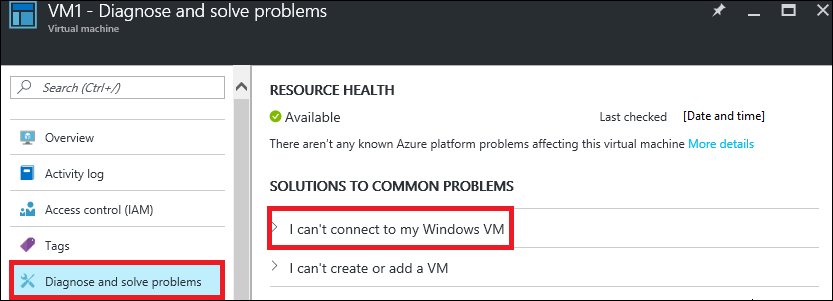

<properties 
   pageTitle="Problembehandlung bei Network Sicherheitsgruppen - Portal | Microsoft Azure"
   description="Informationen Sie zum Behandeln von Problemen mit Sicherheitsgruppen Netzwerk im Bereitstellungsmodell Azure Ressourcenmanager über das Azure-Portal."
   services="virtual-network"
   documentationCenter="na"
   authors="AnithaAdusumilli"
   manager="narayan"
   editor=""
   tags="azure-resource-manager"
/>
<tags 
   ms.service="virtual-network"
   ms.devlang="na"
   ms.topic="article"
   ms.tgt_pltfrm="na"
   ms.workload="infrastructure-services"
   ms.date="09/23/2016"
   ms.author="anithaa" />

# Problembehandlung bei Network Sicherheitsgruppen mithilfe der Azure-Portal

> [AZURE.SELECTOR]
- [Azure-Portal](virtual-network-nsg-troubleshoot-portal.md)
- [PowerShell](virtual-network-nsg-troubleshoot-powershell.md)

Wenn Sie Probleme mit dem virtuellen Computer Konnektivität konfiguriert Netzwerk-Sicherheitsgruppen (NSGs) auf Ihrem Computer virtuellen (virtueller Computer), bietet in diesem Artikel einen Überblick über die Diagnose-Funktionen für NSGs zur weiteren Behandlung an.

NSGs können Sie steuern, welche Arten von Datenverkehr dieser Fluss ein-und Ihre virtuellen Computern (virtuelle Computer). NSGs können auf Subnetze in ein Azure-virtuellen Netzwerk (VNet), Netzwerk-Schnittstellen (NIC) oder beides angewendet werden. Effektiven auf einen Netzwerkadapter angewendeten Regeln sind eine Aggregation die Regeln, die in der NSGs auf einen Netzwerkadapter angewendet vorhanden sind und das Subnetz verbunden ist. Manchmal können Sie Regeln über diese NSGs miteinander in Konflikt stehen und einer virtuellen Computers Netzwerkkonnektivität auswirken.  

Sie können alle Regeln effektive Sicherheit aus Ihrer NSGs, anzeigen, wie auf Ihrem virtuellen Computers NICs angewendet. In diesem Artikel wird gezeigt, wie virtueller Computer Verbindungsproblemen mithilfe dieser Regeln in das Modell zur Bereitstellung von Azure Ressourcenmanager. Wenn Sie nicht mit VNet und NSG Konzepten vertraut sind, Artikeln Sie den [virtuellen Netzwerk](virtual-networks-overview.md) und [Netzwerk-Sicherheitsgruppen](virtual-networks-nsg.md) (Übersicht).

## Verwenden von effektiven Sicherheitsregeln zur Problembehandlung von Datenfluss virtueller Computer

Das Szenario, das folgt ist ein Beispiel für ein häufig auftretendes Verbindungsproblem:

Ein virtueller Computer mit dem Namen *VM1* ist Teil einer Subnetz mit dem Namen *Subnet1* innerhalb einer VNet mit dem Namen *WestUS-VNet1*. Eine Verbindung mit dem virtuellen Computer mit RDP Ports 3389 fehlschlägt. NSGs werden sowohl auf der NIC *VM1-NIC1* im Subnetz *Subnet1*angewendet. In der NSG der Schnittstelle *VM1-NIC1*, zugeordnet ist Datenverkehr an TCP-Port 3389 zulässig, jedoch TCP Pingen zu VM1s Port 3389 fehlschlägt.

Während in diesem Beispiel TCP-Port 3389 verwendet, können die folgenden Schritte zum Ermitteln von Verbindungsfehlern eingehende und ausgehende über einen beliebigen Port verwendet werden.

### Anzeigen der effektiven Sicherheitsregeln für einen virtuellen Computer

Führen Sie die folgenden Schritte aus, um NSGs für eines virtuellen Computers zu beheben:

Sie können die vollständige Liste der Regeln effektive Sicherheit auf einen Netzwerkadapter, aus dem virtuellen Computer selbst anzeigen. Sie können auch hinzufügen, ändern und Löschen von sowohl NIC und Subnetz NSG Regeln aus dem Blade effektiven Regeln, wenn Sie zum Ausführen dieser Vorgänge Berechtigungen.

1. Melden Sie sich zum Azure-Portal unter https://portal.azure.com.
2. Klicken Sie auf **Weitere Dienste**, und klicken Sie auf **virtuellen Computern** in der Liste, die angezeigt wird.
3. Wählen Sie einen virtuellen Computer aus der Liste zu beheben, die angezeigt wird und eine Blade virtueller Computer mit Optionen wird angezeigt.
4. Klicken Sie auf **Konfigurationsprobleme & Lösen von Problemen mit** , und wählen Sie ein häufig auftretendes Problem. **Ich kann keine Verbindung mit meinem Windows virtueller Computer** ist in diesem Beispiel aktiviert. 

    

5. Schritte, die unter das Problem angezeigt werden, wie in der folgenden Abbildung dargestellt: 

    

    Klicken Sie auf *effektive Sicherheit Gruppe Regeln* in der Liste der Schritte empfohlen.

6. Das **erste effektive Sicherheitsregeln** Blade angezeigt wird, wie in der folgenden Abbildung dargestellt:

    

    Beachten Sie in den folgenden Abschnitten des Bilds aus:

    - **Bereich:** *VM1*festgelegt, aktiviert der virtuellen Computer in Schritt 3.
    - **Netzwerk-Benutzeroberfläche:** *VM1-NIC1* ausgewählt ist. Ein virtueller Computer kann mehrere Netzwerkschnittstellen (NIC) haben. Jede NIC kann eindeutige effektiven Sicherheits-Regeln aufzustellen. Bei der Problembehandlung müssen Sie möglicherweise die effektive Sicherheitsregeln für jede NIC anzeigen
    - **NSGs verknüpft:** NSGs kann angewendet werden, um sowohl die NIC und mit dem Subnetz, mit denen die NIC verbunden ist. In der Abbildung wurde ein NSG angewendet sowohl die NIC und dem Subnetz verbunden ist. Klicken Sie auf die NSG Namen direkt in die NSGs Regeln ändern.
    - **VM1-Nsg Registerkarte:** Die Liste der Regeln angezeigt, in dem Bild wird für die NSG des Netzwerkschnittstellenadapters angewendet Mehrere Regeln für das standardmäßige werden von Azure erstellt, sobald ein NSG erstellt wird. Die Regeln können Sie nicht entfernen, aber Sie können sie mit höherer Priorität Regeln überschreiben. Lesen Sie weitere Informationen zu Regeln für das standardmäßige [NSG Übersicht](virtual-networks-nsg.md#default-rules) Artikel aus.
    - **Zielspalte:** Einige der Regeln haben Text in der Spalte, während andere Adresspräfixe haben. Der Text ist der Name der Standard-Tags für die Sicherheitsregel übernommen, wenn er erstellt wurde. Die Tags werden vom System bereitgestellten Bezeichnern, die mehrere Präfixe darstellen. Auswählen einer Regel mit einem Tag, wie etwa *AllowInternetOutBound*, zeigt die Präfixe in der **Adresspräfixe** Blade.
    - **Herunterladen:** Die Liste der Regeln kann lang sein. Sie können eine CSV-Datei für offline Analyse der Regeln herunterladen, indem Sie auf, **herunterladen** und Speichern der Datei.
    - **AllowRDP** Eingehende Regel: Diese Regel ermöglicht RDP Verbindungen mit dem virtuellen Computer.
7. Klicken Sie auf der Registerkarte **Subnet1-NSG** , um die effektiven Regeln aus der NSG angewendet, die mit dem Subnetz, anzuzeigen, wie in der folgenden Abbildung dargestellt: 

    

    Beachten Sie die Regel für **eingehende** *DenyRDP* . Eingehende Regeln auf das Subnetz zugewiesen werden vor bei der Schnittstelle angewendeten Regeln ausgewertet. Da die Verweigerungsregel, bei dem Subnetz angewendet wird, schlägt fehl, die Anfrage 3389 TCP-Verbindung, da die Zulassungsregel bei der NIC nie ausgewertet wird. 

    Die *DenyRDP* Regel handelt es sich um den Grund, warum RDP-Verbindung fehlschlägt. Entfernen es sollte das Problem lösen.

    >[AZURE.NOTE]Wenn Sie der virtuellen Computer die NIC zugeordnet ist nicht in einem laufenden Zustand oder NSGs noch nicht auf der NIC oder Subnetz angewendet wurden, werden keine Regeln angezeigt.

8. Um NSG Regeln zu bearbeiten, klicken Sie auf *Subnet1-NSG* im Abschnitt **NSGs verknüpft ist** .
   Dadurch wird das **Subnet1-NSG** Blade geöffnet. Sie können die Regeln direkt, indem Sie auf **eingehende Sicherheitsregeln**bearbeiten.

    

9. Nach der *DenyRDP* eingehende Regel in der **Subnet1-NSG** entfernen und eine Regel *AllowRDP* hinzugefügt haben, sieht Sie die effektiven Regelliste wie die folgende Abbildung aus:

    

    Bestätigen Sie, dass TCP-Port 3389 nach dem Öffnen einer RDP-Verbindungs zu den virtuellen Computer oder mithilfe des Tools PsPing geöffnet ist. Sie können weitere Informationen zur PsPing durch die [PsPing Downloadseite](https://technet.microsoft.com/sysinternals/psping.aspx)lesen.

### Anzeigen von effektiven Sicherheitsregeln für eine Netzwerk-Benutzeroberfläche

Wenn Ihre virtuellen Computer Datenfluss für eine bestimmte Netzwerkadapter beeinträchtigt wird, können Sie eine vollständige Liste der effektiven Regeln für die Netzwerkadapter aus dem Netzwerk-Schnittstellen Kontext anzeigen, indem Sie die folgenden Schritte durchführen:

1. Melden Sie sich zum Azure-Portal unter https://portal.azure.com.
2. Klicken Sie auf **Weitere Dienste**, und klicken Sie auf **Netzwerk-Schnittstellen** in der Liste, die angezeigt wird.
3. Wählen Sie eine Schnittstelle aus. In der nachstehenden Abbildung ist ein Netzwerkadapter mit dem Namen *VM1-NIC1* ausgewählt.

    

    Beachten Sie, dass der **Bereich** auf der ausgewählten Schnittstelle festgelegt ist. Weitere Informationen zu den zusätzlichen Informationen finden Sie unter Schritt 6 des Abschnitts **Behandeln von Problemen mit NSGs für einen virtuellen** dieses Artikels.

    >[AZURE.NOTE] Eine NSG aus einer Schnittstelle entfernt wird, ist das Subnetz NSG noch effektiver des angegebenen Netzwerkschnittstellenadapters In diesem Fall würde die Ausgabe nur Regeln aus dem Subnetz NSG anzeigen. Regeln werden nur angezeigt, wenn die NIC eines virtuellen Computers zugeordnet ist.

4. Sie können direkt Regeln für einen Netzwerkadapter und einem Subnetz zugeordnet NSGs bearbeiten. Informationen wie, lesen Sie Schritt 8 des Abschnitts **Ansicht effektiver Sicherheitsregeln für einen virtuellen Computer** dieses Artikels.

## Anzeigen der effektiven Sicherheitsregeln für eine Netzwerksicherheitsgruppe (NSG)

Beim Ändern von NSG Regeln möchten Sie möglicherweise den Einfluss der Regeln hinzugefügt werden, klicken Sie auf einen bestimmten virtuellen Computer zu überprüfen. Sie können eine vollständige Liste der effektive Sicherheitsregeln anzeigen, für alle Netzwerkkarten, die einem angegebenen NSG, angewendet wird ohne Kontext aus dem angegebenen NSG Blade wechseln zu müssen. Innerhalb eines NSG effektive Regeln zur Problembehandlung, gehen Sie folgendermaßen vor:

1. Melden Sie sich zum Azure-Portal unter https://portal.azure.com.
2. Klicken Sie auf **Weitere Dienste**, und klicken Sie auf **Netzwerk-Sicherheitsgruppen** in der Liste, die angezeigt wird.
3. Wählen Sie eine NSG aus. In der folgenden Abbildung wurde eine benannte VM1-Nsg NSG ausgewählt.

    

    Beachten Sie in den folgenden Abschnitten des vorherigen Bilds:

    - **Bereich:** Legen Sie auf der NSG ausgewählt.
    - **Virtuellen Computers:** Wenn eine NSG mit einem Subnetz angewendet wird, wird es auf alle Netzwerkschnittstellen, die alle virtuellen Computern, die mit dem Subnetz verbunden angefügt angewendet. Diese Liste zeigt alle virtuellen Computern auf diese NSG angewendet wird. Sie können alle virtuellen Computer aus der Liste auswählen.

    >[AZURE.NOTE] Wenn eine NSG nur mit einem leeren Subnetz angewendet wird, werden virtuellen Computern nicht aufgelistet. Wenn eine NSG auf einen Netzwerkadapter angewendet wird, keines virtuellen Computers zugeordnet ist, werden diese NICs auch nicht aufgeführt. 
    - **Netzwerk-Schnittstelle:** Ein virtueller Computer kann mehrere Netzwerkschnittstellen aufweisen. Sie können eine Netzwerk-Benutzeroberfläche, die den ausgewählten virtuellen Computer angefügt auswählen.
    - **AssociatedNSGs:** Zu einem beliebigen Zeitpunkt kann ein Netzwerkadapter bis zu zwei effektive NSGs, eine der Netzwerkkarte und die andere mit dem Subnetz angewendet haben. Obwohl die NIC eine effektive Subnetz NSG verfügt über der Bereich als VM1-Nsg, ausgewählt ist, wird die Ausgabe beide NSGs angezeigt.
4. Sie können direkt Regeln für NSGs einer Netzwerkkarte oder Subnetz zugeordnet bearbeiten. Informationen wie, lesen Sie Schritt 8 des Abschnitts **Ansicht effektiver Sicherheitsregeln für einen virtuellen Computer** dieses Artikels.

Weitere Informationen zu den zusätzlichen Informationen finden Sie unter Schritt 6 des Abschnitts **Ansicht effektiver Sicherheitsregeln für einen virtuellen Computer** dieses Artikels.

>[AZURE.NOTE] Obwohl ein Subnetz und NIC jeweils nur eine, die NSG darauf angewendet verfügen können, kann ein NSG mehrere NICs und mehrere Subnetze zugeordnet werden.

## Aspekte

Berücksichtigen Sie beim Behandeln von Verbindungsproblemen die folgenden Punkte:

- Regeln für das standardmäßige NSG blockiert eingehenden Zugriff aus dem Internet und treten nur VNet eingehenden Datenverkehr. Regeln sollten explizit eingehenden Zugriff aus dem Internet, je nach Bedarf dürfen hinzugefügt werden.
- Wenn keine NSG Sicherheit-Regeln, die bewirken, dass eine virtuellen Computers Netzwerkkonnektivität zum Fehlschlagen vorhanden sind, kann das Problem Ursachen haben:
    - Firewall-Software, die innerhalb des virtuellen Computers Betriebssystem ausgeführt
    - Leitet nach virtuelle Einheiten oder lokalen Datenverkehr konfiguriert. Internet-Datenverkehr kann in lokalen über Erzwungene Tunnel umgeleitet werden. Eine RDP/SSH-Verbindung aus dem Internet zu Ihrem virtuellen Computer funktioniert möglicherweise nicht mit dieser Einstellung, je nachdem, wie die lokale Netzwerkhardware diesen Datenverkehr verarbeitet. Lesen Sie [Problembehandlung leitet](virtual-network-routes-troubleshoot-powershell.md) Artikel erfahren Sie, wie Routing Probleme diagnostizieren, die den Datenfluss ein-und den virtuellen Computer Beeinträchtigung werden kann. 
- Wenn Sie standardmäßig VNets, dies haben, wird die Kategorie VIRTUAL_NETWORK automatisch erweitert, um Präfixe für hervorragendem VNets einzubeziehen. Sie können diese Präfixe in der Liste **ExpandedAddressPrefix** zur Behandlung aller Probleme im Zusammenhang mit VNet Peeringliste Connectivity anzeigen. 
- Effektive Sicherheitsregeln werden nur angezeigt, wenn es eine NSG des virtuellen Computers NETZWERKKARTEN-und oder Subnetz zugeordnet ist. 
- Wenn es keine NSGs die NIC zugeordnet gibt oder Subnetz und Sie eine öffentliche IP-Adresse haben, die Ihre virtuellen Computer zugewiesen ist, werden alle Ports für eingehende und ausgehende Zugriff geöffnet wird. Wenn der virtuellen Computer eine öffentliche IP-Adresse ist, wird das Anwenden von NSGs auf den NETZWERKKARTEN- oder Subnetz dringend empfohlen.