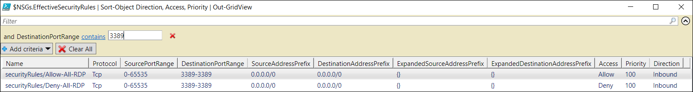

<properties 
   pageTitle="Problembehandlung bei Network Sicherheitsgruppen - PowerShell | Microsoft Azure"
   description="Informationen Sie zum Behandeln von Problemen mit Sicherheitsgruppen Netzwerk in das Modell zur Bereitstellung von Azure Ressourcenmanager mithilfe der PowerShell Azure."
   services="virtual-network"
   documentationCenter="na"
   authors="AnithaAdusumilli"
   manager="narayan"
   editor=""
   tags="azure-resource-manager"
/>
<tags 
   ms.service="virtual-network"
   ms.devlang="na"
   ms.topic="article"
   ms.tgt_pltfrm="na"
   ms.workload="infrastructure-services"
   ms.date="09/23/2016"
   ms.author="anithaa" />

# Behandeln von Problemen mit mithilfe der PowerShell Azure Netzwerk-Sicherheitsgruppen

> [AZURE.SELECTOR]
- [Azure-Portal](virtual-network-nsg-troubleshoot-portal.md)
- [PowerShell](virtual-network-nsg-troubleshoot-powershell.md)

Wenn Sie Probleme mit dem virtuellen Computer Konnektivität konfiguriert Netzwerk-Sicherheitsgruppen (NSGs) auf Ihrem Computer virtuellen (virtueller Computer), bietet in diesem Artikel einen Überblick über die Diagnose-Funktionen für NSGs zur weiteren Behandlung an.

NSGs können Sie steuern, welche Arten von Datenverkehr dieser Fluss ein-und Ihre virtuellen Computern (virtuelle Computer). NSGs können auf Subnetze in ein Azure-virtuellen Netzwerk (VNet), Netzwerk-Schnittstellen (NIC) oder beides angewendet werden. Effektiven auf einen Netzwerkadapter angewendeten Regeln sind eine Aggregation die Regeln, die in der NSGs auf einen Netzwerkadapter angewendet vorhanden sind und das Subnetz verbunden ist. Manchmal können Sie Regeln über diese NSGs miteinander in Konflikt stehen und einer virtuellen Computers Netzwerkkonnektivität auswirken.  

Sie können alle Regeln effektive Sicherheit aus Ihrer NSGs, anzeigen, wie auf Ihrem virtuellen Computers NICs angewendet. In diesem Artikel wird gezeigt, wie virtueller Computer Verbindungsproblemen mithilfe dieser Regeln in das Modell zur Bereitstellung von Azure Ressourcenmanager. Wenn Sie nicht mit VNet und NSG Konzepten vertraut sind, Artikeln Sie den [virtuellen Netzwerk](virtual-networks-overview.md) und [Netzwerk-Sicherheitsgruppen](virtual-networks-nsg.md) (Übersicht).

## Verwenden von effektiven Sicherheitsregeln zur Problembehandlung von Datenfluss virtueller Computer

Das Szenario, das folgt ist ein Beispiel für ein häufig auftretendes Verbindungsproblem:

Ein virtueller Computer mit dem Namen *VM1* ist Teil einer Subnetz mit dem Namen *Subnet1* innerhalb einer VNet mit dem Namen *WestUS-VNet1*. Eine Verbindung mit dem virtuellen Computer mit RDP Ports 3389 fehlschlägt. NSGs werden sowohl auf der NIC *VM1-NIC1* im Subnetz *Subnet1*angewendet. In der NSG der Schnittstelle *VM1-NIC1*, zugeordnet ist Datenverkehr an TCP-Port 3389 zulässig, jedoch TCP Pingen zu VM1s Port 3389 fehlschlägt.

Während in diesem Beispiel TCP-Port 3389 verwendet, können die folgenden Schritte zum Ermitteln von Verbindungsfehlern eingehende und ausgehende über einen beliebigen Port verwendet werden.

## Detaillierte Schritte zur Problembehandlung
Führen Sie die folgenden Schritte aus, um NSGs für eines virtuellen Computers zu beheben:

1. Starten einer Azure PowerShell-Sitzung und melden Sie sich Azure. Wenn Sie nicht mit der Verwendung von Azure PowerShell vertraut sind, lesen Sie im Artikel [zum Installieren und Konfigurieren von Azure PowerShell](../powershell-install-configure.md) .

2. Geben Sie den folgenden Befehl aus, um alle NSG Regeln für einen Netzwerkadapter mit dem Namen *VM1-NIC1* in der Ressourcengruppe *RG1*zurückzukehren:

        Get-AzureRmEffectiveNetworkSecurityGroup -NetworkInterfaceName VM1-NIC1 -ResourceGroupName RG1

    >[AZURE.TIP] Wenn Sie den Namen des einen Netzwerkadapter nicht kennen, geben Sie den folgenden Befehl aus, um die Namen von allen Netzwerkkarten in einer Ressourcengruppe abzurufen: 
    
    >`Get-AzureRmNetworkInterface -ResourceGroupName RG1 | Format-Table Name`

    Der folgende Text ist ein Beispiel für die Ausgabe der effektiven Regeln für die *VM1-NIC1* NIC zurückgegeben:

        NetworkSecurityGroup   : {
                                   "Id": "/subscriptions/[Subscription ID]/resourceGroups/RG1/providers/Microsoft.Network/networkSecurityGroups/VM1-NIC1-NSG"
                                 }
        Association            : {
                                   "NetworkInterface": {
                                     "Id": "/subscriptions/[Subscription ID]/resourceGroups/RG1/providers/Microsoft.Network/networkInterfaces/VM1-NIC1"
                                   }
                                 }
        EffectiveSecurityRules : [
                                 {
                                 "Name": "securityRules/allowRDP",
                                 "Protocol": "Tcp",
                                 "SourcePortRange": "0-65535",
                                 "DestinationPortRange": "3389-3389",
                                 "SourceAddressPrefix": "Internet",
                                 "DestinationAddressPrefix": "0.0.0.0/0",
                                 "ExpandedSourceAddressPrefix": [… ],
                                 "ExpandedDestinationAddressPrefix": [],
                                 "Access": "Allow",
                                 "Priority": 1000,
                                 "Direction": "Inbound"
                                 },
                                 {
                                 "Name": "defaultSecurityRules/AllowVnetInBound",
                                 "Protocol": "All",
                                 "SourcePortRange": "0-65535",
                                 "DestinationPortRange": "0-65535",
                                 "SourceAddressPrefix": "VirtualNetwork",
                                 "DestinationAddressPrefix": "VirtualNetwork",
                                 "ExpandedSourceAddressPrefix": [
                                  "10.9.0.0/16",
                                  "168.63.129.16/32",
                                  "10.0.0.0/16",
                                  "10.1.0.0/16"
                                  ],
                                 "ExpandedDestinationAddressPrefix": [
                                  "10.9.0.0/16",
                                  "168.63.129.16/32",
                                  "10.0.0.0/16",
                                  "10.1.0.0/16"
                                  ],
                                  "Access": "Allow",
                                  "Priority": 65000,
                                  "Direction": "Inbound"
                                  },…
                         ]
        
        NetworkSecurityGroup   : {
                                   "Id": 
                                 "/subscriptions/[Subscription ID]/resourceGroups/RG1/providers/Microsoft.Network/networkSecurityGroups/Subnet1-NSG"
                                 }
        Association            : {
                                   "Subnet": {
                                     "Id": 
                                 "/subscriptions/[Subscription ID]/resourceGroups/RG1/providers/Microsoft.Network/virtualNetworks/WestUS-VNet1/subnets/Subnet1"
                                 }
                                 }
        EffectiveSecurityRules : [
                                 {
                                "Name": "securityRules/denyRDP",
                                "Protocol": "Tcp",
                                "SourcePortRange": "0-65535",
                                "DestinationPortRange": "3389-3389",
                                "SourceAddressPrefix": "Internet",
                                "DestinationAddressPrefix": "0.0.0.0/0",
                                "ExpandedSourceAddressPrefix": [
                                   ... ],
                                "ExpandedDestinationAddressPrefix": [],
                                "Access": "Deny",
                                "Priority": 1000,
                                "Direction": "Inbound"
                                },
                                {
                                "Name": "defaultSecurityRules/AllowVnetInBound",
                                "Protocol": "All",
                                "SourcePortRange": "0-65535",
                                "DestinationPortRange": "0-65535",
                                "SourceAddressPrefix": "VirtualNetwork",
                                "DestinationAddressPrefix": "VirtualNetwork",
                                "ExpandedSourceAddressPrefix": [
                                "10.9.0.0/16",
                                "168.63.129.16/32",
                                "10.0.0.0/16",
                                "10.1.0.0/16"
                                ],
                                "ExpandedDestinationAddressPrefix": [
                                "10.9.0.0/16",
                                "168.63.129.16/32",
                                "10.0.0.0/16",
                                "10.1.0.0/16"
                                ],
                                "Access": "Allow",
                                "Priority": 65000,
                                "Direction": "Inbound"
                                },...
                                ]

    Beachten Sie die folgende Informationen in der Ausgabe an:

    - Es gibt zwei **NetworkSecurityGroup** Bereiche: einen ein Subnetz (*Subnet1*) zugeordnet ist, und eine einen Netzwerkadapter (*VM1-NIC1*) zugeordnet ist. In diesem Beispiel wurde ein NSG zu den einzelnen angewendet.
    - **Zuordnung** zeigt der Ressource (Subnetz oder NIC) einer angegebenen NSG zugeordnet ist. Ist die Ressource NSG verschoben/aufgehoben sofort, bevor Sie diesen Befehl ausführen, müssen Sie möglicherweise ein paar Sekunden für die Änderung in der Ausgabe des Befehls entsprechend warten. 
    - Die Regelnamen, die *DefaultSecurityRules*vorangestellt werden: Wenn ein NSG wird erstellt, die mehrere Regeln für das standardmäßige Sicherheit darin erstellt werden. Regeln für das standardmäßige können nicht entfernt werden, aber sie können mit höherer Prioritätsregeln überschrieben werden.
     Lesen Sie den [NSG Übersicht](virtual-networks-nsg.md#default-rules) -Artikel, um weitere Informationen zur NSG Standard Sicherheitsregeln.
    - **ExpandedAddressPrefix** erweitert die Adresspräfixe für NSG Standard-Tags. Kategorien stellen mehrere Adresspräfixe dar. Erweiterung der Tags kann hilfreich sein, bei der Problembehandlung virtueller Computer-Konnektivität zu/von bestimmter Adresspräfixe. Mit VNET peering erweitert VIRTUAL_NETWORK Tag um hervorragendem VNet Präfixe in der vorherigen Ausgabe anzuzeigen.

        >[AZURE.NOTE] Der Befehl nur zeigt effektiven Regeln Wenn ein NSG ein Subnetz, einen Netzwerkadapter oder beides zugeordnet ist. Ein virtueller Computer möglicherweise mehrere NICs mit verschiedenen NSGs angewendet. Führen Sie den Befehl bei der Problembehandlung für die einzelnen NICs.
        
3. Geben Sie die folgenden Befehle zur weiteren Fehlerbehebung, um über größere Anzahl NSG Regeln filtern zu vereinfachen: 

        $NSGs = Get-AzureRmEffectiveNetworkSecurityGroup -NetworkInterfaceName VM1-NIC1 -ResourceGroupName RG1
        $NSGs.EffectiveSecurityRules | Sort-Object Direction, Access, Priority | Out-GridView

    Ein Filter für RDP-Datenverkehr (TCP-Port 3389), wird der Ansicht Raster angewendet, wie in der folgenden Abbildung dargestellt:

    
    
4. Wie Sie in der in der Datenblattansicht sehen können, es gibt zugelassen und Regeln für RDP verweigern. Die Ausgabe aus Schritt 2 zeigt, dass die Regel *DenyRDP* in der NSG mit dem Subnetz angewendet wird. Für eingehende Regeln werden angewendet, die mit dem Subnetz NSGs zuerst verarbeitet werden. Wenn eine Übereinstimmung gefunden wird, wird die NSG angewendete der Schnittstelle nicht verarbeitet werden. In diesem Fall blockiert die Regel *DenyRDP* aus dem Subnetz RDP, um den virtuellen Computer (**VM1**).

    >[AZURE.NOTE] Ein virtueller Computer möglicherweise mehrere NICs beigefügt. Jeder kann in ein anderes Subnetz verbunden sein. Da die Befehle in den vorherigen Schritten für einen Netzwerkadapter ausgeführt werden, ist es wichtig, um sicherzustellen, dass Sie die NIC angeben, bei den Connectivity Fehler beim Probleme auftreten. Wenn Sie unsicher sind, können Sie immer die Befehle für jede NIC angefügt, um den virtuellen Computer ausführen.

5. In RDP in VM1 ändern Sie die Regel *Verweigern RDP (3389)* zum *Zulassen RDP(3389)* in **Subnet1-NSG** NSG aus. Bestätigen Sie, dass TCP-Port 3389 nach dem Öffnen einer RDP-Verbindungs zu den virtuellen Computer oder mithilfe des Tools PsPing geöffnet ist. Sie können weitere Informationen zur PsPing durch die [PsPing Downloadseite](https://technet.microsoft.com/sysinternals/psping.aspx) lesen

    Sie können oder Entfernen von Regeln aus einer NSG unter Verwendung der Informationen in der Ausgabe aus den folgenden Befehl aus:

        Get-Help *-AzureRmNetworkSecurityRuleConfig
        

## Aspekte

Berücksichtigen Sie beim Behandeln von Verbindungsproblemen die folgenden Punkte:

- Regeln für das standardmäßige NSG blockiert eingehenden Zugriff aus dem Internet und treten nur VNet eingehenden Datenverkehr. Regeln sollten explizit eingehenden Zugriff aus dem Internet, je nach Bedarf dürfen hinzugefügt werden.
- Wenn keine NSG Sicherheit-Regeln, die bewirken, dass eine virtuellen Computers Netzwerkkonnektivität zum Fehlschlagen vorhanden sind, kann das Problem Ursachen haben:
    - Firewall-Software, die innerhalb des virtuellen Computers Betriebssystem ausgeführt
    - Leitet nach virtuelle Einheiten oder lokalen Datenverkehr konfiguriert. Internet-Datenverkehr kann in lokalen über Erzwungene Tunnel umgeleitet werden. Eine RDP/SSH-Verbindung aus dem Internet zu Ihrem virtuellen Computer funktioniert möglicherweise nicht mit dieser Einstellung, je nachdem, wie die lokale Netzwerkhardware diesen Datenverkehr verarbeitet. Lesen Sie im Artikel [Zur Problembehandlung leitet](virtual-network-routes-troubleshoot-powershell.md) Informationen zum Routing Probleme diagnostizieren, die den Datenfluss ein-und den virtuellen Computer Beeinträchtigung werden kann. 
- Wenn Sie standardmäßig VNets, dies haben, wird die Kategorie VIRTUAL_NETWORK automatisch erweitert, um Präfixe für hervorragendem VNets einzubeziehen. Sie können diese Präfixe in der Liste **ExpandedAddressPrefix** zur Behandlung aller Probleme im Zusammenhang mit VNet Peeringliste Connectivity anzeigen. 
- Effektive Sicherheitsregeln werden nur angezeigt, wenn es eine NSG des virtuellen Computers NETZWERKKARTEN-und oder Subnetz zugeordnet ist. 
- Wenn es keine NSGs die NIC zugeordnet gibt oder Subnetz und Sie eine öffentliche IP-Adresse haben, die Ihre virtuellen Computer zugewiesen ist, werden alle Ports für eingehende und ausgehende Zugriff geöffnet wird. Wenn der virtuellen Computer eine öffentliche IP-Adresse ist, wird das Anwenden von NSGs auf den NETZWERKKARTEN- oder Subnetz dringend empfohlen.  
