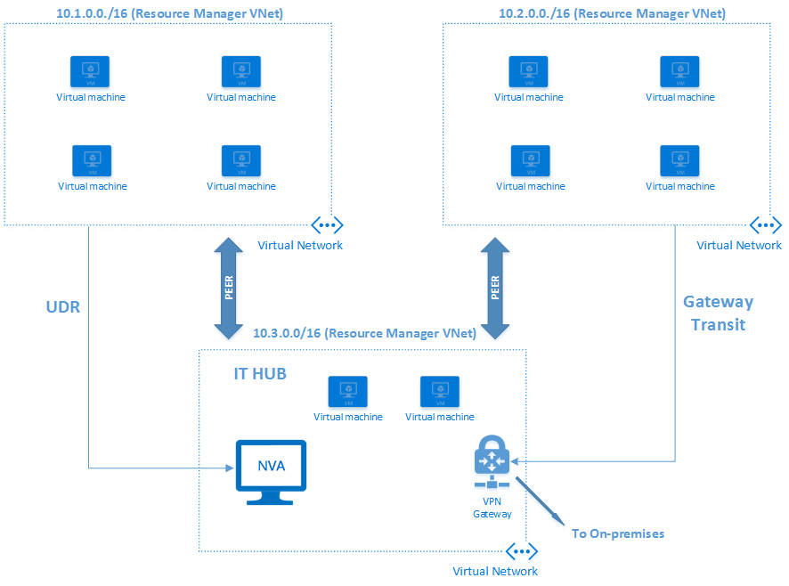

<properties
   pageTitle="Azure virtuelles Netzwerk peering | Microsoft Azure"
   description="Erfahren Sie in Azure peering VNet aus."
   services="virtual-network"
   documentationCenter="na"
   authors="NarayanAnnamalai"
   manager="jefco"
   editor="tysonn" />
<tags
   ms.service="virtual-network"
   ms.devlang="na"
   ms.topic="get-started-article"
   ms.tgt_pltfrm="na"
   ms.workload="infrastructure-services"
   ms.date="10/17/2016"
   ms.author="narayan" />

# VNet peering

VNet peering ist eine Methode, die zwei virtuelle Netzwerke (VNets) in der gleichen Region über das Azure Backbonenetzwerk verbunden. Nachdem dies ist, werden die beiden virtuelle Netzwerke als eine für alle Verwendungszwecke der Konnektivität angezeigt. Sie werden weiterhin als separate Ressourcen verwaltet, aber virtuellen Computern in diese virtuelle Netzwerke können direkt mithilfe der private IP-Adressen miteinander kommunizieren.

Der Datenverkehr zwischen virtuellen Computern in der hervorragendem virtuelle Netzwerke wird über die Azure-Infrastruktur weitergeleitet, ähnlich wie der Datenverkehr zwischen virtuellen Computern in der gleichen virtuellen Netzwerk weitergeleitet wird. Einige der Vorteile der Verwendung von VNet peering einbeziehen möchten:

- Eine Low-Wartezeit, hoher Bandbreite der Verbindung zwischen Ressourcen in verschiedenen virtuellen Netzwerken.
- Die Möglichkeit, Ressourcen wie Netzwerkgeräte und VPN-Gateways als Übertragung Punkte in einer hervorragendem VNet verwenden.
- Die Möglichkeit, ein virtuelles Netzwerk verbinden, das Azure Ressourcenmanager zu einem virtuellen Netzwerk verwendet, das das Bereitstellungsmodell klassischen verwendet und vollständige Konnektivität zwischen den Ressourcen diese virtuelle Netzwerke aktivieren.

Anforderungen und die wichtigsten Aspekte des VNet peering:

- Die zwei virtuelle Netzwerke, die dies sind die gleichen Azure Region hinzugefügt werden.
- Die virtuelle Netzwerke, die dies sind sollten nicht überlappende IP-Adressbereiche verfügen.
- VNet peering zwischen zwei virtuelle Netzwerke ist, und es ist keine abgeleiteten transitiven Beziehung. Angenommen, wenn virtuelles Netzwerk A mit virtuellen Netzwerk B Dies ist und wenn virtuelles Netzwerk B mit virtuelle Netzwerk C Dies ist, nicht zu virtuelle übersetzt Netzwerk einer wird dies mit virtuellen Netzwerk C.
- Peering kann zwischen virtueller Netzwerke in zwei verschiedenen Abonnements hergestellt werden, wie lange ein berechtigte Benutzer der beiden Abonnements die peering autorisiert und die Abonnements auf der gleichen Active Directory-Mandanten zugeordnet sind. 
- Zwischen virtuelles Netzwerk in Ressource-Manager-Modell und Modell zur klassischen Bereitstellung Peering erfordert, dass die VNets im selben Abonnement sein soll.
- Ein virtuelles Netzwerk, das Ressourcenmanager Bereitstellung verwendet, dies werden kann, mit einem anderen virtuellen Netzwerk, das dieses Modell verwendet, oder mit einem virtuellen Netzwerk, das Bereitstellungsmodell klassischen verwendet. Virtuelle Netzwerke, die das Bereitstellungsmodell klassischen verwenden können nicht jedoch miteinander dies sein.
- Obwohl die Kommunikation zwischen virtuellen Computern in hervorragendem virtuelle Netzwerke keine zusätzliche Bandbreite Einschränkungen enthält, gilt für Bandbreite Linienende basierend auf virtueller Speicher immer noch ein.

## Konnektivität
Nach zwei virtuelle Netzwerke Dies sind, können mit anderen virtuellen Computern im Netzwerk hervorragendem virtuelle direkt ein virtuellen Computers (Web/Worker-Rolle) in das virtuelle Netzwerk eine Verbindung herstellen. Dieser beiden Netzwerke haben vollständigen IP-Ebene Connectivity.

Die Netzwerkwartezeit für eine Schleife zwischen zwei virtuellen Computern in hervorragendem virtuelle Netzwerke entspricht der Schleife innerhalb eines lokalen virtuellen Netzwerks. Der Netzwerkdurchsatz basiert auf die Bandbreite, die für den virtuellen Computer proportional zu ihrer Größe zulässig ist. Es ist keine zusätzliche Einschränkung auf die Bandbreite ein.

Der Datenverkehr zwischen den virtuellen Computern in hervorragendem virtuelle Netzwerke wird direkt über die Azure Back-End-Infrastruktur und nicht über ein Gateway weitergeleitet.

Virtuelle Computer in einem virtuellen Netzwerk können die internen Lastenausgleich (ILB) Endpunkte in das hervorragendem virtuelle Netzwerk zugreifen. Netzwerk-Sicherheitsgruppen (NSGs) können entweder virtuelles Netzwerk den Zugriff auf andere virtuelle Netzwerke oder Subnetze blockieren, falls gewünscht angewendet werden.

Wenn Benutzer peering konfigurieren, können sie öffnen oder schließen Sie die Regeln NSG zwischen den virtuellen Netzwerken. Wenn der Benutzer vollständige Konnektivität zwischen hervorragendem virtuelle Netzwerke (Dies ist die Standardoption) zu öffnen, können sie NSGs klicken Sie dann auf bestimmte Subnetze oder virtuellen Computern verwenden, blockiert oder bestimmte Zugriff verweigern.

Bereitgestellter Azure internen DNS-namensauflösung für virtuelle Computer funktioniert nicht über hervorragendem virtuelle Netzwerke. Virtuelle Computer verfügen interne DNS-Namen, die nur innerhalb des lokalen virtuellen Netzwerks aufgelöst werden kann. Benutzer können jedoch virtuelle Computer konfigurieren, die als DNS-Server für ein virtuelles Netzwerk in hervorragendem virtuelle Netzwerke ausgeführt werden.

## Dienst verketten
Benutzer können benutzerdefinierte Routing-Tabellen, die mit virtuellen Computern in hervorragendem virtuelle Netzwerke als "nächsten Abschnitt" IP-Adresse, zeigen Sie auf konfigurieren, wie im Diagramm weiter unten in diesem Artikel dargestellt. Dies ermöglicht Benutzern erzielen Verketten von Diensten, über denen Datenverkehr von einem virtuellen Netzwerk an eine virtuelle Einheit steuern können, die in einem hervorragendem virtuelle Netzwerk über User defined Routing Tabellen ausgeführt wird.

Benutzer können außerdem eine effektive Hub-und-Netz Typ Umgebungen erstellen, in dem der Hub Infrastrukturkomponenten wie eine virtuelle Netzwerk-Anwendung zu hosten kann. Alle Netz virtuelle Netzwerke können dann peer mit es sowie eine Teilmenge der Datenverkehr an Einheiten, die im Hub virtuelle Netzwerk ausgeführt werden. Kurz gesagt, VNet peering die IP-Adresse des nächste Knotens auf 'Definition der Benutzer Routingtabelle' ermöglicht die IP-Adresse eines virtuellen Computers in das hervorragendem virtuelle Netzwerk sein.

## Gateways und lokale Konnektivität
Jedes virtuelles Netzwerk, unabhängig davon, ob es mit einem anderen Netzwerk virtuelle, dies ist können Sie weiterhin eine eigene Gateway haben und verwenden, um eine lokale Verbindung. Benutzer können auch [VNet-VNet - Verbindungen](../vpn-gateway/vpn-gateway-vnet-vnet-rm-ps.md) konfigurieren mithilfe des Gateways, obwohl die virtuellen Netzwerke Dies sind.

Wenn beide Optionen für die virtuelle Netzwerk Interkonnektivität konfiguriert werden, der zwischen den virtuellen Netzwerken Datenfluss durch die Konfiguration Peeringliste (d. h., bis die Azure Backbone).

Beim virtuelle Netzwerke Dies sind, können Benutzer auch das Gateway in das hervorragendem virtuelle Netzwerk als eine Übertragung, zeigen Sie auf lokale konfigurieren. In diesem Fall kann nicht das virtuelle Netzwerk, das ein Gateway remote verwendet einen eigenen Gateway haben. Ein virtuelles Netzwerk kann nur von einem Gateway verfügen. Es kann entweder eines lokalen Gateways oder ein remote Gateway (im hervorragendem virtuelle Netzwerk) sein, wie in der folgenden Abbildung gezeigt.

Gateway Übertragung wird in der Peeringbeziehung zwischen virtuelle Netzwerke mit dem Ressourcenmanager Modell und die Verwendung des Modells klassischen Bereitstellung nicht unterstützt. Beide virtueller Netzwerke in der Peeringbeziehung trifft für Ressourcenmanager Bereitstellungsmodell für ein Gateway Übertragung arbeiten.

Wenn die virtuelle Netzwerke, die eine einzelne Azure ExpressRoute Verbindung Listentypen Dies sind, durchläuft der Datenverkehr zwischen ihnen die Peeringbeziehung (d. h., über das Backbonenetzwerk Azure). Benutzer können weiterhin lokale Gateways in jedes virtuelle Netzwerk verwenden, zum Herstellen der Verbindung mit lokal gehosteten. Alternativ können sie verwenden ein freigegebenes Gateways und Übertragung für lokale Verbindung konfigurieren.

## Bereitgestellt
VNet peering ist ein berechtigten Vorgang. Es ist eine separate Funktion unter dem Namespace VirtualNetworks. Ein Benutzer kann bestimmte Rechte autorisieren peering angegeben sein. Ein Benutzer mit Lese-und Schreibzugriff auf das virtuelle Netzwerk erbt diese Rechte automatisch an.

Benutzer, der ein Administrator sind oder ein berechtigte Benutzer die Möglichkeit Peeringliste kann einen Peeringliste Vorgang auf einem anderen VNet initiieren. Es ist eine übereinstimmende Anforderung für auf der anderen Seite peering und andere Anforderungen erfüllt sind, wird die peering hergestellt werden.

Finden Sie im Artikel im Abschnitt "Nächste Schritte", um weitere Informationen zur VNet zwischen zwei virtuelle Netzwerke peering herstellen.

## Grenzwerte
Bestehen Einschränkungen hinsichtlich der Anzahl der Peerings, die für ein einzelnes virtuelles Netzwerk zulässig ist. Weitere Informationen finden Sie unter [Azure Netzwerke Grenzwerte](../azure-subscription-service-limits.md#networking-limits) .

## Preise
VNet peering werden kostenlos, während des Zeitraums überprüfen. Nach der Veröffentlichung verwendet, wird auf eingehende und Ausgang Datenverkehr, der die peering nutzt eine nominale Gebühr sein. Weitere Informationen finden Sie in der [Seite Preise](https://azure.microsoft.com/pricing/details/virtual-network).

## Nächste Schritte
- [Einrichten von peering zwischen virtuelle Netzwerke](virtual-networks-create-vnetpeering-arm-portal.md).
- Informationen Sie zu [NSGs](virtual-networks-nsg.md).
- Informationen Sie zu [benutzerdefinierten leitet und IP-Weiterleitung](virtual-networks-udr-overview.md).
