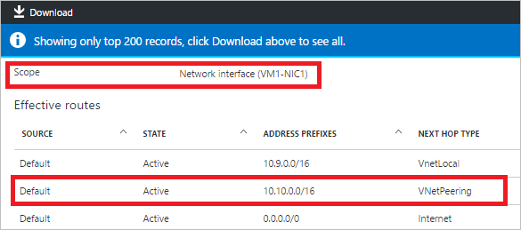
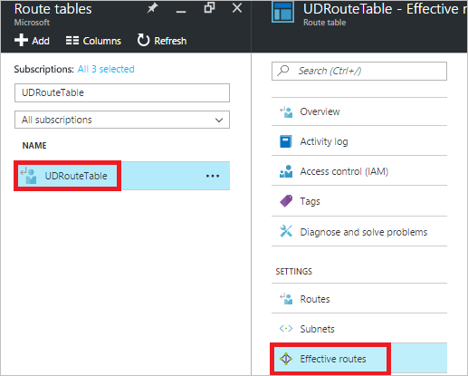

<properties 
   pageTitle="Behandeln von Problemen mit leitet - Portal | Microsoft Azure"
   description="Informationen Sie zum Behandeln von Problemen mit der leitet im Bereitstellungsmodell Azure Ressourcenmanager über das Azure-Portal."
   services="virtual-network"
   documentationCenter="na"
   authors="AnithaAdusumilli"
   manager="narayan"
   editor=""
   tags="azure-resource-manager"
/>
<tags 
   ms.service="virtual-network"
   ms.devlang="na"
   ms.topic="article"
   ms.tgt_pltfrm="na"
   ms.workload="infrastructure-services"
   ms.date="09/23/2016"
   ms.author="anithaa" />

# Behandeln von Problemen mit Arbeitspläne mithilfe der Azure-Portal

> [AZURE.SELECTOR]
- [Azure-Portal](virtual-network-routes-troubleshoot-portal.md)
- [PowerShell](virtual-network-routes-troubleshoot-powershell.md)

Wenn Sie Probleme mit der Netzwerkkonnektivität zu oder aus der Azure-virtuellen Computern (VM) auftreten, möglicherweise Arbeitspläne Ihrer virtuellen Computer Datenverkehr fließt beeinträchtigen. Dieser Artikel enthält eine Übersicht über Diagnose-Funktionen für leitet zur weiteren Behandlung an.

Routing-Tabellen sind mit unterschiedlichen verknüpft und gelten für alle Netzwerkschnittstellen (NIC) in diesem Subnetz. Die folgenden Arten von leitet können auf jedes Netzwerk-Benutzeroberfläche angewendet werden:

- **System leitet:** Standardmäßig weist jede Subnetz erstellt in einer Azure-virtuellen Netzwerk (VNet) System Routing-Tabellen, die lokale VNet Datenverkehr, lokalen Verkehr über VPN-Gateways und Datenverkehr im Internet zulässt. System leitet sind auch für hervorragendem VNets vorhanden.
- **BGP leitet:** Klicken Sie auf Netzwerkschnittstellen durch ExpressRoute oder Website-zu-Standort VPN-Verbindungen verteilt. Weitere Informationen zu BGP routing, indem Sie die Artikeln [BGP mit VPN-Gateways](../vpn-gateway/vpn-gateway-bgp-overview.md) und [ExpressRoute Überblick](../expressroute/expressroute-introduction.md) lesen.
- **User defined leitet (UDR):** Verwendung von virtuellen Netzwerkgeräte oder werden Erzwungene Tunnel Datenverkehr zu einem lokalen Netzwerk über ein VPN zwischen Standorten, möglicherweise müssen Sie benutzerdefinierte leitet (UDRs) mit Ihrem Subnetz Routingtabelle verknüpft ist. Wenn Sie nicht mit UDRs vertraut sind, lesen Sie den [User defined leitet](virtual-networks-udr-overview.md#user-defined-routes) Artikel.

Mit den verschiedenen weitergeleitet, die auf eine Schnittstelle angewendet werden können, kann es schwierig sein, festzustellen, welche aggregieren leitet effektiven sind. Um Netzwerkkonnektivität virtueller Computer zu beheben, können Sie alle effektiven Arbeitspläne für einen Netzwerkadapter im Bereitstellungsmodell Azure Ressourcenmanager anzeigen.

## Verwenden von effektiven leitet zur Problembehandlung von Datenfluss virtueller Computer

In diesem Artikel wird das folgende Szenario als Beispiel zum Veranschaulichen der effektiven leitet für einen Netzwerkadapter behandeln:

Ein virtueller Computer (*VM1*) bei einer Verbindung zu den VNet (*VNet1*, Präfix: 10.9.0.0/16) kann keine Verbindung zu einem VM(VM3) in einem neu hervorragendem VNet (*VNet3*, Präfix 10.10.0.0/16) herstellen. Es gibt keine UDRs oder BGP leitet VM1 NIC1 Schnittstelle bei einer Verbindung zu den virtuellen Computer angewendet, die nur System leitet angewendet werden.

In diesem Artikel wird erläutert, wie die Ursache des Verbindungsfehlers, mithilfe von effektiven leitet Videofunktionen im Modell zur Bereitstellung von Azure Ressourcenverwaltung zu ermitteln.
Während im Beispiel nur System weitergeleitet wird verwendet, können dieselben Schritte anhand von Verbindungsfehlern eingehende und ausgehende über einen beliebigen Routingtyp verwendet werden.

>[AZURE.NOTE] Wenn Ihre virtuellen Computer mehrere NIC angeschlossen ist, überprüfen Sie effektiven leitet für jede der NICs Netzwerkkonnektivitätsprobleme vor an und von eines virtuellen Computers zu diagnostizieren.

### Effektive Arbeitspläne für einen virtuellen Computer anzeigen

Um das Aggregat leitet anzuzeigen, die auf einen virtuellen angewendet werden, gehen Sie folgendermaßen vor:

1. Melden Sie sich zum Azure-Portal unter https://portal.azure.com.
2. Klicken Sie auf **Weitere Dienste**, und klicken Sie auf **virtuellen Computern** in der Liste, die angezeigt wird.
3. Wählen Sie einen virtuellen Computer aus der Liste zu beheben, die angezeigt wird und eine Blade virtueller Computer mit Optionen wird angezeigt.
4. Klicken Sie auf **Konfigurationsprobleme & Lösen von Problemen mit** , und wählen Sie ein häufig auftretendes Problem. In diesem Beispiel wird die **ich kann keine Verbindung mit meinem Windows virtueller Computer** ausgewählt. 

    

5. Schritte, die unter das Problem angezeigt werden, wie in der folgenden Abbildung dargestellt: 

    

    Klicken Sie auf *effektive leitet* in der Liste der Schritte empfohlen.

6. Das **effektive leitet** Blade angezeigt wird, wie in der folgenden Abbildung dargestellt:

    

    Wenn Ihre virtuellen Computer nur eine Netzwerkkarte ist, ist es standardmäßig aktiviert. Wenn Sie mehr als eine NIC haben, wählen Sie die NIC für das Anzeigen der effektiven weitergeleitet werden soll.

    >[AZURE.NOTE] Wenn Sie der virtuellen Computer die NIC zugeordnet nicht aktiv ist, werden effektiven leitet nicht angezeigt. Nur die ersten 200 effektiven weitergeleitet werden im Portal angezeigt. Klicken Sie für die vollständige Liste auf **herunterladen**. Sie können auf die Ergebnisse der heruntergeladenen CSV-Datei filtern.

    Beachten Sie die folgenden in der Ausgabe an:
    - **Datenquelle**: Gibt den Typ des weiterleiten. System weitergeleitet werden angezeigt, wenn *Standard*, UDRs als *Benutzer* und dem Gateway leitet dargestellt werden (statische oder BGP) als *VPNGateway*angezeigt werden.
    - **Bundesstaat**: Gibt den effektiven Routing Zustand. Mögliche Werte sind *aktive* oder ist *ungültig*.
    - **AddressPrefixes**: Gibt das Adresspräfix von der effektiven Routing in CIDR-Notation. 
    - **NextHopType**: Gibt den nächsten Abschnitt für die angegebenen weiterleiten an. Mögliche Werte sind *VirtualAppliance*, *Internet*, *VNetLocal*, *VNetPeering*oder *Null*. Der Wert *Null* für **NextHopType** in einer UDR möglicherweise ein ungültiges Routing angeben. Beispielsweise ist **NextHopType** *VirtualAppliance* und dem Netzwerk virtuelle ist Einheit virtuellen Computer nicht in einem Zustand nach der Bereitstellung/Ausführung. Wenn **NextHopType** *VPNGateway lautet* , und es keine Gateway nach der Bereitstellung wird/Ausführung in der angegebenen VNet, kann das Routing ungültig.
    
7. Es gibt keine Routing von der *WestUS-VNet1* (Präfix 10.9.0.0/16) in dem Bild im vorherigen Schritt in der *WestUS-VNET3* VNet (Präfix 10.10.0.0/16) aufgeführt. In der nachstehenden Abbildung befindet sich die Peeringverbindung im Status *getrennt* :
    
    

    Den Link bidirektionale für die peering fehlerhaft ist, welche wird erläutert, warum VM1 nicht in der *WestUS-VNet3* VNet VM3 Verbindung konnte.

8. Die folgende Abbildung zeigt die Arbeitspläne nach dem Einrichten der bidirektionale Peeringverbindung an:

    

Problembehandlung Szenarien für Erzwungene Tunnel und Routing Auswertung finden Sie im Abschnitt [Aspekte](virtual-network-routes-troubleshoot-portal.md#Considerations) dieses Artikels.

### Effektive Arbeitspläne für einen Netzwerkadapter anzeigen

Wenn Network Datenfluss für einen bestimmten Netzwerkadapter (NIC) beeinträchtigt wird, können Sie eine vollständige Liste der effektiven leitet direkt auf einen Netzwerkadapter anzeigen. Um das Aggregat leitet anzuzeigen, die auf einen Netzwerkadapter angewendet werden, gehen Sie folgendermaßen vor:

1. Melden Sie sich zum Azure-Portal unter https://portal.azure.com.
2. Klicken Sie auf **Weitere Dienste**, und klicken Sie auf **Netzwerk-Schnittstellen**
3. Durchsuchen Sie die Liste nach dem Namen des einen Netzwerkadapter, oder wählen Sie ihn aus der angezeigten Liste aus. In diesem Beispiel ist **VM1-NIC1** ausgewählt.
4. Wählen Sie in das Blade **-Schnittstelle** **effektiven leitet** aus, wie in der folgenden Abbildung dargestellt:
   
    

    Der **Bereich** ist der Schnittstelle ausgewählt.

    

### Effektive Arbeitspläne für eine Routingtabelle anzeigen

Beim User defined leitet (UDRs) in einer Routingtabelle ändern zu können, sollten Sie den Einfluss der die Arbeitspläne hinzugefügt werden, klicken Sie auf einen bestimmten virtuellen Computer zu überprüfen. Eine Routingtabelle kann eine beliebige Anzahl von Subnetzen zugeordnet werden. Sie können nun alle der effektiven Arbeitspläne anzeigen, für alle Netzwerkkarten, die eine Routingtabelle angegebenen, angewendet wird ohne Kontext aus dem angegebenen Routing Tabelle Blade wechseln zu müssen.

In diesem Beispiel wird eine UDR (*UDRoute*) in einer Routingtabelle (*UDRouteTable*) angegeben. Diese Routing sendet alle Internet-Verkehr von *Subnet1* in der VNet *WestUS-VNet1* über ein Netzwerk virtuelle Einheit (NVA), in *Subnet2* von der gleichen VNet. Das Routing ist in der folgenden Abbildung dargestellt:

Um das Aggregat leitet für eine Routingtabelle angezeigt wird, gehen Sie folgendermaßen vor:

1. Melden Sie sich zum Azure-Portal unter https://portal.azure.com.
2. Klicken Sie auf **Weitere Dienste**, und klicken Sie auf **Routing-Tabellen**
3. Suchen Sie in der Liste für die Routingtabelle, die Sie verwenden möchten, finden Sie unter aggregate leitet für, und wählen Sie ihn. In diesem Beispiel ist **UDRouteTable** ausgewählt. Eine Blade für die ausgewählten Routingtabelle angezeigt wird, wie in der folgenden Abbildung dargestellt:

    

4. Wählen Sie in der **Tabelle Routing** Blade- **Effektiven leitet** ein. Der Routing-Tabelle, die Sie ausgewählt haben, wird der **Bereich** festgelegt.
5. Eine Routingtabelle kann auf mehrere Subnetze angewendet werden. Wählen Sie das **Subnetz gehören, den** Sie aus der Liste überprüfen möchten. In diesem Beispiel ist **Subnet1** ausgewählt.
6. Wählen Sie eine **Schnittstelle**aus. Alle NICs mit dem ausgewählten Subnetz verbunden sind aufgeführt. In diesem Beispiel ist **VM1-NIC1** ausgewählt.

    

    >[AZURE.NOTE] Wenn die NIC keines laufenden virtuellen Computers zugeordnet ist, werden keine effektiven leitet angezeigt.

## Aspekte

Ein paar Dinge zu beachten, wenn die Liste der Arbeitspläne überprüfen zurückgegeben:

- Routing basiert auf längsten Präfix Übereinstimmung (LPM) zwischen UDRs, BGP und System weitergeleitet. Ist mit der gleichen LPM Übereinstimmung mehrere weiterleiten, wird ein Routing basierend auf dem Ursprung in der folgenden Reihenfolge ausgewählt:
    - Benutzerdefinierte Routing
    - BGP-Routing
    - Routing System (Standard)

    Mit effektiven weitergeleitet können Sie nur effektiven leitet sehen, die Übereinstimmung LPM im Hinblick auf alle Strecken, die verfügbar sind. Durch mit, wie die Arbeitspläne für einen angegebenen Netzwerkadapter tatsächlich ausgewertet werden, vereinfacht dies sehr bestimmten leitet zu beheben, die Konnektivität zu/aus der virtuellen Computer beeinträchtigt werden kann.

- Wenn Sie UDRs haben und den Datenverkehr an eine virtuelle Netzwerkeinheit (NVA), mit *VirtualAppliance* als **NextHopType**senden, stellen Sie sicher, dass die IP-Weiterleitung aktiviert ist, klicken Sie auf die NVA den Datenverkehr empfangen oder Pakete verloren. 
- Wenn Erzwungene Tunnel aktiviert ist, werden alle ausgehenden Internet-Verkehr zu lokalen weitergeleitet. RDP/SSH aus dem Internet zu Ihrem virtuellen Computer funktioniert möglicherweise nicht mit dieser Einstellung, je nachdem, wie die lokale diesen Datenverkehr verarbeitet. 
  Erzwungene Tunnel aktiviert werden kann:
    - Bei Verwendung von Standort-zu-Standort VPN, indem Sie eine benutzerdefinierte Routing (UDR) mit NextHopType als VPN-Gateway festlegen
    - Wenn Sie eine Standard-Routing über BGP angekündigt wird
- VNet Peeringliste Datenverkehr ordnungsgemäß funktioniert muss ein System Routing mit **NextHopType** *VNetPeering* für die hervorragendem VNet Präfix Bereich vorhanden ist. Wenn ein solcher Routing nicht vorhanden, und die VNet Peeringverbindung sieht OK aus:
    - Warten Sie einige Sekunden, und wiederholen Sie eine neu eingerichtete Peeringverbindung ist. Gelegentlich dauert länger leitet an alle Netzwerkschnittstellen in einem Subnetz auf Objektebene überschrieben werden.
    - Netzwerk-Sicherheitsgruppe (NSG) Regeln möglicherweise den Datenverkehr fließt beeinträchtigt werden. Weitere Informationen finden Sie im Artikel [Behandeln von Problemen mit Netzwerk-Sicherheitsgruppen](virtual-network-nsg-troubleshoot-portal.md) .
