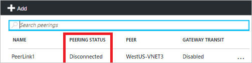

<properties 
   pageTitle="Behandeln von Problemen mit leitet - PowerShell | Microsoft Azure"
   description="Informationen Sie zum Behandeln von Problemen mit der leitet in das Modell zur Bereitstellung von Azure Ressourcenmanager mithilfe der PowerShell Azure."
   services="virtual-network"
   documentationCenter="na"
   authors="AnithaAdusumilli"
   manager="narayan"
   editor=""
   tags="azure-resource-manager"
/>
<tags 
   ms.service="virtual-network"
   ms.devlang="na"
   ms.topic="article"
   ms.tgt_pltfrm="na"
   ms.workload="infrastructure-services"
   ms.date="09/23/2016"
   ms.author="anithaa" />

# Behandeln von Problemen mit Arbeitspläne mithilfe des Azure PowerShell

> [AZURE.SELECTOR]
- [Azure-Portal](virtual-network-routes-troubleshoot-portal.md)
- [PowerShell](virtual-network-routes-troubleshoot-powershell.md)

Wenn Sie Probleme mit der Netzwerkkonnektivität zu oder aus der Azure-virtuellen Computern (VM) auftreten, möglicherweise Arbeitspläne Ihrer virtuellen Computer Datenverkehr fließt beeinträchtigen. Dieser Artikel enthält eine Übersicht über Diagnose-Funktionen für leitet zur weiteren Behandlung an.

Routing-Tabellen sind mit unterschiedlichen verknüpft und gelten für alle Netzwerkschnittstellen (NIC) in diesem Subnetz. Die folgenden Arten von leitet können auf jedes Netzwerk-Benutzeroberfläche angewendet werden:

- **System leitet:** Standardmäßig weist jede Subnetz erstellt in einer Azure-virtuellen Netzwerk (VNet) System Routing-Tabellen, die lokale VNet Datenverkehr, lokalen Verkehr über VPN-Gateways und Datenverkehr im Internet zulässt. System leitet sind auch für hervorragendem VNets vorhanden.
- **BGP leitet:** Klicken Sie auf Netzwerkschnittstellen durch ExpressRoute oder Website-zu-Standort VPN-Verbindungen verteilt. Weitere Informationen zu BGP routing, indem Sie die Artikeln [BGP mit VPN-Gateways](../vpn-gateway/vpn-gateway-bgp-overview.md) und [ExpressRoute Überblick](../expressroute/expressroute-introduction.md) lesen.
- **User defined leitet (UDR):** Verwendung von virtuellen Netzwerkgeräte oder werden Erzwungene Tunnel Datenverkehr zu einem lokalen Netzwerk über ein VPN zwischen Standorten, möglicherweise müssen Sie benutzerdefinierte leitet (UDRs) mit Ihrem Subnetz Routingtabelle verknüpft ist. Wenn Sie nicht mit UDRs vertraut sind, lesen Sie den [User defined leitet](virtual-networks-udr-overview.md#user-defined-routes) Artikel.

Mit den verschiedenen weitergeleitet, die auf eine Schnittstelle angewendet werden können, kann es schwierig sein, festzustellen, welche aggregieren leitet effektiven sind. Um Netzwerkkonnektivität virtueller Computer zu beheben, können Sie alle effektiven Arbeitspläne für einen Netzwerkadapter im Bereitstellungsmodell Azure Ressourcenmanager anzeigen.

## Verwenden von effektiven leitet zur Problembehandlung von Datenfluss virtueller Computer

In diesem Artikel wird das folgende Szenario als Beispiel zum Veranschaulichen der effektiven leitet für einen Netzwerkadapter behandeln:

Ein virtueller Computer (*VM1*) bei einer Verbindung zu den VNet (*VNet1*, Präfix: 10.9.0.0/16) kann keine Verbindung zu einem VM(VM3) in einem neu hervorragendem VNet (*VNet3*, Präfix 10.10.0.0/16) herstellen. Es gibt keine UDRs oder BGP leitet VM1 NIC1 Schnittstelle bei einer Verbindung zu den virtuellen Computer angewendet, die nur System leitet angewendet werden.

In diesem Artikel wird erläutert, wie die Ursache des Verbindungsfehlers, mithilfe von effektiven leitet Videofunktionen im Modell zur Bereitstellung von Azure Ressourcenverwaltung zu ermitteln.
Während im Beispiel nur System weitergeleitet wird verwendet, können dieselben Schritte anhand von Verbindungsfehlern eingehende und ausgehende über einen beliebigen Routingtyp verwendet werden.

>[AZURE.NOTE] Wenn Ihre virtuellen Computer mehrere NIC angeschlossen ist, aktivieren Sie effektiven leitet für jede der NICs Netzwerkkonnektivitätsprobleme vor an und von eines virtuellen Computers diagnostizieren aus.

### Effektive Arbeitspläne für einen virtuellen Computer anzeigen

Um das Aggregat leitet anzuzeigen, die auf einen virtuellen angewendet werden, gehen Sie folgendermaßen vor:

### Effektive Arbeitspläne für einen Netzwerkadapter anzeigen

Um das Aggregat leitet anzuzeigen, die auf eine Schnittstelle angewendet werden, gehen Sie folgendermaßen vor:

1.  Starten einer Azure PowerShell-Sitzung und melden Sie sich Azure. Wenn Sie nicht mit Azure PowerShell, lesen Sie den Artikel [zum Installieren und Konfigurieren von Azure PowerShell](../powershell-install-configure.md) vertraut sind.

2.  Mit dem folgende Befehl gibt alle Arbeitspläne a Netzwerk-Oberfläche mit dem Namen *VM1-NIC1* in der Ressourcengruppe *RG1*angewendet.

        Get-AzureRmEffectiveRouteTable -NetworkInterfaceName VM1-NIC1 -ResourceGroupName RG1

    >[AZURE.TIP] Wenn Sie nicht, dass der Name des Netzwerk-Schnittstellen wissen, geben Sie den folgenden Befehl aus, um die Namen aller Netzwerk-Schnittstellen in einer Ressource Administratorkonten abzurufen

        Get-AzureRmNetworkInterface -ResourceGroupName RG1 | Format-Table Name

    Die folgende Ausgabe ähnelt der Ausgabe für jede Routing angewendet, die mit dem Subnetz, mit denen die NIC verbunden ist:

        Name :
        State : Active
        AddressPrefix : {10.9.0.0/16}
        NextHopType : VNetLocal
        NextHopIpAddress : {}

        Name :
        State : Active
        AddressPrefix : {0.0.0.0/16}
        NextHopType : Internet
        NextHopIpAddress : {}

    Beachten Sie die folgenden in der Ausgabe an:
    - **Name**: Name des der effektiven Routing möglicherweise leer ist, sofern nicht ausdrücklich angegeben, für die benutzerdefinierte weitergeleitet. 
    - **Bundesstaat**: Gibt den effektiven Routing Zustand. Mögliche Werte sind "Aktiv" oder "Ungültig"
    - **AddressPrefixes**: Gibt das Adresspräfix von der effektiven Routing in CIDR-Notation. 
    - **NextHopType**: Gibt den nächsten Abschnitt für die angegebenen weiterleiten an. Mögliche Werte sind *VirtualAppliance*, *Internet*, *VNetLocal*, *VNetPeering*oder *Null*. Der Wert *Null* für **NextHopType** in einer UDR möglicherweise ein ungültiges Routing angeben. Beispielsweise ist **NextHopType** *VirtualAppliance* und dem Netzwerk virtuelle ist Einheit virtuellen Computer nicht in einem Zustand nach der Bereitstellung/Ausführung. Wenn **NextHopType** *VPNGateway lautet* , und es keine Gateway nach der Bereitstellung wird/Ausführung in der angegebenen VNet, kann das Routing ungültig.
    - **NextHopIpAddress**: Gibt die IP-Adresse für den nächsten Abschnitt von der effektiven weiterleiten an.
    
    Mit dem folgende Befehl gibt die Arbeitspläne in einem einfacher zu Tabelle anzuzeigen:

        Get-AzureRmEffectiveRouteTable -NetworkInterfaceName VM1-NIC1 -ResourceGroupName RG1 | Format-Table

    Die folgende Ausgabe ist Teil der Ausgabe für den zuvor beschriebenen erhalten:

        Name State AddressPrefix NextHopType NextHopIpAddress
        ---- ----- ------------- ----------- ----------------
        Active {10.9.0.0/16} VnetLocal {}
        Active {0.0.0.0/0} Internet {}
    

3. Es gibt keine Routing auf die *WestUS-VNet3* VNet (Präfix 10.10.0.0/16)* * von *WestUS-VNet1* (Präfix 10.9.0.0/16) in der Ausgabe aus dem vorherigen Schritt aufgeführt. Wie in der nachstehenden Abbildung zu sehen ist, ist die VNet Peeringverbindung mit der *WestUS-VNet3* VNet in *getrennt* .
    
    

    Den Link bidirektionale für die peering fehlerhaft ist, welche wird erläutert, warum VM1 nicht in der *WestUS-VNet3* VNet VM3 Verbindung konnte. Einrichten einer bidirektionale VNet-Peeringverbindung erneut für *WestUS-VNet1* und *WestUS-VNet3* VNets. Umfasst die Ausgabe die zurückgegeben wird, nachdem die VNet Peeringverbindung ordnungsgemäß eingerichtet wurde:

        Name State AddressPrefix NextHopType NextHopIpAddress
        ---- ----- ------------- ----------- ----------------
        Active {10.9.0.0/16} VnetLocal {}
        Active {10.10.0.0/16} VNetPeering {}
        Active {0.0.0.0/0} Internet {}
        
    Nachdem Sie das Problem ermittelt haben, können hinzufügen, entfernen oder leitet ändern und Weiterleiten von Tabellen. Geben Sie den folgenden Befehl aus, um eine Liste der Befehle dazu verwendet anzuzeigen:

        Get-Help *-AzureRmRouteConfig

## Aspekte

Ein paar Dinge zu beachten, wenn die Liste der Arbeitspläne überprüfen zurückgegeben:

- Routing basiert auf längsten Präfix Übereinstimmung (LPM) zwischen UDRs, BGP und System weitergeleitet. Ist mit der gleichen LPM Übereinstimmung mehrere weiterleiten, wird ein Routing basierend auf dem Ursprung in der folgenden Reihenfolge ausgewählt:
    - Benutzerdefinierte Routing
    - BGP-Routing
    - Routing System (Standard)

    Mit effektiven weitergeleitet können Sie nur effektiven leitet sehen, die Übereinstimmung LPM im Hinblick auf alle Strecken, die verfügbar sind. Durch mit, wie die Arbeitspläne für einen angegebenen Netzwerkadapter tatsächlich ausgewertet werden, vereinfacht dies sehr bestimmten leitet zu beheben, die Konnektivität zu/aus der virtuellen Computer beeinträchtigt werden kann.

- Wenn Sie UDRs haben und den Datenverkehr an eine virtuelle Netzwerkeinheit (NVA), mit *VirtualAppliance* als **NextHopType**senden, stellen Sie sicher, dass die IP-Weiterleitung aktiviert ist, klicken Sie auf die NVA den Datenverkehr empfangen oder Pakete verloren. 
- Wenn Erzwungene Tunnel aktiviert ist, werden alle ausgehenden Internet-Verkehr zu lokalen weitergeleitet. RDP/SSH aus dem Internet zu Ihrem virtuellen Computer funktioniert möglicherweise nicht mit dieser Einstellung, je nachdem, wie die lokale diesen Datenverkehr verarbeitet. 
  Erzwungene Tunnel aktiviert werden kann:
    - Bei Verwendung von Standort-zu-Standort VPN, indem Sie eine benutzerdefinierte Routing (UDR) mit NextHopType als VPN-Gateway festlegen
    - Wenn Sie eine Standard-Routing über BGP angekündigt wird
- VNet Peeringliste Datenverkehr ordnungsgemäß funktioniert muss ein System Routing mit **NextHopType** *VNetPeering* für die hervorragendem VNet Präfix Bereich vorhanden ist. Wenn ein solcher Routing nicht vorhanden, und die VNet Peeringverbindung sieht OK aus:
    - Warten Sie einige Sekunden, und wiederholen Sie eine neu eingerichtete Peeringverbindung ist. Gelegentlich dauert länger leitet an alle Netzwerkschnittstellen in einem Subnetz auf Objektebene überschrieben werden.
    - Netzwerk-Sicherheitsgruppe (NSG) Regeln möglicherweise den Datenverkehr fließt beeinträchtigt werden. Weitere Informationen finden Sie im Artikel [Behandeln von Problemen mit Netzwerk-Sicherheitsgruppen](virtual-network-nsg-troubleshoot-powershell.md) .
