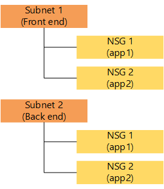
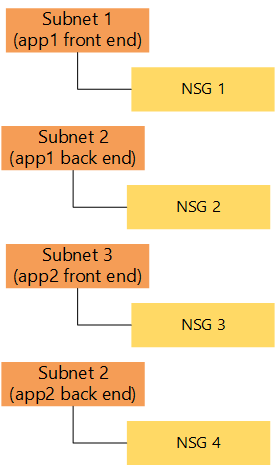
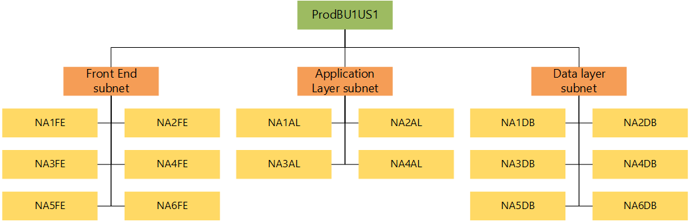

<properties
   pageTitle="Planen der Azure-virtuellen Netzwerk (VNet) und Design Guide | Microsoft Azure"
   description="Informationen Sie zum Planen und Entwerfen virtueller Netzwerke in Azure basierend auf Ihren Anforderungen Isolation, Konnektivität und Speicherort."
   services="virtual-network"
   documentationCenter="na"
   authors="jimdial"
   manager="carmonm"
   editor="tysonn" />
<tags
   ms.service="virtual-network"
   ms.devlang="na"
   ms.topic="article"
   ms.tgt_pltfrm="na"
   ms.workload="infrastructure-services"
   ms.date="02/08/2016"
   ms.author="jdial" />

# Planen Sie und Entwerfen Sie Azure virtuelle Netzwerke

Erstellen einer VNet zum Experimentieren Sie mit ist es ausreichend, aber vermutlich haben Sie mehrere VNets über einen Zeitraum zur Unterstützung der Herstellung Anforderungen Ihrer Organisation bereitstellen. Mit einigen Planung und Entwurf werden Sie möglicherweise VNets bereitstellen, und verbinden Sie die Ressourcen, die Sie noch effektiver zu müssen. Wenn Sie nicht mit VNets vertraut sind, wird empfohlen, die Sie [Informationen zu VNets](virtual-networks-overview.md) und [zum Bereitstellen](virtual-networks-create-vnet-arm-pportal.md) eine bevor Sie fortfahren. 

## Planen

Ein umfassendes Verständnis Azure-Abonnements, Regionen und Netzwerk-Ressourcen ist entscheidend für den Erfolg. Sie können die Liste der Aspekte unter als Ausgangspunkt verwenden. Wenn Sie diese Aspekte verstanden haben, können Sie die Anforderungen für den Netzwerkentwurf definieren.

### Aspekte

Vor der Planung beantwortet unter Fragen, sollten beachten Sie Folgendes:

- Alles in Azure erstellte besteht eine oder mehrere Ressourcen. Ein virtuellen Computers (virtueller Computer) ist eine Ressource, der Netzwerkadapter (NIC) von eines virtuellen Computers verwendet wird, eine Ressource, die öffentliche IP-Adresse durch einen Netzwerkadapter verwendet wird, eine Ressource, die VNet an die NIC angeschlossen ist, ist eine Ressource.
- Erstellen Sie Ressourcen innerhalb einer [Azure Region](https://azure.microsoft.com/regions/#services) und Abonnements. Und Ressourcen können nur verbunden sein, um eine VNet, die in der gleichen Region und Abonnement, wie Sie in vorhanden ist. 
- Sie können über einen Azure [VPN-Gateway](../vpn-gateway/vpn-gateway-vnet-vnet-rm-ps.md)VNets miteinander verbinden. Sie können auch VNets über Regionen und Abonnements auf diese Weise verbinden.
- Sie können VNets mit Ihrem lokalen Netzwerk herstellen, indem Sie eine der [Optionen für die Netzwerkkonnektivität](../vpn-gateway/vpn-gateway-about-vpngateways.md#site-to-site-and-multi-site) in Azure verfügbar. 
- Andere Ressourcen können in [Ressourcengruppen](../azure-resource-manager/resource-group-overview.md#resource-groups), denen es einfacher zum Verwalten der Ressource als Einheit gruppiert werden. Eine Ressourcengruppe kann Ressourcen aus mehreren Bereichen enthalten, solange die Ressourcen mit dem gleichen Abonnement gehören.

### Definieren von Anforderungen

Verwenden Sie Fragen unter als Ausgangspunkt für den Netzwerkentwurf Azure ein.  

1. Welche Azure Speicherorte verwenden Sie zum Host VNets?
2. Benötigen Sie die Kommunikation zwischen diesen Azure Speicherorten zu ermöglichen?
3. Benötigen Sie die Kommunikation zwischen Ihrem Azure VNet(s) und Ihrem lokalen Datacenter(s) bieten?
4. Wie viele als eine Service (IaaS) virtuellen Computern, Infrastrukturdienste Cloud Rollen, und führen Sie Web apps, die Sie für Ihre Lösung müssen?
5. Benötigen Sie zum Isolieren Datenverkehr auf Grundlage von Gruppen von virtuellen Computern (d. h. front-End-Webservern und Back-End-Datenbank-Server)?
6. Benötigen Sie steuern Datenfluss virtuelle Einheiten verwenden?
7. Benötigen Benutzer verschiedene Sätze von Berechtigungen für unterschiedliche Azure Ressourcen?

### Grundlegendes zu VNet und Subnetz Eigenschaften

VNet und Subnetze Ressourcen können eine Begrenzungslinie Sicherheit für Auslastung in Azure ausgeführt definiert werden. Eine VNet ist durch eine Zusammenstellung von Adresse Leerzeichen, als CIDR-Blocks definiert charakterisiert. 

>[AZURE.NOTE] Netzwerk-Administratoren sind mit CIDR-Notation vertraut. Wenn Sie nicht mit CIDR, [erfahren Sie mehr über](http://whatismyipaddress.com/cidr)vertraut sind.

VNets enthalten die folgenden Eigenschaften.

|Eigenschaft|Beschreibung|Einschränkungen|
|---|---|---|
|**Namen**|VNet Namen|Zeichenfolge mit bis zu 80 Zeichen. Möglicherweise Buchstaben, Zahlen, Unterstrich, Punkten oder Bindestriche enthalten. Muss mit einem Buchstaben oder einer Zahl beginnen. Muss mit einem Buchstaben, Zahl oder Unterstrich enden. Können enthält Groß- oder Kleinbuchstaben unterschieden.|  
|**Speicherort**|Azure Speicherort (auch als Bereich bezeichnet).|Die gültigen Azure Positionen gültig sind.|
|**addressSpace**|Sammlung von Adresspräfixe, aus denen die VNet in CIDR-Notation besteht.|Sie müssen ein Array von gültigen CIDR Adressblöcken, einschließlich der öffentlichen IP-Adressbereiche.|
|**Subnetze**|Sammlung von Subnetzen, die die VNet zusammensetzt|finden Sie in der nachfolgenden Subnetz Eigenschaftentabelle ein.||
|**dhcpOptions**|Objekt, das eine einzelne erforderliche-Eigenschaft enthält den Namen **DnsServers**.||
|**dnsServers**|Array von DNS-Server von der VNet verwendet. Wenn kein Server angegeben ist, wird mit einer Auflösung von Azure internen Namen verwendet.|Sie müssen ein Array von bis zu 10 DNS-Server per IP Address.| 

Ein Subnetz ist eine untergeordnete Ressource von einem VNet und Hilfe bei der Definition der Adresse Leerzeichen innerhalb eines CIDR-Blocks mit IP-Adresspräfixe Segmente. NICs können Subnetze hinzugefügt und auf virtuellen Computern, die eine Verbindung herstellt für verschiedene Auslastung verbunden werden.

Subnetze enthalten die folgenden Eigenschaften. 

|Eigenschaft|Beschreibung|Einschränkungen|
|---|---|---|
|**Namen**|Subnetnamen|Zeichenfolge mit bis zu 80 Zeichen. Möglicherweise Buchstaben, Ziffern, Unterstrich, Punkten oder Bindestriche enthalten. Muss mit einem Buchstaben oder einer Zahl beginnen. Muss mit einem Buchstaben, Zahl oder Unterstrich enden. Können enthält Groß- oder Kleinbuchstaben unterschieden.|
|**Speicherort**|Azure Speicherort (auch als Bereich bezeichnet).|Die gültigen Azure Positionen gültig sind.|
|**addressPrefix**|Einzelne Adresspräfix, die das Subnetz in CIDR-Notation zusammensetzt|Muss ein einzelner CIDR-Block, der Bestandteil eines der VNets Adresse Leerzeichen ist.|
|**networkSecurityGroup**|NSG angewendet, die mit dem Subnetz|finden Sie unter [NSGs](resource-groups-networking.md#Network-Security-Group)|
|**routeTable**|Routingtabelle mit dem Subnetz angewendet|finden Sie unter [UDR](resource-groups-networking.md#Route-table)|
|**ipConfigurations**|Sammlung von von NICs verwendeten IP-Konfiguration-Objekte mit dem Subnetz verbunden|finden Sie unter [IP-Konfiguration](../resource-groups-networking.md#IP-configurations)|

### Mit einer namensauflösung von

Standardmäßig verwendet Ihre VNet [mit einer Auflösung von Azure bereitgestellten Namen.](virtual-networks-name-resolution-for-vms-and-role-instances.md#Azure-provided-name-resolution) zum Auflösen von Namen in der VNet, und klicken Sie im öffentlichen Internet. Wenn Sie Ihre VNets mit Ihrem lokalen Data Center verbinden, müssen Sie jedoch [Ihre eigenen DNS-Server](virtual-networks-name-resolution-for-vms-and-role-instances.md#Name-resolution-using-your-own-DNS-server) zum Auflösen von Namen zwischen Ihrem Netzwerken zur Verfügung.  

### Grenzwerte

Überprüfen Sie die Netzwerke Grenzwerte im Artikel [Azure beschränkt](../azure-subscription-service-limits.md#networking-limits) , um sicherzustellen, dass Ihr Design mit einen der Grenzwerte in Konflikt stehen nicht. Einige Grenzwerte können durch Öffnen einer Support-Ticket erhöht werden.

### Rollenbasierte Access Control (RBAC)

[Azure RBAC](../active-directory/role-based-access-built-in-roles.md) können Sie die gewünschte Zugriffsebene für steuern, die andere Benutzern zu anderen Ressourcen in Azure auftritt. Auf diese Weise können Sie die Arbeit von Ihrem Team basierend auf ihre Bedürfnisse aufteilen. 

Soweit virtuelle Netzwerke betrifft sind, müssen Benutzer im **Netzwerk** Teilnehmerrolle Vollzugriff auf Ressourcenmanager Azure-virtuellen Netzwerk-Ressourcen. Auf ähnliche Weise müssen Benutzer in der **klassischen Netzwerk** Teilnehmerrolle Vollzugriff auf klassische virtuelles Netzwerkressourcen.

>[AZURE.NOTE] Sie können auch zum Trennen Indexeigenschaften administrativen [Rollen erstellen](../active-directory/role-based-access-control-configure.md) .

## Entwurf

Nachdem Sie die Antworten auf die Fragen im Abschnitt [Planen](#Plan) kennen, überprüfen Sie Folgendes, bevor Sie Ihre VNets definieren.

### Anzahl von Abonnements und VNets

Erstellen mehrerer VNets in den folgenden Szenarien sollten:

- **Virtuellen Computern, die in unterschiedlichen Azure Standorten platziert werden müssen**. VNets in Azure sind regionale. Sie können nicht Speicherorte umfassen. Daher benötigen Sie mindestens eine VNet für jede Azure Host virtuellen Computern in gewünschten Speicherort.
- **Auslastung, die vollständig voneinander isoliert werden müssen**. Sie können separate VNets, erstellen, die die gleichen IP-Adresse Leerzeichen mit sogar anderen Auslastung voneinander isolieren. 

Denken Sie daran, die sind die Grenzwerte, denen die über angezeigt, pro Region pro Abonnement beibehalten. Dies bedeutet, dass Sie mehrere Abonnements verwenden können, um das Limit von Ressourcen zu erhöhen, die Sie in Azure verwalten können. Ein Standort-zu-Standort VPN oder eine Verbindung ExpressRoute können in anderen Abonnements VNets Verbindung.

### Abonnement und VNet entwurfmustern

Die nachstehende Tabelle zeigt einige allgemeine Entwurfsmuster für die Verwendung von Abonnements und VNets.

|Szenario|Diagramm|Experten|Aufzulisten|
|---|---|---|---|
|Einzelnes Abonnement, zwei VNets pro app||Nur ein Abonnement zu verwalten.|Maximale Anzahl von VNets pro Azure Region. Benötigen Sie weitere Abonnements anschließend aus. Lesen Sie den Artikel [Azure beschränkt](../azure-subscription-service-limits.md#networking-limits) , Details.|
|Einem Abonnement pro zwei VNets pro app-app||Verwendet nur zwei VNets pro Abonnement.|Schwieriger zu verwalten, wenn zu viele apps vorhanden sind.|
|Ein Abonnement pro Einheit für Business, zwei VNets pro app.||Gegeneinander Wägen Sie zwischen Anzahl von Abonnements und VNets ab.|Maximale Anzahl von VNets pro Einheit für Business (Abonnement). Lesen Sie den Artikel [Azure beschränkt](../azure-subscription-service-limits.md#networking-limits) , Details.|
|Ein Abonnement pro Einheit für Business, zwei VNets pro Gruppe von apps.||Gegeneinander Wägen Sie zwischen Anzahl von Abonnements und VNets ab.|Apps müssen mithilfe von Subnetzen und NSGs isoliert werden.|

### Anzahl der Subnetze

Berücksichtigen Sie mehrere Subnetze in einer VNet in den folgenden Szenarien:

- **Nicht genügend privaten IP-Adressen für alle Netzwerkkarten in einem Subnetz**. Wenn Ihr Subnetz Adresse Speicherplatz nicht genügend IP-Adressen für die Anzahl der NICs im Subnetz enthalten, müssen Sie zum Erstellen von mehreren Subnetzen aus. Denken Sie daran, das Azure 5 private IP-Adressen von jedem Subnetz reserviert, die verwendet werden kann: die Adressen vor- und Nachnamen des Adressbereichs (für die Subnetzadresse und Multicast) und 3 Adressen intern (für DHCP- und DNS-Zwecke) verwendet werden soll. 
- **Sicherheit**. Sie können Subnetze verwenden, um Gruppen von virtuellen Computern voneinander für Auslastung zu trennen, die eine Struktur mit mehreren Ebene aufweisen und anderen [Netzwerk-Sicherheitsgruppen (NSGs)](virtual-networks-nsg.md#subnets) für diesen Subnetzen anwenden.
- **Hybrid-Konnektivität**. VPN-Gateways und ExpressRoute Schaltkreise [Verbindung](../vpn-gateway/vpn-gateway-about-vpngateways.md#site-to-site-and-multi-site) können Ihrer VNets miteinander zu, und klicken Sie auf Ihrem lokalen Daten Center(s). VPN-Gateways und ExpressRoute Schaltkreise erfordern ein Subnetz eigenen erstellt werden.
- **Virtuellen Einheiten**. Sie können eine virtuelle Einheit, wie z. B. eine Firewall, WAN-Accelerator oder VPN-Gateway in eine VNet Azure verwenden. Wenn Sie dies tun, Sie benötigen für die [Weiterleitung von Datenverkehr](virtual-networks-udr-overview.md) an diesen Einheiten und diese in einem eigenen Subnetz isolieren.

### Subnetz und NSG entwurfmustern

Die nachstehende Tabelle zeigt einige allgemeine Entwurfsmuster für die Verwendung von Subnetzen.

|Szenario|Diagramm|Experten|Aufzulisten|
|---|---|---|---|
|Einzelnes Subnetz, NSGs pro Anwendung Layer, pro app||Nur ein Subnetz verwalten.|Mehrere NSGs erforderlich sind, um jede Anwendung isolieren.|
|Ein Subnetz pro NSGs pro Anwendungsschicht-app||Weniger NSGs verwalten können.|Mehrere Subnetze zu verwalten.|
|Ein Subnetz pro Anwendung Layer, NSGs pro app.||Gegeneinander Wägen Sie zwischen der Anzahl der Subnetze und NSGs ab.|Maximale Anzahl von NSGs pro Abonnement. Lesen Sie den Artikel [Azure beschränkt](../azure-subscription-service-limits.md#networking-limits) , Details.|
|Ein Subnetz pro Anwendung Layer, pro NSGs pro Subnetz-app||Oftmals kleinere Zahl NSGs.|Mehrere Subnetze zu verwalten.|

## Beispiel-design

Um die Anwendung der Informationen in diesem Artikel zu veranschaulichen, erwägen Sie das folgende Szenario aus.

Sie arbeiten nach einem Unternehmen, die 2 Data Center in Nordamerika und zwei Data Centers Europa verfügt. Sie identifiziert 6 verschiedene Kunden zugänglichen Anwendungen von 2 verschiedenen verwaltet Business Einheiten, die Sie zur Azure als eines Pilotprojekts migrieren möchten. Die grundlegende Architektur für die Applikationen werden wie folgt aus:

- App1, App2, App3 und App4 sind Web-Programme, die auf unter Ubuntu Linux-Servern gehostet. Jede Anwendung, die mit einer separaten Anwendungsserver, hostet Rest-Dienste auf Linux-Servern verbunden. Die Rest-Dienste zu einer Back-End-MySQL-Datenbank verbinden.
- App5 und App6 sind Webanwendungen auf Windows-Servern unter Windows Server 2012 R2 gehostet. Jede Anwendung stellt eine Verbindung mit einer Back-End-SQL Server-Datenbank her.
- Alle apps werden in einem des Unternehmens Daten Centers in Nordamerika aktuell gehostet werden.
- Die lokale Data Centers verwenden Sie den 10.0.0.0/8 Adresse Abstand.

Sie müssen eine Lösung virtuelles Netzwerk zu entwerfen, die die folgenden Anforderungen erfüllt:

- Jede Einheit Business sollte Ressourcenverbrauch von anderen Unternehmenseinheiten nicht betroffen.
- Minimieren Sie die Menge des VNets und Subnetze, um die Verwaltung zu erleichtern.
- Jede Einheit Business sollte eine einzelne Test/Entwicklung VNet für alle Applikationen verwendet haben.
- Jede Anwendung wird in 2 verschiedene Azure Daten Centers pro Kontinent (Nordamerika und Europa) gehostet werden.
- Jede Anwendung ist vollständig voneinander isoliert.
- Jede Anwendung kann über das Internet HTTP mithilfe von Kunden zugegriffen werden.
- Jede Anwendung kann von Benutzern, die über einen verschlüsselten Tunnel mit der lokalen Data Center verbunden zugegriffen werden.
- Verbindung zur lokalen Data Center sollten vorhandene VPN-Geräten verwenden.
- Netzwerke Gruppe des Unternehmens sollte Vollzugriff auf die Konfiguration VNet haben.
- Entwickler in jede Business Einheit sollte nur virtuellen Computern vorhandenen Subnetzen bereitstellen können.
- Wie in Azure (heben Sie UMSCHALTTASTE gedrückt), werden alle Programme migriert werden.
- Datenbanken in jedem Standort sollte an anderen Speicherorten Azure einmal täglich repliziert werden.
- Jede Anwendung sollte 5 front-End-Webservern, 2 Anwendungsserver (bei Bedarf) und 2 Datenbank-Servern verwenden.

### Planen

Starten Sie den Entwurf planen, indem Sie die Frage im Abschnitt [definieren Anforderungen](#Define-requirements) beantworten, wie unten gezeigt.

1. Welche Azure Speicherorte verwenden Sie zum Host VNets?

    2 Positionen in Nordamerika und 2 Speicherorte in Europa. Sie sollten die basierend auf den Standort des Ihre vorhandene lokale Data Center auswählen. Auf diese Weise wird eine Verbindung aus Ihrer physischen Speicherorte mit Azure eine bessere Wartezeit aufweisen.

2. Benötigen Sie die Kommunikation zwischen diesen Azure Speicherorten zu ermöglichen?

    Ja. Da die Datenbanken an allen Standorten repliziert werden müssen.

3. Benötigen Sie die Kommunikation zwischen Ihrem Azure VNet(s) und Ihre lokalen Daten Center(s) bieten?

    Ja. Da Benutzer mit verbunden müssen die lokale Data Centers die Clientanwendungen über einen verschlüsselten Tunnel zugreifen können.
 
4. Wie viele IaaS virtuellen Computern müssen Sie für Ihre Lösung?

    200 IaaS virtuellen Computern. App1, App2 und App3 erfordern jede 5-Webservern, jede 2 Applications-Servern und 2 Datenbankserver jede. Das war insgesamt 9 IaaS virtuellen Computern pro Anwendung oder 36 IaaS virtuellen Computern. App5 und App6 erfordern Webservern 5 und 2 Datenbank-Servern. Das ist insgesamt 7 IaaS virtuellen Computern pro Anwendung oder 14 IaaS virtuellen Computern aus. Deshalb benötigen Sie für alle Applikationen in jeder Region Azure 50 IaaS virtuelle Computer an. Da wir 4 Regionen verwenden müssen, werden 200 IaaS virtuellen Computern.

    Sie benötigen außerdem DNS-Server in jeder VNet oder in Ihrer lokalen Data Center Problembehebung Namen zwischen Ihrem Azure IaaS virtuellen Computern und Ihrem lokalen Netzwerk bieten. 

5. Benötigen Sie zum Isolieren Datenverkehr auf Grundlage von Gruppen von virtuellen Computern (d. h. front-End-Webservern und Back-End-Datenbank-Server)?

    Ja. Jede Anwendung sollten vollständig voneinander isoliert, und jede Anwendungsebene sollten auch isoliert werden. 

6. Benötigen Sie steuern Datenfluss virtuelle Einheiten verwenden?

    Nein. Virtuelle Einheiten können verwendet werden, um mehr Kontrolle über Datenfluss, einschließlich ausführlichere Daten Ebene Protokollierung bereitzustellen. 

7. Benötigen Benutzer verschiedene Sätze von Berechtigungen für unterschiedliche Azure Ressourcen?

    Ja. Networking-Team benötigt Vollzugriff auf die Einstellungen für virtuellen Netzwerken, während Entwickler nur ihre virtuellen Computer mit bereits vorhandenen Teilnetzen bereitstellen können soll. 

### Entwurf

Führen Sie das Design Abonnements, VNets, Subnetze und NSGs angeben. NSGs werden hier erläutert, aber Sie sollte erfahren Sie mehr über [NSGs](virtual-networks-nsg.md) vor den Entwurf abschließen.

**Anzahl von Abonnements und VNets**

Die folgenden Anforderungen beziehen sich auf Abonnements und VNets:

- Jede Einheit Business sollte Ressourcenverbrauch von anderen Unternehmenseinheiten nicht betroffen.
- Sie sollten die Menge des VNets und Subnetze minimieren.
- Jede Einheit Business sollte eine einzelne Test/Entwicklung VNet für alle Applikationen verwendet haben.
- Jede Anwendung wird in 2 verschiedene Azure Daten Centers pro Kontinent (Nordamerika und Europa) gehostet werden.

Diese Anforderungen entsprechend, benötigen Sie ein Abonnement für jede Einheit Business an. Auf diese Weise wird Verbrauch von Ressourcen aus einer Einheit Business nicht in Richtung Grenzwerte für andere Business Einheiten zählen. Und da Sie die Anzahl der VNets minimieren möchten, erwägen Sie das Muster **ein Abonnement pro Einheit für Business, zwei VNets pro Gruppe von apps** wie folgt.

Sie müssen außerdem den Abstand Adresse für jede VNet angeben. Da Sie benötigen Konnektivität zwischen den lokalen Daten zentriert Azure Regionen, Adresse verwendete Speicherplatz für den Azure VNets kann nicht in Konflikt stehen mit dem lokalen Netzwerk und der von jeder VNet verwendete Adresse Speicherplatz sollte nicht mit anderen vorhandenen VNets in Konflikt stehen. Die Adresse Leerzeichen in der folgenden Tabelle können Sie diese Anforderungen entsprechen.  

|**Abonnement**|**VNet**|**Azure region**|**Adresse-Speicherplatz**|
|---|---|---|---|
|BU1|ProdBU1US1|Westen US|172.16.0.0/16|
|BU1|ProdBU1US2|Ostasiatische US|172.17.0.0/16|
|BU1|ProdBU1EU1|North Europa|172.18.0.0/16|
|BU1|ProdBU1EU2|Westen Europa|172.19.0.0/16|
|BU1|TestDevBU1|Westen US|172.20.0.0/16|
|BU2|TestDevBU2|Westen US|172.21.0.0/16|
|BU2|ProdBU2US1|Westen US|172.22.0.0/16|
|BU2|ProdBU2US2|Ostasiatische US|172.23.0.0/16|
|BU2|ProdBU2EU1|North Europa|172.24.0.0/16|
|BU2|ProdBU2EU2|Westen Europa|172.25.0.0/16|

**Anzahl von Adresssubnetzen und NSGs**

Die folgenden Anforderungen beziehen sich auf Subnetze und NSGs:

- Sie sollten die Menge des VNets und Subnetze minimieren.
- Jede Anwendung ist vollständig voneinander isoliert.
- Jede Anwendung kann über das Internet HTTP mithilfe von Kunden zugegriffen werden.
- Jede Anwendung kann von Benutzern, die über einen verschlüsselten Tunnel mit der lokalen Data Center verbunden zugegriffen werden.
- Verbindung zur lokalen Data Center sollten vorhandene VPN-Geräten verwenden.
- Datenbanken in jedem Standort sollte an anderen Speicherorten Azure einmal täglich repliziert werden.

Diese Anforderungen entsprechend, konnte Sie verwenden eine Subnetz pro Anwendung Layer und mit der Filters Datenverkehr pro Anwendung NSGs. Auf diese Weise müssen Sie nur 3 Subnetze in jeder VNet (front-End, Anwendung Layer und Datenebene) und eine NSG je Subnetz nach Anwendung. In diesem Fall müssen Sie berücksichtigen, mit dem **ein Subnetz pro Anwendung Layer, NSGs pro app** Entwurfsmuster. Die folgende Abbildung zeigt die Verwendung des Musters entwerfen, die die **ProdBU1US1** VNet darstellt.

Sie müssen jedoch auch So erstellen Sie eine zusätzliche Subnetz für die VPN-Konnektivität zwischen der VNets und Ihrer lokalen Data Center. Und Sie müssen den Adresse Speicherplatz für jedes Subnetz angeben. Die folgende Abbildung zeigt eine Beispiel-Lösung für **ProdBU1US1** VNet. Dieses Szenario würde für jede VNet repliziert werden. Jede Farbe stellt eine andere Anwendung dar.

**Steuerung des Benutzerzugriffs**

Die folgenden Anforderungen beziehen sich auf das Steuerelement zugreifen:

- Netzwerke Gruppe des Unternehmens sollte Vollzugriff auf die Konfiguration VNet haben.
- Entwickler in jede Business Einheit sollte nur virtuellen Computern vorhandenen Subnetzen bereitstellen können.

Diese Anforderungen entsprechend, könnten Sie Benutzer aus dem Team Netzwerke zu das integrierte **Netzwerk** Teilnehmerrolle in jedes Abonnement hinzufügen. und erstellen Sie eine benutzerdefinierte Rolle für die Anwendungsentwickler in jedes Abonnement erteilen ihm Rechte, virtuellen Computern vorhandenen Subnetze hinzuzufügen.

## Nächste Schritte

- [Bereitstellen eines virtuellen Netzwerks](virtual-networks-create-vnet-arm-template-click.md) auf der Grundlage eines Szenarios.
- Grundlegendes zum [Lastenausgleich](../load-balancer/load-balancer-overview.md) IaaS virtuellen Computern und [routing über mehrere Azure Regionen verwalten](../traffic-manager/traffic-manager-overview.md).
- Weitere Informationen zu [NSGs sowie zum Planen und Entwerfen](virtual-networks-nsg.md) einer NSG-Lösung.
- Weitere Informationen zu Ihren [Cross lokale und VNet-Verbindungsoptionen](../vpn-gateway/vpn-gateway-about-vpngateways.md#site-to-site-and-multi-site).
