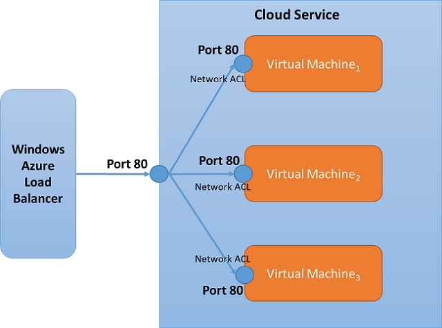

<properties
   pageTitle="Was ist eine Network Access Control (ACL)?"
   description="Erfahren Sie mehr über ACLs"
   services="virtual-network"
   documentationCenter="na"
   authors="jimdial"
   manager="carmonm"
   editor="tysonn" />
<tags
   ms.service="virtual-network"
   ms.devlang="na"
   ms.topic="article"
   ms.tgt_pltfrm="na"
   ms.workload="infrastructure-services"
   ms.date="03/15/2016"
   ms.author="jdial" />

# Was ist ein Endpunkt Access Control List (ACLs)?

Ein Endpunkt Access Control Liste (ACL) ist für Ihre Azure-Bereitstellung verfügbar Optimierung der Sicherheit. Eine ACL bietet die Möglichkeit, erlauben oder verweigern Datenverkehr für einen Endpunkt virtuellen Computern. Dieses Paket Filterfunktion stellt eine zusätzliche Sicherheitsebene. Sie können Netzwerk ACLs für nur Endpunkte angeben. Sie können keine ACL für ein virtuelles Netzwerk oder in einem virtuellen Netzwerk enthaltenen spezielles Subnetz angeben.

> [AZURE.IMPORTANT] Es empfiehlt mit Netzwerk-Sicherheitsgruppen (NSGs) statt ACLs, wann immer möglich. Weitere Informationen zu NSGs finden Sie unter [Neuigkeiten einer Sicherheitsgruppe Netzwerk?](virtual-networks-nsg.md).

ACLs können mit PowerShell oder Verwaltungsportal konfiguriert sein. Zum Konfigurieren einer Netzwerk ACL mithilfe der PowerShell finden Sie unter [Verwalten von Access Control Lists (ACLs) für die Endpunkte mithilfe der PowerShell](virtual-networks-acl-powershell.md). Um ein Netzwerk ACL mithilfe der Verwaltungsportal zu konfigurieren, finden Sie unter [Festlegen von Endpunkte eines virtuellen Computers](../virtual-machines/virtual-machines-windows-classic-setup-endpoints.md).

Mithilfe von Netzwerk ACLs, können Sie die folgende Aufgaben ausführen:

- Erlauben oder den eingehenden Verkehr basierend auf remote-Subnetz IPv4-Adressenbereich zu einem virtuellen Computern Eingabewerte Endpunkt ablehnen.

- Schwarzen IP-Adressen

- Erstellen von mehreren Regeln pro Endpunkt virtuellen Computern

- Geben Sie bis zu 50 ACL Regeln pro Endpunkt virtuellen Computern

- Um sicherzustellen, dass der richtige Regelsatzes Reihenfolge verwenden der Regeln werden angewendet, an einem bestimmten virtuellen Computern Endpunkt (aufsteigend)

- Geben Sie eine ACL für ein bestimmtes remote Subnetz IPv4-Adresse ein.

## Funktionsweise von ACLs

Eine ACL ist ein Objekt, das eine Liste der Regeln enthält. Wenn Sie eine ACL erstellen und einen Endpunkt virtuellen Computern zuweisen, erfolgt Paketfiltern auf dem Hostknoten von Ihrem virtuellen Computer. Dies bedeutet, dass der Datenverkehr von remote-IP-Adressen durch den Hostknoten für übereinstimmende ACL-Regeln anstelle von Ihrem virtuellen Computers gefiltert wird. Dadurch wird verhindert, dass Ihre virtuellen Computer Ausgaben die wertvolle CPU durchläuft auf zu Paketfiltern.

Bei einer virtuellen Computern erstellt wurde, wird eine Standard-ACL direkte alle eingehenden Verkehr zu blockieren abgelegt. Jedoch wird ein Endpunkt für (Port 3389), klicken Sie dann die Standardeinstellung ACL geändert erstellt, wurde um alle eingehenden Datenverkehr für diesen Endpunkt zuzulassen. Eingehender Datenverkehr von remote-Subnetz klicken Sie dann diesen Endpunkt darf und keine Firewall bereitgestellt ist erforderlich. Alle anderen Ports sind für eingehenden Datenverkehr blockiert, es sei denn, Endpunkte für diese Ports erstellt werden. Standardmäßig ist die ausgehender Datenverkehr zulässig.

**Standard-ACL Beispieltabelle**

| **Regel #** | **Remote-Subnetz** | **Endpunkt** | **Zulassen/Verweigern** |
|--------|---------------|----------|-------------|
| 100    | 0.0.0.0/0     | 3389     | Zulassen      |

## Zulassen und ablehnen

Sie können erlauben oder verweigern Netzwerkverkehr für einen virtuellen Computern Eingabewerte Endpunkt durch Erstellen von Regeln, die angeben, "zulassen" oder "Verweigern". Es ist wichtig, beachten Sie, dass standardmäßig, wenn Sie ein Endpunkt erstellt wurde, alle Datenverkehr an den Endpunkt zulässig ist. Aus diesem Grund ist es wichtig zu verstehen, wie Zulassen/Verweigern Regeln erstellen, und setzen sie in der richtigen Reihenfolge Rangfolge aus, wenn Sie präzise steuern, den Netzwerkdatenverkehr möchten, die Sie auswählen, können Sie den Endpunkt des virtuellen Computers erreichen.

Zu berücksichtigende Punkte

1. **Keine ACL –** Standardmäßig bei der Erstellung von außen liegenden Tabellenblättern gestatten wir alle für den Endpunkt.

1. **Treten-** Wenn Sie eine oder mehrere "Bereiche zulassen" hinzugefügt haben, werden Sie standardmäßig alle anderen Bereiche verweigern. Nur Pakete aus dem zugelassenen IP-Bereich werden mit den Endpunkt virtuellen Computern kommunizieren.

1. **Verweigern-** Wenn Sie eine oder mehrere "Bereiche verweigern" hinzugefügt haben, werden Sie standardmäßig alle anderen Bereiche des Datenverkehrs zulassen.

1. **Kombination von zulassen und verweigern-** Sie können eine Kombination aus "zulassen" und "Verweigern" Wenn machen Sie einen bestimmten IP-Bereich erlaubt oder verweigert werden soll.

## Regeln und Rangfolge

Netzwerk-Zugriffssteuerungslisten können auf bestimmte virtuellen Computern Endpunkten eingerichtet werden. Beispielsweise können Sie einem Netzwerk ACL für einen auf einem virtuellen Computer welche sperrt Access für bestimmte IP-Adressen erstellt RDP-Endpunkt angeben. In der nachfolgenden Tabelle zeigt eine Möglichkeit, den Zugriff gewähren, um öffentliche virtuelle IP-Adressen (VIPs) eines bestimmten Bereichs für RDP Zugriff zulassen. Alle anderen remote IP-Adressen verweigert werden. Wir folgen eine Regel-Reihenfolge *niedrigsten hat Vorrang vor* .

### Mehrere Regeln

Im folgenden Beispiel wenn Sie zulassen möchten, Access an den Endpunkt RDP nur aus zwei öffentlichen IPv4-Adressbereiche (65.0.0.0/8 und 159.0.0.0/8), können Sie dies erreichen durch Angeben von zwei *treten* Regeln. In diesem Fall da RDP standardmäßig für einen virtuellen Computer erstellt wurde, können Sie nach unten Zugriff auf den RDP-Anschluss basierend auf einem remote-Subnetz sperren möchten. Das folgende Beispiel zeigt eine Möglichkeit, den Zugriff gewähren, um öffentliche virtuelle IP-Adressen (VIPs) eines bestimmten Bereichs für RDP Zugriff zulassen. Alle anderen remote IP-Adressen verweigert werden. Dies funktioniert, da Netzwerk ACLs für einen bestimmten virtuellen Computern Endpunkt eingerichtet werden kann, und standardmäßig wird der Zugriff verweigert.

**Beispiel – mehrere Regeln**

| **Regel #** | **Remote-Subnetz** | **Endpunkt** | **Zulassen/Verweigern** |
|--------|---------------|----------|-------------|
| 100    | 65.0.0.0/8    | 3389     | Zulassen      |
| 200    | 159.0.0.0/8   | 3389     | Zulassen      |

### Regel-Reihenfolge

Da mehrere Regeln für einen Endpunkt angegeben werden können, muss eine Möglichkeit zum Organisieren von Regeln müssen, um zu bestimmen, welche Regel Vorrang hat sein. Die Reihenfolge der Regeln gibt Vorrang an. Netzwerk-Zugriffssteuerungslisten folgen eine Regel-Reihenfolge *niedrigsten hat Vorrang vor* . Im folgenden Beispiel wird der Endpunkt auf Port 80 Selektives Zugriff auf nur bestimmte IP-Adressbereiche gewährt. Um dies zu konfigurieren, haben wir eine Verweigerungsregel (Regel \# 100) für die Adressen in dem Bereich 175.1.0.1/24. Dann wird eine zweite Regel mit der Rangfolge 200 festgelegt, die Zugriff auf alle anderen Adressen unter 175.0.0.0/8 explizit gestattet.

**Beispiel – Rangfolge**

| **Regel #** | **Remote-Subnetz** | **Endpunkt** | **Zulassen/Verweigern** |
|--------|---------------|----------|-------------|
| 100    | 175.1.0.1/24  | 80       | Verweigern        |
| 200    | 175.0.0.0/8   | 80       | Zulassen      |

## Netzwerk-ACLs und angeglichene Sätze laden

Netzwerk-Zugriffssteuerungslisten können auf einem Lastenausgleich festlegen (Pfd gesetzt) Endpunkt angegeben werden. Wenn eine ACL für ein Pfd Set angegeben ist, wird das Netzwerk ACL auf alle virtuellen Computer in dieser Pfd festlegen angewendet. Beispielsweise erstellt, wenn ein Pfd Set mit "Port 80" erstellt wird, und legen Sie die Pfd 3 virtuellen Computern enthält, im Netzwerk ACL für Endpunkt "Port 80" eines virtuellen Computer automatisch mit den anderen virtuellen Computern beachtet werden.

## Nächste Schritte

[So Access Control Lists (ACLs) für Endpunkte verwalten, indem Sie mithilfe der PowerShell](virtual-networks-acl-powershell.md)
