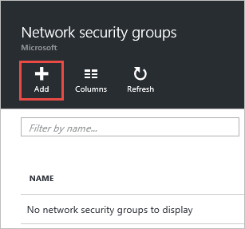
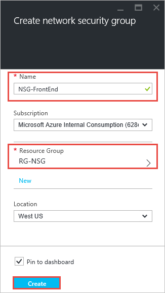
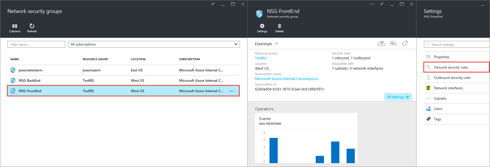
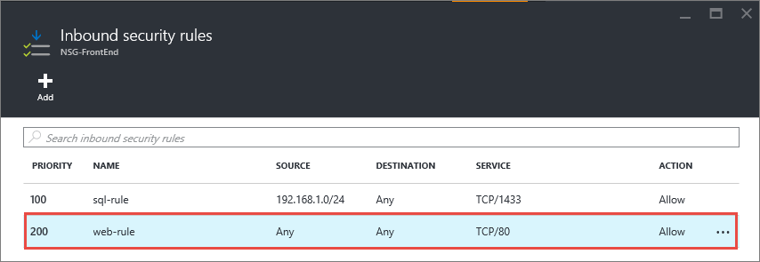
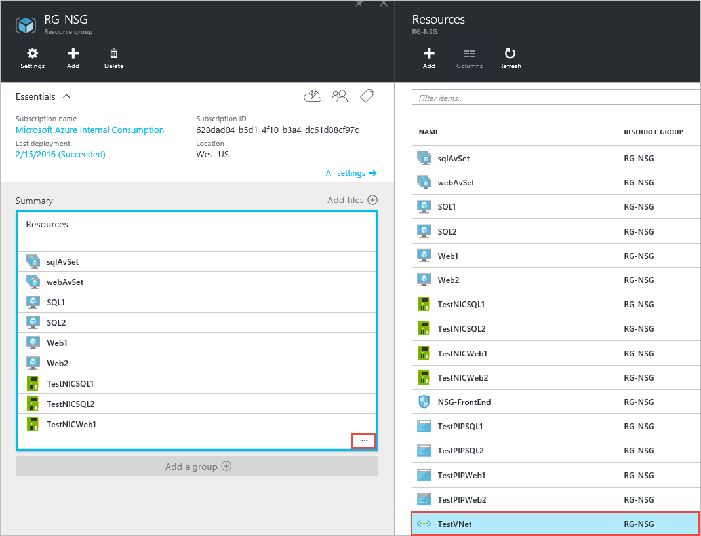
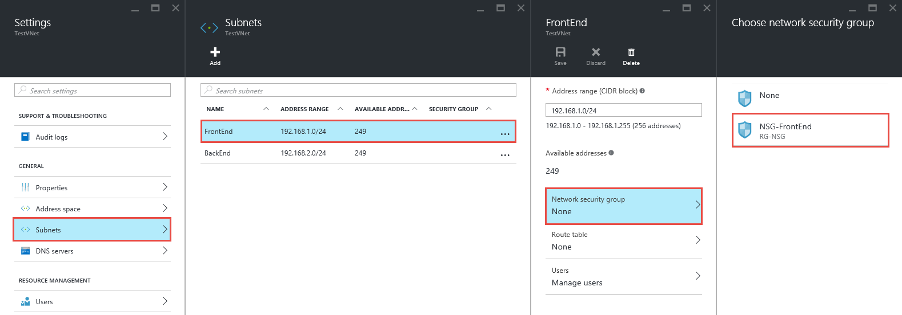
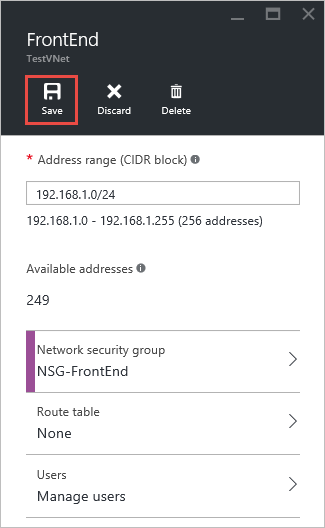
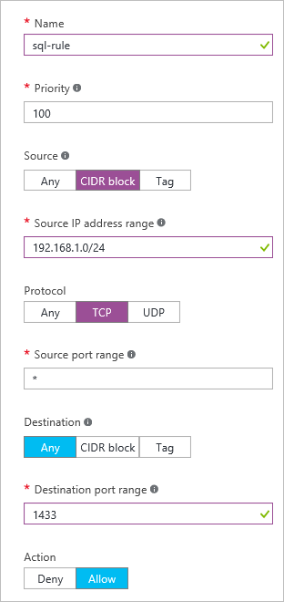
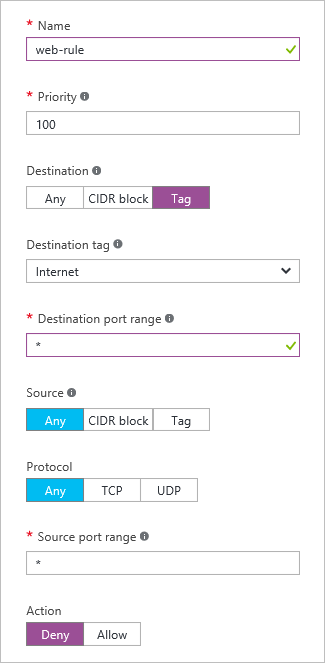

<properties 
   pageTitle="So erstellen Sie in der Cloud-Modus mithilfe des Azure-Portals NSGs | Microsoft Azure"
   description="Informationen Sie zum Erstellen und Bereitstellen von NSGs in der Cloud mithilfe des Azure-Portals"
   services="virtual-network"
   documentationCenter="na"
   authors="jimdial"
   manager="carmonm"
   editor="tysonn"
   tags="azure-resource-manager"
/>
<tags 
   ms.service="virtual-network"
   ms.devlang="na"
   ms.topic="article"
   ms.tgt_pltfrm="na"
   ms.workload="infrastructure-services"
   ms.date="02/04/2016"
   ms.author="jdial" />

# Zum Verwalten von NSGs über das Azure-portal

[AZURE.INCLUDE [virtual-networks-create-nsg-selectors-arm-include](../../includes/virtual-networks-create-nsg-selectors-arm-include.md)]

[AZURE.INCLUDE [virtual-networks-create-nsg-intro-include](../../includes/virtual-networks-create-nsg-intro-include.md)]

[AZURE.INCLUDE [azure-arm-classic-important-include](../../includes/azure-arm-classic-important-include.md)]Dieser Artikel behandelt das Modell zur Bereitstellung von Ressourcenmanager. Sie können auch [NSGs im Bereitstellungsmodell klassischen erstellen](virtual-networks-create-nsg-classic-ps.md).

[AZURE.INCLUDE [virtual-networks-create-nsg-scenario-include](../../includes/virtual-networks-create-nsg-scenario-include.md)]

Im Beispiel unten aufgeführten Befehle eine einfache-Umgebung, die bereits erstellt erwarten PowerShell basierend auf dem Szenario oben. Wenn die Befehle ausführen, wie sie in diesem Dokument angezeigt werden soll, zuerst erstellen Sie Umgebung für die Bereitstellung von [dieser Vorlage](http://github.com/telmosampaio/azure-templates/tree/master/201-IaaS-WebFrontEnd-SQLBackEnd), klicken Sie auf **Bereitstellen in Azure**, ersetzen Sie den Parameter Standardwerte bei Bedarf, und folgen Sie den Anweisungen im Portal. Die folgenden Schritte aus verwenden **RG-NSG** als den Namen der Ressourcengruppe, die, der auf die Vorlage bereitgestellt wurde.

## Erstellen der NSG-Front-End-NSG

Führen Sie die folgenden Schritte aus, um die NSG **NSG-Front-End** erstellen wie oben beschriebenen Szenario dargestellt.

1. Mithilfe eines Browsers und navigieren Sie zu http://portal.azure.com und, falls notwendig, melden Sie sich mit Ihrem Azure-Konto.
2. Klicken Sie auf **Durchsuchen >** > **Netzwerk Sicherheitsgruppen**.

    

3. Klicken Sie in das **Netzwerk Sicherheitsgruppen** Blade auf **Hinzufügen**.
  
    

4. Erstellen Sie in der Blade- **Netzwerk-Sicherheitsgruppe erstellen** eine benannte *NSG-Front-End* in der Ressourcengruppe *RG-NSG* NSG, und klicken Sie dann auf **Erstellen**.

    

## Erstellen Sie Regeln in eine vorhandene NSG

Um Regeln in einer vorhandenen NSG vom Azure-Portal zu erstellen, führen Sie die folgenden Schritte aus.

2. Klicken Sie auf **Durchsuchen >** > **Netzwerk Sicherheitsgruppen**.

3. Klicken Sie in der Liste der NSGs auf **NSG-Front-End-** > **eingehende Sicherheitsregeln**

    

4. Klicken Sie in der Liste der **Regeln für eingehende Sicherheit**auf **Hinzufügen**.

    

5. Erstellen einer Regel, die mit dem Namen *Web-Regel* Priorität von *200* festlegen, dass Access über *TCP* Port *80* auf einem beliebigen virtuellen Computer aus jeder Quelle in das Blade **die eingehende Sicherheitsregel hinzufügen** , und klicken Sie dann auf **OK**. Beachten Sie, dass die meisten diese Einstellungen bereits Standardwerte sind.

    

6. Nach ein paar Sekunden wird die neue Regel in den NSG angezeigt.

    

7. Wiederholen Sie die Schritte 6, um eine eingehende Regel, die mit dem Namen *Rdp-Regel* mit einer Priorität von *250* zulassen des Zugriffs über *TCP* zu Port *3389* zu einem beliebigen virtuellen Computer aus jeder Quelle zu erstellen.

## Zuordnen der NSG mit dem Front-End-Subnetz

1. Klicken Sie auf **Durchsuchen >** > **Ressourcengruppen** > **RG-NSG**.
2. Klicken Sie in das Blade **RG-NSG** auf **...**  >  **TestVNet**.

    

3. Klicken Sie in das Blade **Einstellungen** auf **Subnets** > **Front-End** > **Netzwerk-Sicherheitsgruppe** > **NSG-Front-End**.

    

4. Klicken Sie in der **Front-End** -Blade auf **Speichern**.

    

## Erstellen der NSG-Back-End-NSG

Zum Erstellen von **NSG-Back-End-** NSG, und ordnen es mit dem **Back-End-** Subnetz, führen Sie die folgenden Schritte aus.

1. Wiederholen Sie die Schritte in [Erstellen der NSG-Front-End-NSG](#Create-the-NSG-FrontEnd-NSG) zum Erstellen einer benannten *NSG-Back-End-* NSG
2. Wiederholen Sie die Schritte in [Erstellen von Regeln in einer vorhandenen NSG](#Create-rules-in-an-existing-NSG) zum Erstellen von **eingehende** Regeln in der folgenden Tabelle aus.

  	|Eingehende Regel|Ausgehende Regel|
  	|---|---|
  	|||

3. Wiederholen Sie die Schritte in [der NSG mit dem Front-End-Subnetz zuordnen](#Associate-the-NSG-to-the-FrontEnd-subnet) , **NSG-Back-End-** NSG mit dem **Back-End-** Subnetz zugeordnet werden soll.

## Nächste Schritte

- Informationen zum [Verwalten von vorhandenen NSGs](virtual-network-manage-nsg-arm-portal.md)
- [Aktivieren der Protokollierung](virtual-network-nsg-manage-log.md) für NSGs.