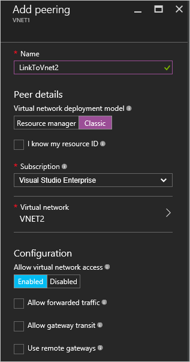

<properties
   pageTitle="Erstellen VNet Peering über das Azure-Portal | Microsoft Azure"
   description="Informationen Sie zum Erstellen eines virtuellen Netzwerks über das Azure-Portal in Ressourcenmanager."
   services="virtual-network"
   documentationCenter=""
   authors="NarayanAnnamalai"
   manager="jefco"
   editor=""
   tags="azure-resource-manager"/>

<tags
   ms.service="virtual-network"
   ms.devlang="na"
   ms.topic="hero-article"
   ms.tgt_pltfrm="na"
   ms.workload="infrastructure-services"
   ms.date="09/14/2016"
   ms.author="narayanannamalai;annahar"/>

# Erstellen eines virtuellen Netzwerks peering über das Azure-portal

[AZURE.INCLUDE [virtual-networks-create-vnet-selectors-arm-include](../../includes/virtual-networks-create-vnetpeering-selectors-arm-include.md)]

[AZURE.INCLUDE [virtual-networks-create-vnet-intro](../../includes/virtual-networks-create-vnetpeering-intro-include.md)]

[AZURE.INCLUDE [virtual-networks-create-vnet-scenario-basic-include](../../includes/virtual-networks-create-vnetpeering-scenario-basic-include.md)]

Führen Sie zum Erstellen einer VNet peering mithilfe des Azure-Portals basierend auf dem Szenario über die folgenden Schritte aus.

1. Mithilfe eines Browsers und navigieren Sie zu http://portal.azure.com und, falls notwendig, melden Sie sich mit Ihrem Azure-Konto.
2. Um VNET peering eingerichtet haben, müssen Sie zwei Links, eine für jede Richtung, zwischen zwei VNets zu erstellen. Sie können VNET Peeringverbindung für VNET1 zu VNET2 zuerst erstellen. Klicken Sie im Portal klicken Sie auf **Durchsuchen** > **virtuelle Netzwerke auswählen**

    

3. In virtuelle Netzwerke Blade VNET1, klicken Sie auf Peerings, wählen Sie dann klicken Sie auf Hinzufügen

    

4. Geben Sie in der Blade Peering hinzufügen einen Namen für Peeringliste Link LinkToVnet2, wählen Sie das Abonnement und den Peer virtuelle Netzwerk VNET2, klicken Sie auf OK.

    

5. Nachdem diese Peeringverbindung VNET erstellt wurde. Sie können den Verbindungsstatus wie folgt angezeigt:

    

6. Als Nächstes erstellen Sie die VNET Peeringverbindung für VNET2 zu VNET1. In virtuelle Netzwerke Blade VNET2, klicken Sie auf Peerings, wählen Sie dann klicken Sie auf Hinzufügen

    

7. Geben Sie in der Blade Peering hinzufügen einen Namen für Peeringliste Link LinkToVnet1, und wählen Sie das Abonnement mit dem Peer virtuelle Netzwerk, klicken Sie auf OK.

    

8. Nachdem diese Peeringverbindung VNET erstellt wurde. Sie können den Verbindungsstatus wie folgt angezeigt:

    

9. Überprüfen Sie den Status für LinkToVnet2, und er ändert sich in verbunden ebenfalls.  

    

    > [AZURE.NOTE] VNET peering wird nur eingerichtet werden, wenn beide Links verbunden sind.

Es gibt einige konfigurierbare Eigenschaften für jede Verknüpfung aus:

|Option|Beschreibung|Standard|
|:-----|:----------|:------|
|AllowVirtualNetworkAccess|Gibt an, ob Adresse Speicherplatz Peer-VNet in der Kategorie Virtual_network enthalten sein.|Ja|
|AllowForwardedTraffic|Gibt an, ob Verkehr nicht von einem hervorragendem VNet akzeptiert oder gelöscht wird|Nein|
|AllowGatewayTransit|Diese Berechtigung ermöglicht des Peers VNet Schlüsselaufgaben VNet verwenden|Nein|
|UseRemoteGateways|Verwenden der Peer des VNet Gateway. Der Peer VNet muss einen Gateway konfiguriert und AllowGatewayTransit aktiviert ist. Sie können diese Option nicht verwenden, wenn Sie einen Gateway konfiguriert haben|Nein|

Jede Verknüpfung im VNet peering verfügt über eine Reihe von über Eigenschaften. Portal können Sie auf den Link für die VNet-Peering und alle verfügbaren Optionen ändern, klicken Sie auf Speichern, um die Änderung wirksam zu machen.

[AZURE.INCLUDE [virtual-networks-create-vnet-scenario-crosssub-include](../../includes/virtual-networks-create-vnetpeering-scenario-crosssub-include.md)]

1. Mithilfe eines Browsers und navigieren Sie zu http://portal.azure.com und, falls notwendig, melden Sie sich mit Ihrem Azure-Konto.
2. In diesem Beispiel werden wir zwei Abonnements A und B und BenutzerA und UserB zwei Benutzer mit Berechtigungen in der Abonnements Hilfethemas verwenden
3. Klicken Sie im Portal klicken Sie auf Durchsuchen, wählen Sie virtuelle Netzwerke aus. Klicken Sie auf die VNET, und klicken Sie auf Hinzufügen.

    

4. Klicken Sie auf das Access Blade hinzufügen, wählen Sie eine Rolle Netzwerk Mitwirkender auswählen, klicken Sie auf Benutzer hinzufügen, geben Sie im Feld Name die Vorzeichen UserB, und klicken Sie auf OK.

    

    Dies ist nicht erforderlich, peering hergestellt werden, auch wenn Benutzer einzeln Peeringliste Anfragen für ihre jeweiligen Vnets heraufstufen, solange die Anforderungen entsprechen. Hinzufügen von den anderen VNet berechtigten Benutzer als Benutzer in der lokalen VNet vereinfacht Portal Einrichtung gehen Sie wie folgt.

5. Klicken Sie dann Login Azure-Portal mit UserB, wer die Berechtigung Benutzer für SubscriptionB ist. Führen Sie die oben beschriebenen Schritten BenutzerA als Mitwirkender Netzwerk hinzufügen.

    

    > [AZURE.NOTE] Sie können melden Sie sich ab und melden Sie sich auf beide Sitzungen Benutzer im Browser, um sicherzustellen, dass die Autorisierung erfolgreich aktiviert ist.

6. Login-Portal als BenutzerA navigieren Sie zu dem VNET3 Blade, Peering, klicken Sie auf überprüfen ' ich weiß, dass meine Ressource-ID "Kontrollkästchen und geben Sie die Ressource ID für VNET5 in unter Format.

    / subscriptions/{SubscriptionID}/resourceGroups/{ResourceGroupName}/providers/Microsoft.Network/VirtualNetwork/{VNETname}

    

7. Melden Sie sich mit dem Portal als UserB und folgen über Schritt Peeringverbindung von VNET5 zur VNet3 zu erstellen.

    

8. Peering eingerichtet und alle virtuellen Computern in VNet3 sollten mit einem beliebigen virtuellen Computern in VNet5 kommunizieren

[AZURE.INCLUDE [virtual-networks-create-vnet-scenario-transit-include](../../includes/virtual-networks-create-vnetpeering-scenario-transit-include.md)]

1. Als ersten Schritt Peeringverbindungen VNET von HubVnet zu VNET1. Beachten Sie, dass weitergeleitet Datenverkehr zulassen Option für den Link nicht aktiviert ist.

    

2. Als nächsten Schritt können Peeringverbindungen aus VNET1 HubVnet erstellt werden. Beachten Sie, dass zulassen weitergeleitet Datenverkehr Option ausgewählt ist.

    

3. Nachdem peering eingerichtet wurde, können Sie finden Sie in diesem [Artikel](virtual-network-create-udr-arm-ps.md) und definieren Benutzer definiert Route(UDR) umgeleitet VNet1 Verkehr über eine virtuelle Einheit seine Funktionen verwenden. Wenn Sie die nächsten Abschnitte Adresse in Routing angeben, können Sie es auf die IP-Adresse des virtuellen Geräts in Peer VNet HubVNet festlegen.

[AZURE.INCLUDE [virtual-networks-create-vnet-scenario-asmtoarm-include](../../includes/virtual-networks-create-vnetpeering-scenario-asmtoarm-include.md)]

1. Mithilfe eines Browsers und navigieren Sie zu http://portal.azure.com und, falls notwendig, melden Sie sich mit Ihrem Azure-Konto.

2. Wenn in diesem Szenario peering VNET festlegen möchten, müssen Sie nur einen einzigen Link aus dem virtuellen Netzwerk in Azure Ressourcenmanager nach dem Vorkommen klassische erstellen. D. h., von **VNET1** zu **VNET2**. Klicken Sie im Portal klicken Sie auf **Durchsuchen** > **Virtuelle Netzwerke** auswählen

3. Wählen Sie das Blade virtuellen Netzwerke **VNET1**aus. Klicken Sie auf **Peerings**, und klicken Sie auf **Hinzufügen**.

4. Benennen Sie Ihr Link in das Blade Peering hinzufügen. Hier wird es **LinkToVNet2**bezeichnet. Wählen Sie unter Peer Details **klassischen**ein.

5. Wählen Sie dann das Abonnement und den Peer virtuelles Netzwerk **VNET2**. Klicken Sie dann auf OK.

    

6. Nachdem diese Peeringverbindung VNet erstellt wurde, die zwei virtuellen Netzwerke Dies sind und Sie werden möglicherweise Folgendes angezeigt:

    

## Entfernen von VNet Peering

1.  Mithilfe eines Browsers und navigieren Sie zu http://portal.azure.com und, falls notwendig, melden Sie sich mit Ihrem Azure-Konto.
2.  Wechseln Sie zu virtuelles Netzwerk Blade, klicken Sie auf Peerings, klicken Sie auf die Verknüpfung, die Sie entfernen möchten, klicken Sie auf die Schaltfläche löschen.

    

3. Nachdem Sie einen Link in VNET peering entfernen, werden der Peer-Verbindungsstatus an getrennt geleitet.

    

4. In diesem Zustand können nicht Sie den Link neu erstellt, bis der Verbindungsstatus Peer initiiert annimmt. Es empfiehlt sich, dass die beiden Links entfernen, bevor Sie die VNET peering neu erstellen.
