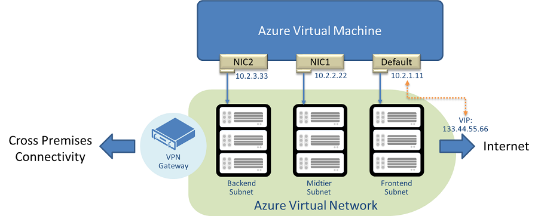

<properties
   pageTitle="Erstellen eines virtuellen Computers mit mehreren NICs"
   description="Informationen Sie zum Erstellen und Konfigurieren von virtuellen Computern mit mehreren nics"
   services="virtual-network, virtual-machines"
   documentationCenter="na"
   authors="jimdial"
   manager="carmonm"
   editor="tysonn"
   tags="azure-service-management,azure-resource-manager"
/>
<tags
   ms.service="virtual-network"
   ms.devlang="na"
   ms.topic="article"
   ms.tgt_pltfrm="na"
   ms.workload="infrastructure-services"
   ms.date="02/02/2016"
   ms.author="jdial" />

# Erstellen eines virtuellen Computers mit mehreren NICs

Sie können Erstellen von virtuellen Computern (virtuellen Computern) in Azure und mehrere Netzwerkschnittstellen (NICs) zu den einzelnen Ihrer virtuellen Computer anfügen. Multi NIC ist eine Vorbedingung für viele virtuelle Netzwerkgeräte, z. B. Anwendung Übermittlungs- und WAN-Optimierung Lösungen. Multi NIC bietet auch weitere Netzwerk Datenverkehr Management-Funktionen, einschließlich Isolation des Datenverkehrs zwischen einer Vorderseite NIC zu beenden und zu Ende Netzwerkadapter oder Trennung des Datenverkehrs Ebene aus Management Ebene Datenverkehr zurück.

Die obige Abbildung zeigt einem virtueller Computer mit drei Netzwerkkarten, jede mit einem anderen Subnetz verbunden.

[AZURE.INCLUDE [azure-arm-classic-important-include](../../includes/learn-about-deployment-models-classic-include.md)]

- Internet zugänglichen VIP (klassische Bereitstellungen) unterstützt nur des Netzwerkschnittstellenadapters "Standard" Es ist nur eine VIP auf die IP-Adresse des der standardmäßigen NIC.
- Zu diesem Zeitpunkt werden Instanz Ebene öffentlichen IP-(LPIP) Adressen (klassische Bereitstellungen) für Multi NIC virtuellen Computern nicht unterstützt.
- Die Reihenfolge der NICs aus innerhalb des virtuellen Computers werden zufällige, und konnte auch über Azure Infrastruktur Updates ändern. Die IP-Adressen und die entsprechenden Ethernet MAC behebt jedoch wird, bleiben gleich. Angenommen Sie hat **Eth1** 10.1.0.100 und MAC-Adresse 00-0D-3A-B0-39-0D; nach einer Azure-Infrastruktur zu aktualisieren Sie und Neustart, es geändert werden kann **Eth2**, aber die IP-Adresse und MAC paarweise Zuordnung erhalten bleibt. Wenn ein Neustart Kunden initiiert ist, wird die Reihenfolge NIC unverändert.
- Die Adresse für jeden Netzwerkadapter jedes virtuellen Computers muss sich in einem Subnetz befinden, mehrere NICs eines einzelnen virtuellen Computers können jede zugewiesen werden Adressen, die sich in demselben Subnetz befinden.
- Die Größe des virtuellen Computer bestimmt die Anzahl der NICS, die Sie für einen virtuellen Computer erstellen können. Bezug der [Windows-Server](../virtual-machines/virtual-machines-windows-sizes.md) und [Linux](../virtual-machines/virtual-machines-linux-sizes.md) virtueller Computer Größen Artikeln zu bestimmen, wie viele NICS unterstützt jedes virtueller Speicher. 

## Netzwerk-Sicherheitsgruppen (NSGs)
In einer Bereitstellung Ressourcenmanager möglicherweise NICs eines virtuellen Computers zugeordneten mit einem Netzwerk Sicherheit Gruppe (NSG), einschließlich NICs eines virtuellen Computers, die mehrere NICs aktiviert hat. Wenn Sie ein Netzwerkadapter eine Adresse in einem Subnetz zugeordnet ist, in dem das Subnetz eine NSG zugeordnet ist, wenden Sie die Regeln in das Subnetz des NSG auch zum diese NIC. Zusätzlich zum Zuordnen von Subnetzen zu NSGs, können Sie auch eine NSG einen Netzwerkadapter zuordnen.

Wenn ein Subnetz zugeordnet ist eine NSG und einen Netzwerkadapter in diesem Subnetz eine NSG einzeln zugeordnet ist, die zugehörigen NSG Regeln in **Fluss Reihenfolge** entsprechend der Richtung des Datenverkehrs übergebene oder Ausblenden der NIC angewendet werden:

- **Eingehende Datenverkehr** , dessen Ziel die betreffende NIC ist, fließt zuerst über das Subnetz, Auslösen von Regeln für das Subnetz des NSG vor dem übergeben an die NIC, und klicken Sie dann die-NIC NSG Regeln auslösen.
- Auschecken von NIC, der Netzwerkkarte bei einer NSG Regeln, bevor Sie über das Subnetz übergeben, und klicken Sie dann im Subnetz des NSG Regeln auslösen auslösen zuerst fließt **ausgehenden Datenverkehr** , dessen Datenquelle die betreffende NIC ist.

Erfahren Sie mehr über [Netzwerk Sicherheitsgruppen](virtual-networks-nsg.md) und wie diese angewendet werden ausgehend von Zuordnungen Subnetze, virtuellen Computern und NICs..

## So konfigurieren Sie mehrere NIC VM in einer klassischen Bereitstellung

Die folgenden Anweisungen helfen Ihnen, einen Multi NIC VM mit 3 NICs erstellen: einen Standardwert NIC und zwei zusätzliche NICs. Die Konfigurationsschritte werden ein virtuellen Computers erstellen, die gemäß der Dienst Fragment einer Konfigurationsdatei unten konfiguriert werden:

    <VirtualNetworkSite name="MultiNIC-VNet" Location="North Europe">
    <AddressSpace>
      <AddressPrefix>10.1.0.0/16</AddressPrefix>
        </AddressSpace>
        <Subnets>
          <Subnet name="Frontend">
            <AddressPrefix>10.1.0.0/24</AddressPrefix>
          </Subnet>
          <Subnet name="Midtier">
            <AddressPrefix>10.1.1.0/24</AddressPrefix>
          </Subnet>
          <Subnet name="Backend">
            <AddressPrefix>10.1.2.0/23</AddressPrefix>
          </Subnet>
          <Subnet name="GatewaySubnet">
            <AddressPrefix>10.1.200.0/28</AddressPrefix>
          </Subnet>
        </Subnets>
    … Skip over the remainder section …
    </VirtualNetworkSite>

Benötigen Sie die folgenden Komponenten, bevor Sie versuchen, die zum Ausführen der PowerShell-Befehle im Beispiel.

- Ein Azure-Abonnement.
- Ein virtuelles Netzwerk konfiguriert sind. Weitere Informationen zu VNets finden Sie unter [Übersicht über Virtual Netzwerk](virtual-networks-overview.md) .
- Die neueste Version von Azure PowerShell heruntergeladen und installiert. Informationen Sie [zum Installieren und Konfigurieren von Azure PowerShell](../powershell-install-configure.md).

Zum Erstellen eines virtuellen Computers mit mehreren NICs, führen Sie die folgenden Schritte aus:

1. Wählen Sie ein Bild virtuellen Computer aus Bildergalerie Azure-virtuellen Computer an. Beachten Sie, dass die Bilder häufig ändern und nach Region verfügbar sind. Das Bild im Beispiel unten angegebene möglicherweise ändern oder möglicherweise nicht in Ihrer Region, daher müssen Sie das Bild an, die, das Sie benötigen.

        $image = Get-AzureVMImage `
            -ImageName "a699494373c04fc0bc8f2bb1389d6106__Windows-Server-2012-R2-201410.01-en.us-127GB.vhd"

1. Erstellen einer Konfigurations virtueller Computer an.

        $vm = New-AzureVMConfig -Name "MultiNicVM" -InstanceSize "ExtraLarge" `
            -Image $image.ImageName –AvailabilitySetName "MyAVSet"

1. Erstellen Sie die standardmäßigen Administratorbenutzernamen.

        Add-AzureProvisioningConfig –VM $vm -Windows -AdminUserName "<YourAdminUID>" `
            -Password "<YourAdminPassword>"

1. Fügen Sie weitere NICs an der Konfiguration virtueller Computer an.

        Add-AzureNetworkInterfaceConfig -Name "Ethernet1" `
            -SubnetName "Midtier" -StaticVNetIPAddress "10.1.1.111" -VM $vm
        Add-AzureNetworkInterfaceConfig -Name "Ethernet2" `
            -SubnetName "Backend" -StaticVNetIPAddress "10.1.2.222" -VM $vm

1. Geben Sie das Subnetz und die IP-Adresse für die Netzwerkkarte Standard.

        Set-AzureSubnet -SubnetNames "Frontend" -VM $vm
        Set-AzureStaticVNetIP -IPAddress "10.1.0.100" -VM $vm

1. Erstellen Sie den virtuellen Computer in Ihrem Netzwerk virtuelle aus.

        New-AzureVM -ServiceName "MultiNIC-CS" –VNetName "MultiNIC-VNet" –VMs $vm

>[AZURE.NOTE] Die VNet, die Sie hier angeben, muss bereits vorhanden sein (wie die erforderlichen Komponenten angegeben). Im folgenden Beispiel gibt ein virtuelles Netzwerk mit dem Namen **MultiNIC-VNet**an.

## Einschränkungen

Die folgenden Einschränkungen gelten, wenn die Multi NIC-Funktion verwenden:

- Multi NIC virtuellen Computern muss in Azure virtuelle Netzwerke (VNets) erstellt werden. Nicht-VNet virtuellen Computern kann nicht mit mehreren NICs konfiguriert werden.
- Alle virtuellen Computern in einer Verfügbarkeit festlegen müssen entweder Multi NIC oder einzelne NIC verwenden Es kann nicht auf eine Mischung Multi NIC virtuellen Computern und einzelnen NIC virtuellen Computern innerhalb eines Satzes Verfügbarkeit sein. Wenden Sie denselben Regeln für virtuelle Computer in einen Cloud-Dienst.
- Ein virtueller Computer mit einzelner Netzwerkkarte kann nicht mit mehreren NICs (und umgekehrt) konfiguriert werden, nachdem es bereitgestellt wird, ohne Sie zu löschen und neu zu erstellen.

## Sekundäre NICs-Zugriff auf anderen Subnetzen

Standardmäßig werden sekundäre NICs nicht mit einem Standard-Gateway konfiguriert werden aufgrund der den Datenverkehr auf den sekundären NICs im selben Subnetz benutzerspezifisch eingeschränkt werden. Wenn die Benutzer in sekundäre NICs außerhalb der eigenen Subnetz sprechen aktivieren möchten, müssen sie zum Hinzufügen eines Eintrags in der Weiterleitung Tabelle aus, um das Gateway zu konfigurieren, wie nachstehend beschrieben.

>[AZURE.NOTE] Virtuellen Computern erstellt, bevor Juli 2015 so konfiguriert, dass für alle Netzwerkkarten hergestellt werden kann. Das standardmäßige Gateway für sekundäre NICs wird erst diese virtuelle Computer neu gestartet werden entfernt werden. In Betriebssystemen, die verwenden das schwachen Host-routing-Modell, wie z. B. Linux, kann Internet Connectivity unterbrechen, wenn der Datenverkehr eingehende und Ausgang anderen NICs verwenden.

### Konfigurieren von Windows-virtuellen Computern

Angenommen Sie, Sie ein Windows virtueller Computer mit zwei NICs wie folgt vor:

- Primäre NIC IP-Adresse: 192.168.1.4
- Sekundäre NIC IP-Adresse: 192.168.2.5

Die IPv4-Routing-Tabelle für diese virtuellen Computer würde wie folgt aussehen:

    IPv4 Route Table
    ===========================================================================
    Active Routes:
    Network Destination        Netmask          Gateway       Interface  Metric
              0.0.0.0          0.0.0.0      192.168.1.1      192.168.1.4      5
            127.0.0.0        255.0.0.0         On-link         127.0.0.1    306
            127.0.0.1  255.255.255.255         On-link         127.0.0.1    306
      127.255.255.255  255.255.255.255         On-link         127.0.0.1    306
        168.63.129.16  255.255.255.255      192.168.1.1      192.168.1.4      6
          192.168.1.0    255.255.255.0         On-link       192.168.1.4    261
          192.168.1.4  255.255.255.255         On-link       192.168.1.4    261
        192.168.1.255  255.255.255.255         On-link       192.168.1.4    261
          192.168.2.0    255.255.255.0         On-link       192.168.2.5    261
          192.168.2.5  255.255.255.255         On-link       192.168.2.5    261
        192.168.2.255  255.255.255.255         On-link       192.168.2.5    261
            224.0.0.0        240.0.0.0         On-link         127.0.0.1    306
            224.0.0.0        240.0.0.0         On-link       192.168.1.4    261
            224.0.0.0        240.0.0.0         On-link       192.168.2.5    261
      255.255.255.255  255.255.255.255         On-link         127.0.0.1    306
      255.255.255.255  255.255.255.255         On-link       192.168.1.4    261
      255.255.255.255  255.255.255.255         On-link       192.168.2.5    261
    ===========================================================================

Beachten Sie, dass der Standard-Routing (0.0.0.0) nur der primäre NIC verfügbar ist Sie werden nicht auf Ressourcen außerhalb der Subnetz für den sekundären Netzwerkadapter zugreifen können wie folgt:

    C:\Users\Administrator>ping 192.168.1.7 -S 192.165.2.5

    Pinging 192.168.1.7 from 192.165.2.5 with 32 bytes of data:
    PING: transmit failed. General failure.
    PING: transmit failed. General failure.
    PING: transmit failed. General failure.
    PING: transmit failed. General failure.

Zum Hinzufügen eines Standard-Routing klicken Sie auf die sekundären NIC führen Sie die folgenden Schritte aus:

1. Führen Sie über eine Befehlszeile zum Identifizieren der Index für die sekundären Netzwerkadapter folgenden Befehl aus:

        C:\Users\Administrator>route print
        ===========================================================================
        Interface List
         29...00 15 17 d9 b1 6d ......Microsoft Virtual Machine Bus Network Adapter #16
         27...00 15 17 d9 b1 41 ......Microsoft Virtual Machine Bus Network Adapter #14
          1...........................Software Loopback Interface 1
         14...00 00 00 00 00 00 00 e0 Teredo Tunneling Pseudo-Interface
         20...00 00 00 00 00 00 00 e0 Microsoft ISATAP Adapter #2
        ===========================================================================

2. Beachten Sie den zweiten Eintrag in der Tabelle durch den Index 27 (in diesem Beispiel) aus.
3. Führen Sie den Befehl **Routing hinzufügen** , wie unten dargestellt, über die Befehlszeile. In diesem Beispiel werden Sie als Standard-Gateway 192.168.2.1 für die sekundären Netzwerkadapter angeben:

        route ADD -p 0.0.0.0 MASK 0.0.0.0 192.168.2.1 METRIC 5000 IF 27

4. Klicken Sie zum Testen der Konnektivität kehren Sie zu der Eingabeaufforderung, und versuchen Sie, ein anderes Subnetz von sekundären NIC als angezeigte Int eh Beispiel unten Signal an:

        C:\Users\Administrator>ping 192.168.1.7 -S 192.165.2.5

        Reply from 192.168.1.7: bytes=32 time<1ms TTL=128
        Reply from 192.168.1.7: bytes=32 time<1ms TTL=128
        Reply from 192.168.1.7: bytes=32 time=2ms TTL=128
        Reply from 192.168.1.7: bytes=32 time<1ms TTL=128

5. Sie können auch die Routingtabelle zum Überprüfen der neu hinzugefügten Routing überprüfen, wie unten dargestellt:

        C:\Users\Administrator>route print

        ...

        IPv4 Route Table
        ===========================================================================
        Active Routes:
        Network Destination        Netmask          Gateway       Interface  Metric
                  0.0.0.0          0.0.0.0      192.168.1.1      192.168.1.4      5
                  0.0.0.0          0.0.0.0      192.168.2.1      192.168.2.5   5005
                127.0.0.0        255.0.0.0         On-link         127.0.0.1    306

### Konfigurieren von Linux virtuellen Computern

Für Linux virtuellen Computern da das Standardverhalten schwachen Hosts routing, empfehlen wir, dass der sekundäre NICs auf Datenverkehr fließt nur innerhalb der gleichen Subnetz beschränkt sind. Jedoch bestimmte Szenarien Connectivity außerhalb der Subnetz anfordern möchten, sollten Benutzer aktivieren Policy-basierten routing, um sicherzustellen, dass der eingehende und Ausgang Datenverkehr dieselbe NIC verwendet

## Nächste Schritte

- Bereitstellen von [MultiNIC virtuellen Computern in einer 2-Ebenen-Anwendungsszenario in einer Bereitstellung Ressourcenmanager](virtual-network-deploy-multinic-arm-template.md).
- Bereitstellen von [MultiNIC virtuellen Computern in einer 2-Ebenen-Anwendungsszenario in einer klassischen Bereitstellung](virtual-network-deploy-multinic-classic-ps.md).
