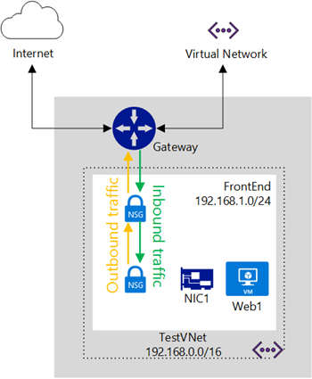
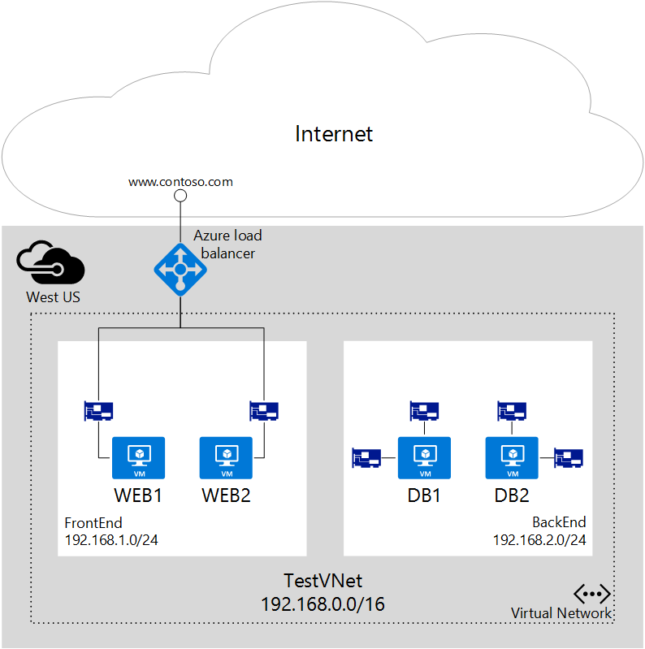

<properties 
   pageTitle="Was ist ein Netzwerk Sicherheit Gruppe (NSG)"
   description="Lernen Sie die verteilte Firewall in Azure mithilfe von Netzwerk-Sicherheitsgruppen (NSGs), und wie NSGs isolieren und steuern Datenfluss innerhalb Ihres virtuellen Netzwerks (VNets) aus."
   services="virtual-network"
   documentationCenter="na"
   authors="jimdial"
   manager="carmonm"
   editor="tysonn" />
<tags 
   ms.service="virtual-network"
   ms.devlang="na"
   ms.topic="get-started-article"
   ms.tgt_pltfrm="na"
   ms.workload="infrastructure-services"
   ms.date="02/11/2016"
   ms.author="jdial" />

# Was ist ein Netzwerk Sicherheit Gruppe (NSG)?

Netzwerk-Sicherheitsgruppe (NSG) enthält eine Liste mit Access Control Liste (ACL) Regeln, die zulassen oder verhindern Netzwerkverkehr auf Ihre Instanzen virtueller Computer in einem virtuellen Netzwerk an. NSGs können entweder Subnets oder einzelne Instanzen von virtuellen Computer in diesem Subnetz zugeordnet werden. Wenn eine NSG ein Subnetz zugeordnet ist, wenden Sie ACL-Regeln auf alle Instanzen virtueller Computer in diesem Subnetz aus. Darüber hinaus kann den Datenverkehr in einem einzelnen virtuellen Computer beschränkt werden weitere durch Zuordnen einer NSG direkt an diesen virtuellen Computer.

## NSG Ressource

NSGs enthalten die folgenden Eigenschaften.

|Eigenschaft|Beschreibung|Einschränkungen|Aspekte|
|---|---|---|---|
|Namen|Namen für die NSG|In der Region muss eindeutig sein Können Buchstaben, Zahlen, Unterstriche, Punkte und Bindestriche enthalten. Muss mit einem Buchstaben oder einer Zahl beginnen. Muss mit einem Buchstaben, Zahl oder Unterstrich enden Kann bis zu 80 Zeichen umfassen|Da Sie möglicherweise mehrere NSGs erstellen müssen, stellen Sie sicher, dass Sie eine Benennungskonvention aufweisen, die die Funktion von Ihrem NSGs zu identifizieren erleichtert|
|Region|Azure Region, wo die NSG gehostet wird|NSGs können nur auf Ressourcen in der Region angewendet werden, die sie erstellt wurde|Finden Sie unter [Grenzwerte](#Limits) darunter zu verstehen, wie viele NSGs Ihnen in einem Bereich|
|Ressourcengruppe|Ressourcengruppe der NSG gehört|Zwar ein NSG zu einer Ressourcengruppe gehört, kann das mit Ressourcen in einem beliebigen Ressourcengruppe verknüpft sein, solange die Ressource Teil der gleichen Azure Region als die NSG ist|Ressourcengruppen werden verwendet, um mehrere Ressourcen als Bereitstellungseinheit zusammen verwalten Sie können auch Gruppieren der NSG mit Ressourcen, die, denen es zugeordnet ist|
|Regeln|Regeln, die definieren, welcher Datenverkehr zulässig oder verweigert wird,||Finden Sie unter folgenden [NSG Regeln](#Nsg-rules)| 

>[AZURE.NOTE] Endpunkt-basierten ACLs und Netzwerk-Sicherheitsgruppen werden auf der gleichen Instanz virtueller Computer nicht unterstützt. Wenn Sie eine NSG verwenden und einen Endpunkt ACL bereits angeordnet haben möchten, entfernen Sie zuerst den Endpunkt ACL. Informationen hierzu finden Sie unter [Verwalten von Access Control Lists (ACLs) für die Endpunkte mithilfe der PowerShell](virtual-networks-acl-powershell.md).

### NSG Regeln

NSG Regeln enthalten die folgenden Eigenschaften.

|Eigenschaft|Beschreibung|Einschränkungen|Aspekte|
|---|---|---|---|
|**Namen**|Namen für die Regel|In der Region muss eindeutig sein Können Buchstaben, Zahlen, Unterstriche, Punkte und Bindestriche enthalten. Muss mit einem Buchstaben oder einer Zahl beginnen. Muss mit einem Buchstaben, Zahl oder Unterstrich enden Kann bis zu 80 Zeichen umfassen|Sie können mehrere Regeln innerhalb einer NSG haben, daher sollten Sie sicherstellen, dass Sie eine Benennungskonvention folgen, die Sie die Funktion die Regel angeben können|
|**Protokoll**|Protokoll für die Regel entsprechend zu.|TCP und/oder UDP oder\*|Verwenden von \* wie ein Protokoll ICMP (nur Osten Westen Verkehr), sowie UDP und TCP enthält und möglicherweise verringern Sie die Anzahl der Regeln, die Sie benötigen Zur gleichen Zeit, mit \* möglicherweise zu Allgemein ein Ansatz, sodass Sie müssen Sie nur im Bedarfsfall wirklich verwenden|
|**Port Quellbereich**|Port Quellbereich entsprechend für die Regel|Einzelnes Port Zahl zwischen 1 und 65535, Portbereich (d. h. 1-65635), oder \* (für alle Ports)|Quellports könnte temporärer. Verwenden Sie, wenn Ihr Clientprogramm einen bestimmten Anschluss verwendet, "*" in den meisten Fällen. Versuchen Sie, verwenden Sie den Portbereiche so weit wie möglich, um die Notwendigkeit mehreren Regeln zu vermeiden Mehrere Ports oder Portbereiche werden nicht durch ein Komma gruppiert
|**Port Zielbereich**|Port Zielbereich für die Regel entsprechend zu.|Einzelnes Port Zahl zwischen 1 und 65535, Portbereich (d. h. 1-65535), oder \* (für alle Ports)|Versuchen Sie, verwenden Portbereiche so weit wie möglich, um die Notwendigkeit von mehreren Regeln zu vermeiden. Mehrere Ports oder Portbereiche werden nicht durch ein Komma gruppiert
|**Die Adresspräfix Quelle**|Die Adresspräfix Quelle oder Kategorie für die Regel entsprechend zu|Einzelne IP-Adresse (d. h. 10.10.10.10), IP-Subnetz (d. h. 192.168.1.0/24), [Standard-Tag](#default-tags), oder * (für alle Adressen)|Erwägen Sie Bereiche, Standard-Tags und * zum Verringern der Anzahl von Regeln|
|**Ziel Adresspräfix**|Ziel Adresspräfix oder Kategorie für die Regel entsprechend zu|einzelne IP-Adresse (d. h. 10.10.10.10), IP-Subnetz (d. h. 192.168.1.0/24), [Standard-Tag](#default-tags), oder * (für alle Adressen)|Erwägen Sie Bereiche, Standard-Tags und * zum Verringern der Anzahl von Regeln|
|**Richtung**|Die Richtung des Datenverkehrs für die Regel entsprechend zu|eingehende und ausgehende|Eingehende und ausgehende Regeln separat, basierend auf Richtung verarbeitet|
|**Priorität**|Regeln werden überprüft, in der Reihenfolge der Priorität, sobald eine Regel gilt, keine weiteren Regeln anwenden für den Abgleich getestet werden|Zahl zwischen 100 und 4096|Erwägen Sie das Erstellen von Regeln Prioritäten mit 100 für jede Regel Sie Platz für neue Regeln, damit im Zusammenhang zwischen vorhandenen Regeln springen|
|**Access**|Art des Zugriffs auf angewendet werden, wenn die Regel entspricht.|zulassen oder verweigern|Denken Sie daran, wenn Sie eine Regel zum gewähren für ein Paket nicht gefunden wird, wird das Paket entfernt|

NSGs enthalten zwei Arten von Regeln: eingehende und ausgehende. Die Priorität für eine Regel muss innerhalb jeder festlegen eindeutig sein. 

 

Die obige Abbildung zeigt, wie Regeln NSG verarbeitet werden.

### Standard-Tags

Standard-Tags handelt es sich um System bereitgestellten Bezeichner eine Kategorie von IP-Adressen behoben werden. Sie können Standard-Tags in der **Quelle Adresspräfix** und **Ziel Adresspräfix** Eigenschaften von Regeln verwenden. Es gibt drei Standard-Tags, die Sie verwenden können.

- **VIRTUAL_NETWORK:** Diese Standard-Tag kennzeichnet alle Ihr Netzwerk Speicherplatz für die Adresse. Es enthält den virtuelles Netzwerk Adresse Abstand (CIDR Bereiche in Azure definiert) als auch alle verbundenen lokalen Adresse Leerzeichen und Azure VNets (lokalen Netzwerken) verbunden.

- **AZURE_LOADBALANCER:** Diese Standard-Tag um eine Azure Infrastruktur Lastenausgleich. Dies übersetzt in einer Azure Datacenter IP, wo der Azure-Dienststatus untersucht, stammen.

- **INTERNET:** Diese Standard-Tag um eine IP-Adressbereichs, die außerhalb des virtuellen Netzwerks und von öffentlichen Internet erreichbar ist. Dieser Bereich enthält [Azure im Besitz öffentlichen IP-Speicherplatz](https://www.microsoft.com/download/details.aspx?id=41653) ebenfalls.

### Standardregeln

Alle NSGs enthalten eine Reihe von Regeln für das standardmäßige. Die Regeln für die nicht gelöscht werden, aber, da sie die niedrigste Priorität zugewiesen sind, können sie durch die Regeln, die Sie erstellen überschrieben werden. 

Wie die Regeln für die unten dargestellt, ist den Datenverkehr mit Ursprung beginnt und endet in einem virtuellen Netzwerk sowohl in eingehenden und ausgehenden erfahren Sie, wie zulässig. Während der Verbindung mit dem Internet für ausgehende Richtung zulässig ist, ist es standardmäßig für eingehende Richtung blockiert. Es gibt eine Standardregel des Azure Lastenausgleich, um die Integrität Ihrer virtuellen Computern und Rolleninstanzen Prüfpunkt zulassen. Sie können diese Regel, außer Kraft setzen, wenn Sie eine Reihe von Lastenausgleich nicht verwenden.

**Eingehende Standardregeln**

| Namen                              | Priorität | Datenquelle IP          | Port Quelle | Ziel IP  | Ziel-Port | Protokoll | Access |
|-----------------------------------|----------|--------------------|-------------|-----------------|------------------|----------|--------|
| EINGEHENDE VNET ZULASSEN                | 65000    | VIRTUAL_NETWORK    | *           | VIRTUAL_NETWORK | *                | *        | ZULASSEN  |
| ZULASSEN SIE AZURE LASTENAUSGLEICH EINGEHENDE | 65001    | AZURE_LOADBALANCER | *           | *               | *                | *        | ZULASSEN  |
| ALLE EINGEHENDEN VERWEIGERN                  | 65500    | *                  | *           | *               | *                | *        | VERWEIGERN   |

**Standardregeln für ausgehende**

| Namen                    | Priorität | Datenquelle IP       | Port Quelle | Ziel IP  | Ziel-Port | Protokoll | Access |
|-------------------------|----------|-----------------|-------------|-----------------|------------------|----------|--------|
| VNET AUSGEHENDE ZULASSEN     | 65000    | VIRTUAL_NETWORK | *           | VIRTUAL_NETWORK | *                | *        | ZULASSEN  |
| INTERNET AUSGEHENDE ZULASSEN | 65001    | *               | *           | INTERNET        | *                | *        | ZULASSEN  |
| ALLE AUSGEHENDEN VERWEIGERN       | 65500    | *               | *           | *               | *                | *        | VERWEIGERN   |

## Zuordnen von NSGs

Sie können eine NSG virtuellen Computern, NICs und Subnetze, je nach verwendetem Bereitstellungsmodell zuordnen.

[AZURE.INCLUDE [learn-about-deployment-models-both-include.md](../../includes/learn-about-deployment-models-both-include.md)]
 
- **Zuordnen einer NSG zu eines virtuellen Computers (klassische Bereitstellungen) an.** Wenn Sie eine NSG zu eines virtuellen Computers zuordnen, der Netzwerkzugriff, die für alle Regeln in der NSG angewendet werden Datenverkehr bestimmt ist und den virtuellen Computer verlassen. 

- **Zuordnen einer NSG an einen Netzwerkadapter (nur Ressourcenmanager Bereitstellungen).** Wenn Sie eine NSG an einen Netzwerkadapter zuordnen, werden die Network Access Regeln in der NSG nur für diese NIC. angewendet. Dies bedeutet, dass in eines Multi-NIC virtuellen Computers, wenn eine NSG für einen einzelnen Netzwerkadapter, gilt es nicht den Datenverkehr an andere NICs gebunden auswirkt. 

- **Zuordnen einer NSG mit einem Subnetz (alle Bereitstellungen)**. Wenn Sie eine NSG mit einem Subnetz zuordnen, werden die Network Access-Regeln in der NSG auf alle IaaS und PaaS Ressourcen im Subnetz angewendet. 

Sie können verschiedene NSGs zu eines virtuellen Computers (oder NIC, je nach der Bereitstellungsmodell) zuordnen und mit dem Subnetz, die an einer Netzwerkkarte oder virtueller Computer gebunden ist. In diesem Fall werden alle Network Access-Regeln auf den Datenverkehr Priorität in jeder NSG, in der folgenden Reihenfolge angewendet:

- **Eingehenden Datenverkehr**
    1. NSG Subnetz angewendet. 

    Wenn Subnetz NSG übereinstimmende Regel Datenverkehr verwehren möchten verfügt, wird hier Paket gelöscht werden.
    2. NSG NIC (Ressourcen-Manager) oder (klassische) virtueller Computer angewendet. 

    VM\NIC NSG übereinstimmende Regel Datenverkehr verwehren möchten aufweist, werden Paket bei VM\NIC, zwar Subnetz NSG übereinstimmende Regel, die Datenverkehr zulässt verfügt gelöscht.

- **Ausgehenden Datenverkehr**
    1. NSG NIC (Ressourcen-Manager) oder (klassische) virtueller Computer angewendet. 

    Wenn VM\NIC NSG übereinstimmende Regel Datenverkehr verwehren möchten aufweist, wird hier Paket abgelegt.
    2. NSG Subnetz angewendet.
    
    Wenn Subnetz NSG übereinstimmende Regel Datenverkehr verwehren möchten verfügt, wird Paket zwar VM\NIC NSG übereinstimmende Regel für den Datenverkehr zulassen weist hier abgelegt.

        

>[AZURE.NOTE] Obwohl Sie nur ein einzelnes NSG ein Subnetz, virtueller Computer oder NIC zuordnen können. Sie können die gleichen NSG zu viele Ressourcen beliebig zuordnen.

## Implementierung
Sie können in der Standardansicht NSGs implementieren oder aufgeführten Ressourcenmanager Bereitstellungsmodelle verschiedene Tools verwenden.

|Bereitstellungstools für|Klassische|Ressourcenmanager|
|---|---|---|
|Klassische-portal|||
|Azure-portal||[! [Ja] [Grün]](virtual-networks-create-nsg-arm-pportal.md)|
|PowerShell|[! [Ja] [Grün]](virtual-networks-create-nsg-classic-ps.md)|[! [Ja] [Grün]](virtual-networks-create-nsg-arm-ps.md)|
|Azure CLI|[! [Ja] [Grün]](virtual-networks-create-nsg-classic-cli.md)|[! [Ja] [Grün]](virtual-networks-create-nsg-arm-cli.md)|
|Cloud-Vorlage||[! [Ja] [Grün]](virtual-networks-create-nsg-arm-template.md)|

|**Schlüssel**| Unterstützt.| Nicht unterstützt.|
|---|---|---|

## Planung

Bevor Sie implementieren NSGs, müssen Sie die folgenden Fragen beantworten:   

1. Welche Arten von Ressourcen zum Filtern von Verkehr in den oder aus (in den gleichen virtuellen Computer, virtuellen Computern oder anderen Ressourcen wie z. B. Cloud Services oder Anwendung Service-Umgebungen mit demselben Subnetz oder zwischen Ressourcen verbunden mit unterschiedlichen Teilnetzen verbunden NICs) werden soll?

2. Subnetze in vorhandene VNets Verbindung die Datenverkehr in gefiltert werden soll Ressourcen oder werden diese neue VNets oder Subnetze verbunden sein?
 
Lesen Sie weitere Informationen zum Planen der Netzwerk Sicherheit in Azure die [bewährte Verfahren für Cloud-Diensten und Netzwerk Sicherheit](../best-practices-network-security.md). 

## Gibt

Nachdem Sie die Antworten auf die Fragen im Abschnitt [Planning](#Planning) kennen, überprüfen Sie Folgendes, bevor Sie Ihre NSGs definieren.

### Grenzwerte

Sie müssen die folgenden Grenzwerte berücksichtigen Sie beim Entwerfen Ihrer NSGs.

|**Beschreibung**|**Standardmäßige Grenzwert**|**Auswirkungen**|
|---|---|---|
|Anzahl der NSGs, die Sie einem Subnetz, virtueller Computer oder NIC zuordnen können|1|Dies bedeutet, dass Sie können keine NSGs kombinieren. Stellen Sie sicher alle die Regeln erforderlich für eine bestimmte Gruppe von Ressourcen in einer einzelnen NSG enthalten sind.|
|NSGs pro Region pro Abonnement|100|Standardmäßig wird eine neue NSG für jeden virtuellen Computer erstellt, die Sie in der Azure-Portal zu erstellen. Wenn Sie dieses Standardverhalten zulassen, können Sie schnell von NSGs ausführen. Stellen Sie sicher, Sie diese Beschränkung Beachten Sie bei der Planung, und Ressourcen in mehreren Regionen oder Abonnements zu trennen, falls erforderlich. |
|NSG Regeln pro NSG|200|Verwenden Sie eine umfassende Bereich der IP-Adresse und Ports, um sicherzustellen, dass Sie nicht über diese Beschränkung tun. |

>[AZURE.IMPORTANT] Stellen Sie sicher, dass Sie alle die [Einschränkungen im Zusammenhang mit Dienste in Azure Netzwerke](../azure-subscription-service-limits.md#networking-limits) vor dem Entwerfen Ihrer Lösung anzeigen. Einige Grenzwerte können durch Öffnen einer Support-Ticket erhöht werden.

### VNet und Subnetz Entwurf

Da NSGs auf Subnetze angewendet werden kann, können Sie die Anzahl der NSGs durch Gruppieren von Ressourcen nach Subnetz und Anwenden von NSGs auf Subnetze minimieren.  Wenn Sie NSGs auf Subnetze anwenden möchten, kann es passieren, dass vorhandene VNets und Subnets, die Sie nicht mit NSGs in Meinung definiert wurden. Möglicherweise müssen Sie die neue VNets und Subnetze zur Unterstützung von Ihrem NSG Design definieren. Und neuen Ressourcen für Ihre neue Subnetze bereitstellen. Anschließend können Sie eine Strategie für die Migration zum Verschieben von vorhandener Ressourcen an die neue Subnetze festlegen. 

### Spezielle Regeln

Sie müssen die Inhalten Regeln, die unten aufgeführten berücksichtigen. Stellen Sie sicher, dass Sie keine Sperren Datenverkehr durch diese Regeln, andernfalls, die Ihre Infrastruktur mit wichtigen Azure Dienste kommunizieren nicht, zulässig.

- **Virtuelle IP-Adresse des Knotens Host:** Grundlegende Infrastrukturdienste, beispielsweise als DHCP-, DNS- und Gesundheit Überwachung über die virtualisierten Host IP-Adresse 168.63.129.16 bereitgestellt werden. Diese öffentliche IP-Adresse an Microsoft gehört und die einzige virtualisierte IP-Adresse verwendet werden in allen Regionen für diesen Zweck. Diese IP-Adresse ordnet die physische IP-Adresse des Computers Server (Hostknoten) des virtuellen Computers zu hosten. Der Hostknoten fungiert als der DHCP-Relay, die DNS-rekursive Auflösung und die Quelle Prüfpunkt für den Laden Lastenausgleich Gesundheit Prüfpunkt und den Computer Gesundheit Prüfpunkt. Kommunikation mit dieser IP-Adresse sollte nicht als Angriffen angesehen.

- **Lizenzierung (Schlüsselverwaltungsdienst):** Windows-Bilder auf den virtuellen Computern ausführen, sollte lizenziert sein. Hierzu wird eine zur Lizenzierung Anforderung der Schlüsselverwaltungsdienst Host-Server gesendet, die solche Abfragen behandelt. Dies wird immer für ausgehenden Port 1688 sein.

### ICMP-Verkehr

Die aktuellen NSG Regeln lassen sich nur für die Protokolle *TCP* oder *UDP*. Es ist keine bestimmte Kategorie für *ICMP*. ICMP-Verkehrs ist jedoch zulässig innerhalb eines virtuellen Netzwerks standardmäßig über die Regel für eingehende VNet (Standard-Regel 65000 eingehenden), die Datenverkehr von/bis sämtliche Ports und Protokolle innerhalb der VNet ermöglicht.

### Subnetze

- Erwägen Sie die Anzahl der Ebenen, die Ihre Arbeitsbelastung erfordert. Pro Ebene kann mit einem Subnetz, mit einer NSG angewendet, die mit dem Subnetz isoliert werden. 
- Wenn Sie ein Subnetz für VPN-Gateway oder ExpressRoute Verbindung implementieren, stellen Sie sicher, dass Sie müssen **** keine NSG an das betreffende Subnetz angewendet. Wenn Sie dies tun, funktionieren Ihre Cross VNet oder Cross lokale Verbindung nicht.
- Wenn Sie eine virtuelle Einheit implementieren müssen, stellen Sie sicher, dass Sie die virtuelle Anwendung in einem eigenen Subnetz, bereitstellen, damit Ihre Benutzer definiert ist (UDRs) ordnungsgemäß arbeiten können. Sie können eine Subnetzebene NSG, um den Verkehr zu filtern und dieses Subnetz implementieren. Weitere Informationen [zum Steuern der Datenfluss und virtuelle Einheiten verwenden](virtual-networks-udr-overview.md).

### Lastenausgleich

- Erwägen Sie die Lastenausgleich und NAT-Regeln für jede Lastenausgleich, die von den einzelnen Ihrer Auslastung verwendet wird. Diese Regeln werden in einen Back-End-Pool, der NICs (Ressourcenmanager Bereitstellungen) enthält gebunden oder virtuellen Computern/Rolle Instanzen (klassische Bereitstellungen). Erwägen Sie das Erstellen einer NSG für jeden Back-End-Pool nur durch die Regeln, die in den Lastenausgleich implementiert zugeordneten Datenverkehr zulässt. Die wird sichergestellt, dass Datenverkehr an den Back-End-Pool direkt, ohne dabei Lastenausgleich, auch gefiltert wird.
- In der klassischen Bereitstellungen erstellen Sie Endpunkte, die auf Ihrem virtuellen Computern oder Rolleninstanzen Ports Ports auf einem Lastenausgleich zuordnen. Sie können auch eigene einzelne öffentlich zugänglichen Lastenausgleich in einer Ressourcenmanager Bereitstellung erstellen. Wenn Sie sind Einschränken des Datenverkehrs auf virtuellen Computern und Rolleninstanzen, die Teil einer Back-End-Pool in ein Lastenausgleich mithilfe von NSGs, denken Sie daran, dass der Zielport für den eingehenden Datenverkehr der tatsächlichen Port in der Instanz virtuellen Computers oder Rolle sind nicht der Port, die von den Lastenausgleich ausgegeben. Beachten Sie, dass die Quellport und die Adresse für die Verbindung mit dem virtuellen Computer einen Port und die Adresse in das Internet auf dem Remotecomputer, auch behalten Sie bei, nicht den Port und die Adresse, den Lastenausgleich bereitgestellt werden.
- Ähnlich wie öffentlich zugänglichen Lastenausgleich beim NSGs zum Filtern von Verkehr über eine interne Lastenausgleich (ILB) in Kürze erstellen, müssen Sie wissen, dass der Port und die Adresse Quellbereich angewendet werden Features, die von dem Computer mit den Anruf nicht Lastenausgleich Ursprung. Und der Port und die Adresse Zielbereich beziehen sich auf den Computer des Datenverkehrs, nicht den Lastenausgleich empfangen.

### Andere

- Endpunkt-basierten ACLs und NSGs werden auf der gleichen Instanz virtueller Computer nicht unterstützt. Wenn Sie eine NSG verwenden und einen Endpunkt ACL bereits angeordnet haben möchten, entfernen Sie zuerst den Endpunkt ACL. Informationen hierzu finden Sie unter [Verwalten Endpunkt ACLs](virtual-networks-acl-powershell.md).
- Eine NSG, einen Netzwerkadapter für virtuelle Computer mit mehreren NICs zugeordnet ist können Sie im Bereitstellungsmodell Ressourcenmanager Management (remote Access) von der NIC, daher Trennung Datenverkehr aktivieren.
- Wie bei der Verwendung von Lastenausgleich, wenn Datenverkehr von anderen VNets zu filtern, müssen Sie die Adresse Quellbereich des Remotecomputers, nicht das Herstellen einer Verbindung die VNets Gateway verwenden.
- Viele Azure Services können nicht mit Azure-virtuellen Netzwerken verbunden sein und daher den Datenverkehr zu und von ihnen kann nicht mit NSGs gefiltert werden.  Lesen Sie die Dokumentation für die Dienste, die Sie verwenden, um festzustellen, ob sie mit VNets verbunden werden können oder nicht.

## Beispiel für Bereitstellung

Um die Anwendung der Informationen in diesem Artikel zu veranschaulichen, können wir NSGs zum Filtern von Netzwerkverkehr für eine Ebene 2 Arbeitsbelastung Lösung mit den folgenden Anforderungen definieren:

1. Trennung des Datenverkehrs zwischen front-End (Windows-Webservern) und Back-End (SQL-Datenbankserver).
2. Lastenausgleich Weiterleitung an den Lastenausgleich für alle Webserver auf Port 80 Regeln.
3. Weiterleiten von Datenverkehr an Anschluss 50001 NAT-Regeln Lastenausgleich an nur eine virtuellen Computers im front-End-Port 3389.
4. Kein Zugriff auf die front-End oder Back-End-virtuellen Computern aus dem Internet, mit Ausnahme der Anforderung Zahl 1.
5. Kein Zugriff aus der front-End oder Back-End mit dem Internet.
6. Zugriff auf Port 3389 auf jeden beliebigen Webserver im front-End für den Datenverkehr aus der front-End-Subnetz selbst.
7. Zugriff auf Port 3389 alle SQL Server-virtuellen Computern im Back-End aus dem front-End-Subnetz nur.
8. Zugriff auf den Port 1433 auf alle SQL Server-virtuellen Computern im Back-End nur der front-End-Subnetz.
9. Trennung des Management-Verkehrs (Port 3389) und die Datenbank Datenverkehr (1433) auf anderen NICs in die Back-End-virtuellen Computern.

Wie in dem Diagramm oben gesehen, die *Web1* und *Web2* virtuellen Computern mit dem *Front-End* -Subnetz verbunden sind, und die *DB1* und *DB2* virtuellen Computern mit dem *Back-End-* Subnetz verbunden sind.  Beide Subnetze sind Teil der *TestVNet* VNet. Alle Ressourcen werden nach *Westen US* zugewiesen Azure Region.

Anforderungen 1 bis 6 (mit Ausnahme von 3) oben sind alle auf Subnetz Leerzeichen beschränkt. Die Anzahl von Regeln für jede NSG erforderlich minimieren und, einfache Methode zum Hinzufügen von weiterer virtuellen Computern an die Subnetze dieselben Arbeitsbelastung Typen als die vorhandenen virtuellen Computern ausgeführt wird, können wir die folgenden Subnetzebene NSGs implementieren.

### NSG für Front-End-Subnetz

**Eingehende Regeln**

|Regel|Access|Priorität|Adresse Quellbereich|Quellport|Zielbereich für die Adresse|Ziel-port|Protokoll|
|---|---|---|---|---|---|---|---|
|HTTP zulassen|Zulassen|100|INTERNET|\*|\*|80|TCP|
|RDP von Front-End zulassen|Zulassen|200|192.168.1.0/24|\*|\*|3389|TCP|
|nichts aus dem Internet verweigern|Verweigern|300|INTERNET|\*|\*|\*|TCP|

**Regeln für ausgehende Nachrichten**

|Regel|Access|Priorität|Adresse Quellbereich|Quellport|Zielbereich für die Adresse|Ziel-port|Protokoll|
|---|---|---|---|---|---|---|---|
|Verweigern Internet|Verweigern|100|\*|\*|INTERNET|\*|\*|

### NSG für Back-End-Subnetz

**Eingehende Regeln**

|Regel|Access|Priorität|Adresse Quellbereich|Quellport|Zielbereich für die Adresse|Ziel-port|Protokoll|
|---|---|---|---|---|---|---|---|
|Internet verweigern|Verweigern|100|INTERNET|\*|\*|\*|\*|

**Regeln für ausgehende Nachrichten**

|Regel|Access|Priorität|Adresse Quellbereich|Quellport|Zielbereich für die Adresse|Ziel-port|Protokoll|
|---|---|---|---|---|---|---|---|
|Internet verweigern|Verweigern|100|\*|\*|INTERNET|\*|\*|

### NSG für einzelne virtueller Computer (NIC) in Front-End für RDP aus dem Internet

**Eingehende Regeln**

|Regel|Access|Priorität|Adresse Quellbereich|Quellport|Zielbereich für die Adresse|Ziel-port|Protokoll|
|---|---|---|---|---|---|---|---|
|RDP aus dem Internet zulassen|Zulassen|100|INTERNET|*|\*|3389|TCP|

>[AZURE.NOTE] Beachten Sie, dass der Adresse Quellbereich für diese Regel **Internet-**und nicht die VIP für den Lastenausgleich; ist der Quellport **\***, nicht 500001. Nicht erhalte verwechselt zwischen NAT Regeln/Lastenausgleich Regeln und NSG Regeln. Die Regeln NSG beziehen sich immer auf den ursprünglichen Quell- und endgültige des Datenverkehrs **nicht** den Lastenausgleich zwischen den beiden. 

### NSG für die Verwaltung in die Back-End-NICs

**Eingehende Regeln**

|Regel|Access|Priorität|Adresse Quellbereich|Quellport|Zielbereich für die Adresse|Ziel-port|Protokoll|
|---|---|---|---|---|---|---|---|
|RDP von front-End zulassen|Zulassen|100|192.168.1.0/24|*|\*|3389|TCP|

### NSG für den Datenbankzugriff NICs Back-End

**Eingehende Regeln**

|Regel|Access|Priorität|Adresse Quellbereich|Quellport|Zielbereich für die Adresse|Ziel-port|Protokoll|
|---|---|---|---|---|---|---|---|
|SQL von front-End zulassen|Zulassen|100|192.168.1.0/24|*|\*|1433|TCP|

Da einige der oben genannten NSGs einzelne NICs zugeordnet werden müssen, müssen Sie dieses Szenario als Ressourcenmanager Bereitstellung bereitstellen. Beachten Sie, wie Regeln für Subnetz und NIC Ebene, je nachdem, wie sie angewendet werden müssen kombiniert werden. 

## Nächste Schritte

- [Bereitstellen von NSGs im Bereitstellungsmodell klassischen](virtual-networks-create-nsg-classic-ps.md).
- [NSGs in Ressourcenmanager bereitstellen](virtual-networks-create-nsg-arm-pportal.md).
- [Verwalten von NSG Protokolle](virtual-network-nsg-manage-log.md).

[green]: ./media/virtual-network-nsg-overview/green.png
[yellow]: ./media/virtual-network-nsg-overview/yellow.png
[red]: ./media/virtual-network-nsg-overview/red.png
