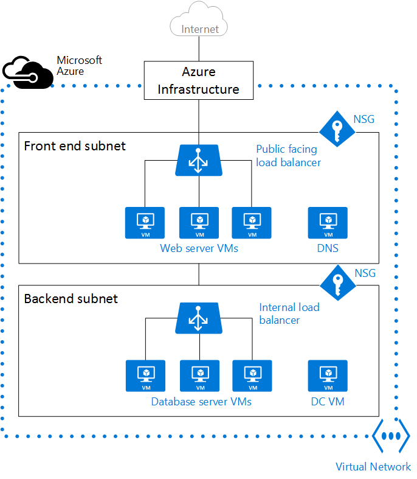

<properties
   pageTitle="Azure-virtuellen Network (VNet) (Übersicht)"
   description="Informationen Sie zu virtueller Netzwerke (VNets) in Azure."
   services="virtual-network"
   documentationCenter="na"
   authors="jimdial"
   manager="carmonm"
   editor="tysonn" />
<tags
   ms.service="virtual-network"
   ms.devlang="na"
   ms.topic="get-started-article"
   ms.tgt_pltfrm="na"
   ms.workload="infrastructure-services"
   ms.date="03/15/2016"
   ms.author="jdial" />

# Virtuelle Network (Übersicht)

Ein Azure-virtuelles Netzwerk (VNet) ist eine Darstellung des Netzwerks in der Cloud.  Es ist eine logische Isolation der Azure Cloud dedizierten für Ihr Abonnement. Sie können die IP-Adressblöcke, DNS-Einstellungen, Sicherheitsrichtlinien und Routing-Tabellen in diesem Netzwerk vollständig steuern. Können Sie auch weiter Segmentieren Ihrer VNet in Subnetze und starten Sie IaaS Azure-virtuellen Computern (virtuelle Computer) und/oder [Cloud Services (PaaS Rolleninstanzen)](../cloud-services/cloud-services-choose-me.md). Darüber hinaus können Sie das virtuelle Netzwerk mit Ihrem lokalen Netzwerk verwenden eine der [Optionen für die Netzwerkkonnektivität](../vpn-gateway/vpn-gateway-about-vpngateways.md#site-to-site-and-multi-site) in Azure verfügbar verbinden. Im Wesentlichen können Sie Ihr Netzwerk Azure mit vollständig steuern auf IP-Adressblöcke mit der Vorteil der Skalierung Enterprise erweitern, die Azure ermöglicht.

Zum besseren Verständnis VNets sehen Sie sich in der Abbildung unten, der eine lokale vereinfachte Netzwerk angezeigt wird.

Die obige Abbildung zeigt eine lokale Netzwerk mit dem öffentlichen Internet über einen Router verbunden. Sie können auch eine Firewall zwischen dem Router und einer DMZ Hostinganbieter eines DNS-Servers und einer Webserverfarm anzeigen. Die Web-Serverfarm ist Lastenausgleich ein Hardware-Lastenausgleich, die im Internet offen gelegt ist, und es verbraucht Ressourcen aus dem internen Subnetz verwenden. Interne Subnetz werden von der DMZ durch eine andere Firewall und Hosts Active Directory-Domänencontroller Servern, Datenbankserver und Anwendungsserver getrennt.

Im selben Netzwerk kann in Azure gehostet werden, wie in der folgenden Abbildung gezeigt.

Beachten Sie, wie die Rolle des Routers, gleicht Access aus Ihrer VNet mit dem öffentlichen Internet, ohne dass benötigt jeder Konfiguration die Azure-Infrastruktur annimmt. Firewalls können nach Netzwerk Sicherheitsgruppen (NSGs) angewendet, die für jedes einzelne Subnetz ersetzt werden. Und physisch Lastenausgleich von Internet zugänglichen und internen Lastenausgleich in Azure ersetzt werden.

>[AZURE.NOTE] Es gibt zwei Bereitstellung Modi in Azure: klassischen (auch bekannt als Servicemanagement) und Azure Ressource-Manager (Cloud). Klassische VNets konnte eine Gruppe für die Zugehörigkeit hinzugefügt oder als eine Landes-/ VNet erstellt werden. Wenn Sie eine Gruppe für die Zugehörigkeit eines VNet haben, empfiehlt es sich mit der [Migration zu einer regionalen VNet](virtual-networks-migrate-to-regional-vnet.md).

## Vorteile des virtuellen Netzwerks

- **Grad der Isolation**. VNets sind vollständig voneinander isoliert. Mit der Sie die nicht zusammenhängende Netzwerken für die Entwicklung, testen und Herstellung erstellen, die die gleichen CIDR-Blocks Adresse verwenden.

- **Zugriff auf das öffentliche Internet**. Alle IaaS virtuellen Computern und PaaS Rolleninstanzen in einer VNet können im öffentliche Internet standardmäßig zugreifen. Sie können mithilfe von Netzwerk-Sicherheitsgruppen (NSGs) Zugriff steuern.

- **Zugriff auf virtuellen Computern innerhalb der VNet**. PaaS Rolleninstanzen und IaaS virtuellen Computern im gleichen virtuellen Netzwerk gestartet werden kann, und sie können eine Verbindung mit miteinander private IP-Adressen verwenden, auch wenn sie in verschiedenen Subnetzen ohne sind zu konfigurieren ein Gateways oder öffentliche IP-Adressen verwenden müssen.

- **Mit einer Auflösung von Namen**. Azure bietet internen namensauflösung für IaaS virtuellen Computern und PaaS Rolleninstanzen in Ihrem VNet bereitgestellt. Auch können Sie Ihre eigenen DNS-Server bereitstellen und die VNet, um diese zu konfigurieren.

- **Sicherheit**. Datenverkehr eingeben, und beenden den virtuellen Computern und PaaS Rolleninstanzen in einer VNet kann mithilfe von Netzwerk-Sicherheitsgruppen gesteuert werden.

- **Konnektivität**. VNets können mit Netzwerkgateways oder VNet peering miteinander verbunden sein. VNets können mit lokalen Data Center über Standort-zu-Standort VPN-Netzwerke oder Azure ExpressRoute verbunden sein. Weitere Informationen zu Website-zu-Standort VPN-Konnektivität zu finden, besuchen Sie [zu VPN-Gateways](../vpn-gateway/vpn-gateway-about-vpngateways.md#site-to-site-and-multi-site)aus. Weitere Informationen zum ExpressRoute finden Sie auf [ExpressRoute – technische Übersicht](../expressroute/expressroute-introduction.md). Weitere Informationen zu VNet peering zu finden, besuchen Sie [VNet peering](virtual-network-peering-overview.md)aus.

    >[AZURE.NOTE] Stellen Sie sicher, dass Sie eine VNet vor der Bereitstellung von einem beliebigen IaaS virtuellen Computern oder PaaS Rolleninstanzen bei Ihrer Azure-Umgebung erstellen. Cloud-basierte virtuellen Computern erfordern eine VNet, und wenn Sie eine vorhandene VNet nicht angeben, erstellt Azure ein Standard-VNet, die möglicherweise einen CIDR Adresse blockieren Konflikt mit Ihrem lokalen Netzwerk. Wodurch es unmöglich, eine Verbindung mit Ihrem lokalen Netzwerk Ihrer VNet.

## Subnetze

Subnetz ist ein Bereich von IP-Adressen in der VNet, Sie können eine VNet in mehreren Subnetzen für Organisations- und Sicherheitsgruppen unterteilen. Virtuellen Computern und PaaS Rolleninstanzen auf Subnetze (denselben oder unterschiedlichen) innerhalb einer VNet bereitgestellt können ohne zusätzliche Konfiguration kommunizieren. Sie können auch mit einem Subnetz Routing Tabellen und NSGs konfigurieren.

## IP-Adressen

Es gibt zwei Arten von IP-Adressen für Ressourcen in Azure: *öffentlichen* und *privaten*. Öffentliche IP-Adressen zulassen Azure Ressourcen zur Kommunikation mit dem Internet und anderen Azure öffentlich zugänglichen Diensten wie [Azure Redis Cache](https://azure.microsoft.com/services/cache/), [Azure Ereignis Hubs](https://azure.microsoft.com/documentation/services/event-hubs/). Private IP-Adressen ermöglicht die Kommunikation zwischen Ressourcen in einem virtuellen Netzwerk, sowie Personen über ein VPN verbunden sind, ohne eine Internet geroutet IP-Adressen.

Weitere Informationen zum IP-Adressen in Azure finden Sie auf [IP-Adressen in virtuelles Netzwerk](virtual-network-ip-addresses-overview-arm.md)

## Azure Lastenausgleich

Virtuellen Computern und Clouddiensten in einem virtuellen Netzwerk können über Azure Lastenausgleich mit Internet verfügbar gemacht werden. Branchenanwendungen, die interne sind kann nur Lastenausgleich mit internen Lastenausgleich durchgeführt werden.

- **Externer Lastenausgleich**. Einen externer Lastenausgleich können Sie hohe Verfügbarkeit IaaS virtuellen Computern und PaaS Rolleninstanzen im öffentlichen Internet zugegriffen bereitstellen.

- **Interne Lastenausgleich**. Eine interne Lastenausgleich können Sie hohe Verfügbarkeit IaaS virtuellen Computern und PaaS Rolleninstanzen von anderen Diensten in Ihrem VNet zugegriffen bereitstellen.

Weitere Informationen zu den Lastenausgleich in Azure finden Sie auf [System zum Lastenausgleich Übersicht zu laden](../load-balancer/load-balancer-overview.md).

## Netzwerk-Sicherheitsgruppe (NSG)

Sie können eingehende und ausgehende Zugriff auf Netzwerk-Schnittstellen (NICs), gesteuert NSGs erstellen virtuellen Computern und Subnetze. Jede NSG enthält einen oder mehrere Regeln angegeben werden, ob Datenverkehr genehmigt oder abgelehnt wird, ausgehend von Quelle IP-Adresse, Anschluss Quelle, Ziel IP-Adresse und Zielanschluss. Weitere Informationen zum NSGs finden Sie auf [Was ist eine Sicherheitsgruppe Netzwerk](virtual-networks-nsg.md).

## Virtuelle Einheiten

Eine virtuelle Einheit ist virtueller nur von einem anderen Computer in Ihrem VNet, die eine Software basieren Einheit-Funktion, wie z. B. Firewall, WAN-Optimierung oder einen unbefugten ausgeführt wird. Sie können eine Routing in Azure zum Weiterleiten von Ihren VNet Verkehrs über eine virtuelle Einheit mit seiner Funktionen erstellen.

NSGs kann beispielsweise verwendet werden, um auf Ihre VNet Sicherheit zu gewährleisten. NSGs bieten jedoch Ebene 4 Access Control Liste (ACL) auf eingehende und ausgehende Pakete. Wenn Sie eine Ebene 7 Sicherheitsmodell verwenden möchten, müssen Sie eine Firewall-Anwendung zu verwenden.

Virtuelle Einheiten hängen davon ab, [benutzerdefinierte leitet und IP-Weiterleitung](virtual-networks-udr-overview.md).

## Grenzwerte
Es gibt die Anzahl von virtuellen Netzwerken in einem Abonnement zulässige beschränkt, Näheres [Azure Networking Grenzwerte](../azure-subscription-service-limits.md#networking-limits) für Weitere Informationen.

## Preise
Es ist keine zusätzliche Kosten für die Verwendung von virtuellen Netzwerken in Azure. Die berechnen Instanzen innerhalb der Vnet gestartet werden der standard-Tarife belastet in [Azure virtueller Computer Preise](https://azure.microsoft.com/pricing/details/virtual-machines/)beschriebenen. Die [VPN-Gateways](https://azure.microsoft.com/pricing/details/vpn-gateway/) und [öffentliche IP-Adressen] (https://azure.microsoft.com/pricing/details/ip-addresses/) in der VNet verwendet werden auch berechnete standard Sätzen.

## Nächste Schritte

- [Erstellen einer VNet](virtual-networks-create-vnet-arm-pportal.md) und Subnetze.
- [Erstellen ein virtuellen Computers in einer VNet](../virtual-machines/virtual-machines-windows-hero-tutorial.md).
- Informationen Sie zu [NSGs](virtual-networks-nsg.md).
- Lernen Sie [benutzerdefinierte leitet und IP-Weiterleitung](virtual-networks-udr-overview.md).
