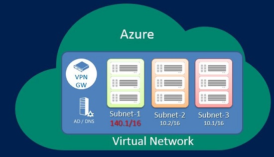
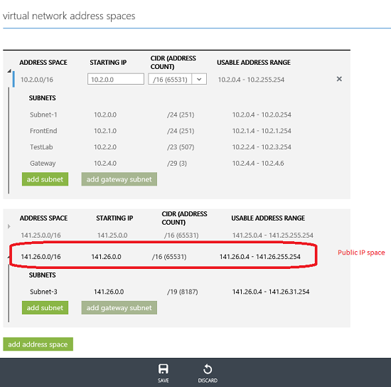

<properties 
   pageTitle="Verwenden Sie öffentliche IP-Adressen in einem virtuellen Netzwerk"
   description="Informationen Sie zum Konfigurieren eines virtuellen Netzwerks um öffentliche IP-Adressen verwenden"
   services="virtual-network"
   documentationCenter="na"
   authors="jimdial"
   manager="carmonm"
   editor="tysonn" />
<tags 
   ms.service="virtual-network"
   ms.devlang="na"
   ms.topic="article"
   ms.tgt_pltfrm="na"
   ms.workload="infrastructure-services"
   ms.date="04/27/2016"
   ms.author="jdial" />

# Öffentliche IP-Adresse Leerzeichen in einem virtuellen Netzwerk (VNet)

Virtuelle Netzwerke (VNets) können öffentliche und private (RFC 1918 Adressblöcke) IP-Adresse Leerzeichen enthalten. Wenn Sie einen öffentlichen IP-Adressbereich hinzufügen, wird diese als Teil der privaten VNet IP-Adresse Leerzeichen behandelt, die nur innerhalb der VNet, verbundener VNets, und von Ihrem lokalen Standort erreichbar ist.

Die nachstehende Abbildung zeigt ein VNet, der öffentliche und private IP-Adresse Leerzeichen enthält.

## Wie füge ich einen öffentlichen IP-Adressbereich?

Sie einen Bereich der öffentlichen IP-Adresse auf dieselbe Weise hinzufügen Sie einen privaten IP-Adressbereich fügen; entweder mit einer Datei *Netcfg* oder durch die Konfiguration der [Azure-Portal](http://portal.azure.com)hinzufügen. Sie können einen öffentlichen IP-Adressbereich beim Erstellen der VNet, oder Sie können zurückgehen und danach Lizenz hinzufügen. Das folgende Beispiel zeigt die öffentliche und private IP-Adresse Leerzeichen in der gleichen VNet konfiguriert.

## Gibt es Einschränkungen?

Es gibt ein paar IP-Adressbereiche, die nicht zulässig sind:

- 224.0.0.0/4 (Multicast)

- 255.255.255.255/32 (übertragen)

- 127.0.0.0/8 (Schleife)

- 169.254.0.0/16 (Link-lokal)

- 168.63.129.16/32 (internen DNS)

## Nächste Schritte

[Zum Verwalten von einer VNet verwendeten DNS-Server](virtual-networks-manage-dns-in-vnet.md)