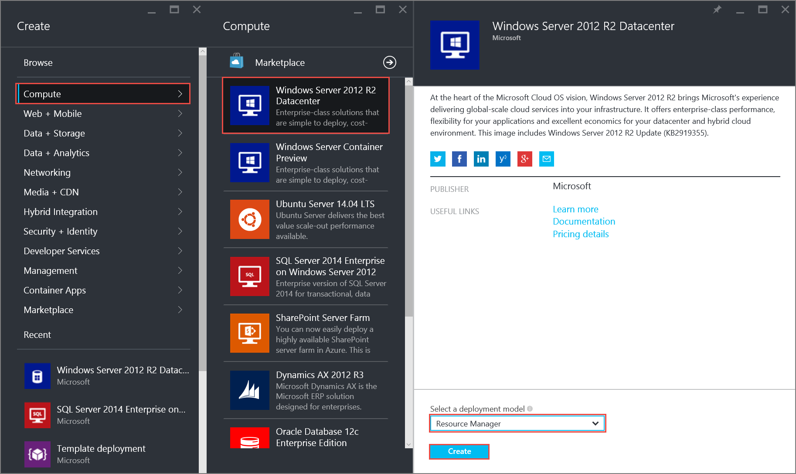
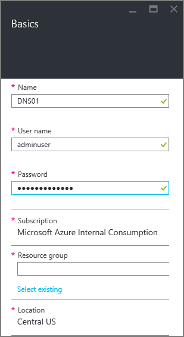
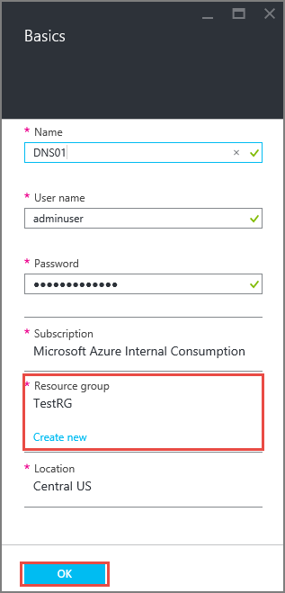
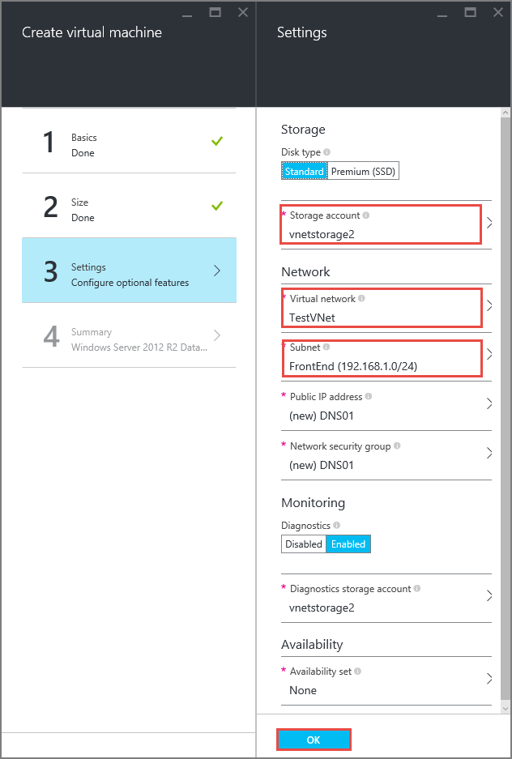
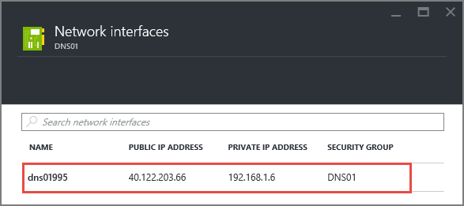
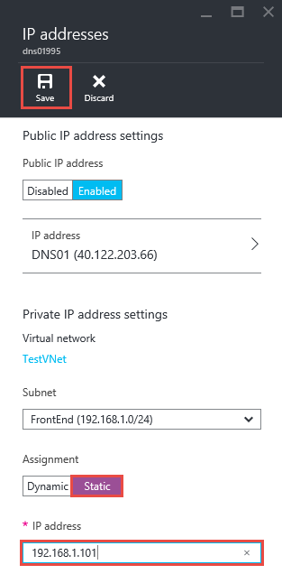

<properties 
   pageTitle="So legen Sie eine statische private IP-Adresse in die Cloud-Modus mithilfe des Azure-Portals | Microsoft Azure"
   description="Grundlegendes zu privaten IP-Adressen (DIPs) und wie sie in der Cloud-Modus verwenden des Portals Azure verwaltet"
   services="virtual-network"
   documentationCenter="na"
   authors="jimdial"
   manager="carmonm"
   editor="tysonn"
   tags="azure-resource-manager"
/>
<tags 
   ms.service="virtual-network"
   ms.devlang="na"
   ms.topic="article"
   ms.tgt_pltfrm="na"
   ms.workload="infrastructure-services"
   ms.date="02/04/2016"
   ms.author="jdial" />

# So legen Sie eine statische private IP-Adresse der Azure-Portal

[AZURE.INCLUDE [virtual-networks-static-private-ip-selectors-arm-include](../../includes/virtual-networks-static-private-ip-selectors-arm-include.md)]

[AZURE.INCLUDE [virtual-networks-static-private-ip-intro-include](../../includes/virtual-networks-static-private-ip-intro-include.md)]

[AZURE.INCLUDE [azure-arm-classic-important-include](../../includes/azure-arm-classic-important-include.md)]Dieser Artikel behandelt das Modell zur Bereitstellung von Ressourcenmanager. Sie können auch [statische private IP-Adresse in das Bereitstellungsmodell klassischen verwalten](virtual-networks-static-private-ip-classic-pportal.md).

[AZURE.INCLUDE [virtual-networks-static-ip-scenario-include](../../includes/virtual-networks-static-ip-scenario-include.md)]

Beispiel für Schritte erwarten eine einfache-Umgebung, die bereits erstellt. Wenn Sie die Schritte ausführen, wie sie in diesem Dokument angezeigt werden soll, erstellen Sie zuerst der testumgebung beschrieben, die in [einer Vnet erstellen](virtual-networks-create-vnet-arm-pportal.md).

## So erstellen Sie einen virtuellen Testzwecken statische private IP-Adressen

Sie können keine statische private IP-Adresse während der Erstellung eines virtuellen Computers im Modus Bereitstellung Ressourcenmanager festlegen mithilfe des Azure-Portals. Sie müssen den virtuellen Computer erstellen, Textauswahl zugehörigen privaten IP statisch festlegen.

Zum Erstellen eines virtuellen Computers mit dem Namen *DNS01* im *Front-End* Subnetz eines Namens *TestVNet*VNet führen Sie die folgenden Schritte aus.

1. Mithilfe eines Browsers und navigieren Sie zu http://portal.azure.com und, falls notwendig, melden Sie sich mit Ihrem Azure-Konto.
2. Klicken Sie auf **neu** > **berechnen** > **Windows Server 2012 R2 Datacenter**, beachten Sie, dass in die Liste **Wählen Sie ein Modell zur Bereitstellung von** bereits zeigt **Ressourcenmanager**, und klicken Sie dann auf **Erstellen**, wie in der folgenden Abbildung gezeigt.

    

3. Geben Sie in die **Grundlagen** Blade den Namen des den virtuellen Computer (*DNS01* in diesem Szenario) erstellt werden der lokalen Administratorkonto und das Kennwort, wie in der folgenden Abbildung gezeigt.

    

4. Sicherstellen Sie, dass den ausgewählten **Speicherort** *Zentralen US*, ist und dann klicken Sie unter **Ressourcengruppe**auf **vorhandene auswählen** und dann klicken Sie erneut auf **Ressourcengruppe** und dann *TestRG*klicken Sie auf, und klicken Sie dann auf **OK**.

    

5. Wählen Sie **A1 Standard**aus, und klicken Sie auf **auswählen**, in das Blade **auswählen eine Größe** .

     

6. Vergewissern Sie sich die folgenden Eigenschaften festgelegt werden in das Blade **Einstellungen** mit den folgenden Werten festgelegt sind, und klicken Sie dann auf **OK**.

    -**Speicher-Konto**: *Vnetstorage*
    - **Netzwerk**: *TestVNet*
    - **Subnetz**: *Front-End*

      

7. Die **Zusammenfassung** Blade klicken Sie auf **OK**. Beachten Sie die Kachel unten im Dashboard angezeigt.

    

## Informationen zu Vorgehensweisen abrufen statische private IP-Adresse für einen virtuellen Computer

Um statische private IP-Adresse-Informationen für den virtuellen Computer mit den oben aufgeführten Schritten erstellte anzeigen möchten, führen Sie die folgenden Schritte aus.

1. Klicken Sie im Portal Azure Azure auf **Alle durchsuchen** > **virtuellen Computern** > **DNS01** > **Alle Einstellungen** > **Netzwerk-Schnittstellen** und klicken Sie dann auf die einzige Netzwerkschnittstelle aufgeführt.

    

2. Klicken Sie in das Blade **-Schnittstelle** **Alle Einstellungen**auf > **IP-Adressen** und beachten Sie die Werte **Zuordnungs-** und **IP-Adresse** .

    

## So fügen Sie eine statische private IP-Adresse zu einer vorhandenen virtuellen Computer
Um eine statische private IP-Adresse der virtuellen Computer erstellt haben, verwenden die obigen Schritte hinzuzufügen, führen Sie die folgenden Schritte aus:

1. Klicken Sie aus dem **IP-Adressen** Blade abgebildet ist auf **statische** unter **Zuordnung**.
2. Geben Sie *192.168.1.101* für **IP-Adresse**ein, und klicken Sie dann auf **Speichern**.

    

>[AZURE.NOTE] Wenn nach dem Klicken auf **Speichern** Sie feststellen, dass die Zuordnung weiterhin auf **dynamische**festgelegt ist, bedeutet dies, dass die IP-Adresse eingegebenen bereits verwendet wird. Versuchen Sie eine andere IP-Adresse ein.

## So entfernen Sie eine statische private IP-Adresse eines virtuellen Computers
Führen Sie zum Entfernen der statischen privaten IP-Adresse aus den virtuellen Computer erstellt haben, über die folgenden Schritte aus.
    
1. Klicken Sie unter **Zuordnung**auf **dynamische** aus dem **IP-Adressen** -Blade abgebildet und klicken Sie dann auf **Speichern**.

## Nächste Schritte

- Informationen Sie zu [Reservierte öffentliche IP-](virtual-networks-reserved-public-ip.md) Adressen.
- Informationen Sie zu Adressen [Instanz Ebene öffentlichen IP-(ILPIP)](virtual-networks-instance-level-public-ip.md) .
- Wenden Sie sich an die [reservierte IP-REST-APIs](https://msdn.microsoft.com/library/azure/dn722420.aspx).