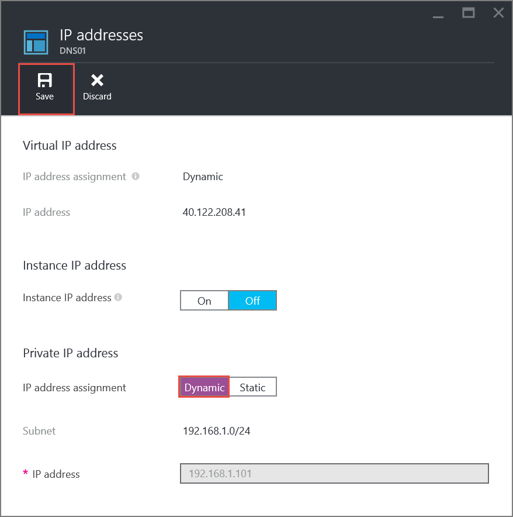

<properties 
   pageTitle="So legen Sie eine statische private IP-Adresse im klassischen Modus mithilfe der Azure-Portal | Microsoft Azure"
   description="Grundlegendes zu statischen privaten IP-Adressen und wie sie in der klassischen Ansicht mit der Azure-Portal verwaltet"
   services="virtual-network"
   documentationCenter="na"
   authors="jimdial"
   manager="carmonm"
   editor="tysonn"
   tags="azure-service-management"
/>
<tags 
   ms.service="virtual-network"
   ms.devlang="na"
   ms.topic="article"
   ms.tgt_pltfrm="na"
   ms.workload="infrastructure-services"
   ms.date="02/04/2016"
   ms.author="jdial" />

# Wie Sie eine statische private IP-Adresse (klassische) im Azure-Portal

[AZURE.INCLUDE [virtual-networks-static-private-ip-selectors-classic-include](../../includes/virtual-networks-static-private-ip-selectors-classic-include.md)]

[AZURE.INCLUDE [virtual-networks-static-private-ip-intro-include](../../includes/virtual-networks-static-private-ip-intro-include.md)]

[AZURE.INCLUDE [azure-arm-classic-important-include](../../includes/azure-arm-classic-important-include.md)]Dieser Artikel behandelt das Bereitstellungsmodell klassischen. Sie können auch [eine statische private IP-Adresse in das Modell zur Bereitstellung von Ressourcenmanager verwalten](virtual-networks-static-private-ip-arm-pportal.md).

[AZURE.INCLUDE [virtual-networks-static-ip-scenario-include](../../includes/virtual-networks-static-ip-scenario-include.md)]

Beispiel für Schritte erwarten eine einfache-Umgebung, die bereits erstellt. Wenn Sie die Schritte ausführen, wie sie in diesem Dokument angezeigt werden soll, erstellen Sie zuerst der testumgebung beschrieben, die in [einer Vnet erstellen](virtual-networks-create-vnet-classic-pportal.md).

## So geben Sie beim Erstellen eines virtuellen Computers eine statische private IP-Adresse
Zum Erstellen eines virtuellen Computers mit dem Namen *DNS01* in der *Front-End* -Subnetz von einer VNet mit dem Namen *TestVNet* mit einem statischen privaten IP-Adresse des *192.168.1.101*führen Sie die folgenden Schritte aus:

1. Mithilfe eines Browsers und navigieren Sie zu http://portal.azure.com und, falls notwendig, melden Sie sich mit Ihrem Azure-Konto.
2. Klicken Sie auf **neu** > **berechnen** > **Windows Server 2012 R2 Datacenter**, beachten Sie, dass in die Liste **Wählen Sie ein Bereitstellungsmodell** bereits zeigt **klassischen**, und klicken Sie dann auf **Erstellen**.

    

3. Geben Sie in das **Erstellen von virtuellen Computer** Blade, den Namen des den virtuellen Computer (*DNS01* in diesem Szenario) erstellt werden die lokale Administratorkonto und das Kennwort.

    

4. Klicken Sie auf **Optional Konfiguration** > **Netzwerk** > **Virtuelle Netzwerk**, und klicken Sie dann auf **TestVNet**. Wenn **TestVNet** nicht verfügbar ist, stellen Sie sicher Sie den *Zentralen US* -Speicherort verwenden und die testumgebung beschrieben, die zu Beginn dieses Artikels erstellt haben.

    

5. Stellen Sie in das **Netzwerk** Blade sicher, dass das aktuell ausgewählte Subnetz *Front-End*, ist und klicken Sie dann auf **IP-Adressen**, klicken Sie unter **IP-Adresse Zuordnung** auf **statische**und geben Sie dann *192.168.1.101* für **IP-Adresse** ein, wie folgt.

       

6. Klicken Sie in das Blade **IP-Adressen** auf **OK** und dann klicken Sie in das **Netzwerk** Blade auf **OK** , und klicken Sie in das **optionale Config** Blade auf **OK** .
7. Klicken Sie in das **Erstellen von virtuellen Computer** Blade auf **Erstellen**. Beachten Sie die Kachel unten im Dashboard angezeigt.

    

## Informationen zu Vorgehensweisen abrufen statische private IP-Adresse für einen virtuellen Computer

Um statische private IP-Adresse-Informationen für den virtuellen Computer mit den oben aufgeführten Schritten erstellte anzeigen möchten, führen Sie die folgenden Schritte aus.

1. Klicken Sie im Portal Azure Azure auf **Alle durchsuchen** > **virtuellen Computern (klassische)** > **DNS01** > **Alle Einstellungen** > **IP-Adressen** und beachten Sie die IP-Adresse Zuordnung und IP-Adresse wie folgt.

    

## So entfernen Sie eine statische private IP-Adresse eines virtuellen Computers
Führen Sie zum Entfernen der statischen privaten IP-Adresse aus den virtuellen Computer erstellt haben, über die folgenden Schritte aus.
    
1. Klicken Sie aus dem **IP-Adressen** -Blade abgebildet auf **dynamische** rechts neben der **Zuordnung von IP-Adresse**, und klicken Sie dann klicken Sie auf **Speichern**, und klicken Sie dann auf **Ja**.

    

## So fügen Sie eine statische private IP-Adresse zu einer vorhandenen virtuellen Computer
Um eine statische private IP-Adresse der virtuellen Computer erstellt haben, verwenden die obigen Schritte hinzuzufügen, führen Sie die folgenden Schritte aus:

1. Klicken Sie aus dem **IP-Adressen** Blade abgebildet ist auf **statische** rechts neben **IP-Adresse Zuordnung**.
2. Geben Sie *192.168.1.101* für die **IP-Adresse**, und klicken Sie auf **Speichern**, und klicken Sie dann auf **Ja**.

## Nächste Schritte

- Informationen Sie zu [Reservierte öffentliche IP-](virtual-networks-reserved-public-ip.md) Adressen.
- Informationen Sie zu Adressen [Instanz Ebene öffentlichen IP-(ILPIP)](virtual-networks-instance-level-public-ip.md) .
- Wenden Sie sich an die [reservierte IP-REST-APIs](https://msdn.microsoft.com/library/azure/dn722420.aspx).