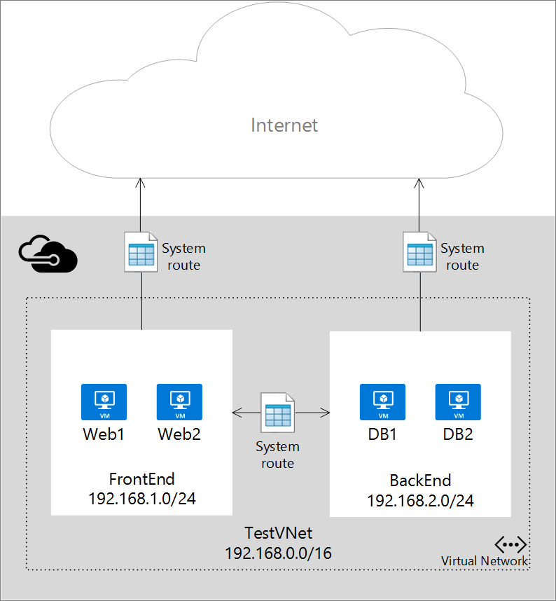
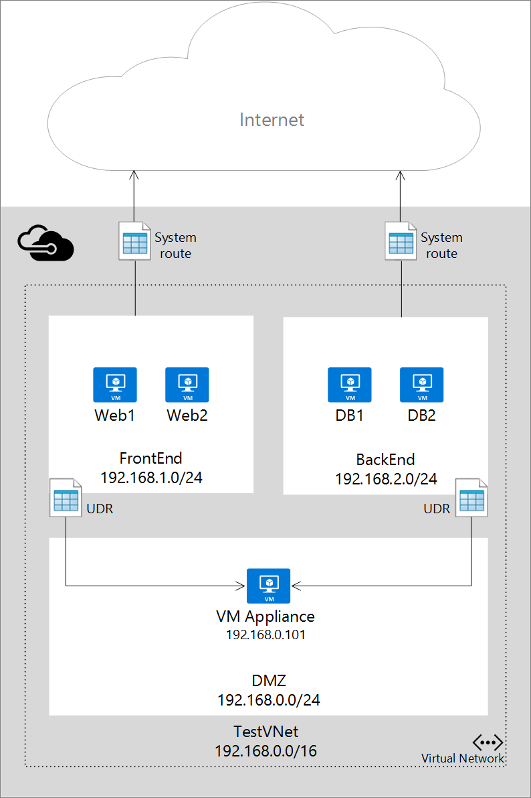

<properties 
   pageTitle="Was sind Benutzer definiert ist und die IP-Weiterleitung?"
   description="Erfahren Sie, wie Benutzer definiert ist (UDR) und IP-Weiterleitung auf Weiterleitung von Datenverkehr virtuelle Einheiten in Azure Netzwerk."
   services="virtual-network"
   documentationCenter="na"
   authors="jimdial"
   manager="carmonm"
   editor="tysonn" />
<tags 
   ms.service="virtual-network"
   ms.devlang="na"
   ms.topic="get-started-article"
   ms.tgt_pltfrm="na"
   ms.workload="infrastructure-services"
   ms.date="03/15/2016"
   ms.author="jdial" />

# Was sind Benutzer definiert ist und die IP-Weiterleitung?
Wenn Sie ein virtuelles Netzwerk (VNet) in Azure virtuellen Computern (virtuellen Computern) hinzufügen, werden Sie feststellen, dass der virtuelle Computer im Netzwerk automatisch kommunizieren können. Sie müssen nicht angeben ein Gateways, obwohl die virtuellen Computern in verschiedenen Subnetzen befinden. Dasselbe gilt für die Kommunikation von den virtuellen Computern mit dem öffentlichen Internet und sogar auf Ihrem lokalen Netzwerk bei einer Hybrid Verbindung zu Ihrem eigenen Datencenter Azure vorhanden ist.

Dieser Datenfluss von Kommunikation ist möglich, da Azure eine Reihe von System leitet verwendet um zu definieren, wie IP-Datenverkehr fließt. System leitet Steuern des Kommunikation in den folgenden Szenarien:

- Aus im selben Subnetz.
- Von einem Subnetz in ein anderes innerhalb einer VNet.
- Aus virtuellen Computern mit dem Internet.
- Aus einer VNet zu einem anderen VNet über ein VPN-Gateway.
- Aus einer VNet mit Ihrem lokalen Netzwerk über ein VPN-Gateway.

Die folgende Abbildung zeigt ein einfaches Setup mit einem VNet, zwei Subnetzen und ein paar virtuellen Computern, zusammen mit dem System weitergeleitet, die IP-Datenverkehr zulassen.

Obwohl die Verwendung von System leitet den Datenverkehr automatisch für die Bereitstellung erleichtert, gibt es Fälle, in denen Sie das routing von Paketen über eine virtuelle Einheit steuern möchten. Sie können also erstellen Sie benutzerdefinierte weitergeleitet, die den nächsten Abschnitt für Pakete parallelen mit einem bestimmten Subnetz, um stattdessen an Ihre virtuelle Einheit zu wechseln, und Aktivieren der IP-Weiterleitung für den virtuellen Computer ausgeführt werden, wie das virtuelle Gerät angeben.

Die folgende Abbildung zeigt ein Beispiel für benutzerdefinierte leitet und IP-Weiterleitung So erzwingen Sie Pakete an einem Subnetz gesendet werden, von einem anderen über eine virtuelle Einheit in einem dritten Subnetz wechseln.

>[AZURE.IMPORTANT] Benutzerdefinierte leitet werden nur auf ein Subnetz verlassen Datenverkehr angewendet. Sie können keine erstellen weitergeleitet, um anzugeben, wie Datenverkehr in einem Subnetz aus dem Internet, zum Beispiel stammt. Darüber hinaus kann nicht die Einheit, der Sie den Datenverkehr in weiterleiten in demselben Subnetz befinden, um der Datenverkehr stammt. Erstellen Sie immer ein separates Subnetz für Ihre Geräte. 

## Weiterleiten von Ressourcen
In einem TCP/IP-Netzwerk basierend auf einer Routingtabelle an jedem Knoten physischen Netzwerk definiert sind Pakete weitergeleitet. Eine Routingtabelle ist eine Auflistung von verschiedenen Arbeitspläne verwendet, um zu entscheiden, wo Sie basierend auf der IP-Zieladresse Pakete weiterleiten. Eine Routing setzt sich wie folgt:

|Eigenschaft|Beschreibung|Einschränkungen|Aspekte|
|---|---|---|---|
| Adresspräfix | Die Ziel-CIDR auf die die Routing angewendet, wie z. B. 10.1.0.0/16 wird.|Muss ein gültiger CIDR Bereich Adressen in den öffentlichen Internet, Azure virtuelles Netzwerk oder lokalen Datacenter darstellt.|Stellen Sie sicher, dass die **Adresspräfix** nicht die Adresse für die **Adresse des nächsten Abschnitts**, andernfalls enthalten, geben Sie Ihre Pakete in einer Schleife an den nächsten Abschnitt ohne zu erreichen jemals das Ziel aus der Quelle vertraut werden. |
| Typ der nächsten Abschnitte | Den Typ des Abschnitts Azure das Paket gesendet werden soll. | Muss einen der folgenden Werte:   **Virtuelles Netzwerk**. Steht für lokale virtuelle Netzwerk. Beispielsweise wenn Sie zwei Subnetzen, 10.1.0.0/16 und 10.2.0.0/16 im gleichen virtuellen Netzwerk verfügen, haben das Routing für jedes Subnetz in der Routingtabelle nächsten Abschnitte Wert *Virtuelles Netzwerk*.   **Virtuelle Netzwerk-Gateway**. Stellt einen Azure S2S VPN-Gateway.   **Internet**. Stellt das standardmäßige Internetgateway von der Azure-Infrastruktur bereitgestellt.   **Virtuelle Anwendung**. Stellt eine virtuelle Anwendung, die Sie mit Ihrem Azure virtuelle Netzwerk hinzugefügt.   **Keine**. Stellt ein Loch Schwarz. An einem schwarzen Loch weitergeleitete Pakete werden gar nicht übermittelt.| Erwägen Sie einen Typ **keine** Pakete von parallelen zu einem angegebenen Ziel zu beenden. | 
| Adresse des nächsten Abschnitts | Die Adresse des nächste Abschnitts enthält die IP-Adresse, die auf Pakete weitergeleitet werden sollen. Nächsten Abschnitte Werte dürfen nur in weitergeleitet, wo finde ich der nächste Abschnitt Typ *Virtuelle Anwendung*.| Muss eine IP-Adresse, die innerhalb des virtuellen Netzwerks erreichbar ist, auf die benutzerdefinierte Routing angewendet wird. | Wenn die IP-Adresse ein virtuellen Computers darstellt, stellen Sie sicher, dass Sie für den virtuellen Computer in Azure [IP-forwarding](#IP-forwarding) aktivieren. |

Azure PowerShell haben einige der Werte "NextHopType" unterschiedliche Namen:
- Virtuelles Netzwerk ist VnetLocal
- Virtuelle Netzwerk-Gateway ist VirtualNetworkGateway
- Virtuelle Einheit ist VirtualAppliance
- Internet ist Internet
- Keine ist keiner

### System leitet
Jedes Subnetz in ein virtuelles Netzwerk erstellt wird automatisch eine Routingtabelle, die die folgenden System Routing Regeln enthält zugeordnet:

- **Lokale Vnet Regel**: mit dieser Regel wird automatisch für jedes Subnetz in ein virtuelles Netzwerk erstellt. Es gibt an, dass eine direkte Verknüpfung zwischen den virtuellen Computern in der VNet besteht, und es keine zwischen-XT für nächste Abschnitt ist.
- **Lokale Regel**: mit dieser Regel gilt für alle Datenverkehr auf den lokalen Adressbereich und VPN-Gateway als das Ziel des nächsten Abschnitts verwendet.
- **Internet-Regel**: Diese Regel Ziehpunkte gesamten Verkehr an das öffentliche Internet (0.0.0.0/Adresse Präfix 0) gerichtet und Infrastruktur Internet-Gateway als den nächsten Abschnitt für den gesamten Verkehr verwendet, die mit dem Internet bestimmt ist.

### Benutzerdefinierte leitet
Für die meisten Umgebungen benötigen Sie nur das System leitet von Azure bereits definiert. Möglicherweise müssen Sie jedoch, zum Erstellen einer Tabelle weiterleiten, und fügen eine oder mehrere leitet in bestimmten Fällen, z. B.:

- Erzwingen Sie Tunnel im Internet über Ihrem lokalen Netzwerk.
- Verwenden von virtuellen Einheiten in Ihre Azure-Umgebung.

In den oben genannten Szenarien müssen Sie zum Erstellen einer Routingtabelle, und fügen Sie benutzerdefinierte leitet hinzu. Sie können mehrere Routing Tabellen haben, und die gleichen Routing Tabelle kann ein oder mehrere Subnetze zugeordnet werden. Und jedes Subnetz kann nur mit einer einzelnen Routingtabelle verknüpft werden. Alle virtuellen Computern und Clouddienste in einem Subnetz verwenden der Routingtabelle zugeordnet ist, an das betreffende Subnetz.

Subnetze basieren auf System weitergeleitet, bis eine Routingtabelle mit dem Subnetz verknüpft ist. Nachdem eine Zuordnung vorhanden ist, ist das routing auf längsten Präfix Übereinstimmung (LPM) zwischen sowohl benutzerdefinierte leitet und System leitet basierend fertig. Wenn mehrere Routing mit den gleichen LPM Übereinstimmung vorhanden ist, wird ein Routing ausgewählt basierend auf dem Ursprung in der folgenden Reihenfolge:

1. Benutzer definierten weiterleiten
1. BGP-Routing (wenn ExpressRoute verwendet)
1. System-Routing

Informationen zum Erstellen von benutzerdefinierten leitet finden Sie unter [So leitet erstellen und Aktivieren von IP-Weiterleitung in Azure](virtual-network-create-udr-arm-template.md).

>[AZURE.IMPORTANT] Benutzerdefinierte leitet werden nur auf Azure-virtuellen Computern und Cloud Services angewendet. Wenn Sie eine Firewall virtuelle Einheit zwischen Ihrem lokalen Netzwerk und Azure hinzufügen möchten, müssen Sie beispielsweise eine benutzerdefinierte Routing für Ihre Azure Routing Tabellen zu erstellen, der den gesamten Verkehr auf den lokalen Adresse Abstand an die virtuelle Einheit weiterleitet. Sie können auch die GatewaySubnet alle aus lokalen in Azure durch das virtuelle Gerät weiterleiten, eine benutzerdefinierte Routing (UDR) hinzufügen. Hierbei handelt es sich um eine neue Ergänzung.

### BGP leitet
Wenn Sie eine ExpressRoute Verbindung zwischen Ihrem lokalen Netzwerk und Azure verfügen, können Sie BGP leitet aus Ihrem lokalen Netzwerk in Azure weitergegeben aktivieren. Diese BGP weitergeleitet werden auf die gleiche Weise wie System leitet und benutzerdefinierte leitet in jedem Azure Subnetz verwendet. Weitere Informationen finden Sie unter [Einführung in die ExpressRoute](../expressroute/expressroute-introduction.md).

>[AZURE.IMPORTANT] Sie können Ihre Azure-Umgebung, um sofort Tunnel über das lokale Netzwerk durch Erstellen eines Benutzers definierten Routing für Subnetz 0.0.0.0/0, die das VPN-Gateway als den nächsten Abschnitt verwendet verwenden konfigurieren. Dies funktioniert jedoch nur, wenn Sie ein VPN-Gateway, nicht ExpressRoute verwenden. Für ExpressRoute wird die erzwungene Tunnel über BGP konfiguriert.

## IP-Weiterleitung
Wie oben beschreiben, ist eine der wichtigsten Gründe für das Erstellen eines Benutzers definierten Routing Datenverkehr an eine virtuelle Einheit weiterleiten. Eine virtuelle Einheit ist nicht mehr als ein virtueller Computer, die eine Anwendung zur Behandlung von Netzwerkverkehr in irgendeiner Weise, wie eine Firewall oder ein NAT-Gerät verwendet ausgeführt wird.

Diese virtuelle Einheit virtueller Computer muss eingehenden Datenverkehr empfangen, der nicht an sich selbst adressiert ist. Damit ein virtuellen Computers Datenverkehr an andere Ziele berücksichtigt empfangen können, müssen Sie die IP-Weiterleitung für den virtuellen Computer aktivieren. Hierbei handelt es sich um eine Azure, keine Einstellung im Gastbetriebssystem.

## Nächste Schritte

- Erfahren Sie, wie [Arbeitspläne im Bereitstellungsmodell Ressourcenmanager erstellen](virtual-network-create-udr-arm-template.md) , und ordnen Sie diese an Subnetze. 
- Erfahren Sie, wie [Arbeitspläne im Bereitstellungsmodell klassischen erstellen](virtual-network-create-udr-classic-ps.md) , und ordnen Sie diese an Subnetze.
