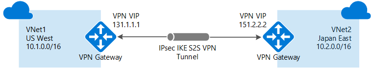
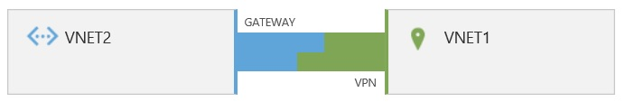

<properties
   pageTitle="Konfigurieren einer VNet-VNet-Verbindung für das Bereitstellungsmodell klassischen | Microsoft Azure"
   description="Herstellung der Verbindung Azure virtuelle Netzwerke mit PowerShell und dem klassischen Azure-Portal."
   services="vpn-gateway"
   documentationCenter="na"
   authors="cherylmc"
   manager="carmonm"
   editor=""
   tags="azure-service-management"/>

<tags
   ms.service="vpn-gateway"
   ms.devlang="na"
   ms.topic="article"
   ms.tgt_pltfrm="na"
   ms.workload="infrastructure-services"
   ms.date="08/31/2016"
   ms.author="cherylmc"/>

# Konfigurieren einer VNet-VNet-Verbindung für das Bereitstellungsmodell klassischen

> [AZURE.SELECTOR]
- [Ressourcenmanager - Azure-Portal](vpn-gateway-howto-vnet-vnet-resource-manager-portal.md)
- [Ressourcenmanager - PowerShell](vpn-gateway-vnet-vnet-rm-ps.md)
- [Klassische - klassischen-Portal](virtual-networks-configure-vnet-to-vnet-connection.md)

In diesem Artikel führt Sie durch die Schritte zum Erstellen und verbinden virtuelle Netzwerke zusammen mit dem klassischen Bereitstellungsmodell (auch bekannt als Servicemanagement). Die folgenden Schritte mithilfe das Azure klassische Portal um VNets und Gateways und PowerShell zum Konfigurieren der VNet-VNet-Verbindung zu erstellen. Sie können nicht im Portal die Verbindung konfigurieren.

### Bereitstellungsmodelle und Methoden für VNet-VNet-Verbindungen

[AZURE.INCLUDE [deployment models](../../includes/vpn-gateway-deployment-models-include.md)]

In der folgenden Tabelle zeigt die aktuell verfügbare Bereitstellung-Modelle und Methoden für VNet-VNet-Konfigurationen. Wenn ein Artikel mit Konfigurationsschritte verfügbar ist, verknüpfen wir aus dieser Tabelle direkt an.

[AZURE.INCLUDE [vpn-gateway-table-vnet-vnet](../../includes/vpn-gateway-table-vnet-to-vnet-include.md)]

## Informationen zu VNet-VNet-Verbindungen

Herstellen einer Verbindung ein virtuelles Netzwerk zu einem anderen virtuellen Netzwerk ähnelt (VNet VNet) ein virtuelles Netzwerk für das Herstellen von Verbindungen mit einer lokalen Website-Speicherort. Beide Typen Connectivity verwenden einen VPN-Gateway, um einen sicheren Tunnel mit IPSec-/IKE bereitzustellen. 

Die VNets, die Sie eine Verbindung herstellen kann in anderen Abonnements und verschiedener Regionen sein. Sie können VNet auf VNet Kommunikation mit mehreren Standorten Konfigurationen kombinieren. Auf diese Weise können Sie Netzwerken herstellen, die Cross lokale Konnektivität mit zwischen virtuelle Netzwerkkonnektivität kombinieren.

### Warum keine Verbindung herstellen mit virtuelle Netzwerke?

Möglicherweise virtuelle Netzwerke aus den folgenden Gründen eine Verbindung herstellen möchten:

- **Cross Region Geo-Redundanz und Geo-Anwesenheitsstatus**
    - Sie können eigene Geo-Replikation oder die Synchronisierung mit sichere Konnektivität einrichten ohne Überblick über das Internet zugänglichen Endpunkte.
    - Mit Azure Lastenausgleich und Microsoft oder Drittanbieter-Cluster Technologie können Sie über mehrere Azure Regionen hoch verfügbaren Arbeitsbelastung mit Geo-Redundanz einrichten. Beispiel für eine wichtige besteht darin, SQL immer auf mit Verfügbarkeit Gruppen verteilen auf mehrere Azure Regionen einzurichten.

- **Regionale mit mehreren Ebenen Applikationen mit signifikante Isolation Begrenzungslinie**
    - Innerhalb derselben Region können Sie mit mehreren Ebenen Applikationen mit mehreren VNets zusammen mit signifikante Isolation und sichere zwischen Ebene Kommunikation verbunden einrichten.

- **Cross zwischen Organisationen Kommunikation in Azure-Abonnement**
    - Wenn Sie mehrere Azure-Abonnements verfügen, können Sie aus anderen Abonnements Auslastung zusammen sicher zwischen virtuellen Netzwerken verbinden.
    - Für Unternehmen oder Dienstanbieter können Sie Cross-Organisation Kommunikation mit sichere VPN-Technologie in Azure aktivieren.

### Klassische VNets VNet-VNet – häufig gestellte Fragen

- Die virtuelle Netzwerke können in derselben oder einer anderen Abonnements befinden.

- Die virtuelle Netzwerke können in der gleichen oder in verschiedenen Azure Regionen (Speicherorte) befinden.

- Cloud-Dienst oder einen Endpunkt für den Lastenausgleich kann nicht über virtuelle Netzwerke umfassen, auch wenn diese miteinander verbunden sind.

- Mehrere virtuelle Netzwerke miteinander zu verbinden, keine Geräte VPN erforderlich.

- VNet-zu-VNet unterstützt Verbindungslinien Azure-virtuellen Netzwerken. Nicht unterstützen Verbindungslinien virtuellen Computern oder cloud Services, die nicht zu einem virtuellen Netzwerk bereitgestellt werden.

- VNet-zu-VNet erfordert dynamische Weiterleitung Gateways. Azure statischen routing Gateways werden nicht unterstützt.

- Virtuelle Netzwerkkonnektivität kann gleichzeitig mit mehreren Standorten VPN verwendet werden. Es gibt bis zu 10 VPN-Tunnel für ein virtuelles Netzwerk VPN-Gateway Herstellen einer Verbindung mit anderen virtuelle Netzwerke oder einem lokalen Websites aus.

- Die Adresse Leerzeichen der Sites virtuelle Netzwerke und lokale lokales Netzwerk dürfen nicht überlappen. Überlappende Adressbereiche bewirkt, dass die Erstellung virtueller Netzwerke oder Hochladen von Dateien von Netcfg Konfiguration fehlschlägt.

- Redundante Tunnel zwischen zwei virtuelle Netzwerke werden nicht unterstützt.

- Alle VPN-Tunnel für die VNet, einschließlich P2S VPN, geben Sie die verfügbare Bandbreite für das Gateway VPN, und die gleichen VPN Gateway Verfügbarkeit Vereinbarung zum SERVICELEVEL in Azure frei.

- VNet-VNet-Datenverkehr bewegt sich über dem Azure Backbone.

## Schritt 1 – Planen Ihrer IP-Adressbereiche

Es ist wichtig, die Bereiche entscheiden, die Sie Ihre virtuelle Netzwerke konfigurieren verwenden möchten. Bei dieser Konfiguration müssen Sie sicherstellen, dass keiner Ihrer VNet Bereiche überlappen miteinander oder mit keinem der Netzwerke, die Verbindung mit einem lokalen.

Die folgende Tabelle zeigt ein Beispiel für Ihre VNets definiert. Verwenden Sie die Bereiche als nur eine Richtlinie ein. Notieren Sie sich die Bereiche für Ihre virtuelle Netzwerke. Sie benötigen diese Informationen für spätere Schritte aus.

**Beispiel-Einstellungen**

|Virtuelles Netzwerk  |Adressbereichs               |Region      |Stellt eine Verbindung mit einer lokalen Netzwerk-Website|
|:----------------|:---------------------------|:-----------|:-----------------------------|
|VNet1            |VNet1 (10.1.0.0/16)         |US "Westen"     |VNet2Local (10.2.0.0/16)      |
|VNet2            |VNet2 (10.2.0.0/16)         |Japan OST  |VNet1Local (10.1.0.0/16)      |
  
## Schritt 2 – VNet1 erstellen

In diesem Schritt erstellen wir VNet1 aus. Wenn Sie eine der in den Beispielen verwenden, achten Sie darauf, dass Sie Ihre eigenen Werte ersetzt. Wenn Ihre VNet bereits vorhanden ist, brauchen Sie dieses Schritts. Jedoch benötigen Sie zur Überprüfung, dass die IP-Adressbereiche nicht mit den Bereichen für Ihre zweite VNet überlappen oder mit einer der anderen VNets, dem Sie eine Verbindung herstellen möchten.

1. Melden Sie sich im [Azure klassischen Portal](https://manage.windowsazure.com). In diesem Artikel verwenden wir das klassische Portal, da einige der Einstellungen für die Konfiguration erforderliches noch nicht im Azure-Portal verfügbar sind.

2. Klicken Sie in der unteren linken Ecke des Bildschirms auf **neu** > **Network Services** > **Virtuelles Netzwerk** > **Benutzerdefinierte erstellen** , beginnen Sie im Kontokonfigurations-Assistenten. Wie Sie mithilfe des Assistenten navigieren, fügen Sie die angegebenen Werte auf jeder Seite.

### Virtuelle Netzwerkdetails

Geben Sie auf der Seite Details für virtuelle Netzwerk die folgenden Informationen ein:

  

  - **Name** - Namen virtuellen Netzwerks. Beispielsweise VNet1.
  - **Speicherort** – Wenn Sie ein virtuelles Netzwerk erstellen, ordnen Sie es mit einem Azure Speicherort (Region). Wenn Sie Ihre virtuellen Computern möchten, die mit Ihrem virtuelle Netzwerk physisch im Westen US befinden müssen bereitgestellt werden, wählen Sie beispielsweise diesem Speicherort. Sie können den Speicherort Ihrer virtuelles Netzwerk zugeordnet ist, nachdem Sie es erstellt haben nicht ändern.

### DNS-Server und VPN-Konnektivität

Klicken Sie auf der Seite DNS-Server und VPN-Konnektivität Geben Sie die folgenden Informationen ein, und klicken Sie dann auf den nächsten Pfeil in der unteren rechten Ecke.

    

- **DNS-Server** - Geben Sie den DNS-Servernamen und die IP-Adresse ein, oder wählen Sie einen zuvor registrierten DNS-Server aus der Dropdownliste aus. Diese Einstellung werden keine DNS-Server erstellt. Sie können Sie die DNS-Server angeben, die Sie für die Auflösung von Namen für diese virtuelle Netzwerk verwenden möchten. Wenn Sie mit einer namensauflösung von zwischen Ihrem virtuelle Netzwerke haben möchten, müssen Sie Konfigurieren Ihrer eigenen DNS-Server, anstatt die namensauflösung, die von Azure bereitgestellt wird.
- Wählen Sie eine der die Kontrollkästchen für P2S oder S2S Konnektivität nicht. Klicken Sie auf den Pfeil unten rechts zum nächsten Bildschirm zu verschieben.

### Virtuelle Netzwerk-Adressbereiche

Geben Sie auf der Seite virtuellen Netzwerk Adresse Leerzeichen Bereich, den Sie für Ihre virtuelle Netzwerk verwenden möchten. Hierbei handelt es sich um die dynamischen IP-Adressen (DIPS), die den virtuellen Computern und andere Rolleninstanzen, die Sie in diesem virtuellen Netzwerk bereitstellen zugewiesen werden. 

Wenn Sie eine VNet, die auch eine Verbindung mit Ihrem lokalen Netzwerk erstellen, ist es besonders wichtig, um einen Bereich, der nicht überlappt mit keine Bereiche auszuwählen, die für das lokale Netzwerk verwendet werden. In diesem Fall müssen Sie Ihr Netzwerkadministrator abgestimmt. Ihr Netzwerkadministrator möglicherweise machen Sie einen Bereich von IP-Adressen aus Ihrem lokalen Netzwerk Adresse Space für Sie für Ihre VNet verwenden müssen.

  

  - **Adressbereichs** – einschließlich erste IP- und die Anzahl der Adressen. Stellen Sie sicher, dass die Adresse Leerzeichen angegebenen mithilfe einer der Adresse Leerzeichen überlappen nicht, die Sie in Ihrem lokalen Netzwerk besitzen. In diesem Beispiel verwenden wir 10.1.0.0/16 für VNet1 an.
  - **Hinzufügen Subnetz** - erste IP- und die Anzahl der Adressen einschließlich. Weitere Subnetze sind nicht erforderlich, aber Sie möchten ein separates Subnetz für virtuelle Computer zu erstellen, die statischen DIPS. Oder möglicherweise möchten Sie Ihre virtuelle Computer in einem Subnetz haben, die von der anderen Rolleninstanzen getrennt ist.
 
**Klicken Sie auf das Häkchen** unten rechts von der Seite und virtuellen Netzwerks beginnt mit dem erstellen. Wenn es abgeschlossen ist, sehen Sie sich, dass auf der Seite Netzwerke "Erstellt" unter Status aufgeführt.

## Schritt 3 – Erstellen von VNet2

Als Nächstes wiederholen Sie die vorstehenden Schritte zum Erstellen von einer anderen VNet aus. Verbinden Sie die zwei VNets in späteren Schritten. Sie können auf die [Beispiel-Einstellungen](#step1) in Schritt 1 verweisen. Wenn Ihre VNet bereits vorhanden ist, brauchen Sie dieses Schritts. Jedoch müssen Sie überprüfen, ob die IP-Adressbereiche mit keinem der anderen VNets oder lokale Netzwerke nicht, die Sie überlappen in eine Verbindung herstellen möchten.

## Schritt 4: Hinzufügen der lokalen Netzwerk-Websites

Beim Erstellen einer VNet-VNet-Konfigurations, müssen Sie lokales Netzwerk-Websites zu konfigurieren, die in der **Lokalen Netzwerken** Seite des Portals gezeigt werden. Azure verwendet die Einstellungen an jedem Standort lokales Netzwerk angegebenen bestimmen, wie Datenverkehr zwischen den VNets weiter. Sie bestimmen Sie den Namen, die, den Sie verwenden, um auf beiden Websites lokales Netzwerk verweisen möchten. Es empfiehlt sich, verwenden Sie beschreibenden Text an, wie Sie den Wert aus einer Dropdownliste in späteren Schritten auswählen.

Verbindet z. B. VNet1 zu einer lokalen Netzwerk-Website, die Sie erstellen, mit dem Namen "VNet2Local" ein. Die Einstellungen für VNet2Local enthalten die Adresspräfixe für VNet2 und eine öffentliche IP-Adresse für das Gateway VNet2. VNet2 eine Verbindung mit einer lokalen Netzwerk-Website, die Sie erstellen, mit dem Namen "VNet1Local", die die Adresspräfixe für VNet1 und die öffentliche IP-Adresse für das Gateway VNet1 enthält.

### Hinzufügen der lokalen Netzwerk-Website VNet1Local

1. Klicken Sie in der unteren linken Ecke des Bildschirms auf **neu** > **Network Services** > **Virtuelles Netzwerk** > **Lokales Netzwerk hinzufügen**.

2. Geben Sie auf der Seite **Geben Sie die Details Ihrer lokalen Netzwerk** für **Name**einen Namen ein, den Sie verwenden, um das Netzwerk darzustellen, dem Sie zum verbinden möchten möchten. In diesem Beispiel können Sie "VNet1Local" auf die IP-Adressbereiche und dem Gateway für VNet1 verweisen.

3. **VPN-Gerät IP-Adresse (optional)**Geben Sie eine gültige öffentliche IP-Adresse ein. In der Regel, verwenden Sie die tatsächliche externe IP-Adresse für ein VPN-Gerät. Für VNet-zu-VNet möchten verwenden Sie die öffentliche IP-Adresse, die mit dem Gateway für Ihre VNet zugeordnet ist. Aber, vorausgesetzt, dass Sie das Gateway noch nicht erstellt haben, können Sie eine beliebige gültige öffentliche IP-Adresse angeben, als Platzhalter. Nicht dieses Feld leer lassen: Es ist nicht für diese Konfiguration optional. In einem späteren Schritt kehren Sie in diese Einstellungen und konfigurieren Sie diese mit den entsprechenden Gateway IP-Adressen, sobald Azure generiert. Klicken Sie auf den Pfeil, um zum nächsten Bildschirm zu gelangen.

4. Geben Sie auf der **Adressseite angeben**die IP-Adresse Bereichs- und die Adresse der Anzahl für VNet1 aus. Dies muss in den Bereich genau entsprechen, die für VNet1 konfiguriert ist. Azure verwendet die IP-Adressbereiche, die Sie angeben, um den Datenverkehr für VNet1 vorgesehen weiterleiten. Klicken Sie auf das Häkchen, um das lokale Netzwerk erstellen.

### Hinzufügen der lokalen Netzwerk-Website VNet2Local

Verwenden Sie die oben aufgeführten Schritte, um die Website lokales Netzwerk "VNet2Local" erstellen. Sie können bei Bedarf auf die Werte in den [Einstellungen Beispiel](#step1) in Schritt 1, verweisen.

### Konfigurieren der einzelnen VNet auf einem lokalen Netzwerk verweisen

Jede VNet muss mit dem entsprechenden lokalen Netzwerk zeigen, die Sie den Datenverkehr in weiterleiten möchten. 

#### Für VNet1

1. Navigieren Sie zu der Seite " **Konfigurieren** " für virtuelle Netzwerk **VNet1**. 
2. Klicken Sie unter Konnektivität zwischen Standorten wählen Sie "Verbindung mit dem lokalen Netzwerk" aus, und wählen Sie dann **VNet2Local** als im lokalen Netzwerk aus der Dropdownliste aus. 
3. Speichern Sie Ihre Einstellungen.

#### Für VNet2

1. Navigieren Sie zu der Seite " **Konfigurieren** " für virtuelle Netzwerk **VNet2**. 
2. Wählen Sie unter Konnektivität zwischen Standorten "Verbindung mit dem lokalen Netzwerk" aus, und wählen Sie dann **VNet1Local** aus der Dropdownliste aus, wie das lokale Netzwerk. 
3. Speichern Sie Ihre Einstellungen.

## Schritt 5 – Konfigurieren eines Gateways für jede VNet

Konfigurieren eines Gateways dynamisches Routing für jedes virtuelle Netzwerk an. Statisches Routing Gateways unterstützt dieser Konfiguration nicht. Wenn Sie VNets verwenden, die zuvor konfiguriert wurden und bereits dynamisches Routing Gateways, brauchen Sie dieses Schritts. Wenn der Gateways statisches Routing sind, müssen Sie löschen ist möglich, und erstellen Sie sie als dynamisches Routing Gateways. Wenn Sie einen Gateway löschen, die öffentliche IP-Adresse zugewiesen wird freigegeben, und müssen Sie zurückgehen und eine lokale Netzwerke und VPN-Geräte mit der neuen öffentlichen IP-Adresse für das neue Gateway neu zu konfigurieren.

1. Klicken Sie auf der Seite **Netzwerke** stellen Sie sicher, dass die Statusspalte für Ihre virtuelle Netzwerk **erstellt**wird.

2. Klicken Sie in der Spalte **Name** auf den Namen des virtuellen Netzwerks. In diesem Beispiel verwenden wir "VNet1".

3. Klicken Sie auf der Seite **Dashboard** Beachten Sie, dass diese VNet ein Gateways konfiguriert noch nicht aus. Sehen Sie diesen Status ändern, wie Sie durch die Schritte zum Konfigurieren Ihrer Gateways wechseln.

4. Klicken Sie am unteren Rand der Seite auf **Gateway erstellen** und **Dynamisches Routing**. Wenn das System Sie zum Bestätigen fordert, dass Sie das Gateway erstellt haben, klicken Sie auf Ja.

      

5. Beachten Sie beim Erstellen Ihrer Gateways ist die Gateway-Grafik auf der Seite ändert sich in Gelb und besagt "Gateway erstellen". In der Regel nimmt etwa 30 Minuten für das Gateway zu erstellen.

6. Wiederholen Sie diese Schritte für VNet2 aus. Sie benötigen keine das erste VNet Gateway vor dem Erstellen des Gateways für Ihre anderen VNet ausführen.

7. Wenn der gatewaystatus auf "Verbindung mit" verwandelt hat, ist die öffentliche IP-Adresse für jedes Gateway im Dashboard sichtbar. Notieren Sie sich die IP-Adresse, die entspricht zu jeder VNet, sorgen, nicht, um diese zu mischen nach oben. Hierbei handelt es sich um die IP-Adressen, die beim Bearbeiten der Platzhalter IP-Adressen für das Gerät VPN für jede lokales Netzwerk verwendet werden.

## Schritt 6: Bearbeiten im lokalen Netzwerk

1. Klicken Sie auf der Seite **Lokale Netzwerke** klicken Sie auf den Namen des lokalen Netzwerk, die Sie bearbeiten möchten und dann auf am unteren Rand der Seite **Bearbeiten** . Geben Sie **VPN-Gerät IP-Adresse**die IP-Adresse des Gateways, das die VNet entspricht. Setzen Sie beispielsweise für VNet1Local, in der VNet1 zugewiesene Gateway IP-Adresse. Klicken Sie dann auf den Pfeil am unteren Rand der Seite.

2. Klicken Sie auf der Seite **Geben Sie den Abstand Adresse** klicken Sie auf das Häkchen klicken Sie auf der unteren rechten Ecke ohne Änderungen vorgenommen werden.

## Schritt 7 – erstellen Sie die VPN-Verbindung

Wenn alle vorherigen Schritte abgeschlossen haben, legen Sie die IPSec-/IKE vorinstallierten Schlüssel und erstellen Sie die Verbindung zu. Dieser Satz von Schritten PowerShell verwendet und kann nicht im Portal konfiguriert werden. Weitere Informationen zum Installieren der Azure-PowerShell-Cmdlets finden Sie unter [Informationen zum Installieren und konfigurieren Azure PowerShell](../powershell-install-configure.md) . Vergewissern Sie sich zum Herunterladen der neuesten Version von Cmdlets der Dienst Management (SM). 

1. Öffnen Sie Windows PowerShell, und melden Sie sich an.

        Add-AzureAccount

2. Wählen Sie das Abonnement, dem in Ihrem VNets befinden.

        Get-AzureSubscription | Sort SubscriptionName | Select SubscriptionName
        Select-AzureSubscription -SubscriptionName "<Subscription Name>"

3. Erstellen der Verbindungen. Beachten Sie in den Beispielen, dass der gemeinsame Schlüssel identisch ist. Der freigegebene Schlüssel muss immer übereinstimmen.

    VNet1 auf VNet2-Verbindung

        Set-AzureVNetGatewayKey -VNetName VNet1 -LocalNetworkSiteName VNet2Local -SharedKey A1b2C3D4

    VNet2 auf VNet1-Verbindung

        Set-AzureVNetGatewayKey -VNetName VNet2 -LocalNetworkSiteName VNet1Local -SharedKey A1b2C3D4

4. Warten Sie Verbindungen Initialisierung aus. Nach der Initialisierung der Gateways weist sieht die folgenden Grafik das Gateway.

      

    [AZURE.INCLUDE [vpn-gateway-no-nsg-include](../../includes/vpn-gateway-no-nsg-include.md)] 

## Nächste Schritte

Sie können Ihre virtuelle Netzwerke virtuellen Computern hinzufügen. Den [virtuellen Computern Dokumentation](https://azure.microsoft.com/documentation/services/virtual-machines/) Weitere Informationen anzuzeigen.

[1]: ../hdinsight-hbase-geo-replication-configure-vnets.md
[2]: http://channel9.msdn.com/Series/Getting-started-with-Windows-Azure-HDInsight-Service/Configure-the-VPN-connectivity-between-two-Azure-virtual-networks
 
