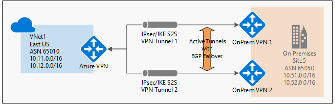
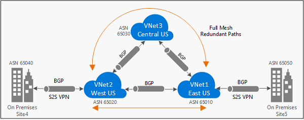

<properties
   pageTitle="Übersicht über BGP mit Azure VPN-Gateways | Microsoft Azure"
   description="Dieser Artikel enthält eine Übersicht über BGP mit Azure VPN-Gateways."
   services="vpn-gateway"
   documentationCenter="na"
   authors="yushwang"
   manager="rossort"
   editor=""
   tags=""/>

<tags
   ms.service="vpn-gateway"
   ms.devlang="na"
   ms.topic="article"
   ms.tgt_pltfrm="na"
   ms.workload="infrastructure-services"
   ms.date="06/16/2016"
   ms.author="yushwang"/>

# Übersicht über BGP mit Azure VPN-Gateways

Dieser Artikel enthält eine Übersicht über BGP (Rahmen Gateway Protocol) Unterstützung in Azure VPN-Gateways.

## Informationen zu BGP

BGP jedoch das standard Protokoll im Internet häufig verwendet werden, um routing und Erreichbarkeit zwischen zwei oder mehr Netzwerken austauschen. Bei Verwendung in Kontext virtuelle Netzwerke Azure ermöglicht BGP Azure VPN-Gateways und beteiligten Personen Ihren lokalen VPN-Geräten, BGP Kollegen oder Nachbarn "leitet" austauschen, die beide Gateways auf die Verfügbarkeit und Erreichbarkeit für diese Präfixe durchlaufen die Gateways oder Router informieren werden aufgerufen. BGP kann die Übertragung routing zwischen mehreren Netzwerken auf, indem Sie verbreitet weitergeleitet, die ein Gateway BGP aus einem BGP Peer auf alle anderen BGP Kollegen lernfähig auch aktivieren.
 
### Gründe für die Verwendung von BGP

BGP ist ein optionales Feature, mit Azure Routing-basierten VPN-Gateways verwendet werden können. Sie sollten auch sicherstellen, dass es sich bei Ihren lokalen VPN-Geräten BGP unterstützen, bevor Sie das Feature aktivieren. Sie können weiterhin Azure VPN-Gateways und Ihren lokalen VPN-Geräten ohne BGP verwenden. Es ist vergleichbar mit statischen leitet (ohne BGP) *im Vergleich zu* verwenden, dynamisches routing mit BGP zwischen Ihren Netzwerken und Azure verwenden.

Es gibt mehrere vor- und neue Funktionen mit BGP aus:

#### Automatische und flexible Präfix Updates unterstützt

Mit BGP müssen Sie nur eine minimale Präfix für einen bestimmten BGP Peer über den Tunnel IPsec S2S VPN deklarieren. Kann ein Präfix Host möglichst klein sein (/ 32) der BGP Peer-IP-Adresse von Ihrem lokalen VPN-Gerät. Sie können steuern, welche Netzwerkpräfixe lokalen gewünschten Ankündigung an Azure an, damit Ihre Azure virtuelles Netzwerk für den Zugriff auf.
    
Sie können auch eine größere Präfixe ankündigen, die Teil Ihrer VNet Adresspräfixe, beispielsweise ein großer private IP-Adresse Leerzeichen (z. B. 10.0.0.0/8) enthalten können. Bitte beachten Sie, obwohl die Präfixe identisch mit einer der Ihrer VNet Präfixe werden können. Diese leitet identisch mit Ihrer VNet Präfixe werden abgelehnt.

>[AZURE.IMPORTANT] Aktuell, wird der Standard-Routing (0.0.0.0/0) zu Azure VPN-Gateways Werbung blockiert. Weitere Aktualisierungen werden bereitgestellt werden, sobald diese Funktion aktiviert ist.

#### Unterstützung für mehrere Tunnel zwischen einem VNet und einer lokalen Website mit automatischen Failover basierend auf BGP

Sie können mehrere Verbindungen zwischen Ihrem Azure VNet und Ihren lokalen VPN-Geräten an derselben Stelle herstellen. Diese Funktion bietet mehrere Tunnel (Pfade) zwischen den beiden Netzwerken in eine aktive Konfiguration. Wenn eine der die Tunnel getrennt ist, werden die entsprechenden Arbeitspläne über BGP widerrufen, und der Datenverkehr wird automatisch die verbleibende Tunnel verschoben.
    
Das folgende Diagramm zeigt ein einfaches Beispiel für diese hoher Verfügbarkeit einrichten:
    

#### Unterstützen Sie während der Übertragung zwischen Ihrem lokalen Netzwerken und mehrere Azure VNets routing

BGP ermöglicht mehreren Gateways Weitere und Präfixe aus verschiedenen Netzwerken auf Objektebene überschrieben werden, ob sie direkt oder indirekt verbunden sind. Dies kann die Übertragung routing mit Azure VPN Gateways zwischen Ihrem lokalen Websites oder in mehreren Azure-virtuellen Netzwerken aktivieren.
    
Die folgende Abbildung zeigt ein Beispiel für ein Suchtopologie mit mehreren Abschnitte mit mehreren Pfaden, die Datenverkehr zwischen den beiden lokalen Netzwerken über Azure VPN Gateways innerhalb der Networks anzuwenden, können:

## BGP häufig gestellte Fragen

[AZURE.INCLUDE [vpn-gateway-bgp-faq-include](../../includes/vpn-gateway-bpg-faq-include.md)] 

## Nächste Schritte

Finden Sie unter [Erste Schritte mit BGP auf Azure VPN-Gateways](./vpn-gateway-bgp-resource-manager-ps.md) , für die Schritte zum Konfigurieren von BGP für Ihre Cross lokale und VNet-VNet-Verbindungen.

