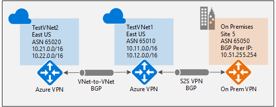
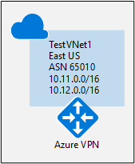
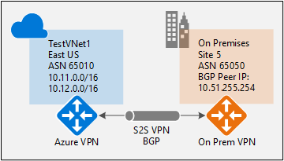
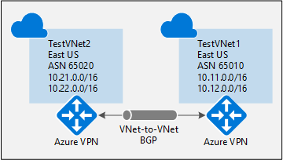

<properties
   pageTitle="Konfigurieren von BGP auf Azure VPN-Gateways mit Azure Ressourcenmanager und PowerShell | Microsoft Azure"
   description="In diesem Artikel Schritte zum Konfigurieren von BGP mit Azure VPN-Gateways Azure Ressourcenmanager und PowerShell verwenden."
   services="vpn-gateway"
   documentationCenter="na"
   authors="yushwang"
   manager="rossort"
   editor=""
   tags="azure-resource-manager"/>

<tags
   ms.service="vpn-gateway"
   ms.devlang="na"
   ms.topic="article"
   ms.tgt_pltfrm="na"
   ms.workload="infrastructure-services"
   ms.date="04/15/2016"
   ms.author="yushwang"/>

# Konfigurieren von BGP auf Azure VPN-Gateways mit Azure Ressourcenmanager und PowerShell

In diesem Artikel führt Sie durch die Schritte zum BGP Cross lokalen Standort-zu-Standort (S2S) VPN-Verbindung und eine VNet-VNet-Verbindung mit dem Modell zur Bereitstellung von Ressourcenmanager und PowerShell aktivieren.

**Informationen zu Datenmodellen Azure-Bereitstellung**

[AZURE.INCLUDE [vpn-gateway-clasic-rm](../../includes/vpn-gateway-classic-rm-include.md)] 

## Informationen zu BGP

BGP jedoch das standard Protokoll im Internet häufig verwendet werden, um routing und Erreichbarkeit zwischen zwei oder mehr Netzwerken austauschen. BGP ermöglicht die Azure VPN-Gateways und Ihren lokalen VPN-Geräten, BGP Kollegen oder Nachbarn "leitet" austauschen, die beide Gateways auf die Verfügbarkeit und Erreichbarkeit für diese Präfixe durchlaufen die Gateways oder Router verbindet informieren werden aufgerufen. BGP kann die Übertragung routing zwischen mehreren Netzwerken auf, indem Sie verbreitet weitergeleitet, die ein Gateway BGP aus einem BGP Peer auf alle anderen BGP Kollegen lernfähig auch aktivieren.

[Übersicht der BGP mit Azure VPN-Gateways](./vpn-gateway-bgp-overview.md) finden Sie weitere Diskussion auf Vorteile von BGP und an den technischen Vorschriften und Aspekte der Verwendung von BGP vertraut sein.

## Erste Schritte mit BGP auf Azure VPN-gateways

In diesem Artikel führt Sie durch die Schritte zum folgende Aufgaben ausführen:

- [Teil 1: Aktivieren BGP auf Ihre Azure VPN gateway](#enablebgp)

- [Teil 2: Stellen Sie eine Cross eine lokale Verbindung mit BGP](#crossprembgp)

- [Teil 3: Stellen Sie eine Verbindung VNet-zu-VNet mit BGP](#v2vbgp)

Jeder Teil der Anweisungen bildet einen grundlegenden Baustein für die Aktivierung BGP in Ihrem Netzwerk verbunden. Wenn Sie alle drei Teile abgeschlossen haben, wird der Suchtopologie erstellen, wie in der folgenden Abbildung dargestellt:

Sie können diese zusammen, um eine komplexere, mit mehreren hoffen, eisenbahnschienen Netzwerk, die Ihren Anforderungen entsprechen aufbauen kombinieren.

## Teil 1: Konfigurieren von BGP auf dem Gateway Azure VPN

Die folgenden Konfigurationsschritte werden die BGP Parameter des Gateways Azure VPN-setup-wie in der folgenden Abbildung dargestellt:

### Vorbemerkung

- Stellen Sie sicher, dass Sie ein Azure-Abonnement verfügen. Wenn Sie bereits über ein Azure-Abonnement besitzen, können Sie Ihre [MSDN-Vorteile für Abonnenten](https://azure.microsoft.com/pricing/member-offers/msdn-benefits-details/) oder melden Sie sich für ein [kostenloses Konto](https://azure.microsoft.com/pricing/free-trial/)von aktivieren.
    
- Sie müssen die Azure Ressourcenmanager PowerShell-Cmdlets installieren. Weitere Informationen zum Installieren der PowerShell-Cmdlets finden Sie unter [Informationen zum Installieren und konfigurieren Azure PowerShell](../powershell-install-configure.md) .

### Schritt 1: Erstellen und Konfigurieren von VNet1 

#### 1. Deklarieren der Variablen

In dieser Übung zunächst wir unsere Variablen zu deklarieren. Im folgenden Beispiel wird die mit den Werten für diese Übung Variablen deklariert. Achten Sie darauf, dass Sie die Werte durch ein eigenes ersetzen, beim für Herstellung konfigurieren. Sie können diese Variablen verwenden, wenn Sie die Schritte zum mit dieser Art von Konfiguration vertraut ausgeführt werden. Ändern der Variablen und klicken Sie dann auf Kopieren und Einfügen in der PowerShell-Konsole.

    $Sub1          = "Replace_With_Your_Subcription_Name"
    $RG1           = "TestBGPRG1"
    $Location1     = "East US"
    $VNetName1     = "TestVNet1"
    $FESubName1    = "FrontEnd"
    $BESubName1    = "Backend"
    $GWSubName1    = "GatewaySubnet"
    $VNetPrefix11  = "10.11.0.0/16"
    $VNetPrefix12  = "10.12.0.0/16"
    $FESubPrefix1  = "10.11.0.0/24"
    $BESubPrefix1  = "10.12.0.0/24"
    $GWSubPrefix1  = "10.12.255.0/27"
    $VNet1ASN      = 65010
    $DNS1          = "8.8.8.8"
    $GWName1       = "VNet1GW"
    $GWIPName1     = "VNet1GWIP"
    $GWIPconfName1 = "gwipconf1"
    $Connection12  = "VNet1toVNet2"
    $Connection15  = "VNet1toSite5"

#### 2. Herstellen einer Verbindung mit Ihrem Abonnement und Erstellen einer neuen Ressourcengruppe

Stellen Sie sicher, dass Sie in PowerShell-Modus, um die Ressourcenmanager Cmdlets verwenden, wechseln. Weitere Informationen finden Sie unter [Verwenden von Windows PowerShell mit Ressourcenmanager](../powershell-azure-resource-manager.md).

Öffnen Sie in der PowerShell-Konsole und eine Verbindung mit Ihrem Konto herstellen. Verwenden Sie im folgende Beispiel, damit Sie eine Verbindung herstellen können:

    Login-AzureRmAccount
    Select-AzureRmSubscription -SubscriptionName $Sub1
    New-AzureRmResourceGroup -Name $RG1 -Location $Location1

#### 3. TestVNet1 erstellen

Im folgenden Beispiel wird ein virtuelles Netzwerk mit dem Namen TestVNet1 und drei Subnetze, eine sogenannte GatewaySubnet, eine sogenannte Front-End und eine sogenannte Back-End-erstellt. Werte ersetzen, es ist wichtig, dass Sie Ihrem Subnetz gehören, Gateway immer benennen speziell GatewaySubnet. Wenn Sie einen anderen Namen, tritt der Erstellung des Gateways. 

    $fesub1 = New-AzureRmVirtualNetworkSubnetConfig -Name $FESubName1 -AddressPrefix $FESubPrefix1
    $besub1 = New-AzureRmVirtualNetworkSubnetConfig -Name $BESubName1 -AddressPrefix $BESubPrefix1
    $gwsub1 = New-AzureRmVirtualNetworkSubnetConfig -Name $GWSubName1 -AddressPrefix $GWSubPrefix1

    New-AzureRmVirtualNetwork -Name $VNetName1 -ResourceGroupName $RG1 -Location $Location1 -AddressPrefix $VNetPrefix11,$VNetPrefix12 -Subnet $fesub1,$besub1,$gwsub1

### Schritt 2 – Erstellen von VPN-Gateway für TestVNet1 mit BGP Parameter

#### 1. erstellen Sie 1. die IP-Adresse und Subnetz Konfigurationen

Fordern Sie eine öffentliche IP-Adresse für das Gateway bereitzustellenden, den Sie für Ihre VNet erstellen. Sie können auch das Subnetz und die IP-Konfigurationen erforderlich definieren. 

    $gwpip1    = New-AzureRmPublicIpAddress -Name $GWIPName1 -ResourceGroupName $RG1 -Location $Location1 -AllocationMethod Dynamic
    
    $vnet1     = Get-AzureRmVirtualNetwork -Name $VNetName1 -ResourceGroupName $RG1
    $subnet1   = Get-AzureRmVirtualNetworkSubnetConfig -Name "GatewaySubnet" -VirtualNetwork $vnet1
    $gwipconf1 = New-AzureRmVirtualNetworkGatewayIpConfig -Name $GWIPconfName1 -Subnet $subnet1 -PublicIpAddress $gwpip1

#### 2. erstellen Sie VPN-Gateway mit der Anzahl AS

Erstellen von virtuellen Netzwerkgateways für TestVNet1. Beachten Sie, dass BGP ein Gateway Routing-basierten VPN, und die Erweiterung-Parameter - Asn, das ASN (AS-Nummer) für TestVNet1 festlegen erfordert. Erstellen eines Gateways kann eine Weile dauern (30 Minuten oder mehr durchführen).

    New-AzureRmVirtualNetworkGateway -Name $GWName1 -ResourceGroupName $RG1 -Location $Location1 -IpConfigurations $gwipconf1 -GatewayType Vpn -VpnType RouteBased -GatewaySku HighPerformance -Asn $VNet1ASN

#### 3. die Azure BGP Peer-IP-Adresse zu erhalten

Nachdem das Gateway erstellt wurde, müssen Sie die BGP Peer-IP-Adresse auf dem Azure VPN Gateway zu erhalten. Diese Adresse ist so konfigurieren Sie die Azure VPN-Gateway als BGP Peer für Ihren lokalen VPN-Geräten erforderlich.

    $vnet1gw = Get-AzureRmVirtualNetworkGateway -Name $GWName1 -ResourceGroupName $RG1
    $vnet1gw.BgpSettingsText

Des letzten Befehls zeigt die entsprechenden BGP Konfigurationen auf dem Azure VPN Gateway; Beispiel:

    $vnet1gw.BgpSettingsText
    {
        "Asn": 65010,
        "BgpPeeringAddress": "10.12.255.30",
        "PeerWeight": 0
    }

Nachdem das Gateway erstellt wurde, können Sie dieses Gateway, Cross lokale oder VNet-VNet-Verbindung mit BGP herstellen. In den folgenden Abschnitten werden die Schritte zum Abschließen der Übung durchzuführen.

## Teil 2: Stellen Sie eine Cross eine lokale Verbindung mit BGP

Um eine Verbindung mit der Cross lokale, müssen Sie ein lokales Netzwerk-Gateway zur Darstellung von Ihrem lokalen VPN-Geräts und eine Verbindung mit dem Gateway lokales Netzwerk das Gateway Azure VPN Verbindung erstellen. Der Unterschied zwischen den Anweisungen in diesem Artikel wird die zusätzlichen Eigenschaften erforderlich, um die BGP Konfigurationsparameter anzugeben.

Stellen Sie bevor Sie fortfahren sicher, dass Sie [Teil 1](#enablebgp) dieser Übung abgeschlossen haben.

### Schritt 1: Erstellen und Konfigurieren des Gateways lokales Netzwerk

#### 1. Deklarieren der Variablen

In dieser Übung weiterhin im Diagramm dargestellten Konfiguration erstellen. Achten Sie darauf, dass Sie die Werte durch die ersetzen, die Sie für Ihre Konfiguration verwenden möchten.

    $RG5           = "TestBGPRG5"
    $Location5     = "East US 2"
    $LNGName5      = "Site5"
    $LNGPrefix50   = "10.52.255.254/32"
    $LNGIP5        = "Your_VPN_Device_IP"
    $LNGASN5       = 65050
    $BGPPeerIP5    = "10.52.255.254"

Ein paar Punkte, die Sie hinsichtlich der lokalen Netzwerk Gateway-Parameter zu beachten:

- Das Gateway lokales Netzwerk kann in der gleichen oder einem anderen Speicherort und Ressourcengruppe als VPN-Gateway sein. Dieses Beispiel zeigt ihnen in anderen Ressourcengruppen an unterschiedlichen Standorten.

- Das minimale Präfix, die, das Sie für das Gateway lokales Netzwerk deklarieren müssen, handelt es sich um die Adresse Hosts Ihrer BGP Peer-IP-Adresse auf Ihrem Gerät VPN. In diesem Fall ist es eine /32 Präfix "10.52.255.254/32".

- Als Erinnerung müssen Sie verschiedene BGP ASNs zwischen Ihrem lokalen Netzwerken und Azure VNet verwenden. Wenn sie gleich sind, müssen Sie Ihre VNet ASN zu ändern, wenn der lokale VPN mithilfe Ihres Geräts bereits das ASN mit anderen BGP Nachbarn peer.
    
Bevor Sie fortfahren, stellen Sie sicher, dass Sie weiterhin Abonnement 1 verbunden sind.

#### 2. Erstellen des Gateways lokales Netzwerk für Site5

Achten Sie darauf, dass die Ressourcengruppe erstellen, wenn sie vor dem Erstellen des Gateways lokales Netzwerk nicht erstellt wurde, werden. Beachten Sie die zwei zusätzliche Parameter für das Gateway lokales Netzwerk: VLB und BgpPeerAddress.

    New-AzureRmResourceGroup -Name $RG5 -Location $Location5

    New-AzureRmLocalNetworkGateway -Name $LNGName5 -ResourceGroupName $RG5 -Location $Location5 -GatewayIpAddress $LNGIP5 -AddressPrefix $LNGPrefix50 -Asn $LNGASN5 -BgpPeeringAddress $BGPPeerIP5

### Schritt 2 – schließen Sie die VNet Gateway und lokale Netzwerk-gateway

#### 1 holen Sie 1 sich die zwei gateways

        $vnet1gw = Get-AzureRmVirtualNetworkGateway -Name $GWName1  -ResourceGroupName $RG1
        $lng5gw  = Get-AzureRmLocalNetworkGateway -Name $LNGName5 -ResourceGroupName $RG5

#### 2. erstellen Sie die TestVNet1 auf Site5-Verbindung

In diesem Schritt erstellen Sie die Verbindung aus TestVNet1 zu Site5. Geben Sie "-EnableBGP $True" BGP für diese Verbindung zu aktivieren. Wie bereits zuvor erwähnt, ist es möglich, die sowohl BGP und nicht BGP Verbindungen für das gleiche Azure VPN Gateway haben. Es sei denn, in der Verbindungseigenschaft BGP aktiviert ist, wird Azure nicht BGP für diese Verbindung aktivieren, obwohl BGP-Parameter auf beide Gateways bereits konfiguriert sind.

    New-AzureRmVirtualNetworkGatewayConnection -Name $Connection15 -ResourceGroupName $RG1 -VirtualNetworkGateway1 $vnet1gw -LocalNetworkGateway2 $lng5gw -Location $Location1 -ConnectionType IPsec -SharedKey 'AzureA1b2C3' -EnableBGP $True

Im folgenden Beispiel werden die Parameter, die Sie in Abschnitt Konfiguration BGP auf Ihrem lokalen VPN-Gerät für diese Übung eingeben werden aufgeführt:

    - Site5 ASN: 65050
    - Site5 BGP IP-: 10.52.255.254
    - Präfixe, vorstellen: (zum Beispiel) 10.51.0.0/16 und 10.52.0.0/16
    - Azure VNet ASN: 65010
    - Azure VNet BGP IP-: 10.12.255.30
    - Statische Routing: Hinzufügen einer Routing für 10.12.255.30/32, mit Nexthop wird VPN-Tunnelschnittstelle auf Ihrem Gerät
    - eBGP Multihop: Vergewissern Sie sich die Option "Multihop" für eBGP auf Ihrem Gerät aktiviert ist, falls erforderlich

Die Verbindung hergestellt werden soll, nach ein paar Minuten, und die Peeringliste BGP-Sitzung wird gestartet, sobald die IPSec-Verbindung eingerichtet wird.
 
## Teil 3: Stellen Sie eine Verbindung VNet-zu-VNet mit BGP

In diesem Abschnitt fügt eine VNet-VNet-Verbindung mit BGP, wie in der folgenden Abbildung gezeigt. 

Die folgenden Anweisungen fortsetzen aus den vorherigen Schritten aufgeführten. Sie müssen [Teil I](#enablebgp) zum Erstellen und Konfigurieren von TestVNet1 und VPN-Gateway mit BGP abschließen. 

### Schritt 1 – Erstellen von TestVNet2 und VPN-gateway

Es ist wichtig, um sicherzustellen, dass die IP-Adresse das neue virtuelle Netzwerk TestVNet2, Speicherplatz für alle Ihre VNet Bereiche nicht überlappt.

In diesem Beispiel wird die virtuellen Netzwerke zu einziges Abonnement gehören. Sie können VNet-VNet-Verbindungen zwischen verschiedenen Abonnements setup; Näheres [Konfigurieren einer VNet-VNet - Verbindung](./vpn-gateway-vnet-vnet-rm-ps.md) , um weitere Details zu erfahren. Stellen Sie sicher, dass Sie Hinzufügen der "-EnableBgp $True" beim Erstellen der Verbindungen zum BGP aktivieren.

#### 1. Deklarieren der Variablen

Achten Sie darauf, dass Sie die Werte durch die ersetzen, die Sie für Ihre Konfiguration verwenden möchten.

    $RG2           = "TestBGPRG2"
    $Location2     = "West US"
    $VNetName2     = "TestVNet2"
    $FESubName2    = "FrontEnd"
    $BESubName2    = "Backend"
    $GWSubName2    = "GatewaySubnet"
    $VNetPrefix21  = "10.21.0.0/16"
    $VNetPrefix22  = "10.22.0.0/16"
    $FESubPrefix2  = "10.21.0.0/24"
    $BESubPrefix2  = "10.22.0.0/24"
    $GWSubPrefix2  = "10.22.255.0/27"
    $VNet2ASN      = 65020
    $DNS2          = "8.8.8.8"
    $GWName2       = "VNet2GW"
    $GWIPName2     = "VNet2GWIP"
    $GWIPconfName2 = "gwipconf2"
    $Connection21  = "VNet2toVNet1"
    $Connection12  = "VNet1toVNet2"

#### 2. erstellen Sie TestVNet2 in die neue Ressourcengruppe

    New-AzureRmResourceGroup -Name $RG2 -Location $Location2
    
    $fesub2 = New-AzureRmVirtualNetworkSubnetConfig -Name $FESubName2 -AddressPrefix $FESubPrefix2
    $besub2 = New-AzureRmVirtualNetworkSubnetConfig -Name $BESubName2 -AddressPrefix $BESubPrefix2
    $gwsub2 = New-AzureRmVirtualNetworkSubnetConfig -Name $GWSubName2 -AddressPrefix $GWSubPrefix2

    New-AzureRmVirtualNetwork -Name $VNetName2 -ResourceGroupName $RG2 -Location $Location2 -AddressPrefix $VNetPrefix21,$VNetPrefix22 -Subnet $fesub2,$besub2,$gwsub2

#### 3. erstellen Sie das Option VPN Gateway für TestVNet2 mit BGP Parametern

Fordern Sie eine öffentliche IP-Adresse für das Gateway bereitzustellenden, den Sie für Ihre VNet erstellen. Sie können auch das Subnetz und die IP-Konfigurationen erforderlich definieren. 

    $gwpip2    = New-AzureRmPublicIpAddress -Name $GWIPName2 -ResourceGroupName $RG2 -Location $Location2 -AllocationMethod Dynamic

    $vnet2     = Get-AzureRmVirtualNetwork -Name $VNetName2 -ResourceGroupName $RG2
    $subnet2   = Get-AzureRmVirtualNetworkSubnetConfig -Name "GatewaySubnet" -VirtualNetwork $vnet2
    $gwipconf2 = New-AzureRmVirtualNetworkGatewayIpConfig -Name $GWIPconfName2 -Subnet $subnet2 -PublicIpAddress $gwpip2

Erstellen Sie mit der Zufallszahl AS VPN-Gateway ein. Beachten Sie, dass die Standardeinstellung ASN auf Ihren Azure VPN Gateways überschrieben werden müssen. Die ASNs für die verbundenen VNets müssen BGP und Übertragung routing aktivieren unterschiedlich sein.

    New-AzureRmVirtualNetworkGateway -Name $GWName2 -ResourceGroupName $RG2 -Location $Location2 -IpConfigurations $gwipconf2 -GatewayType Vpn -VpnType RouteBased -GatewaySku Standard -Asn $VNet2ASN

### Schritt 2: Verbinden der Gateways TestVNet1 und TestVNet2

In diesem Beispiel werden beide Gateways im selben Abonnement aus. Sie können diesen Schritt abgeschlossen haben, in der gleichen PowerShell-Sitzung.

#### 1. erste beide gateways

Vergewissern Sie sich anmelden und beim Herstellen einer Verbindung Abonnement 1 mit.

    $vnet1gw = Get-AzureRmVirtualNetworkGateway -Name $GWName1 -ResourceGroupName $RG1
    $vnet2gw = Get-AzureRmVirtualNetworkGateway -Name $GWName2 -ResourceGroupName $RG2
    
#### 2. erstellen Sie beide Verbindungen

In diesem Schritt können Sie die Verbindung zwischen TestVNet1 und TestVNet2 und die Verbindung TestVNet2 zu TestVNet1 erstellen.

    New-AzureRmVirtualNetworkGatewayConnection -Name $Connection12 -ResourceGroupName $RG1 -VirtualNetworkGateway1 $vnet1gw -VirtualNetworkGateway2 $vnet2gw -Location $Location1 -ConnectionType Vnet2Vnet -SharedKey 'AzureA1b2C3' -EnableBgp $True

    New-AzureRmVirtualNetworkGatewayConnection -Name $Connection21 -ResourceGroupName $RG2 -VirtualNetworkGateway1 $vnet2gw -VirtualNetworkGateway2 $vnet1gw -Location $Location2 -ConnectionType Vnet2Vnet -SharedKey 'AzureA1b2C3' -EnableBgp $True

>[AZURE.IMPORTANT] Achten Sie darauf, dass BGP für beide Verbindungen zu aktivieren.

Nachdem Sie diese Schritte ausgeführt haben, Herstellen der Verbindung wird werden ein paar Minuten, und die BGP Peeringliste Sitzung werden einmal ist die VNet-VNet-Verbindung abgeschlossen.

Wenn Sie alle drei Teile dieser Übung abgeschlossen haben, haben Sie werden ein Suchtopologie Netzwerk hergestellt, wie unten dargestellt:

## Nächste Schritte

Nachdem die Verbindung abgeschlossen ist, können Sie Ihre virtuelle Netzwerke virtuellen Computern hinzufügen. Schritte finden Sie unter [Erstellen eines virtuellen Computers](../virtual-machines/virtual-machines-windows-hero-tutorial.md) .

