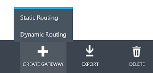
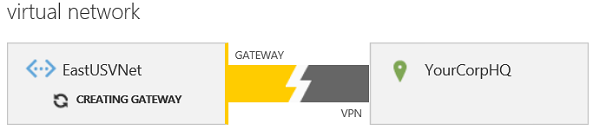

<properties 
   pageTitle="Konfigurieren ein VPN-Gateways im klassischen Azure-Portal | Microsoft Azure"
   description="In diesem Artikel führt Sie durch die Konfiguration des virtuellen Netzwerks VPN-Gateway und einen Gateway VPN-routing Typ ändern."
   services="vpn-gateway"
   documentationCenter="na"
   authors="cherylmc"
   manager="carmonm"
   editor=""
   tags="azure-service-management"/>

<tags 
   ms.service="vpn-gateway"
   ms.devlang="na"
   ms.topic="article"
   ms.tgt_pltfrm="na"
   ms.workload="infrastructure-services"
   ms.date="08/11/2016"
   ms.author="cherylmc" />

# Konfigurieren eines Gateways VPN für das Bereitstellungsmodell klassischen

Wenn Sie eine sichere Cross lokale Verbindung zwischen Azure und Ihren lokalen Standort erstellen möchten, müssen Sie eine VPN-Gateway-Verbindung zu konfigurieren. Im Bereitstellungsmodell klassischen ein Gateways kann eine von zwei VPN-routing Typen: statisch oder dynamisch. Der Typ, die, den Sie auswählen, hängt davon ab, Ihres Entwurfs Netzwerk, und das lokale VPN-Gerät, das Sie verwenden möchten. 

Einige Optionen für die Netzwerkkonnektivität, beispielsweise eine Punkt-zu-Standort-Verbindung erfordern beispielsweise dynamischen routing-Gateway. Wenn Sie Ihr Gateway zur Unterstützung von sowohl Verbindungen Punkt-zu-Standort (P2S) und eine Website-zu-Standort-Verbindung (S2S) konfigurieren möchten, müssen Sie dynamischen routing-Gateway konfigurieren, obwohl zwischen Standorten mit entweder Gateway VPN-routing Typ konfiguriert werden kann. 

Darüber hinaus müssen sicherstellen, dass das Gerät, das Sie für die Verbindung verwenden möchten, den Weiterleitung VPN-Typ unterstützt, den Sie erstellen möchten. Finden Sie unter [VPN-Geräte](vpn-gateway-about-vpn-devices.md).

**Informationen zu den in diesem Artikel** 

In diesem Artikel geschrieben wurde für das klassische Bereitstellungsmodell Verwenden des [klassischen-Portal](https://manage.windowsazure.com) (nicht im Azure-Portal). 

**Informationen zu Datenmodellen Azure-Bereitstellung**

[AZURE.INCLUDE [vpn-gateway-clasic-rm](../../includes/vpn-gateway-classic-rm-include.md)] 

## Übersicht über die Konfiguration

Die folgenden Schritte aus, die Sie konfigurieren das VPN-Gateway im klassischen Azure-Portal durchgehen. Diese Schritte gelten für Gateways für virtuelle Netzwerke, die mit dem Bereitstellungsmodell klassischen erstellt wurden. Aktuell, sind nicht alle Einstellungen Konfiguration für Gateways Azure-Portal zur Verfügung. Wenn sie sind, erstellen wir einen neuen Satz von Anweisungen, die auf das Portal Azure anwenden.

1. [Erstellen Sie einen VPN-Gateway für Ihre VNet](#create-a-vpn-gateway)

1. [Sammeln von Informationen für die Konfiguration der VPN-Gerät](#gather-information-for-your-vpn-device-configuration)

1. [Konfigurieren Sie das VPN-Gerät](#configure-your-vpn-device)

1. [Überprüfen Sie die Bereiche für lokales Netzwerk und VPN-Gateway IP-Adresse](#verify-your-local-network-ranges-and-vpn-gateway-ip-address)

### Vorbemerkung

Bevor Sie Ihr Gateway konfigurieren, müssen Sie zuerst Ihre virtuelle Netzwerk erstellen. Schritte zum Erstellen eines virtuellen Netzwerks für Cross lokale Konnektivität finden Sie unter [Konfigurieren eines virtuellen Netzwerks mit einer VPN-Verbindung zwischen Standorten](vpn-gateway-site-to-site-create.md)oder [Konfigurieren eines virtuellen Netzwerks mit einer Punkt-zu-Standort VPN-Verbindung](vpn-gateway-point-to-site-create.md). Gehen Sie folgendermaßen vor, klicken Sie dann zum Konfigurieren des Gateways VPN und Sammeln der Informationen müssen Sie Ihr Gerät VPN konfigurieren. 

Wenn Sie bereits über ein VPN-Gateway verfügen und den Weiterleitung VPN-Typ ändern möchten, finden Sie unter [So ändern Sie den Typ der VPN-Weiterleitung für Ihr Gateway](#how-to-change-the-vpn-routing-type-for-your-gateway).

## Erstellen Sie einen VPN-gateway

1. Im [Azure klassischen Portal](https://manage.windowsazure.com)auf der Seite **Netzwerke** stellen Sie sicher, dass die Statusspalte für Ihre virtuelle Netzwerk **erstellt**wird.

1. Klicken Sie in der Spalte **Name** auf den Namen des virtuellen Netzwerks.

1. Klicken Sie auf der Seite **Dashboard** Beachten Sie, dass diese VNet ein Gateways konfiguriert noch nicht aus. Dieser Status sehen Sie, wie Sie durch die Schritte zum Konfigurieren Ihrer Gateways wechseln.

Klicken Sie als Nächstes am unteren Rand der Seite, auf **Gateway zu erstellen**. Sie können entweder *Statische* oder *Dynamisches Routing*auswählen. Der Typ des routing VPN, die, den Sie auswählen, hängt von einige Faktoren ab. Angenommen, was auf Ihrem Gerät VPN unterstützt, und gibt an, ob die benötigten Punkt-zu-Standort-Verbindung zu unterstützen. Aktivieren Sie [Zum VPN-Geräten für virtuelle Netzwerkkonnektivität](vpn-gateway-about-vpn-devices.md) , um die Weiterleitung VPN-Typ überprüfen, den Sie benötigen. Nachdem das Gateway erstellt wurde, können Sie zwischen Gateway VPN-routing Typen ohne zu löschen und neu erstellen des Gateways nicht ändern. Wenn das System Sie zum Bestätigen fordert, dass Sie das Gateway erstellt haben, klicken Sie auf **Ja**.

Beachten Sie beim Erstellen Ihrer Gateways ist die Gateway-Grafik auf der Seite ändert sich in Gelb und besagt *Gateway erstellen*. Es dauert bis zu 45 Minuten für das Gateway zu erstellen. Warten Sie, bis das Gateway abgeschlossen ist, bevor Sie mit anderen Einstellungen Konfiguration nach vorne verschieben können.

Wenn das Gateway zum *Herstellen einer Verbindung*ändert, können Sie die Informationen sammeln, die Sie für Ihr Gerät VPN müssen.

## Sammeln von Informationen für die Konfiguration der VPN-Gerät

Nachdem das Gateway erstellt wurde, Sammeln von Informationen für die Konfiguration der VPN-Gerät. Diese Informationen befindet sich auf der Seite " **Dashboard** " für Ihre virtuelle Netzwerk:

1. **Gateway IP-Adresse:** Die IP-Adresse finden Sie auf der Seite " **Dashboard** ". Nicht möglich sie bis zu sehen, nachdem Ihr Gateway erstellen abgeschlossen ist.

1. **Freigegebene Schlüssel-** Klicken Sie auf **Verwalten Taste** am unteren Rand des Bildschirms. Klicken Sie auf das Symbol neben der-Taste, um in der Zwischenablage, kopieren und einfügen, und speichern Sie den Schlüssel. Diese Schaltfläche funktioniert nur, wenn ein einzelner S2S VPN-Tunnel vorhanden ist. Wenn Sie mehrere S2S VPN-Tunnel verfügen, verwenden Sie die *Erste virtuelle Netzwerk Gateway freigegeben Taste* API oder PowerShell-Cmdlet.

## Konfigurieren Sie das VPN-Gerät

Nachdem Sie die vorherigen Schritte durchführen, müssen Sie oder Ihr Netzwerkadministrator VPN-Gerät zu konfigurieren, um die Verbindung zu erstellen. Weitere Informationen zu VPN-Geräten finden Sie unter [Informationen zu VPN-Geräten für virtuelle Netzwerkkonnektivität](vpn-gateway-about-vpn-devices.md) .

Nachdem das Gerät VPN konfiguriert wurde, können Sie Ihre aktualisierten Verbindungsinformationen für Ihre VNet auf der Seite Dashboard anzeigen.

Sie können auch eine der folgenden Befehle, um die Verbindung testen ausführen:

|                      | Cisco ASA             | Cisco ISR/ASR         | Juniper SSG/ISG | Juniper SRX/J                            |
|----------------------|-----------------------|-----------------------|-----------------|------------------------------------------|
| **Aktivieren Sie im Haupt-SAs**  | Anzeigen von Verschlüsselung Isakmp sa | Anzeigen von Verschlüsselung Isakmp sa | Ike Cookie abrufen  | Anzeigen der Sicherheit Ike Sicherheit-Zuordnung   |
| **Aktivieren Sie im Schnellmodus SAs** | Anzeigen von Verschlüsselung Ipsec sa  | Anzeigen von Verschlüsselung Ipsec sa  | Abrufen von sa          | Anzeigen der Sicherheit IPSec-Sicherheit-Zuordnung |

## Überprüfen Sie die Bereiche für lokales Netzwerk und VPN-Gateway IP-Adresse

### Überprüfen Sie Ihre VPN-Gateway IP-Adresse

Für Gateway die Verbindung herstellen muss die IP-Adresse für Ihr Gerät VPN ordnungsgemäß für lokales Netzwerk konfiguriert sein, die Sie für Ihre Cross lokale Konfiguration angegeben haben. Normalerweise ist dies während des Konfigurationsprozesses Standorten konfiguriert. Wenn Sie diese lokale Netzwerk zuvor mit einem anderen Gerät verwendet, oder die IP-Adresse für diese lokales Netzwerk geändert wurde, bearbeiten Sie jedoch die Einstellungen, um die richtige Gateway-IP-Adresse angeben.

1. Wenn Ihre IP-Adresse des Gateways überprüfen möchten, klicken Sie im linken Bereich des Portals auf **Netzwerke** , und wählen Sie **Lokale Netzwerke** am oberen Rand der Seite. Die Option VPN Gateway-Adresse für jeden lokales Netzwerk wird angezeigt, die Sie erstellt haben. Um die IP-Adresse zu bearbeiten, wählen Sie die VNet aus, und klicken Sie auf **Bearbeiten** am unteren Rand der Seite.

1. Klicken Sie auf der Seite **Geben Sie die Details Ihrer lokalen Netzwerk** bearbeiten Sie die IP-Adresse, und klicken Sie dann auf den nächsten Pfeil am unteren Rand der Seite.

1. Klicken Sie auf der Seite **Geben Sie den Abstand Adresse** auf das Auswahlfeld unten rechts, um die Einstellungen zu speichern.

### Überprüfen Sie die Adressbereiche für Ihre lokale Netzwerke

Für die richtige Datenverkehr über des Gateways auf den lokalen Speicherort müssen Sie überprüfen, dass jeder Bereich der IP-Adresse angegeben ist. Jeder Bereich muss in der Konfiguration Azure **Lokalen Netzwerken** aufgeführt sein. Je nach Netzwerkkonfiguration Ihres Standorts lokalen kann dies einen Vorgang etwas groß sein. Datenverkehr, die für eine IP-Adresse gebunden ist, das innerhalb der aufgeführten Bereiche enthalten ist, wird über das virtuelle Netzwerk VPN Gateway gesendet werden. Die Bereiche, die Sie aufführen keine private Bereiche werden zwar sollten Sie überprüfen, ob die lokalen Konfiguration den eingehenden Datenverkehr empfangen kann.

Zum Hinzufügen oder Bearbeiten der Bereiche für ein lokales Netzwerk, gehen Sie folgendermaßen vor.

1. Um die IP-Adressbereiche für ein lokales Netzwerk zu bearbeiten, klicken Sie im linken Bereich des Portals auf **Netzwerke** aus, und wählen Sie dann die **Lokale Netzwerke** am oberen Rand der Seite. Im Portal ist am einfachsten können Sie die Bereiche anzeigen möchten, die Sie aufgeführt haben, auf der Seite **Bearbeiten** . Zum Anzeigen der Bereiche wählen Sie die VNet aus, und klicken Sie auf am unteren Rand der Seite **Bearbeiten** .

1. Klicken Sie auf der Seite **Geben Sie die Details Ihrer lokalen Netzwerk** ändern Sie nicht. Klicken Sie auf der nächsten Pfeil am unteren Rand der Seite.

1. Klicken Sie auf der Seite **Geben Sie den Abstand Adresse** ändern Sie Ihre Netzwerk Adresse Leerzeichen. Klicken Sie dann auf das Häkchen, um die Konfiguration zu speichern.

## So Gateway Datenverkehr anzeigen

Sie können Ihre Gateway und Gateway den Datenverkehr auf Ihrer Seite Virtuelles Netzwerk **Dashboard** anzeigen.

Klicken Sie auf der Seite " **Dashboard** " können Sie Folgendes anzeigen:

- Der Umfang der Daten, die durch das Gateway sowohl in auch Daten, fließt.

- Die Namen der DNS-Server, die für das virtuelle Netzwerk angegeben sind.

- Die Verbindung zwischen Ihrem Gateway und dem VPN-Gerät.

- Der freigegebene Schlüssel, mit dem die Gateway-Verbindung mit Ihrem Gerät VPN konfigurieren.

## So ändern Sie den Typ der VPN-Weiterleitung für Ihr gateway

Da einige Connectivity Konfigurationen nur für bestimmte Typen von Gateway routing verfügbar sind, kann es passieren, dass Sie das Gateway VPN routing Typs eines vorhandenen VPN Gateways ändern müssen. Sie möchten beispielsweise möglicherweise Punkt-zu-Standort Connectivity eine bereits vorhandene Website-zu-Standort-Verbindung hinzufügen, einen statischen Gateway ist. Punkt-zu-Standort-Verbindungen erfordern einen dynamischen Gateway. Dies bedeutet eine P2S Verbindung konfigurieren, müssen Sie Ihr Gateway VPN-routing Typ von statischen in dynamischen zu ändern.

Wenn Sie einen Gateway VPN-routing Typ ändern müssen, werden Sie das vorhandene Gateway löschen und erstellen Sie dann ein neues Gateway mit den neuen routing ein. Sie müssen nicht das gesamte virtuelle Netzwerk aus, um den Gateway-routing Typ ändern zu löschen.

Vor dem Ändern der Gateways VPN-routing Typ, werden Sie sicher, dass Ihr Gerät VPN den routing unterstützt, die Sie verwenden möchten. Zum Herunterladen neue Weiterleitung Konfiguration Beispiele und Überprüfen der VPN-Gerät finden Sie unter [Informationen zu VPN-Geräten für virtuelle Netzwerkkonnektivität](vpn-gateway-about-vpn-devices.md).

>[AZURE.IMPORTANT] Wenn Sie ein virtuelles Netzwerk VPN-Gateway löschen, wird die mit dem Gateway zugewiesene VIP freigegeben. Wenn Sie das Gateway neu erstellen, wird eine neue VIP zugewiesen.

1. **Löschen Sie das vorhandene VPN-Gateway ein.**

    Auf der Seite **Dashboard** für Ihre virtuelle Netzwerk an das Ende der Seite navigieren Sie, und klicken Sie auf **Gateway löschen**. Warten Sie auf die Benachrichtigung, dass das Gateway gelöscht wurden. Nachdem Sie die Benachrichtigung auf dem Bildschirm, dass Ihr Gateway gelöscht wurde erhalten, können Sie ein neues Gateway erstellen.

1. **Erstellen eines neuen VPN-Gateways.**

    Gehen Sie vor am oberen Rand der Seite, um ein neues Gateway erstellen: [Erstellen eines Gateways VPN](#create-a-vpn-gateway).

## Nächste Schritte

Sie können mit Ihrem Netzwerk virtuelle virtuellen Computern hinzufügen. Informationen Sie [zum Erstellen eines benutzerdefinierten virtuellen Computers](../virtual-machines/virtual-machines-windows-classic-createportal.md).

Wenn Sie eine Punkt-zu-Standort VPN-Verbindung konfigurieren möchten, finden Sie unter [Konfigurieren einer Punkt-zu-Standort VPN-Verbindung](vpn-gateway-point-to-site-create.md).

 
