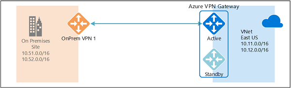
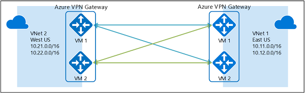

<properties
   pageTitle="Übersicht über hochgradig verfügbare Konfigurationen mit Azure VPN-Gateways | Microsoft Azure"
   description="Dieser Artikel enthält eine Übersicht über hoch verfügbaren Konfigurationsoptionen Azure VPN-Gateways verwenden."
   services="vpn-gateway"
   documentationCenter="na"
   authors="yushwang"
   manager="rossort"
   editor=""
   tags=""/>

<tags
   ms.service="vpn-gateway"
   ms.devlang="na"
   ms.topic="article"
   ms.tgt_pltfrm="na"
   ms.workload="infrastructure-services"
   ms.date="09/24/2016"
   ms.author="yushwang"/>

# Hochgradig verfügbare Cross lokale und VNet-VNet-Konnektivität

Dieser Artikel enthält eine Übersicht über hochgradig verfügbaren Konfigurationsoptionen für Ihre Cross lokale und VNet-VNet-Konnektivität mit Azure VPN-Gateways.

## Informationen zu Azure VPN Gateway Redundanz

Jede Azure VPN Gateway besteht aus zwei Instanzen in eine aktiv-Standby-Konfiguration. Geplanten Wartung oder nicht geplante Unterbrechung, die zur aktiven Instanz geschieht, würde die standby-Instanz (Failover) automatisch übernehmen und Fortsetzen der S2S VPN oder VNet-VNet-Verbindungen. Eine kurze Unterbrechung bewirkt, dass der Schalter über. Für die geplante Wartung sollte die Konnektivität innerhalb von 10 bis 15 Sekunden wiederhergestellt werden. Ungeplanten Probleme wird die Wiederherstellung der Verbindung länger, ungefähr eine Minute um 1 und einen halben weltweit in den ungünstigsten Fall sein. P2S VPN-Client-Verbindungen mit dem Gateway werden die P2S Verbindungen getrennt und die Benutzer müssen die Clientcomputer aus wiederherstellen können.

## Hochgradig verfügbare Cross lokale Konnektivität

Um eine bessere Verfügbarkeit für Ihre Cross lokale Verbindungen zu gewährleisten, stehen zwei Optionen zur Verfügung:

- Mehrere lokale VPN-Geräte
- Aktive Azure VPN gateway
- Kombination beider

### Mehrere lokale VPN-Geräte

Mehrere VPN-Geräten können aus Ihrem lokalen Netzwerk in Verbindung mit Ihrem Gateway Azure VPN wie in der folgenden Abbildung dargestellt:

Diese Konfiguration bietet mehrere aktive Tunnel aus demselben Gateway Azure VPN auf lokale Geräte an derselben Stelle. Es gibt einige Anforderungen und Einschränkungen:

1. Sie müssen mehrere S2S VPN-Verbindungen von Ihren VPN-Geräten zur Azure zu erstellen. Wenn Sie mehrere VPN-Geräten aus einem lokalen Netzwerk mit Azure verbinden, müssen Sie einem lokalen Netzwerkgateway für jedes Gerät VPN, und eine Verbindung von Ihrer Azure VPN Gateway mit dem lokalen Netzwerk-Gateway zu erstellen.

2. Lokales Netzwerkgateways entspricht Ihren VPN-Geräten müssen eindeutige öffentliche IP-Adressen in der Eigenschaft "GatewayIpAddress".

3. BGP ist für diese Konfiguration erforderlich. Jedes lokales Netzwerkgateway ein VPN-Gerät darstellt, müssen eine eindeutige BGP Peer-IP-Adresse in die Eigenschaft "BgpPeerIpAddress" angegeben.

4. Das Feld der Eigenschaft AddressPrefix in jeder lokalen Netzwerkgateway dürfen nicht überlappen. Geben Sie die "BgpPeerIpAddress" in /32 CIDR-Format in das Feld AddressPrefix, beispielsweise 10.200.200.254/32.

5. Sie sollten BGP verwenden, um der Datenverkehr gleichzeitig durch diese Tunnel weitergeleitet, und die gleichen Präfixe des gleichen lokalen Netzwerkpräfixe mit Ihrer Azure VPN Gateway ankündigen.

6. Jede Verbindung wird gegen die maximale Anzahl von Tunnel für Ihr Gateway Azure VPN, 10 für Basic und Standard-SKUs gezählt und 30 für HighPerformance SKU. 

In dieser Konfiguration wird Azure VPN-Gateway noch aktiv-Standby-Modus, damit die gleichen Failoververhalten und kurze Unterbrechung weiterhin wie beschrieben [oben](#activestandby)erfolgen werden. Aber dieses Setup geschützt mit Fehlern oder Interruptions im lokalen Netzwerk und VPN-Geräte.
 
### Aktive Azure VPN gateway

Jetzt können Sie einen Gateway Azure VPN in eine aktive Konfiguration erstellen, in dem beide Instanzen von der Gateway-virtuellen Computern S2S VPN-Tunnel mit Ihrem lokalen VPN-Gerät, wie das folgende Diagramm veranschaulicht einzurichten:

In dieser Konfiguration jede Gatewayinstanz Azure hat eine eindeutige öffentliche IP-Adresse und wird jede einen Tunnel IPSec-/IKE S2S VPN mit Ihrem lokalen VPN-Gerät angegebenen in Ihrem lokalen Netzwerkgateway und die Verbindung hergestellt. Beachten Sie, dass sowohl VPN-Tunnel tatsächlich dieselbe Verbindung gehören. Sie müssen immer noch Konfigurieren von Ihrem lokalen VPN-Gerät zum annehmen oder zwei S2S VPN-Tunnel diese zwei Azure VPN Gateway öffentlicher IP-Adressen einrichten.

Da die Instanzen Azure Gateway aktive Konfiguration haben, wird der Datenverkehr aus dem Azure virtuelle Netzwerk mit Ihrem lokalen Netzwerk über beide Tunnel gleichzeitig weitergeleitet, selbst wenn eine Tunnel zu Ihrem lokalen VPN-Gerät übereinander liegende bevorzugen möglicherweise. Beachten Sie zwar der gleiche TCP oder UDP Fluss den Tunnel oder den Pfad immer durchlaufen, es sei denn, klicken Sie auf eine der Instanzen einer Wartung-Ereignis stattfindet.

Bei einer geplanten Wartung oder einer ungeplanten Ereignis Instanz von einem Gateway geschieht, wird der IPSec-Tunnel aus dieser Instanz mit Ihrem lokalen VPN-Gerät getrennt. Die entsprechenden Arbeitspläne auf Ihren VPN-Geräten sollte zurückgenommen automatisch, damit Sie der Datenverkehr auf der aktiven IPSec-Tunnel gewechselt werden sollen, über oder entfernt werden. Klicken Sie auf der Seite Azure tritt der Wechsel automatisch aus der betroffenen Instanz zur aktiven Instanz.

### Zwei-Redundanz: aktive VPN-Gateways für Azure sowohl die lokale Netzwerke

Die am häufigsten zuverlässige Möglichkeit besteht darin die aktive Gateways sich in Ihrem Netzwerk und die Azure, kombinieren, wie in der folgenden Abbildung gezeigt.

Hier Sie erstellen und Einrichten des Gateways Azure VPN in eine aktive Konfiguration und zwei Gateways für lokales Netzwerk erstellen und zwei Verbindungen für die beiden lokalen VPN-Geräten wie zuvor beschrieben. Das Ergebnis ist eine vollständige Netz Connectivity der 4 IPSec-Tunnel zwischen dem Azure virtuelle Netzwerk und Ihrem lokalen Netzwerk.

Alle Gateways und Tunnel werden von der Seite Azure active, damit der Datenverkehr zwischen allen 4 Tunnel gleichzeitig verteilt werden zwar jede TCP- oder UDP-Verkehr erneut die gleichen Tunnel oder den Pfad zur Azure-Seite folgen wird. Obwohl durch das Verteilen des Datenverkehrs an, Sie etwas besseren Durchsatz über die IPsec Tunnel angezeigt werden können, ist das primäre Ziel dieser Konfiguration für eine hohe Verfügbarkeit. Und aufgrund der statistischen Natur für die Zuweisung, es ist schwierig, die angeben, dass die Maße auf wie anderen Anwendung Datenverkehr Konditionen aggregierten Durchsatz auswirkt.

Diese Suchtopologie benötigen Sie zwei Gateways für lokales Netzwerk und zwei Verbindungen, um die Kombination von lokalen VPN-Geräten unterstützt, und BGP ist erforderlich, um die zwei Verbindungen mit dem gleichen lokalen Netzwerk zulassen. Diese Anforderungen stimmen mit den [oben](#activeactiveonprem). 

## Hochgradig verfügbar VNet-VNet-Konnektivität für Azure VPN-Gateways

Die gleiche aktive Konfiguration kann auch Verbindungen Azure-VNet VNet anwenden. Sie können aktive VPN-Gateways für beide virtuelle Netzwerke erstellen und diese zusammen Herstellen einer Verbindung mit Form der gleichen vollständige Netz Konnektivität von 4 Tunnel zwischen den beiden VNets, wie in der folgenden Abbildung dargestellt:

Dadurch wird sichergestellt, dass es gibt immer ein paar Tunnel zwischen den beiden virtuellen Netzwerken für geplante Wartung Ereignissen, noch bessere Verfügbarkeit bereitstellen. Obwohl die gleichen Suchtopologie für Cross lokale, dass Connectivity zwei Verbindungen erfordert, benötigen den oben gezeigten VNet-zu-VNet Suchtopologie nur eine Verbindung für jedes Gateway. Darüber hinaus ist BGP optional, es sei denn, während der Übertragung über die Verbindung VNet-VNet-routing erforderlich ist.

## Nächste Schritte

Finden Sie unter [Konfigurieren von aktive VPN-Gateways für Cross lokale und VNet-VNet - Verbindungen](vpn-gateway-activeactive-rm-powershell.md) für Schritte aktive Cross lokale und VNet-VNet-Verbindungen zu konfigurieren.
