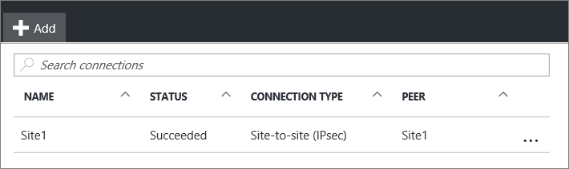

<properties
   pageTitle="Zum Hinzufügen von mehreren VPN Gateway Standorten Verbindungen zu einem virtuellen Netzwerk für das Modell zur Bereitstellung von Ressourcenmanager über das Azure-Portal | Microsoft Azure"
   description="Fügen Sie Website mit mehreren S2S Verbindungen zu einem VPN-Gateway, der eine vorhandene Verbindung hinzu"
   services="vpn-gateway"
   documentationCenter="na"
   authors="cherylmc"
   manager="carmonm"
   editor=""
   tags="azure-resource-manager"/>

<tags
   ms.service="vpn-gateway"
   ms.devlang="na"
   ms.topic="article"
   ms.tgt_pltfrm="na"
   ms.workload="infrastructure-services"
   ms.date="10/10/2016"
   ms.author="cherylmc"/>

# Hinzufügen einer Website-zu-Standort-Verbindung mit einer VNet mit einer vorhandenen VPN-Gateway-Verbindung

> [AZURE.SELECTOR]
- [Ressourcenmanager - Portal](vpn-gateway-howto-multi-site-to-site-resource-manager-portal.md)
- [Klassische - PowerShell](vpn-gateway-multi-site.md)

In diesem Artikel führt Sie durch über das Azure-Portal so ein VPN-Gateway Verbindungen Standort-zu-Standort (S2S) hinzu, die eine vorhandene Verbindung enthält. Diese Art von Verbindung wird häufig als Konfiguration "Multi-Website" bezeichnet. 

In diesem Artikel können Sie eine Verbindung S2S einer VNet hinzufügen, die bereits eine S2S Verbindung, Punkt-zu-Standort-Verbindung oder VNet-VNet-Verbindung. Es bestehen einige Einschränkungen beim Hinzufügen von Verbindungen. Aktivieren Sie im Abschnitt " [Vorbemerkung](#before) " in diesem Artikel, um zu überprüfen, bevor Sie mit die Konfiguration beginnen. 

In diesem Artikel gilt für VNets mit dem Modell zur Bereitstellung von Ressourcenmanager erstellt, die ein Gateway RouteBased VPN haben. Diese Schritte gelten nicht für ExpressRoute/Website-zu-Standort gleichzeitig vorhandener Verbindung Konfigurationen. Informationen zu gleichzeitig vorhandener Verbindungen finden Sie unter [ExpressRoute/S2S gleichzeitig vorhandener Verbindungen](../expressroute/expressroute-howto-coexist-resource-manager.md) .

### Bereitstellungsmodelle und Methoden

[AZURE.INCLUDE [vpn-gateway-clasic-rm](../../includes/vpn-gateway-classic-rm-include.md)] 

Wir aktualisieren diese Tabelle als neue Beiträge und zusätzliche Tools werden für diese Konfiguration verfügbar. Wenn ein Artikel verfügbar ist, verknüpfen wir aus dieser Tabelle direkt an.

[AZURE.INCLUDE [vpn-gateway-table-multi-site](../../includes/vpn-gateway-table-multisite-include.md)] 

## Vorbemerkung

Überprüfen Sie die folgenden Punkte:

- Sie sind keine ExpressRoute/S2S gleichzeitig vorhandener Verbindung erstellen.
- Sie haben ein virtuelles Netzwerk, das mit dem Modell zur Bereitstellung von Ressourcenmanager mit einer bestehenden Verbindung erstellt wurde.
- Das Gateway virtuelles Netzwerk für Ihre VNet ist RouteBased. Wenn Sie einen Gateway PolicyBased VPN haben, müssen Sie Löschen des Gateways virtuelles Netzwerk und erstellen einen neuen VPN Gateway RoutBased.
- Keiner der Adressbereiche überlappen für keines der VNets, die diese VNet eine Verbindung herstellt.
- Sie haben-Gerät VPN und eine Person, die sie konfigurieren kann. Finden Sie unter [VPN-Geräte](vpn-gateway-about-vpn-devices.md). Wenn Sie nicht mit Ihrem Gerät VPN konfigurieren vertraut sind, oder klicken Sie mit der IP-Adresse, die Bereiche in ansässig vertraut sind, Ihre lokal Netzwerkkonfiguration, müssen Sie mit einer anderen Person zu koordinieren, die für Sie diese Details abgerufen werden können.
- Sie haben eine extern ausgerichteten öffentliche IP-Adresse für Ihr Gerät VPN. Diese IP-Adresse kann sich nicht hinter einem NAT befinden

## Teil 1: Konfigurieren einer Verbindung

1. Mithilfe eines Browsers und navigieren Sie zu der [Azure-Portal](http://portal.azure.com) und, falls notwendig, melden Sie sich mit Ihrem Azure-Konto.
2. Klicken Sie auf **alle Ressourcen** und suchen Sie nach der **Gateways virtuelles Netzwerk** aus der Liste der Ressourcen, und klicken Sie darauf.
3. Klicken Sie auf das **Netzwerk-Gateway virtuellen** Blade auf **Verbindungen**.

     

4. Klicken Sie auf das Blade **Verbindungen** auf **+ Hinzufügen**.

     

5. Füllen Sie das Blade **Verbindung hinzufügen** folgende Angaben:
    - **Name:** Der Name, den Sie zu der Website gewähren, die Sie die Verbindung zu erstellen möchten.
    - **Verbindungstyp:** Wählen Sie **Website-zu-Standort (IPsec)**aus.

     

## Teil 2: Hinzufügen eines Gateways für lokales Netzwerk

1. Klicken Sie auf **Lokales Netzwerkgateway** ***Auswählen eines Gateways für lokales Netzwerk***. Dadurch wird das Blade **auswählen lokales Netzwerkgateway** geöffnet.

     
2. Klicken Sie auf **neu erstellen** , um das Blade **Erstellen lokales Netzwerkgateway** zu öffnen.

     

3. Füllen Sie das Blade **Erstellen lokales Netzwerkgateway** folgende Angaben:
    - **Name:** Der Name, die Sie auf der lokalen Netzwerk Gateway Ressource gewähren möchten.
    - **IP-Adresse:** Die öffentliche IP-Adresse des Geräts VPN auf der Website, der Sie in eine Verbindung herstellen möchten.
    - **Speicherplatz zu beheben:** Die Adressbereich, die in die neue Website für lokales Netzwerk weitergeleitet werden soll.
4. Klicken Sie auf **OK** , klicken Sie auf das **Erstellen lokales Netzwerkgateway** Blade Änderungen zu speichern.

## Teil 3 – gemeinsamen Schlüssel hinzufügen und die Verbindung zu erstellen

1. Fügen Sie in der Blade **Verbindung hinzufügen** des freigegebenen Schlüssels, den Sie verwenden, um die Verbindung erstellen möchten. Sie erhalten von Ihrem Gerät VPN gemeinsamen Schlüssel oder stellen Sie eine hier oben aus, und konfigurieren Sie dann auf Ihrem Gerät VPN, um den gleichen gemeinsamen Schlüssel verwenden. Wichtig ist, dass die Tasten identisch sind.

     
2. Klicken Sie am unteren Rand der Blade auf **OK** , um die Verbindung zu erstellen.

## Teil 4: Überprüfen Sie die Option VPN-Verbindung

Sie können Ihre VPN-Verbindung im Portal oder mithilfe der PowerShell überprüfen.

[AZURE.INCLUDE [vpn-gateway-verify-connection-rm](../../includes/vpn-gateway-verify-connection-rm-include.md)]

## Nächste Schritte

- Nachdem die Verbindung abgeschlossen ist, können Sie Ihre virtuelle Netzwerke virtuellen Computern hinzufügen. Die virtuellen Computern [learning Pfad](https://azure.microsoft.com/documentation/learning-paths/virtual-machines) für Weitere Informationen finden Sie unter.
