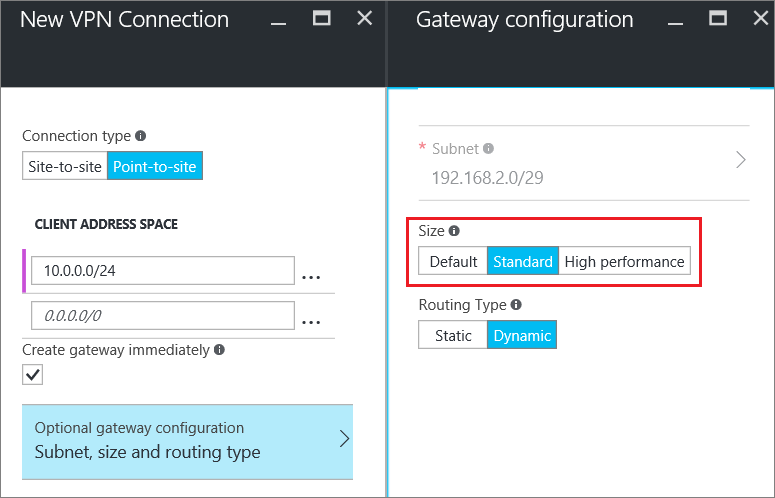
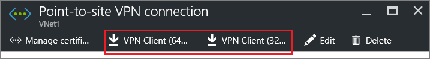

<properties
   pageTitle="Konfigurieren einer Punkt-zu-Standort VPN Gateway-Verbindung zu einem virtuellen Azure-Netzwerk über das Azure-Portal | Microsoft Azure"
   description="Sicheres Herstellen einer Verbindung mit Ihrem Azure-virtuellen Netzwerk durch Erstellen einer Punkt-zu-Standort VPN Gateway-Verbindungs mit dem Azure-Portal."
   services="vpn-gateway"
   documentationCenter="na"
   authors="cherylmc"
   manager="carmonm"
   editor=""
   tags="azure-service-management"/>

<tags
   ms.service="vpn-gateway"
   ms.devlang="na"
   ms.topic="hero-article"
   ms.tgt_pltfrm="na"
   ms.workload="infrastructure-services"
   ms.date="10/17/2016"
   ms.author="cherylmc"/>

# Konfigurieren einer Punkt-zu-Standort-Verbindung zu einem VNet über das Azure-portal

> [AZURE.SELECTOR]
- [Ressourcenmanager - Azure-Portal](vpn-gateway-howto-point-to-site-resource-manager-portal.md)
- [Ressourcenmanager - PowerShell](vpn-gateway-howto-point-to-site-rm-ps.md)
- [Klassische - Azure-Portal](vpn-gateway-howto-point-to-site-classic-azure-portal.md)

In diesem Artikel führt Sie durch die Erstellung einer VNet mit einer Punkt-zu-Standort-Verbindung im Bereitstellungsmodell klassischen über das Azure-Portal an. Die Konfiguration einer Punkt-zu-Standort (P2S) können Sie eine sichere Verbindung aus einem einzelnen Clientcomputer zu einem virtuellen Netzwerk zu erstellen. Eine Verbindung P2S ist nützlich, wenn Sie zu Ihrer VNet von einem entfernten Standort, wie z. B. Start oder einer Konferenz verbinden möchten. Oder, wenn Sie nur wenige Clients, die Verbindung zu einem virtuellen Netzwerk benötigen.

Ein VPN-Gerät oder eine öffentlich zugängliche IP-Adresse entwickelt erforderlich Punkt-zu-Standort-Verbindungen keine. Eine VPN-Verbindung wird hergestellt, indem Sie die Verbindung vom Clientcomputer starten. Weitere Informationen zu-Punkt-zu-Standort-Verbindungen finden Sie unter der [VPN Gateway häufig gestellte Fragen](vpn-gateway-vpn-faq.md#point-to-site-connections) und [Informationen zu VPN-Gateway](vpn-gateway-about-vpngateways.md#point-to-site).

### Bereitstellungsmodelle und Methoden für P2S Verbindungen

[AZURE.INCLUDE [deployment models](../../includes/vpn-gateway-deployment-models-include.md)] 

In der folgenden Tabelle werden die zwei Bereitstellungsmodelle und Methoden für die Bereitstellung verfügbar für P2S Konfigurationen. Wenn ein Artikel mit Konfigurationsschritte verfügbar ist, verknüpfen wir aus dieser Tabelle direkt an.

[AZURE.INCLUDE [vpn-gateway-clasic-rm](../../includes/vpn-gateway-table-point-to-site-include.md)] 

## Grundlegende workflow 

![Punkt-zu-Website-Diagramm] (./media/vpn-gateway-howto-point-to-site-rm-ps/p2srm.png "Punkt-zu-Standort")

In den folgenden Abschnitten gehen Sie durch die Schritte zum Erstellen einer secure Punkt-zu-Standort-Verbindungs zu einem virtuellen Netzwerk an. 

1. Erstellen eines virtuellen Netzwerk und VPN-gateway
2. Generieren von Zertifikaten
3. CER-Datei hochladen
4. Das VPN-Client-Konfigurations-Paket generieren
5. Konfigurieren des Clientcomputers
6. Herstellen einer Verbindung Azure mit

### Beispiel-Einstellungen

Sie können die folgenden Beispiel Einstellungen verwenden:

- **Name: VNet1**
- **Leerzeichen zu beheben: 192.168.0.0/16**
- **Subnetnamen: Front-End**
- **Subnetzadressbereichs: 192.168.1.0/24**
- **Abonnement:** Wenn Sie mehr als ein Abonnement besitzen, stellen Sie sicher, dass Sie den richtigen Arbeitsbereich verwenden.
- **Ressourcengruppe: TestRG**
- **Standort: Ostasiatischen US**
- **Verbindungstyp: Punkt-zu-Standort**
- **Client Adressbereichs: 172.16.201.0/24**. VPN-Clients, die Verbindung mit der VNet mithilfe dieser Punkt-zu-Standort-Verbindung erhalten eine IP-Adresse aus dem angegebenen Pool an.
- **GatewaySubnet: 192.168.200.0/24**. Das Gateway Subnetz muss den Namen "GatewaySubnet" verwenden.
- **Größe:** Wählen Sie den Gateway-SKU, die Sie verwenden möchten.
- **Weiterleitung Typ: dynamische**

## Abschnitt 1: Erstellen eines virtuellen Netzwerks und ein VPN-Gateway

### Teil 1: Erstellen ein virtuelles Netzwerks

Wenn Sie bereits über ein virtuelles Netzwerk besitzen, erstellen Sie eine. Screenshots dienen als Beispiele für. Achten Sie darauf, dass Sie die Werte durch ein eigenes ersetzen. Um eine VNet mithilfe des Azure-Portals zu erstellen, gehen Sie folgendermaßen vor: 

1. Mithilfe eines Browsers und navigieren Sie zu der [Azure-Portal](http://portal.azure.com) und, falls notwendig, melden Sie sich mit Ihrem Azure-Konto.

2. Klicken Sie auf **neu**. Geben Sie im Feld **Suchen die Marketplace** "Virtuelle Netzwerk" aus. Suchen Sie **Virtuelle Netzwerk** aus der zurückgegebenen Liste, und klicken Sie auf, um das **Virtuelle Netzwerk** Blade zu öffnen.

    ![Suchen nach virtuelles Netzwerk blade] (./media/vpn-gateway-howto-point-to-site-classic-azure-portal/newvnetportal700.png "Suchen nach virtuelles Netzwerk blade")

3. Im unteren Bereich des Blades virtuelle Netzwerk aus der Liste **Wählen Sie ein Modell zur Bereitstellung von** **klassischen**wählen Sie aus, und klicken Sie dann auf **Erstellen**.

    ![Wählen Sie Modell zur Bereitstellung] (./media/vpn-gateway-howto-point-to-site-classic-azure-portal/selectmodel.png "Wählen Sie Modell zur Bereitstellung")

4. Konfigurieren Sie die VNet-Einstellungen, klicken Sie auf das Blade **virtuelles Netzwerk erstellen** . In diesem Blade fügen Sie Ihrer ersten Adressbereichs und einem einzelnen Subnetz Adressbereich. Nachdem Sie die VNet erstellt haben, können Sie zurückgehen und hinzufügen zusätzliche Subnetze und Adresse Leerzeichen.

    ![Erstellen virtuelle Netzwerk blade] (./media/vpn-gateway-howto-point-to-site-classic-azure-portal/vnet125.png "Erstellen virtuelle Netzwerk blade")

5. Stellen Sie sicher, dass das **Abonnement** richtig ist. Sie können Abonnements mithilfe der Dropdown-Liste ändern.

6. Klicken Sie auf **Ressourcengruppe** und entweder eine vorhandene Ressourcengruppe auswählen oder einen neuen erstellen, indem Sie einen Namen für die neue Ressourcengruppe eingeben. Wenn Sie eine neue Gruppe erstellen, benennen Sie die Ressourcengruppe entsprechend Ihren Werten für geplanten Konfiguration. Weitere Informationen zu Ressourcengruppen finden Sie auf [Azure Ressourcenmanager Übersicht](azure-resource-manager/resource-group-overview.md#resource-groups).

7. Wählen Sie dann die Einstellungen **Speicherort** für Ihre VNet ein. Die Position wird bestimmen, wo die Ressourcen, die Sie für diese VNet bereitstellen gespeichert werden soll.

8. Wählen Sie **Pin zum Dashboard** , wenn Sie möchten, kann der VNet auf dem Dashboard wiederzufinden, und klicken Sie dann auf **Erstellen**.
    
    ![PIN zum dashboard] (./media/vpn-gateway-howto-point-to-site-classic-azure-portal/pintodashboard150.png "PIN zum dashboard")

9. Nachdem Sie auf erstellen, sehen Sie eine Kachel auf des Dashboards, die den Fortschritt Ihrer VNet widerspiegeln wird. Die Kachel ändert sich während der VNet erstellt wird.

    ![Erstellen von virtuelles Netzwerk-Kachel] (./media/vpn-gateway-howto-point-to-site-classic-azure-portal/deploying150.png "Erstellen von virtuelles Netzwerk-Kachel")

10. Nach dem Erstellen von virtuellen Netzwerks können Sie die IP-Adresse eines DNS-Servers hinzufügen, um mit einer namensauflösung von zu behandeln. Öffnen Sie die Einstellungen für das virtuelle Netzwerk, klicken Sie auf DNS-Server, und fügen Sie die IP-Adresse des DNS-Servers ein, die Sie verwenden möchten. Diese Einstellung erstellt keine neuen DNS Servers. Achten Sie darauf, um einen DNS-Server hinzuzufügen, dem mit Ressourcen kommunizieren können.

Sobald virtuellen Netzwerks erstellt wurde, sehen Sie sich, dass **erstellt** auf der Seite Netzwerke im klassischen Azure-Portal unter **Status** aufgelistet.

### Teil 2: Erstellen von Gateway Subnetz und dynamische routing-Gateway

In diesem Schritt erstellen Sie ein Gateway Subnetz und dynamische routing-Gateway. Im Azure-Portal für das Bereitstellungsmodell klassischen kann die gleiche Konfiguration Karten erstellen, dem Gateway Subnetz und das Gateway vorgenommen werden.

1. Navigieren Sie im Portal an das virtuelle Netzwerk, für das Sie einen Gateway erstellen möchten.

2. Klicken Sie auf das Blade Netzwerkadministrator virtuelle auf **Übersicht** vorher, in dem Abschnitt VPN-Verbindungen auf **Gateway**.

    ![Klicken Sie hier, um ein Gateway zu erstellen.] (./media/vpn-gateway-howto-point-to-site-classic-azure-portal/beforegw125.png "Klicken Sie hier, um ein Gateway zu erstellen.")

3. Wählen Sie auf das **Neue VPN-Verbindung** Blade **Punkt-zu-Standort**.

    ![P2S Verbindungstyp] (./media/vpn-gateway-howto-point-to-site-classic-azure-portal/newvpnconnect.png "P2S Verbindungstyp")

4. Fügen Sie für **Client-Adressbereichs**den Bereich der IP-Adresse hinzu. Dies ist der Bereich, von dem die VPN-Clients eine IP-Adresse beim Herstellen einer Verbindung empfangen werden. Löschen Sie den Bereich automatisch ausgefüllt, und fügen Sie Ihre eigenen.

    ![Client-Adressbereichs] (./media/vpn-gateway-howto-point-to-site-classic-azure-portal/clientaddress.png "Client-Adressbereichs")

5. Wählen Sie das Kontrollkästchen **sofort Gateway erstellen** aus.

    ![Sofort Gateway erstellen] (./media/vpn-gateway-howto-point-to-site-classic-azure-portal/creategwimm.png "Sofort Gateway erstellen")

6. Klicken Sie auf **Optional Gateway-Konfiguration** , um das **Gateway-Konfiguration** Blade zu öffnen.

    ![Klicken Sie auf optional Gateway-Konfiguration] (./media/vpn-gateway-howto-point-to-site-classic-azure-portal/optsubnet125.png "Klicken Sie auf optional Gateway-Konfiguration")

7. Klicken Sie auf **Einstellungen konfigurieren Subnetz erforderlich** , um das **Gateway Subnetz**hinzuzufügen. Es ist, zwar möglich, ein Gateway Subnetz /29 möglichst klein erstellen wird empfohlen, dass Sie eine größere Subnetz, die mehrere Adressen enthält erstellen, indem Sie mindestens /28 oder /27 auswählen. Damit wird genügend Adressen mögliche zusätzliche Konfigurationen gerecht werden kann, die Sie möglicherweise in der Zukunft möchten.

    >[AZURE.IMPORTANT] Bei der Arbeit mit unterschiedlichen Gateway, vermeiden Sie eine Netzwerksicherheitsgruppe (NSG) mit dem Gateway Subnetz zuordnen aus. Zuordnen einer Netzwerk-Sicherheitsgruppe zu diesem Subnetz möglicherweise das VPN-Gateway nicht mehr funktionieren wie erwartet. Weitere Informationen zu Netzwerk-Sicherheitsgruppen enthalten, finden Sie unter [Neuigkeiten einer Netzwerksicherheitsgruppe?](../articles/virtual-network/virtual-networks-nsg.md)

    ![Hinzufügen von GatewaySubnet] (./media/vpn-gateway-howto-point-to-site-classic-azure-portal/gwsubnet125.png "Hinzufügen von GatewaySubnet")

8. Wählen Sie den Gateway **Größe**ein. Dies ist das Gateway SKU, mit denen Sie Ihre virtuelle Netzwerkgateway zu erstellen. Im Portal ist der Standard-SKU **grundlegende**. Weitere Informationen zu Gateway SKUs finden Sie unter [Informationen zum VPN Gateway Settings](../articles/vpn-gateway/vpn-gateway-about-vpn-gateway-settings.md#gwsku).

    

9. Wählen Sie den **Typ Routing** für Ihr Gateway aus. P2S Konfigurationen erfordern einen **dynamischen** Weiterleitung Typ. Wenn Sie diese Blade konfiguriert haben, klicken Sie auf **OK** .

    ![Weiterleitung Typ konfigurieren] (./media/vpn-gateway-howto-point-to-site-classic-azure-portal/routingtype125.png "Weiterleitung Typ konfigurieren")

10. Klicken Sie auf das Blade **Neue VPN-Verbindung** auf **OK** am unteren Rand der Blade um zu Ihrer virtuelle Netzwerk-Gateway zu erstellen. Dies kann bis zu 45 Minuten dauern. 

## Abschnitt 2: generieren Zertifikate

Zertifikate werden von Azure verwendet, um VPN-Clients für Punkt-zu-Standort VPN authentifizieren. Sie exportieren als Base-64 CER-Datei aus entweder ein Zertifikat einer Stammzertifizierungsstelle durch eine Enterprise-Lösung Zertifikat generiert oder ein selbst signiertes Root Zertifikat x. 509-Zertifikat für Öffentliche Daten (nicht der private Schlüssel). Sie dann importieren die Zertifikat für Öffentliche Daten aus dem Stammordner Zertifikat in Azure. Darüber hinaus müssen Sie ein Client-Zertifikat aus dem Stammordner Zertifikat für Clients generieren. Jeder Client, der mit dem virtuellen Netzwerk über eine P2S Verbindung herstellen will ein Clientzertifikat muss installiert sein, die aus dem Stammordner Zertifikat generiert wurde.

### Teil 1: CER-Datei für das Zertifikat Quadratwurzel zu erhalten

Wenn Sie eine Lösung Enterprise verwenden, können Sie Ihre vorhandene Kette des Zertifikats. Wenn Sie eine Enterprise-Lösung Zertifizierungsstelle verwenden, können Sie ein selbst signiertes Stamm-Zertifikat erstellen. Eine Methode zum Erstellen eines selbstsignierten Zertifikats ist Makecert an.

- Wenn Sie ein Zertifikat Enterprise-System verwenden, beziehen Sie die CER-Datei für das Stamm-Zertifikat, das Sie verwenden möchten. 

- Wenn Sie eine Zertifikat-Lösung Enterprise nicht verwenden, müssen Sie ein Zertifikat selbstsignierten Stamm zu generieren. Für Windows 10 Schritten können Sie für die [Arbeit mit Quadratwurzel von selbstsignierten Zertifikaten für Punkt-zu-Standort Konfigurationen](vpn-gateway-certificates-point-to-site.md)verweisen.

1. Um ein Zertifikat eine CER-Datei erhalten öffnen Sie **certmgr.msc** , und suchen Sie das Zertifikat aus. Mit der rechten Maustaste in des Zertifikats selbstsignierten Stamm, klicken Sie auf **Alle Aufgaben**, und klicken Sie dann auf **Exportieren**. Daraufhin wird ein **Zertifikat Export-Assistenten**.

2. Im Assistenten klicken Sie auf **Weiter**, wählen Sie **Nein, privaten Schlüssel nicht exportieren**aus, und klicken Sie dann auf **Weiter**.

3. Klicken Sie auf der Seite **Format der zu exportierenden Datei** wählen **Base-64-codierte x. 509 (. CER).** Klicken Sie dann auf **Weiter**. 

4. Klicken Sie auf die **Datei zu exportieren**, **Navigieren** Sie zu dem Speicherort, den Sie das Zertifikat exportieren möchten. Dateinamen Sie für den **Dateinamen ein**den Zertifikat aus. Klicken Sie dann auf **Weiter**.

5. Klicken Sie auf **Fertig stellen** , um das Zertifikat zu exportieren.

### Teil 2: Erstellen Sie ein Clientzertifikat

Sie können entweder ein eindeutige Zertifikat generieren, für jeden Client, der eine Verbindung herstellt, oder Sie können das gleiche Zertifikat auf mehreren Clients verwenden. Der Vorteil bei Generieren von eindeutigen Client-Zertifikate ist die Möglichkeit, ein einzelnes Zertifikat widerrufen, falls erforderlich. Andernfalls, wenn alle ist das gleiche Clientzertifikat verwenden, und Sie feststellen, dass Sie das Zertifikat für einen Client Sperren müssen, müssen Sie zum Generieren und installieren neue Zertifikate für alle Clients, die das Zertifikat zum Authentifizieren verwenden.

- Wenn Sie eine Zertifikat-Lösung Enterprise verwenden, generieren ein Client-Zertifikat mit der gemeinsamen Wert Namensformat 'name@yourdomain.com', und nicht das Format 'Domänenname\Benutzername'. 

- Wenn Sie ein selbst signiertes Zertifikat verwenden, finden Sie unter [Arbeiten mit selbstsignierten Stammzertifikaten für Punkt-zu-Standort-Konfigurationen](vpn-gateway-certificates-point-to-site.md) , um ein Client-Zertifikat generieren.

### Teil 3: Exportieren der Client-Zertifikat

Installieren Sie ein Client-Zertifikat auf jedem Computer, die Sie an das virtuelle Netzwerk eine Verbindung herstellen möchten. Ein Client-Zertifikat ist zur Authentifizierung erforderlich. Sie können die Installation von dem Client-Zertifikat automatisieren oder manuell installieren. Die folgenden Schritte führen Sie durch das Exportieren und das Client-Zertifikat manuell installieren.

1. Wenn Sie ein Client-Zertifikat exportieren möchten, können Sie *certmgr.msc*verwenden. Mit der rechten Maustaste in des Client-Zertifikats, das Sie exportieren, klicken Sie auf **Alle Aufgaben**, und klicken Sie dann auf **Exportieren**möchten.
2. Exportieren Sie das Client-Zertifikat mit dem privaten Schlüssel ein. Dies ist eine *PFX* -Datei. Vergewissern Sie sich zum Aufzeichnen oder vergessen Sie nicht das Kennwort (Schlüssel), das Sie für dieses Zertifikat festlegen.

## Abschnitt 3: Hochladen der Root Zertifikat CER-Datei

Nachdem das Gateway erstellt wurde, können Sie die CER-Datei für ein vertrauenswürdiges Zertifikat in Azure hochladen. Sie können Dateien für bis zu 20 Stammzertifikate hochladen. Sie nicht den privaten Schlüssel für das Zertifikat der Stamm in Azure hochladen. Sobald die CER-Datei hochgeladen wird, von Azure-Clients authentifizieren, die mit dem virtuellen Netzwerk verwendet.

1. Klicken Sie im Abschnitt des Blades für Ihre VNet **VPN-Verbindungen** klicken Sie auf die Grafik **Clients** zum Öffnen der **Punkt-zu-Standort VPN-Verbindung** Blade.

    ![Clients] (./media/vpn-gateway-howto-point-to-site-classic-azure-portal/clients125.png "Clients")

2. Klicken Sie auf die **Punkt-zu-Standort-Verbindung** Blade, klicken Sie auf **Zertifikate verwalten** , um das Blade **Zertifikate** zu öffnen. 

      

3. Klicken Sie auf das Blade **Zertifikate** klicken Sie auf **Hochladen** , um das **Zertifikat hochladen** Blade zu öffnen. 

     

4. Klicken Sie auf die Grafik Ordner, um die CER-Datei zu suchen. Wählen Sie die Datei und dann auf **OK**. Aktualisieren Sie die Seite zum hochgeladene Zertifikat auf das Blade **Zertifikate** angezeigt.

     
    

## Abschnitt 4: generieren das VPN-Client-Konfigurations-Paket

Informationen zum Verbinden mit dem virtuellen Netzwerk müssen Sie auch einen VPN-Client konfigurieren. Der Clientcomputer erfordert ein Client-Zertifikat, und das ordnungsgemäße VPN-Client-Konfiguration-Paket und herstellen.

Das VPN-Client-Paket enthält Informationen zum Konfigurieren der VPN-Client-Software in Windows integriert. Das Paket keine zusätzlichen Software installieren. Die Einstellungen gelten nur für das virtuelle Netzwerk aus, dem Sie in eine Verbindung herstellen möchten. Eine Liste der Client-Betriebssystemen, die unterstützt werden, finden Sie unter der [Punkt-zu-Standort-Verbindungen](vpn-gateway-vpn-faq.md#point-to-site-connections) Abschnitt die Option VPN Gateway häufig gestellte Fragen. 

### Das VPN-Client-Konfigurations-Paket generieren

1. Im Portal Azure in der **Übersicht** Blade für Ihre VNet, in **VPN-Verbindungen**, klicken Sie auf die Grafik Client, öffnen Sie die **Punkt-zu-Standort VPN-Verbindung** Blade.
2. Am Anfang der der **Punkt-zu-Standort VPN Verbindung** Blade, klicken Sie auf das Downloadpaket, das das Client-Betriebssystem entspricht, auf dem er installiert:

 - Wählen Sie für 64-Bit-Clients **VPN-Client (64-Bit)**aus.
 - Wählen Sie für 32-Bit-Clients **VPN-Client (32-Bit)**aus.

     

3. Sehen Sie, dass das Paket VPN-Client-Konfiguration, für das virtuelle Netzwerk Azure generiert, wird eine Meldung. Nach ein paar Minuten das Paket generiert wird, und Sie werden eine Meldung angezeigt, auf dem lokalen Computer, dass das Paket heruntergeladen wurde. Speichern Sie die Konfigurationspaketdatei an. Sie werden diese auf jedem Clientcomputer installieren, die mit der Verwendung P2S virtuelle Netzwerk verbinden möchten.

## Abschnitt 5: konfigurieren den Clientcomputer

### Teil 1: Installieren des Clientzertifikats

Jeder Clientcomputer müssen ein Client-Zertifikat für die Authentifizierung. Wenn Sie das Client-Zertifikat installieren zu können, benötigen Sie das Kennwort, das erstellt wurde, wenn das Client-Zertifikat exportiert wurde.

1. Kopieren Sie die PFX-Datei auf dem Clientcomputer.
2. Doppelklicken Sie auf die PFX-Datei, um ihn zu installieren. Ändern Sie den Installationsspeicherort nicht.

### Teil 2: Installieren der VPN-Client-Konfiguration-Paket

Sie können dasselbe VPN-Client-Konfigurationspaket auf jedem Clientcomputer verwenden, vorausgesetzt, dass die Version die Architektur für den Client entspricht.

1. Kopieren Sie die Konfigurationsdatei lokal auf dem Computer, den Sie verwenden möchten, eine Verbindung mit Ihrem Netzwerk virtuelle und doppelklicken Sie auf die .exe-Datei. 

2. Nachdem das Paket installiert wurde, können Sie die VPN-Verbindung starten. Das Konfigurationspaket ist nicht von Microsoft signiert. Sie möglicherweise das Paket mithilfe von Ihrer Organisation signierenden Service melden möchten, oder melden sich mit [SignTool]( http://go.microsoft.com/fwlink/p/?LinkId=699327). Es ist OK, um das Paket verwenden, ohne sich anzumelden. Jedoch, wenn das Paket signiert nicht zur Verfügung, wird eine Warnung angezeigt, wenn Sie das Paket installieren.

3. Navigieren Sie zu **Deren Einstellungen im Netzwerk** , und klicken Sie auf **VPN**, auf dem Clientcomputer. Sie sehen die Verbindung aufgeführt. Es zeigt dem Namen des virtuellen Netzwerks, dass es beim Herstellen einer Verbindung mit wird und ungefähr wie folgt sieht: 

    ![VPN-client] (./media/vpn-gateway-howto-point-to-site-classic-azure-portal/vpn.png "VNet VPN-client")

## Abschnitt 6: Herstellen einer Verbindung Azure mit

### Verbinden mit Ihrer VNet

1. Navigieren Sie zu VPN-Verbindungen, und suchen Sie die VPN-Verbindung, die Sie erstellt haben, zum Verbinden mit Ihrer VNet, auf dem Clientcomputer. Es wird als denselben Namen wie virtuelle Netzwerk bezeichnet. Klicken Sie auf **Verbinden**. Möglicherweise eine Popup-Meldung angezeigt, die bei der Verwendung von des Zertifikats verweist. Wenn dies der Fall ist, klicken Sie auf **Weiter** , um erhöhten verwenden. 

2. Klicken Sie auf der Statusseite **Verbindung** auf **Verbindung herstellen** , um die Verbindung zu starten. Wenn Sie einen **Zertifikat auswählen** -Bildschirm angezeigt wird, stellen Sie sicher, dass das Client-Zertifikat, das angezeigt, die Sie verwenden wird, um eine Verbindung herstellen möchten. Wenn es nicht der Fall ist, verwenden Sie den Dropdown-Pfeil, um das richtige Zertifikat auszuwählen, und klicken Sie dann auf **OK**.

    ![Verbinden] (./media/vpn-gateway-howto-point-to-site-classic-azure-portal/clientconnect.png "VPN-Client-Verbindung")

3. Nun sollte die Verbindung hergestellt werden.

    ![Verbindung hergestellt] (./media/vpn-gateway-howto-point-to-site-classic-azure-portal/connected.png "Verbindung hergestellt")

### Überprüfen Sie die Option VPN-Verbindung

1. Stellen Sie sicher, dass die Option VPN-Verbindung aktiv ist, wenn öffnen Sie ein erweitertes Eingabeaufforderungsfenster, und führen Sie *Ipconfig/All*.
2. Anzeigen der Ergebnisse an. Beachten Sie, dass die IP-Adresse, die Sie erhalten eine der Adressen innerhalb des Punkt-zu-Standort Connectivity Adressbereichs, dass Sie beim Erstellen Ihrer VNet angegeben ist. Die Ergebnisse sollten etwa so:

Beispiel:

    PPP adapter VNet1:
        Connection-specific DNS Suffix .:
        Description.....................: VNet1
        Physical Address................:
        DHCP Enabled....................: No
        Autoconfiguration Enabled.......: Yes
        IPv4 Address....................: 192.168.130.2(Preferred)
        Subnet Mask.....................: 255.255.255.255
        Default Gateway.................:
        NetBIOS over Tcpip..............: Enabled

## Nächste Schritte

Sie können mit Ihrem Netzwerk virtuelle virtuellen Computern hinzufügen. Informationen Sie [zum Erstellen eines benutzerdefinierten virtuellen Computers](../virtual-machines/virtual-machines-windows-classic-createportal.md).