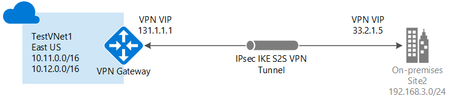

<properties
   pageTitle="Erstellen eines virtuelles Netzwerks mit einer Website-zu-Standort VPN-Verbindung mithilfe von Azure Ressourcenmanager und Azure-Portal | Microsoft Azure"
   description="So erstellen mit dem Modell zur Bereitstellung von Ressourcenmanager VNet und verbinden Sie es mit Ihrem lokalen lokalen Netzwerk über eine S2S VPN-Gateway-Verbindung."
   services="vpn-gateway"
   documentationCenter="na"
   authors="cherylmc"
   manager="carmonm"
   editor=""
   tags="azure-resource-manager"/>

<tags
   ms.service="vpn-gateway"
   ms.devlang="na"
   ms.topic="hero-article"
   ms.tgt_pltfrm="na"
   ms.workload="infrastructure-services"
   ms.date="10/14/2016"
   ms.author="cherylmc"/>

# Erstellen einer VNet mit einer Website-zu-Standort-Verbindung über das Azure-portal

> [AZURE.SELECTOR]
- [Ressourcenmanager - Azure-Portal](vpn-gateway-howto-site-to-site-resource-manager-portal.md)
- [Ressourcenmanager - PowerShell](vpn-gateway-create-site-to-site-rm-powershell.md)
- [Klassische - klassischen-Portal](vpn-gateway-site-to-site-create.md)

In diesem Artikel führt Sie durch die Erstellung eines virtuellen Netzwerks und eine Website-zu-Standort VPN Gateway-Verbindung mit Ihrem lokalen Netzwerk mit dem Modell zur Bereitstellung von Azure Ressourcenmanager und Azure-Portal an. Website-zu-Standort-Verbindungen für Cross lokale und Hybrid verwendet werden können Konfigurationen.

### Bereitstellungsmodelle und Methoden für die Verbindungen zwischen Standorten

[AZURE.INCLUDE [deployment models](../../includes/vpn-gateway-deployment-models-include.md)] 

In der folgenden Tabelle zeigt die aktuell verfügbare Bereitstellung-Modelle und Methoden für die Website-zu-Standort-Konfigurationen. Wenn ein Artikel mit Konfigurationsschritte verfügbar ist, verknüpfen wir aus dieser Tabelle direkt an.

[AZURE.INCLUDE [site-to-site table](../../includes/vpn-gateway-table-site-to-site-include.md)]

#### Zusätzliche Konfigurationen 

Wenn Sie VNets miteinander zu verbinden möchten, aber keine Verbindung mit einem lokalen Speicherort erstellen, finden Sie unter [Konfigurieren einer VNet-VNet - Verbindung](vpn-gateway-vnet-vnet-rm-ps.md). Wenn Sie eine Verbindung zwischen Standorten eine VNet hinzufügen, die bereits eine Verbindung möchten, finden Sie unter [Hinzufügen einer S2S-Verbindung zu einem VNet mit einer vorhandenen VPN-Gateway-Verbindung](vpn-gateway-howto-multi-site-to-site-resource-manager-portal.md).

## Vorbemerkung

Stellen Sie sicher, dass Sie über Folgendes verfügen, bevor Sie mit die Konfiguration beginnen:

- Ein kompatibles VPN-Gerät und eine Person, die sie konfigurieren kann. Finden Sie unter [VPN-Geräte](vpn-gateway-about-vpn-devices.md). Wenn Sie nicht mit Ihrem Gerät VPN konfigurieren vertraut sind, oder klicken Sie mit der IP-Adresse, die Bereiche in ansässig vertraut sind, Ihre lokal Netzwerkkonfiguration, müssen Sie mit einer anderen Person zu koordinieren, die für Sie diese Details abgerufen werden können.

- Eine extern ausgerichteten öffentlichen IP-Adresse für Ihr Gerät VPN. Diese IP-Adresse kann sich nicht hinter einem NAT befinden
    
- Ein Azure-Abonnement. Wenn Sie bereits über ein Azure-Abonnement besitzen, können Sie Ihre [MSDN-Vorteile für Abonnenten](http://azure.microsoft.com/pricing/member-offers/msdn-benefits-details/) oder melden Sie sich für ein [kostenloses Konto](http://azure.microsoft.com/pricing/free-trial/)von aktivieren.

### Konfiguration Beispielwerte für diese Übung

Wenn Sie diese Schritte als Übung verwenden, können Sie die Konfiguration Beispielwerte verwenden:

- **VNet Namen:** TestVNet1
- **Speicherplatz zu beheben:** 10.11.0.0/16 und 10.12.0.0/16
- **Subnetze:**
    - Front-End: 10.11.0.0/24
    - Back-End-: 10.12.0.0/24
    - GatewaySubnet: 10.12.255.0/27
- **Ressourcengruppe:** TestRG1
- **Speicherort:** Ostasiatische US
- **DNS-Server:** 8.8.8.8
- **Gatewayname:** VNet1GW
- **Öffentliche IP-Adresse:** VNet1GWIP
- **VPN-Typ:** Routing-basierten
- **Verbindungstyp:** Website-zu-Standort (IPsec)
- **Gateway-Typ:** VPN
- **Lokales Netzwerk gatewayname:** Site2
- **Verbindungsname:** VNet1toSite2

## 1. erstellen Sie 1. ein virtuelles Netzwerk 

Wenn Sie bereits eine VNet haben, stellen Sie sicher, dass die Einstellungen mit den VPN-Gatewayentwurf kompatibel sind. Achten Sie besonders auf Subnetze, die mit anderen Netzwerken überlappen möglicherweise ein. Wenn sich überlappenden Subnetze funktionieren die Verbindung ordnungsgemäß nicht. Wenn Ihre VNet mit den korrekten Einstellungen so konfiguriert ist, können Sie die Schritte im Abschnitt [Geben Sie einen DNS-Server](#dns) beginnen.

### So erstellen ein virtuelles Netzwerk

[AZURE.INCLUDE [vpn-gateway-basic-vnet-rm-portal](../../includes/vpn-gateway-basic-vnet-rm-portal-include.md)]  

## 2. Fügen Sie zusätzliche Adressbereichs und Subnetze hinzu

Sie können weitere Adressbereichs und Subnetze zu Ihrem VNet hinzufügen, nachdem er erstellt wurde.

[AZURE.INCLUDE [vpn-gateway-additional-address-space](../../includes/vpn-gateway-additional-address-space-include.md)] 

## 3. Geben Sie einen DNS-server

### Angeben ein DNS-Servers

[AZURE.INCLUDE [vpn-gateway-add-dns-rm-portal](../../includes/vpn-gateway-add-dns-rm-portal-include.md)]

## 4 Erstellen Sie 4 ein Gateway Subnetz

Vor dem Verbinden Ihrer virtuellen Netzwerks zu einem Gateway, müssen Sie zuerst das Gateway Subnetz für das virtuelle Netzwerk erstellen, dem Sie eine Verbindung herstellen möchten. Falls möglich, empfiehlt es sich, erstellen Sie ein Gateway Subnetz einen Textblock CIDR /28 oder /27 verwenden, um genügend IP-Adressen, um zusätzliche zukünftigen Konfiguration Bedürfnisse bereitstellen zu können.

Wenn Sie diese Konfiguration als Übung erstellen, lesen Sie diese [Werte](#values) Ihrem Subnetz gehören, Gateway zu erstellen.

### So erstellen Sie ein Gateway Subnetz

[AZURE.INCLUDE [vpn-gateway-add-gwsubnet-rm-portal](../../includes/vpn-gateway-add-gwsubnet-rm-portal-include.md)]

## 5 Erstellen eines Gateways virtuelles Netzwerk

Wenn Sie diese Konfiguration als Übung erstellen, können Sie die [Konfiguration Beispielwerte](#values)verweisen.

### Erstellen eines Gateways virtuelles Netzwerk

[AZURE.INCLUDE [vpn-gateway-add-gw-rm-portal](../../includes/vpn-gateway-add-gw-rm-portal-include.md)]

## 6. Erstellen eines Gateways für lokales Netzwerk

Das Gateway' Lokales Netzwerk' bezieht sich auf Ihrem lokalen Speicherort. Benennen Sie dem Gateway lokales Netzwerk anhand der Azure darauf verweisen kann. 

Wenn Sie diese Konfiguration als Übung erstellen, können Sie die [Konfiguration Beispielwerte](#values)verweisen.

### Erstellen eines Gateways lokales Netzwerk

[AZURE.INCLUDE [vpn-gateway-add-lng-rm-portal](../../includes/vpn-gateway-add-lng-rm-portal-include.md)]

## 7 Konfigurieren von Ihrem Gerät VPN

[AZURE.INCLUDE [vpn-gateway-configure-vpn-device-rm](../../includes/vpn-gateway-configure-vpn-device-rm-include.md)]

## 8 erstellen Sie 8 eine Website-zu-Standort VPN-Verbindung

Website-zu-Standort VPN-Verbindung zwischen Ihrem virtuelles Netzwerkgateway und Ihrem Gerät VPN zu erstellen. Achten Sie darauf, dass Sie die Werte durch ein eigenes ersetzen. Der gemeinsame Schlüssel muss der Wert entsprechen, die, den Sie für Ihre VPN-Gerätekonfiguration verwendet. 

Bevor Sie beginnen, stellen Sie sicher, dass Ihre virtuelle Netzwerk-Gateway und lokales Netzwerkgateways erstellen abgeschlossen haben. Wenn Sie diese Konfiguration als Übung erstellen, lesen Sie diese [Werte](#values) beim Erstellen der Verbindung.

### So erstellen Sie die VPN-Verbindung

[AZURE.INCLUDE [vpn-gateway-add-site-to-site-connection-rm-portal](../../includes/vpn-gateway-add-site-to-site-connection-rm-portal-include.md)]

## 9. Überprüfen Sie die Option VPN-Verbindung

Sie können Ihre VPN-Verbindung im Portal oder mithilfe der PowerShell überprüfen.

[AZURE.INCLUDE [vpn-gateway-verify-connection-rm](../../includes/vpn-gateway-verify-connection-rm-include.md)]

## Nächste Schritte

- Nachdem die Verbindung abgeschlossen ist, können Sie Ihre virtuelle Netzwerke virtuellen Computern hinzufügen. Die virtuellen Computern [learning Pfad](https://azure.microsoft.com/documentation/learning-paths/virtual-machines) für Weitere Informationen finden Sie unter.

- Informationen zu BGP finden Sie unter der [BGP Übersicht](vpn-gateway-bgp-overview.md) und [BGP konfigurieren](vpn-gateway-bgp-resource-manager-ps.md).
