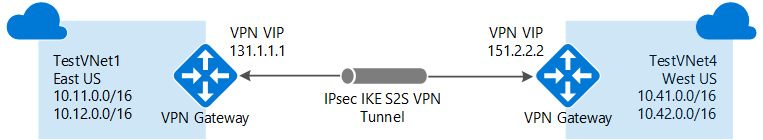

<properties
   pageTitle="Verbinden von Azure VNets mit VPN-Gateway und PowerShell | Microsoft Azure"
   description="In diesem Artikel führt Sie durch virtuelle Netzwerke zusammen mit Azure Ressourcenmanager und PowerShell verbinden."
   services="vpn-gateway"
   documentationCenter="na"
   authors="cherylmc"
   manager="carmonm"
   editor=""
   tags="azure-resource-manager"/>

<tags
   ms.service="vpn-gateway"
   ms.devlang="na"
   ms.topic="get-started-article"
   ms.tgt_pltfrm="na"
   ms.workload="infrastructure-services"
   ms.date="08/31/2016"
   ms.author="cherylmc"/>

# Konfigurieren einer VNet-VNet-Verbindungs für Ressourcenmanager mithilfe der PowerShell

> [AZURE.SELECTOR]
- [Ressourcenmanager - Azure-Portal](vpn-gateway-howto-vnet-vnet-resource-manager-portal.md)
- [Ressourcenmanager - PowerShell](vpn-gateway-vnet-vnet-rm-ps.md)
- [Klassische - klassischen-Portal](virtual-networks-configure-vnet-to-vnet-connection.md)

In diesem Artikel führt Sie durch die Schritte zum Erstellen einer Verbindungs zwischen VNets im Bereitstellungsmodell Ressourcenmanager mithilfe von VPN-Gateway. Virtuelle Netzwerke können in der gleichen oder in verschiedenen Regionen und aus den gleichen oder einem anderen Abonnements sein.

### Bereitstellungsmodelle und Methoden für VNet-VNet-Verbindungen

[AZURE.INCLUDE [deployment models](../../includes/vpn-gateway-deployment-models-include.md)]

In der folgenden Tabelle zeigt die aktuell verfügbare Bereitstellung-Modelle und Methoden für VNet-VNet-Konfigurationen. Wenn ein Artikel mit Konfigurationsschritte verfügbar ist, verknüpfen wir aus dieser Tabelle direkt an.

[AZURE.INCLUDE [vpn-gateway-table-vnet-vnet](../../includes/vpn-gateway-table-vnet-to-vnet-include.md)]

#### VNet peering

[AZURE.INCLUDE [vpn-gateway-vnetpeeringlink](../../includes/vpn-gateway-vnetpeeringlink-include.md)]

## Informationen zu VNet-VNet-Verbindungen

Herstellen einer Verbindung ein virtuelles Netzwerk zu einem anderen virtuellen Netzwerk ähnelt (VNet VNet) eine VNet in einer lokalen Website verbinden. Beide Typen Connectivity mit einer Azure VPN Gateway können einen sicheren Tunnel mit IPSec-/IKE bereitstellen. Die VNets, die Sie eine Verbindung herstellen kann in unterschiedlichen Regionen sein. Oder in anderen Abonnements. Sie können auch VNet-VNet-Kommunikation mit mehreren Standorten Konfigurationen kombinieren. Diese Berechtigung ermöglicht, die Sie einführen Netzwerktopologien, die kombinieren Cross lokale Konnektivität mit zwischen virtuelle Netzwerkkonnektivität, wie in der folgenden Abbildung dargestellt:

 
### Warum keine Verbindung herstellen mit virtuelle Netzwerke?

Möglicherweise virtuelle Netzwerke aus den folgenden Gründen eine Verbindung herstellen möchten:

- **Cross Region Geo-Redundanz und Geo-Anwesenheitsstatus**
    - Sie können eigene Geo-Replikation oder die Synchronisierung mit sichere Konnektivität einrichten ohne Überblick über das Internet zugänglichen Endpunkte.
    - Mit Azure Datenverkehr Manager und Lastenausgleich können Sie über mehrere Azure Regionen hoch verfügbaren Arbeitsbelastung mit Geo-Redundanz einrichten. Beispiel für eine wichtige besteht darin, SQL immer auf mit Verfügbarkeit Gruppen verteilen auf mehrere Azure Regionen einzurichten.

- **Regionale mit mehreren Ebenen Applikationen mit Isolation oder administrative Grenze**
    - Innerhalb derselben Region können Sie mit mehreren Ebenen Applikationen mit mehreren virtuellen Netzwerken aufgrund von Isolation oder Verwaltungsaufwand miteinander verbunden einrichten.

### VNet-VNet – häufig gestellte Fragen

[AZURE.INCLUDE [vpn-gateway-vnet-vnet-faq](../../includes/vpn-gateway-vnet-vnet-faq-include.md)] 

## Welche Schritte sollte ich verwenden?

In diesem Artikel finden Sie unter zwei verschiedene Gruppen von Schritte. Einen Satz von Schritten für [VNets, die sich im selben Abonnement befinden](#samesub), und einen anderen für [VNets, die in anderen Abonnements befinden](#difsub). Der wichtige Unterschied zwischen den Sätzen ist, ob Sie erstellen und Konfigurieren von alle virtuelles Netzwerk und Gatewayressourcen innerhalb der gleichen PowerShell-Sitzung können.

Die Schritte in diesem Artikel verwenden von Variablen, die am Anfang eines jeden Abschnitts deklariert sind. Wenn Sie bereits mit vorhandenen VNets arbeiten, ändern Sie die Variablen, um die Einstellungen in Ihrer eigenen Umgebung wiederzugeben. 

## Herstellung der Verbindung im selben Abonnement sind VNets

### Vorbemerkung
    
Bevor Sie beginnen müssen Sie die Azure Ressourcenmanager PowerShell-Cmdlets installieren. Weitere Informationen zum Installieren der PowerShell-Cmdlets finden Sie unter [Informationen zum Installieren und konfigurieren Azure PowerShell](../powershell-install-configure.md) .

### Schritt 1 – Planen Ihrer IP-Adressbereiche

In den folgenden Schritten erstellen wir zwei virtuelle Netzwerke zusammen mit ihrer jeweiligen Gateway Subnetze und Konfigurationen. Wir erstellen Sie eine VPN-Verbindung zwischen den beiden VNets. Es ist wichtig, um die IP-Adressbereiche für Ihre Netzwerkkonfiguration zu planen. Denken Sie daran, die Sie sicherstellen müssen, dass keiner Ihrer VNet Bereiche oder lokales Netzwerkbereiche in keiner Weise überlappen beibehalten.

Wir verwenden Sie die folgenden Werte in den Beispielen:

**Werte für TestVNet1:**

- VNet Name: TestVNet1
- Ressourcengruppe: TestRG1
- Standort: Ostasiatischen US
- TestVNet1: 10.11.0.0/16 & 10.12.0.0/16
- Front-End: 10.11.0.0/24
- Back-End-: 10.12.0.0/24
- GatewaySubnet: 10.12.255.0/27
- DNS-Server: 8.8.8.8
- GatewayName: VNet1GW
- Öffentliche IP-Adresse: VNet1GWIP
- VPNType: RouteBased
- Connection(1to4): VNet1toVNet4
- Connection(1to5): VNet1toVNet5
- ConnectionType: VNet2VNet

**Werte für TestVNet4:**

- VNet Name: TestVNet4
- TestVNet2: 10.41.0.0/16 & 10.42.0.0/16
- Front-End: 10.41.0.0/24
- Back-End-: 10.42.0.0/24
- GatewaySubnet: 10.42.255.0/27
- Ressourcengruppe: TestRG4
- Standort: Westen US
- DNS-Server: 8.8.8.8
- GatewayName: VNet4GW
- Öffentliche IP-Adresse: VNet4GWIP
- VPNType: RouteBased
- Verbindung: VNet4toVNet1
- ConnectionType: VNet2VNet

### Schritt 2: Erstellen und Konfigurieren von TestVNet1

1. Deklarieren der Variablen

    Sie zunächst Deklarieren von Variablen. In diesem Beispiel wird die mit den Werten für diese Übung Variablen deklariert. In den meisten Fällen sollten Sie die Werte durch ein eigenes ersetzen. Allerdings können Sie diese Variablen verwenden, wenn Sie die Schritte zum mit dieser Art von Konfiguration vertraut ausgeführt werden. Ändern Sie die Variablen, falls erforderlich, und klicken Sie dann kopieren Sie und fügen Sie sie in der PowerShell-Konsole.

        $Sub1 = "Replace_With_Your_Subcription_Name"
        $RG1 = "TestRG1"
        $Location1 = "East US"
        $VNetName1 = "TestVNet1"
        $FESubName1 = "FrontEnd"
        $BESubName1 = "Backend"
        $GWSubName1 = "GatewaySubnet"
        $VNetPrefix11 = "10.11.0.0/16"
        $VNetPrefix12 = "10.12.0.0/16"
        $FESubPrefix1 = "10.11.0.0/24"
        $BESubPrefix1 = "10.12.0.0/24"
        $GWSubPrefix1 = "10.12.255.0/27"
        $DNS1 = "8.8.8.8"
        $GWName1 = "VNet1GW"
        $GWIPName1 = "VNet1GWIP"
        $GWIPconfName1 = "gwipconf1"
        $Connection14 = "VNet1toVNet4"
        $Connection15 = "VNet1toVNet5"

2. Herstellen einer Verbindung Ihres Abonnements mit

    Wechseln Sie zur PowerShell-Modus, um die Ressourcenmanager Cmdlets verwenden zu können. Öffnen Sie in der PowerShell-Konsole und eine Verbindung mit Ihrem Konto herstellen. Verwenden Sie im folgende Beispiel, damit Sie eine Verbindung herstellen können:

        Login-AzureRmAccount

    Überprüfen Sie die Abonnements für das Konto ein.

        Get-AzureRmSubscription 

    Geben Sie das Abonnement, das Sie verwenden möchten.

        Select-AzureRmSubscription -SubscriptionName $Sub1

3. Erstellen einer neuen Ressourcengruppe

        New-AzureRmResourceGroup -Name $RG1 -Location $Location1

4. Erstellen Sie die Subnetz Konfigurationen für TestVNet1

    In diesem Beispiel wird ein virtuelles Netzwerk mit dem Namen TestVNet1 und drei Subnetze, eine sogenannte GatewaySubnet, eine sogenannte Front-End und eine sogenannte Back-End-erstellt. Werte ersetzen, es ist wichtig, dass Sie Ihrem Subnetz gehören, Gateway immer benennen speziell GatewaySubnet. Wenn Sie einen anderen Namen, tritt der Erstellung des Gateways. 

    Im folgenden Beispiel wird die Variablen, die Sie zuvor festgelegt. In diesem Beispiel wird das Gateway Subnetz eine /27 verwenden. Es ist, zwar möglich, ein Gateway Subnetz /29 möglichst klein erstellen wird empfohlen, dass Sie eine größere Subnetz, die mehrere Adressen enthält erstellen, indem Sie mindestens /28 oder /27 auswählen. Damit wird genügend Adressen mögliche zusätzliche Konfigurationen gerecht werden kann, die Sie möglicherweise in der Zukunft möchten. 

        $fesub1 = New-AzureRmVirtualNetworkSubnetConfig -Name $FESubName1 -AddressPrefix $FESubPrefix1
        $besub1 = New-AzureRmVirtualNetworkSubnetConfig -Name $BESubName1 -AddressPrefix $BESubPrefix1
        $gwsub1 = New-AzureRmVirtualNetworkSubnetConfig -Name $GWSubName1 -AddressPrefix $GWSubPrefix1

5. Erstellen von TestVNet1

        New-AzureRmVirtualNetwork -Name $VNetName1 -ResourceGroupName $RG1 `
        -Location $Location1 -AddressPrefix $VNetPrefix11,$VNetPrefix12 -Subnet $fesub1,$besub1,$gwsub1

6. Anfordern einer öffentlichen IP-Adresse

    Fordern Sie eine öffentliche IP-Adresse für das Gateway bereitzustellenden, den Sie für Ihre VNet erstellen. Beachten Sie, dass die AllocationMethod Dynamic ist. Sie können nicht die IP-Adresse angeben, die Sie verwenden möchten. Es ist den Schlüsselaufgaben dynamisch zugewiesen. 

        $gwpip1 = New-AzureRmPublicIpAddress -Name $GWIPName1 -ResourceGroupName $RG1 `
        -Location $Location1 -AllocationMethod Dynamic

7. Erstellen der Gateway-Konfigurations

    Die Gateway-Konfiguration definiert das Subnetz und die öffentliche IP-Adresse zu verwenden. Verwenden Sie das Beispiel, um Ihre Gateway-Konfiguration zu erstellen. 

        $vnet1 = Get-AzureRmVirtualNetwork -Name $VNetName1 -ResourceGroupName $RG1
        $subnet1 = Get-AzureRmVirtualNetworkSubnetConfig -Name "GatewaySubnet" -VirtualNetwork $vnet1
        $gwipconf1 = New-AzureRmVirtualNetworkGatewayIpConfig -Name $GWIPconfName1 `
        -Subnet $subnet1 -PublicIpAddress $gwpip1

8. Erstellen des Gateways für TestVNet1

    In diesem Schritt erstellen Sie das Gateway virtuelles Netzwerk für Ihre TestVNet1. VNet-VNet-Konfigurationen erfordern eine RouteBased VpnType. Erstellen eines Gateways kann eine Weile dauern (45 Minuten oder mehr durchführen).

        New-AzureRmVirtualNetworkGateway -Name $GWName1 -ResourceGroupName $RG1 `
        -Location $Location1 -IpConfigurations $gwipconf1 -GatewayType Vpn `
        -VpnType RouteBased -GatewaySku Standard

### Schritt 3: Erstellen und Konfigurieren von TestVNet4

Nachdem Sie TestVNet1 konfiguriert haben, erstellen Sie TestVNet4. Folgen Sie den Schritten unter ersetzen die Werte durch ein eigenes bei Bedarf aus. Dieser Schritt kann innerhalb der gleichen PowerShell-Sitzung vorgenommen werden, da es im selben Abonnement ist.

1. Deklarieren der Variablen

    Achten Sie darauf, dass Sie die Werte durch die ersetzen, die Sie für Ihre Konfiguration verwenden möchten.

        $RG4 = "TestRG4"
        $Location4 = "West US"
        $VnetName4 = "TestVNet4"
        $FESubName4 = "FrontEnd"
        $BESubName4 = "Backend"
        $GWSubName4 = "GatewaySubnet"
        $VnetPrefix41 = "10.41.0.0/16"
        $VnetPrefix42 = "10.42.0.0/16"
        $FESubPrefix4 = "10.41.0.0/24"
        $BESubPrefix4 = "10.42.0.0/24"
        $GWSubPrefix4 = "10.42.255.0/27"
        $DNS4 = "8.8.8.8"
        $GWName4 = "VNet4GW"
        $GWIPName4 = "VNet4GWIP"
        $GWIPconfName4 = "gwipconf4"
        $Connection41 = "VNet4toVNet1"

    Bevor Sie fortfahren, stellen Sie sicher, dass Sie weiterhin Abonnement 1 verbunden sind.

2. Erstellen einer neuen Ressourcengruppe

        New-AzureRmResourceGroup -Name $RG4 -Location $Location4

3. Erstellen Sie die Subnetz Konfigurationen für TestVNet4

        $fesub4 = New-AzureRmVirtualNetworkSubnetConfig -Name $FESubName4 -AddressPrefix $FESubPrefix4
        $besub4 = New-AzureRmVirtualNetworkSubnetConfig -Name $BESubName4 -AddressPrefix $BESubPrefix4
        $gwsub4 = New-AzureRmVirtualNetworkSubnetConfig -Name $GWSubName4 -AddressPrefix $GWSubPrefix4

4. Erstellen von TestVNet4

        New-AzureRmVirtualNetwork -Name $VnetName4 -ResourceGroupName $RG4 `
        -Location $Location4 -AddressPrefix $VnetPrefix41,$VnetPrefix42 -Subnet $fesub4,$besub4,$gwsub4

5. Anfordern einer öffentlichen IP-Adresse

        $gwpip4 = New-AzureRmPublicIpAddress -Name $GWIPName4 -ResourceGroupName $RG4 `
        -Location $Location4 -AllocationMethod Dynamic

6. Erstellen der Gateway-Konfigurations

        $vnet4 = Get-AzureRmVirtualNetwork -Name $VnetName4 -ResourceGroupName $RG4
        $subnet4 = Get-AzureRmVirtualNetworkSubnetConfig -Name "GatewaySubnet" -VirtualNetwork $vnet4
        $gwipconf4 = New-AzureRmVirtualNetworkGatewayIpConfig -Name $GWIPconfName4 -Subnet $subnet4 -PublicIpAddress $gwpip4

7. Erstellen des Gateways TestVNet4

        New-AzureRmVirtualNetworkGateway -Name $GWName4 -ResourceGroupName $RG4 `
        -Location $Location4 -IpConfigurations $gwipconf4 -GatewayType Vpn `
        -VpnType RouteBased -GatewaySku Standard

### Schritt 4: Verbinden der gateways

1. Abrufen von beiden Gateways virtuelles Netzwerk

    In diesem Beispiel da beide Gateways im selben Abonnement, sind kann dieser Schritt werden in der gleichen PowerShell-Sitzung ausgeführt.

        $vnet1gw = Get-AzureRmVirtualNetworkGateway -Name $GWName1 -ResourceGroupName $RG1
        $vnet4gw = Get-AzureRmVirtualNetworkGateway -Name $GWName4 -ResourceGroupName $RG4

2. Erstellen der TestVNet1 auf TestVNet4-Verbindung

    In diesem Schritt erstellen Sie die Verbindung zu TestVNet4 aus TestVNet1. Einen freigegebenen Schlüssel verwiesen wird in den Beispielen wird angezeigt. Sie können eigene Werte für den freigegebenen Schlüssel verwenden. Wichtig ist, dass der gemeinsame Schlüssel für beide Verbindungen entsprechen muss. Erstellen einer Verbindung kann eine kurze Weile dauern.

        New-AzureRmVirtualNetworkGatewayConnection -Name $Connection14 -ResourceGroupName $RG1 `
        -VirtualNetworkGateway1 $vnet1gw -VirtualNetworkGateway2 $vnet4gw -Location $Location1 `
        -ConnectionType Vnet2Vnet -SharedKey 'AzureA1b2C3'

3. Erstellen der TestVNet4 auf TestVNet1-Verbindung

    Dieser Schritt ist ähnlich der obigen, außer Sie die Verbindung zu TestVNet1 aus TestVNet4 erstellen. Stellen Sie sicher, dass der gemeinsamen Schlüssel entsprechen.

        New-AzureRmVirtualNetworkGatewayConnection -Name $Connection41 -ResourceGroupName $RG4 `
        -VirtualNetworkGateway1 $vnet4gw -VirtualNetworkGateway2 $vnet1gw -Location $Location4 `
        -ConnectionType Vnet2Vnet -SharedKey 'AzureA1b2C3'

    Nach ein paar Minuten sollten die Verbindung hergestellt werden.

4. Überprüfen Sie die Verbindung aus. Finden Sie im Abschnitt [So überprüfen Sie die Verbindung](#verify)aus.

## Herstellung der Verbindung VNets, die in anderen Abonnements sind

In diesem Szenario verbinden wir TestVNet1 und TestVNet5 ein. TestVNet1 und TestVNet5 befinden sich in ein anderes Abonnement. Die Schritte für diese Konfiguration hinzufügen eine zusätzliche VNet-VNet-Verbindung und TestVNet1 mit TestVNet5 herstellen. 

Hier der Unterschied besteht darin, dass einige der Konfigurationsschritte in einer getrennten PowerShell-Sitzung im Kontext des zweiten Abonnements ausgeführt werden müssen. Wenn die zwei Abonnements zu anderen Organisationen besonders gehören. 

Fahren Sie die Anweisungen aus den vorherigen Schritten aufgeführten. Führen Sie [Schritt 1](#Step1) und [Schritt2](#Step2) zum Erstellen und Konfigurieren von TestVNet1 und VPN-Gateway für TestVNet1. Nachdem Sie Schritt 1 und Schritt2 abgeschlossen haben, fahren Sie mit Schritt 5, um TestVNet5 zu erstellen.

### Schritt 5: Überprüfen Sie die zusätzlichen IP-Adressbereiche

Es ist wichtig, um sicherzustellen, dass die Leerzeichen IP-Adresse des neuen virtuellen Netzwerks, TestVNet5, nicht mit Ihrem VNet Bereiche oder lokales Netzwerk Gateway Bereiche überlappt. 

In diesem Beispiel können die virtuellen Netzwerke zu verschiedenen Organisationen gehören. Für diese Übung können Sie die folgenden Werte für die TestVNet5:

**Werte für TestVNet5:**

- VNet Name: TestVNet5
- Ressourcengruppe: TestRG5
- Standort: Japan OST
- TestVNet5: 10.51.0.0/16 & 10.52.0.0/16
- Front-End: 10.51.0.0/24
- Back-End-: 10.52.0.0/24
- GatewaySubnet: 10.52.255.0.0/27
- DNS-Server: 8.8.8.8
- GatewayName: VNet5GW
- Öffentliche IP-Adresse: VNet5GWIP
- VPNType: RouteBased
- Verbindung: VNet5toVNet1
- ConnectionType: VNet2VNet

**Weitere Werte für TestVNet1:**

- Verbindung: VNet1toVNet5

### Schritt 6: Erstellen und Konfigurieren von TestVNet5

Dieser Schritt muss im Zusammenhang mit dem neuen Abonnement ausgeführt werden. In diesem Abschnitt kann vom Administrator in einer anderen Organisation ausgeführt werden, die das Abonnement besitzt.

1. Deklarieren der Variablen

    Achten Sie darauf, dass Sie die Werte durch die ersetzen, die Sie für Ihre Konfiguration verwenden möchten.

        $Sub5 = "Replace_With_the_New_Subcription_Name"
        $RG5 = "TestRG5"
        $Location5 = "Japan East"
        $VnetName5 = "TestVNet5"
        $FESubName5 = "FrontEnd"
        $BESubName5 = "Backend"
        $GWSubName5 = "GatewaySubnet"
        $VnetPrefix51 = "10.51.0.0/16"
        $VnetPrefix52 = "10.52.0.0/16"
        $FESubPrefix5 = "10.51.0.0/24"
        $BESubPrefix5 = "10.52.0.0/24"
        $GWSubPrefix5 = "10.52.255.0/27"
        $DNS5 = "8.8.8.8"
        $GWName5 = "VNet5GW"
        $GWIPName5 = "VNet5GWIP"
        $GWIPconfName5 = "gwipconf5"
        $Connection51 = "VNet5toVNet1"

2. Verbinden mit Abonnement 5

    Öffnen Sie in der PowerShell-Konsole und eine Verbindung mit Ihrem Konto herstellen. Verwenden Sie im folgende Beispiel, damit Sie eine Verbindung herstellen können:

        Login-AzureRmAccount

    Überprüfen Sie die Abonnements für das Konto ein.

        Get-AzureRmSubscription 

    Geben Sie das Abonnement, das Sie verwenden möchten.

        Select-AzureRmSubscription -SubscriptionName $Sub5

3. Erstellen einer neuen Ressourcengruppe

        New-AzureRmResourceGroup -Name $RG5 -Location $Location5

4. Erstellen Sie die Subnetz Konfigurationen für TestVNet4
    
        $fesub5 = New-AzureRmVirtualNetworkSubnetConfig -Name $FESubName5 -AddressPrefix $FESubPrefix5
        $besub5 = New-AzureRmVirtualNetworkSubnetConfig -Name $BESubName5 -AddressPrefix $BESubPrefix5
        $gwsub5 = New-AzureRmVirtualNetworkSubnetConfig -Name $GWSubName5 -AddressPrefix $GWSubPrefix5

5. Erstellen von TestVNet5

        New-AzureRmVirtualNetwork -Name $VnetName5 -ResourceGroupName $RG5 -Location $Location5 `
        -AddressPrefix $VnetPrefix51,$VnetPrefix52 -Subnet $fesub5,$besub5,$gwsub5

6. Anfordern einer öffentlichen IP-Adresse

        $gwpip5 = New-AzureRmPublicIpAddress -Name $GWIPName5 -ResourceGroupName $RG5 `
        -Location $Location5 -AllocationMethod Dynamic

7. Erstellen der Gateway-Konfigurations

        $vnet5 = Get-AzureRmVirtualNetwork -Name $VnetName5 -ResourceGroupName $RG5
        $subnet5  = Get-AzureRmVirtualNetworkSubnetConfig -Name "GatewaySubnet" -VirtualNetwork $vnet5
        $gwipconf5 = New-AzureRmVirtualNetworkGatewayIpConfig -Name $GWIPconfName5 -Subnet $subnet5 -PublicIpAddress $gwpip5

8. Erstellen des Gateways TestVNet5

        New-AzureRmVirtualNetworkGateway -Name $GWName5 -ResourceGroupName $RG5 -Location $Location5 `
        -IpConfigurations $gwipconf5 -GatewayType Vpn -VpnType RouteBased -GatewaySku Standard

### Schritt 7: Verbinden der gateways

In diesem Beispiel, da der Gateways in der anderen Abonnements sind haben wir dieses Schritts zwei PowerShell Sitzungen markiert [Abonnement 1] und [Abonnement 5] folgendermaßen unterteilt.

1. **[Abonnement 1]** Holen Sie sich das Gateway virtuelles Netzwerk für Abonnement 1

    Vergewissern Sie sich, melden Sie sich und beim Herstellen einer Verbindung Abonnement 1 mit.

        $vnet1gw = Get-AzureRmVirtualNetworkGateway -Name $GWName1 -ResourceGroupName $RG1

    Kopieren Sie die Ausgabe der folgenden Elemente zu, und senden Sie diese an den Administrator der Abonnement 5 per e-Mail oder eine andere Methode.

        $vnet1gw.Name
        $vnet1gw.Id

    Diese zwei Elemente werden ähnlich wie die folgende Ausgabe Werte haben:

        PS D:\> $vnet1gw.Name
        VNet1GW
        PS D:\> $vnet1gw.Id
        /subscriptions/b636ca99-6f88-4df4-a7c3-2f8dc4545509/resourceGroupsTestRG1/providers/Microsoft.Network/virtualNetworkGateways/VNet1GW

2. **[Abonnement 5]** Abrufen von Gateways virtuelles Netzwerk für Abonnements 5

    Vergewissern Sie sich anmelden, und Verbinden mit Abonnement 5.

        $vnet5gw = Get-AzureRmVirtualNetworkGateway -Name $GWName5 -ResourceGroupName $RG5

    Kopieren Sie die Ausgabe der folgenden Elemente zu, und senden Sie diese an den Administrator der 1-Abonnement per e-Mail oder eine andere Methode.

        $vnet5gw.Name
        $vnet5gw.Id

    Diese zwei Elemente werden ähnlich wie die folgende Ausgabe Werte haben:

        PS C:\> $vnet5gw.Name
        VNet5GW
        PS C:\> $vnet5gw.Id
        /subscriptions/66c8e4f1-ecd6-47ed-9de7-7e530de23994/resourceGroups/TestRG5/providers/Microsoft.Network/virtualNetworkGateways/VNet5GW

3. **[Abonnement 1]** Erstellen der TestVNet1 auf TestVNet5-Verbindung

    In diesem Schritt erstellen Sie die Verbindung zu TestVNet5 aus TestVNet1. Der Unterschied besteht darin, dass die $vnet5gw direkt abgerufen werden kann, weil es in ein anderes Abonnement ist. Sie müssen zum Erstellen eines neuen PowerShell-Objekts mit den Werten aus dem Abonnement 1 in den vorstehenden Schritten angekündigt. Verwenden Sie im folgenden Beispiel wird ein. Ersetzen Sie den Namen, die Id und die freigegebenen Schlüssel durch eigene Werte ein. Wichtig ist, dass der gemeinsame Schlüssel für beide Verbindungen entsprechen muss. Erstellen einer Verbindung kann eine kurze Weile dauern.

    Stellen Sie sicher, dass das Herstellen einer Verbindung mit 1-Abonnement. 
    
        $vnet5gw = New-Object Microsoft.Azure.Commands.Network.Models.PSVirtualNetworkGateway
        $vnet5gw.Name = "VNet5GW"
        $vnet5gw.Id   = "/subscriptions/66c8e4f1-ecd6-47ed-9de7-7e530de23994/resourceGroups/TestRG5/providers/Microsoft.Network/virtualNetworkGateways/VNet5GW"
        $Connection15 = "VNet1toVNet5"
        New-AzureRmVirtualNetworkGatewayConnection -Name $Connection15 -ResourceGroupName $RG1 -VirtualNetworkGateway1 $vnet1gw -VirtualNetworkGateway2 $vnet5gw -Location $Location1 -ConnectionType Vnet2Vnet -SharedKey 'AzureA1b2C3'

4. **[Abonnement 5]** Erstellen der TestVNet5 auf TestVNet1-Verbindung

    Dieser Schritt ist ähnlich der obigen, außer Sie die Verbindung zu TestVNet1 aus TestVNet5 erstellen. Mit demselben Verfahren Erstellen eines PowerShell-Objekts basierend auf den Werten, die vom Abonnement 1 wird auch hier. Achten Sie in diesem Schritt darauf, dass der gemeinsamen Schlüssel entsprechen.

    Stellen Sie sicher, dass das Herstellen einer Verbindung mit Abonnement 5.

        $vnet1gw = New-Object Microsoft.Azure.Commands.Network.Models.PSVirtualNetworkGateway
        $vnet1gw.Name = "VNet1GW"
        $vnet1gw.Id = "/subscriptions/b636ca99-6f88-4df4-a7c3-2f8dc4545509/resourceGroups/TestRG1/providers/Microsoft.Network/virtualNetworkGateways/VNet1GW "
        New-AzureRmVirtualNetworkGatewayConnection -Name $Connection51 -ResourceGroupName $RG5 -VirtualNetworkGateway1 $vnet5gw -VirtualNetworkGateway2 $vnet1gw -Location $Location5 -ConnectionType Vnet2Vnet -SharedKey 'AzureA1b2C3'

## So überprüfen die Verbindung

[AZURE.INCLUDE [vpn-gateway-no-nsg-include](../../includes/vpn-gateway-no-nsg-include.md)]

[AZURE.INCLUDE [verify connection powershell](../../includes/vpn-gateway-verify-connection-ps-rm-include.md)] 

## Nächste Schritte

- Nachdem die Verbindung abgeschlossen ist, können Sie Ihre virtuelle Netzwerke virtuellen Computern hinzufügen. Schritte finden Sie unter [Erstellen eines virtuellen Computers](../virtual-machines/virtual-machines-windows-hero-tutorial.md) .
- Informationen zu BGP finden Sie unter der [BGP Übersicht](vpn-gateway-bgp-overview.md) und [BGP konfigurieren](vpn-gateway-bgp-resource-manager-ps.md). 

