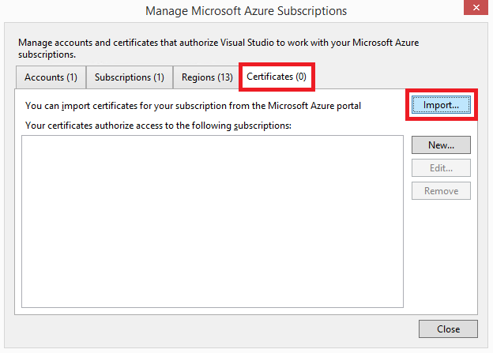

<properties 
   pageTitle="Zugreifen auf private Azure Wolken mit Visual Studio | Microsoft Azure"
   description="Erfahren Sie, wie private Zugriff auf Cloudressourcen mithilfe von Visual Studio."
   services="visual-studio-online"
   documentationCenter="na"
   authors="TomArcher"
   manager="douge"
   editor="" />
<tags 
   ms.service="multiple"
   ms.devlang="dotnet"
   ms.topic="article"
   ms.tgt_pltfrm="na"
   ms.workload="multiple"
   ms.date="08/15/2016"
   ms.author="tarcher" />

# Zugreifen auf private Azure Wolken mit Visual Studio

##(Übersicht)

Standardmäßig unterstützt Visual Studio öffentlichen Azure Cloud REST-Endpunkte. Dies kann jedoch ein Problem aufgetreten sein, wenn Sie eine private Azure Cloud Visual Studio mit. Zertifikate können Sie Visual Studio Zugriff auf private Azure Cloud REST-Endpunkte konfigurieren. Sie können diese erhalten Zertifikate über Ihre Azure veröffentlichen-Einstellungsdatei.

## Eine private Azure Zugriff auf Cloud in Visual Studio

1. Im [Azure klassischen Portal](http://go.microsoft.com/fwlink/?LinkID=213885) für die private Cloud Herunterladen der Einstellungsdatei veröffentlichen, oder wenden Sie sich an den Administrator für eine Einstellungsdatei veröffentlichen. Klicken Sie auf der öffentlichen Version von Azure ist der Link zum download dieses [https://manage.windowsazure.com/publishsettings/](https://manage.windowsazure.com/publishsettings/). (Die Datei, die Sie herunterladen, sollte eine PUBLISHSETTINGS-Erweiterung haben.)

1. Wählen Sie aus dem **Azure** -Knoten in **Server-Explorer** in Visual Studio und wählen Sie im Kontextmenü den Befehl **Abonnements verwalten** .

    

1. Klicken Sie im Dialogfeld **Microsoft Azure-Abonnements verwalten** wählen Sie die Registerkarte **Zertifikate** , und wählen Sie dann auf die Schaltfläche **Importieren** .

    

1. Navigieren Sie zu dem Ordner, in dem Sie die Einstellungsdatei veröffentlichen gespeichert Wählen Sie die Datei aus, und dann die Schaltfläche **Importieren** , klicken Sie im Dialogfeld **Importieren Microsoft Azure-Abonnements** . Dadurch wird die Zertifikate in der Einstellungsdatei Veröffentlichen in Visual Studio importiert. Sie sollten jetzt mit Ihrer privaten Cloudressourcen interagieren sein.

    

## Nächste Schritte

[Veröffentlichen auf einem Azure-Cloud-Dienst von Visual Studio](https://msdn.microsoft.com/library/azure/ee460772.aspx)

[So: herunterladen und importieren, veröffentlichen Sie Einstellungen und Abonnementinformationen](https://msdn.microsoft.com/library/dn385850(v=nav.70).aspx)

