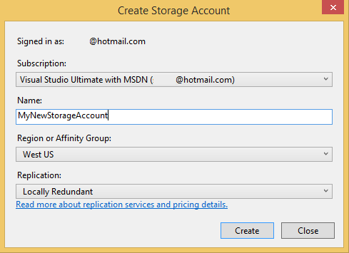

<properties
   pageTitle="Vorbereiten der veröffentlichen oder Bereitstellen einer Azure-Anwendung von Visual Studio | Microsoft Azure"
   description="Erfahren Sie die Verfahren zum Einrichten von Cloud und Speicher Konto Services und Azure-Anwendung konfigurieren."
   services="visual-studio-online"
   documentationCenter="na"
   authors="TomArcher"
   manager="douge"
   editor="" />
<tags
   ms.service="multiple"
   ms.devlang="dotnet"
   ms.topic="article"
   ms.tgt_pltfrm="na"
   ms.workload="multiple"
   ms.date="08/15/2016"
   ms.author="tarcher" />

# Vorbereiten der veröffentlichen oder Bereitstellen einer Azure-Anwendung von Visual Studio

## (Übersicht)

Bevor Sie ein Projekt Cloud-Dienst veröffentlichen können, müssen Sie die folgenden Dienste einrichten:

- Einen **Cloud-Dienst** zum Ausführen Ihrer Rollen in der Azure-Umgebung

- Ein **Speicher-Konto** , das Zugriff auf die Dienste Blob, Warteschlange und Tabelle enthält.

Gehen Sie folgendermaßen vor, diese Dienste einrichten und Konfigurieren der Anwendungs

## Erstellen Sie einen Clouddienst

Um einen Clouddienst auf Azure zu veröffentlichen, erstellen Sie zuerst einen Clouddienst, der Ihre Rollen in der Azure-Umgebung ausgeführt wird. Sie können einen Clouddienst im [Azure klassischen Portal](http://go.microsoft.com/fwlink/?LinkID=213885)erstellen, wie im Abschnitt **zum Erstellen eines Cloud-Diensts mithilfe des Azure klassischen Portals**später in diesem Artikel beschrieben. Sie können auch einen Clouddienst in Visual Studio erstellen, mit dem Veröffentlichen-Assistenten.

### So erstellen Sie einen Clouddienst mit Visual Studio

1. Öffnen Sie das Kontextmenü für das Projekt Azure, und wählen Sie dann **Veröffentlichen**.

    

1. Wenn Sie sich angemeldet haben, melden Sie sich mit Ihrem Benutzernamen und Kennwort für das Microsoft-Konto oder organisationskonto, die Ihr Abonnement Azure zugeordnet ist.

1. Wählen Sie **Weiter** , um zur Seite **Einstellungen** zu gelangen.

    

1. Wählen Sie in der Liste **Cloud Services** **Neu erstellen**. Das Dialogfeld **Azure Services erstellen** wird angezeigt.

1. Geben Sie den Namen der Cloud-Dienst aus. Der Name Teil der URL des Diensts Formularen und daher global eindeutig sein muss. Der Name wird nicht beachtet.

### Cloud-Dienst erstellen, mit dem klassischen Azure-portal

1. Melden Sie sich auf der Website Microsoft [Azure klassischen Portal](http://go.microsoft.com/fwlink/?LinkId=253103) aus.

1. (optional) Um eine Liste der Clouddienste anzuzeigen, die Sie bereits erstellt haben, wählen Sie in des Cloud Services-links auf der linken Seite der Seite.

1. Wählen Sie aus der **+** -Symbol in der unteren linken Ecke, und wählen Sie dann in der daraufhin angezeigten Menü **Cloud-Dienst** . Einem anderen Bildschirm mit zwei Optionen, **Schnellen Erstellen** und **Benutzerdefinierte erstellen**wird angezeigt. Wenn Sie **Schnell erstellen**auswählen, können Sie einen Clouddienst, indem er seine URL und der Bereich, in dem es physisch gehostet wird, einfach erstellen. Wenn Sie **Benutzerdefinierte erstellen**auswählen, können Sie einen Clouddienst sofort nach Angabe eines Pakets (.cspkg-Datei), eine Konfigurationsdatei (.cscfg) und ein Zertifikat veröffentlichen. Erstellen benutzerdefinierter nicht erforderlich, wenn Sie Ihre Cloud-Dienst mithilfe des Befehls **Veröffentlichen** in einem Azure-Projekt veröffentlichen möchten. Der Befehl " **Veröffentlichen** " steht im Kontextmenü für ein Azure-Projekt.

1. Wählen Sie später Ihre Cloud-Dienst veröffentlichen mit Visual Studio **Schnellen Erstellen** .

1. Geben Sie einen Namen für Ihre Cloud-Dienst an. Die vollständige URL wird neben dem Namen angezeigt.

1. Wählen Sie in der Liste der Region, wo sich die meisten Benutzer befinden.

1. Wählen Sie am unteren Rand des Fensters den Link **Cloud-Dienst erstellen** aus.

## Erstellen Sie ein Speicherkonto

Ein Speicherkonto bietet Zugriff auf die Tabelle, Warteschlange und Blob-Dienste. Sie können ein Speicherkonto mithilfe von Visual Studio oder das [Azure klassischen Portal](http://go.microsoft.com/fwlink/?LinkId=253103)erstellen.

### Erstellen eines Speicher-Kontos mit Visual Studio

1. Öffnen Sie im **Explorer Lösung**das Kontextmenü für den **Speicher** -Knoten, und wählen Sie dann **Speicher-Konto erstellen**.

    

1. Wählen Sie aus, oder geben Sie die folgende Informationen für das neue Speicherkonto im Dialogfeld **Speicher-Konto erstellen** .
    - Das Azure-Abonnement, das Sie das Speicherkonto hinzufügen möchten.
    - Der Name, den Sie für das neue Speicherkonto verwenden möchten.
    - Die Region oder die Zugehörigkeit Gruppe (z. B. Westen US oder Ostasien).
    - Die Art der Replikation, die Sie für den Speicherkonto, beispielsweise Geo redundante verwenden möchten.

1. Wenn Sie fertig sind, wählen Sie **Erstellen**. Das neue Speicherkonto wird in der Liste **Speicher** **Server-Explorer**.

### Erstellen eines Speicher-Kontos mithilfe des klassischen Azure-Portals

1. Melden Sie sich auf der Website Microsoft [Azure klassischen Portal](http://go.microsoft.com/fwlink/?LinkId=253103) aus.

1. (Optional) Wenn Ihre Speicherkonten anzeigen möchten, wählen Sie den **Speicher** -Link in dem Bereich auf der linken Seite der Seite ein.

1. Wählen Sie in der unteren linken Ecke der Seite, die **+** Symbol.

1. Klicken Sie in der, das daraufhin angezeigten Menü Wählen Sie **Speicher**, und wählen Sie dann aus der **Symbolleiste erstellen**.

1. Benennen Sie dem Speicherkonto, die einen eindeutigen Url führt.

1. Benennen Sie Ihre Cloud-Dienst. Die vollständige URL wird neben dem Namen angezeigt.

1. Wählen Sie in der Liste der Gebiete einen Bereich, wo sich die meisten Benutzer befinden.

1. Geben Sie an, ob Sie Geo-Replikation aktivieren möchten. Wenn Sie Geo-Replikation aktivieren, werden die Daten in mehreren physischen Speicherorten, das Risiko von Datenverlusten zu verringern gespeichert werden. Dieses Feature wird Speicher teurer, aber Sie können die Kosten reduzieren, indem Sie die Aktivierung der geografischen Position bei der Erstellung des Speicherkontos anstelle die Funktion später hinzufügen. Weitere Informationen finden Sie unter [Geo-Replikation](http://go.microsoft.com/fwlink/?LinkId=253108).

1. Wählen Sie am unteren Rand des Fensters den Link **Speicherkonto erstellen** aus.

Nachdem Sie Ihr Speicherkonto erstellt haben, sehen Sie die URLs, die Sie verwenden können, um Ressourcen in den einzelnen Dienste Azure-Speicher, und der primären und sekundären Tastenkombinationen für Ihr Konto zugreifen. Sie verwenden Sie diese Tastenkombinationen zum Authentifizieren Anfragen gegen die Speicherdienste vorgenommen.

>[AZURE.NOTE] Sekundäre Zugriffstaste ermöglicht denselben Zugriff auf Ihr Speicherkonto als primären Zugriffstaste und generiert als Sicherung Ihrer primären Zugriffstaste beeinträchtigt werden sollte. Darüber hinaus empfiehlt es sich, dass Sie Ihre Tastenkombinationen in regelmäßigen Abständen neu generieren. Sie können eine Verbindung Zeichenfolge Einstellung sekundären Schlüssel verwenden, während Sie den Primärschlüssel, neu generieren und dann ändern können, um den neu generierte Primärschlüssel verwenden, während Sie den sekundären Schlüssel neu erstellen, ändern.

## Konfigurieren der app, um das Speicherkonto-Dienste verwenden

Sie müssen eine Rolle konfigurieren, die greift auf Speicherservices, um die Azure-Speicher-Dienste verwenden, die Sie erstellt haben. Hierzu können Sie mehrere Dienstkonfigurationen für ein Projekt Azure verwenden. Standardmäßig werden zwei im Projekt Azure erstellt. Mithilfe von Konfigurationen von mehreren Diensten, können Sie dieselbe Verbindungszeichenfolge im Code verwenden, haben aber einen anderen Wert für eine Verbindungszeichenfolge in jeder Dienstkonfiguration. Beispielsweise können Sie eine Dienstkonfiguration ausführen und Debuggen Ihrer Anwendung lokal mit Azure Speicheremulator und eine andere Dienstkonfiguration Ihrer Anwendung in Azure veröffentlichen. Weitere Informationen zu Service-Konfigurationen finden Sie unter [Konfigurieren Ihrer Azure Project verwenden mehrerer Dienstkonfigurationen](vs-azure-tools-multiple-services-project-configurations.md).

### So konfigurieren Sie die Anwendung Dienste verwenden, die das Speicherkonto bietet

1. Öffnen Sie Ihre Azure-Lösung in Visual Studio. Öffnen Sie in Lösung Explorer das Kontextmenü für jede Rolle im Projekt Azure, die die Speicherdienste greift auf, und wählen Sie **Eigenschaften**aus. Eine Seite mit dem Namen der Rolle ist im Visual Studio-Editor angezeigt. Die Seite zeigt die Felder für die Registerkarte **Konfiguration** .

1. Wählen Sie in der Eigenschaftenseiten für die Rolle aus die **Einstellungen**aus.

1. Wählen Sie den Namen der Dienstkonfiguration, die Sie bearbeiten möchten, klicken Sie in der Liste **Dienstkonfiguration** . Wenn Sie alle der Dienstkonfigurationen für diese Rolle ändern möchten, können Sie **Alle Konfigurationen**auswählen.  Weitere Informationen zum Dienstkonfigurationen aktualisieren finden Sie im Abschnitt **Verwalten Verbindungszeichenfolgen für Speicher-Konten** unter dem Thema [konfigurieren die Rollen für einen Azure-Cloud-Dienst mit Visual Studio](vs-azure-tools-configure-roles-for-cloud-service.md).

1. Wenn keine Verbindung Zeichenfolge Einstellungen ändern möchten, wählen Sie die **...** neben der Einstellung. Das Dialogfeld **Speicher Verbindungszeichenfolge erstellen** wird angezeigt.

1. Klicken Sie unter **Verbindung herstellen über**die Option **Ihr Abonnement** aus.

1. Wählen Sie in der Liste **Abonnement** Ihres Abonnements. Wenn die Liste der Abonnements den enthält, die Sie möchten, wählen Sie den Link **Herunterladen Einstellungen veröffentlichen** .

1. Wählen Sie in der Liste **Kontonamen** aus Ihren speicherkontonamen für ein. Azure Tools erhält Anmeldeinformationen Speicher automatisch mithilfe der PUBLISHSETTINGS-Datei. Wenn Sie Ihre Anmeldeinformationen ein Speicher-Konto manuell angegeben werden, wählen Sie die Option **manuell eingegebenen Anmeldeinformationen** , und fahren Sie mit diesem Verfahren. Sie können Ihren Kontonamen Speicher und die Primärschlüssel aus dem [Azure klassischen Portal](http://go.microsoft.com/fwlink/p/?LinkID=213885)erhalten. Wenn Sie Ihre Speicher angeben möchten, nicht kontoeinstellungen manuell, wählen Sie die Schaltfläche **OK** , um das Dialogfeld zu schließen.

1. Wählen Sie den Link der **EINGABETASTE Speicherkonto** -Anmeldeinformationen an.

1. Geben Sie in das Feld **Kontoname** den Namen Ihres Kontos Speicher ein.

    >[AZURE.NOTE] Melden Sie sich bei der [Azure klassischen Portal](http://go.microsoft.com/fwlink/?LinkID=213885), und wählen Sie dann auf die Schaltfläche **Speicher** . Im Portal zeigt eine Liste der Speicherkonten. Wenn Sie ein Konto auswählen, wird eine Seite dafür geöffnet. Auf dieser Seite können Sie den Namen des Speicherkontos kopieren. Wenn Sie mit eine frühere Version des Portals klassischen arbeiten, wird der Name Ihres Kontos Speicher in der Ansicht **Speicherkonten** angezeigt. Wenn dieser Name kopieren möchten, markieren Sie es im Fenster **Eigenschaften** der Ansicht, und wählen Sie dann die Tasten STRG + C. Wenn Sie den Namen in Visual Studio einfügen möchten, wählen Sie im Textfeld **Konto** aus, und wählen Sie dann die Tasten STRG + V.

1. Geben Sie in das Feld **kontoschlüssel** ein Ihre Primärschlüssel, oder kopieren Sie, und fügen Sie ihn aus dem [Azure klassischen Portal](http://go.microsoft.com/fwlink/?LinkID=213885).
    So kopieren Sie diese Taste:

    1. Wählen Sie am unteren Rand der Seite für den entsprechenden Speicherkonto die Schaltfläche **Schlüssel verwalten** aus.

    1. Klicken Sie auf der Seite **Verwalten des Zugriffs Tasten** markieren Sie den Text der primären Tastenkombination, und wählen Sie dann die Tasten STRG + C.

    1. Fügen Sie die Taste Azure-Tools in das Feld **kontoschlüssel** ein.

    1. Sie müssen wählen Sie eine der folgenden Optionen, um zu bestimmen, wie der Dienst das Speicherkonto zugreifen:
        - **HTTP-verwenden**. Dies ist die Option standard. Beispielsweise `http://<account name>.blob.core.windows.net`.
        - **Verwenden von HTTPS** für eine sichere Verbindung. Beispielsweise `https://<accountname>.blob.core.windows.net`.
        - **Benutzerdefinierte Endpunkte angeben** für jeden der drei Dienste. Sie können diese Endpunkte klicken Sie dann in das Feld für den bestimmten Dienst eingeben.

        >[AZURE.NOTE] Wenn Sie benutzerdefinierte Endpunkte erstellen, können Sie eine komplexere Verbindungszeichenfolge erstellen. Wenn Sie diese Zeichenfolgenformat verwenden, können Sie Speicherplatz Endpunkte angeben, die einen benutzerdefinierten Domänennamen enthalten, den Sie für Ihr Speicherkonto mit dem Blob-Dienst registriert haben. Sie können auch nur Zugriff auf Blob-Ressourcen in einem einzelnen Container durch eine Signatur gemeinsamen Zugriff gewähren. Weitere Informationen zum Erstellen von benutzerdefinierte Endpunkten finden Sie unter [Konfigurieren von Azure Speicher Verbindungszeichenfolgen](storage-configure-connection-string.md).

1. Um diese Verbindung Zeichenfolge Änderungen zu speichern, wählen Sie die Schaltfläche **OK** aus, und wählen Sie dann auf der Symbolleiste auf die Schaltfläche **Speichern** . Nachdem Sie diese Änderungen zu speichern, können Sie den Wert diese Verbindungszeichenfolge im Code abrufen, mithilfe von [GetConfigurationSettingValue](https://msdn.microsoft.com/library/azure/microsoft.windowsazure.serviceruntime.roleenvironment.getconfigurationsettingvalue.aspx). Wenn Sie eine Anwendung in Azure veröffentlichen, wählen Sie die Dienstkonfiguration, die das Konto Azure-Speicher für die Verbindungszeichenfolge enthält. Nach Ihrer Anwendung veröffentlicht wird, stellen Sie sicher, dass die Anwendung erwartungsgemäß gegen die Dienste Azure-Speicher

## Nächste Schritte

Weitere Informationen zum Veröffentlichen von apps zu Azure aus Visual Studio, finden Sie unter [Veröffentlichen einer mithilfe der Tools Azure-Cloud-Dienst](vs-azure-tools-publishing-a-cloud-service.md).
