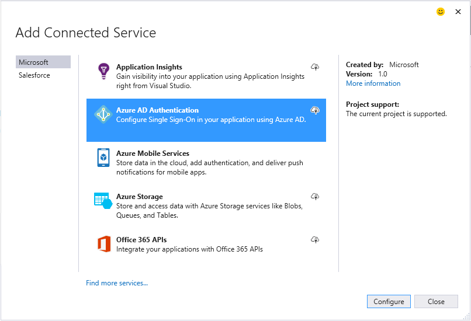
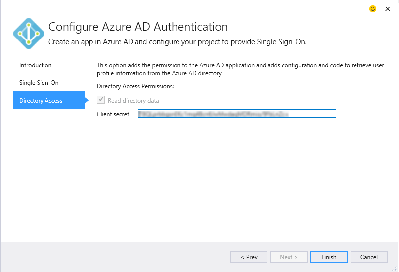

<properties 
   pageTitle="Hinzufügen einer Azure Active Directory mithilfe von Diensten verbunden in Visual Studio | Microsoft Azure"
   description="Hinzufügen einer Azure Active Directory mithilfe des Dialogfelds Visual Studio verbunden Dienste hinzufügen"
   services="visual-studio-online"
   documentationCenter="na"
   authors="TomArcher"
   manager="douge"
   editor="" />
<tags 
   ms.service="active-directory"
   ms.devlang="multiple"
   ms.topic="article"
   ms.tgt_pltfrm="na"
   ms.workload="na"
   ms.date="08/15/2016"
   ms.author="tarcher" />

# Hinzufügen einer Azure Active Directory mithilfe von Diensten verbunden in Visual Studio 

##(Übersicht)
Mithilfe von Azure Active Directory (Azure AD), können Sie für einmaliges Anmelden (SSO) für ASP.NET-MVC-Anwendungen Web oder im Web-API-Diensten AD-Authentifizierung unterstützen. Mit Azure AD-Authentifizierung können die Benutzer ihre Konten aus Azure AD Verbindung zu Ihrem Webanwendungen verwenden. Die Vorteile von Azure AD-Authentifizierung mit Web-API umfassen erweiterte Sicherheit, eine API aus einer Webanwendung verfügbar zu machen. Mit Azure AD müssen Sie kein separates Authentifizierungssystem mit einem eigenen Management-Konto und Benutzer verwalten.

## Unterstützte Projekttypen

Das Dialogfeld verbunden Services können Verbindung zum Azure AD in den folgenden Projekttypen.

- ASP.NET-MVC-Projekte

- ASP.NET Web API Projekte

### Verbinden Sie mit Azure AD mithilfe des Dialogfelds Services verbunden.

1. Stellen Sie sicher, dass Sie ein Azure-Konto besitzen. Wenn Sie ein Azure-Konto besitzen, können Sie für eine [kostenlose Testversion](http://go.microsoft.com/fwlink/?LinkId=518146)registrieren.

1. Klicken Sie in Visual Studio öffnen Sie das Kontextmenü des Knotens **Verweise** im Projekt, und wählen Sie **Verbundene Dienste hinzufügen**.
1. Wählen Sie **Azure AD-Authentifizierung** aus, und wählen Sie dann **Konfigurieren**.

    

1. Aktivieren Sie auf der ersten Seite der **Konfigurieren Azure AD-Authentifizierung** **Konfigurieren einmaliges Anmelden Azure AD-**.

    Wenn Ihr Projekt mit einer anderen Authentifizierungskonfiguration konfiguriert ist, gibt eine Warnung aus der Assistent Sie, dass Sie den Vorgang fortsetzen die vorherige Konfiguration deaktivieren.

    

1.  Klicken Sie auf der zweiten Seite Wählen Sie eine Domäne aus der **Domäne** Dropdown-Liste aus. Die Liste der Domänen enthält alle verfügbaren Domänen, indem Sie im Dialogfeld Kontoeinstellungen aufgeführten Konten. Alternativ können Sie einen Domänennamen eingeben, wenn Sie den finden Sie, wie etwa mydomain.onmicrosoft.com gefunden haben. Sie können auswählen, die Option zum Erstellen eines neuen Azure AD-app oder verwenden Sie die Einstellungen aus einer vorhandenen Azure AD-app. 

    

1. Stellen Sie auf der dritten Seite des Assistenten sicher, dass das **Verzeichnisdaten lesen** aktiviert ist. Der Assistent setzt im Feld **Client geheim**. 

    

1. Wählen Sie die Schaltfläche **Fertig stellen** aus. Das Dialogfeld addiert die erforderlichen Konfigurationsschritte Code und Verweise auf Ihr Projekt zur Azure AD-Authentifizierung aktivieren. Sie können auf das [Portal Azure](http://go.microsoft.com/fwlink/p/?LinkID=525040)AD-Domäne anzeigen.

1. Überprüfen der Seite Erste Schritte, die in Ihrem Browser Tipps zur nächsten Schritte angezeigt wird, und der Seite geblieben, um anzuzeigen, wie Ihr Projekt geändert wurde. Wenn Sie überprüfen, dass alles gearbeitet haben, öffnen Sie die geänderte Konfigurationsdateien, und überprüfen Sie Folgendes möchten sind die Einstellungen in den Vorkommnissen angegeben ist es. Angenommen, wird das Hauptfenster web.config in einem ASP.NET-MVC-Projekt diese Einstellungen hinzugefügt haben:

        <appSettings> 
            <add key="ida:ClientId" value="ClientId from the new Azure AD App" />
            <add key="ida:AADInstance" value="https://login.windows.net/" />
            <add key="ida:Domain" value="Your selected domain" />
            <add key="ida:TenantId" value="The Id of your selected Azure AD Tenant" />
            <add key="ida:PostLogoutRedirectUri" value="The default redirect URI from the project" />
        </appSettings>

## Wie Ihr Projekt geändert wird

Wenn Sie den Assistenten ausführen, wird Visual Studio addiert Azure AD und Verweise zum Projekt verknüpft. Konfigurationsdateien und Codedateien in Ihrem Projekt werden auch geändert, um Unterstützung für Azure AD hinzuzufügen. Bestimmten Änderungen, die Visual Studio macht richtet sich nach dem Projekt. Ausführliche Informationen dazu, wie ASP.NET-MVC-Projekte geändert werden finden Sie unter [Was ist – MVC-Projekte](http://go.microsoft.com/fwlink/p/?LinkID=513809). Web-API Projekte finden Sie unter [den Vorkommnissen – Web API Projekte](http://go.microsoft.com/fwlink/p/?LinkId=513810).

##Nächste Schritte

Stellen von Fragen und Hilfe.

 - [-Forum im MSDN: Azure AD](https://social.msdn.microsoft.com/forums/azure/home?forum=WindowsAzureAD)

 - [Azure AD-Dokumentation](https://azure.microsoft.com/documentation/services/active-directory/)

 - [Blogbeitrag: Einführung in Azure AD](http://blogs.msdn.com/b/brunoterkaly/archive/2014/03/03/introduction-to-windows-azure-active-directory.aspx)

