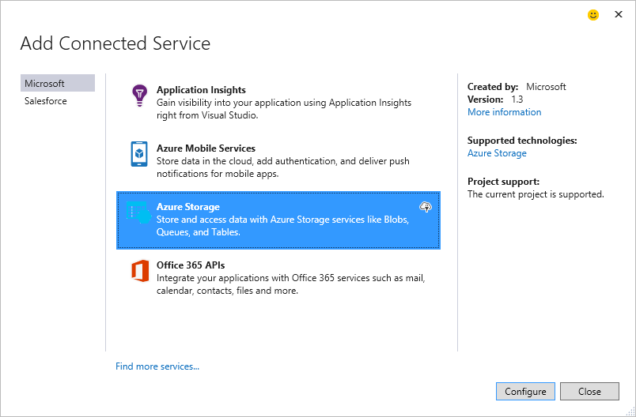

<properties 
   pageTitle="Hinzufügen von Azure-Speicher mithilfe von Diensten verbunden in Visual Studio | Microsoft Azure"
   description="Hinzufügen von Azure-Speicher zu Ihrer Anwendung mithilfe des Dialogfelds Visual Studio verbunden Dienste hinzufügen"
   services="visual-studio-online"
   documentationCenter="na"
   authors="TomArcher"
   manager="douge"
   editor="" />
<tags 
   ms.service="storage"
   ms.devlang="na"
   ms.topic="article"
   ms.tgt_pltfrm="na"
   ms.workload="na"
   ms.date="08/15/2016"
   ms.author="tarcher" />

# Hinzufügen von Azure-Speicher mithilfe von Visual Studio verbunden Services

## (Übersicht)

Mit Visual Studio 2015 können Sie alle C#-Cloud-Dienst, .NET Back-End-mobile Service, ASP.NET-Website oder Dienst, ASP.NET 5-Dienst oder WebJob Azure Service mit Azure-Speicher verbinden, über das Dialogfeld **Verbunden Dienste hinzufügen** . Die Dienstfunktionalität der verbundenen fügt die benötigten Verweise und Verbindungscode und Ihre Konfigurationsdateien ordnungsgemäß ändert. Das Dialogfeld gelangen Sie auch in der Dokumentation, die Sie darüber Was sind den nächsten Schritten fort informiert, um Blob-Speicher, Warteschlangen und Tabellen zu starten.

## Unterstützte Projekttypen

Im Dialogfeld verbunden Services können Sie in den folgenden Projekttypen mit Azure-Speicher herstellen.

- ASP.NET Web-Projekte

- ASP.NET 5 Projekte

- .NET Cloud-Dienst Webrolle und Worker Rolle Projekte

- .NET Mobile Services-Projekte

- Azure WebJob Projekte

## Herstellen einer Verbindung mithilfe des Dialogfelds Services verbunden Azure-Speicher mit

1. Stellen Sie sicher, dass Sie ein Azure-Konto besitzen. Wenn Sie ein Azure-Konto besitzen, können Sie für eine [kostenlose Testversion](http://go.microsoft.com/fwlink/?LinkId=518146)registrieren. Nachdem Sie ein Azure-Konto haben, können Sie Speicherkonten erstellen, mobile-Dienste erstellen und Konfigurieren von Azure Active Directory.

1. Öffnen Sie das Projekt in Visual Studio, öffnen Sie das Kontextmenü für den Knoten **Verweise** in der Lösung-Explorer, und wählen Sie dann **Verbunden Dienst hinzufügen**.

    

1. Klicken Sie im Dialogfeld **Verbunden Dienst hinzufügen** wählen Sie **Azure-Speicher**, und wählen Sie dann auf die Schaltfläche **Konfigurieren** . Sie möglicherweise aufgefordert, die in Azure melden, wenn Sie dies nicht bereits getan haben.

    

1. Klicken Sie im Dialogfeld **Azure-Speicher** wählen Sie ein vorhandenes Speicherkonto aus, und wählen Sie **Hinzufügen**aus.

    Wenn Sie zum Erstellen eines neuen Kontos mit Speicher müssen, wechseln Sie zu dem nächsten Schritt fort. Andernfalls fahren Sie mit Schritt 6 fort.

    

1. So erstellen Sie ein neues Speicherkonto 

    1. Wählen Sie die Schaltfläche **Erstellen eines neuen Kontos mit Speicher** am unteren Rand des Dialogfelds Azure-Speicher.

    1. Füllen Sie im Dialogfeld **Speicher-Konto erstellen** , und wählen Sie dann auf die Schaltfläche **Erstellen** .
    
        

        Wenn Sie sich wieder im Dialogfeld **Azure-Speicher** befinden, wird der neue Speicher in der Liste angezeigt.

    1. Wählen Sie den neuen Speicher in der Liste aus, und wählen Sie **Hinzufügen**aus.

1. Der Speicherdienst verbunden wird unter dem Dienstverweise Knoten Ihres Projekts WebJob angezeigt.

    

1. Überprüfen Sie die erste Schritte-Seite, die angezeigt wird, und erfahren Sie, wie Ihr Projekt geändert wurde. In Ihrem Browser wird eine Seite Erste Schritte angezeigt, sobald Sie einen verbundenen Dienst hinzufügen. Sie überprüfen die vorgeschlagene nächste Schritte und Codebeispielen, oder wechseln Sie zu der Seite geblieben, um anzuzeigen, welche Verweise zum Projekt hinzugefügt wurden, und wie Ihre Dateien Code und Konfiguration geändert wurden.

## Wie Ihr Projekt geändert wird

Klicken Sie abschließend im Dialogfeld Visual Studio Verweise hinzugefügt, und bestimmte Konfigurationsdateien ändert. Bestimmten Änderungen richtet sich nach dem Projekt. 

 - ASP.NET-Projekte finden Sie unter [Was ist – ASP.NET-Projekte](http://go.microsoft.com/fwlink/p/?LinkId=513126). 
 - ASP.NET 5 Projekte finden Sie unter [Was ist – ASP.NET 5 Projekte](http://go.microsoft.com/fwlink/p/?LinkId=513124). 
 - Cloud Service-Projekte (Webrollen und Worker-Rollen), finden Sie unter [den Vorkommnissen – Cloud-Dienst Projekte](http://go.microsoft.com/fwlink/p/?LinkId=516965). 
 - WebJob Projekte finden Sie unter [Was ist - WebJob Projekte](./storage/vs-storage-webjobs-what-happened.md).

## Nächste Schritte

1. Erste Schritte mit Codebeispielen als Leitfaden, erstellen den Typ der Speicher die gewünschte, und beginnen Sie Schreiben von Code Zugriff auf Ihr Speicherkonto!

1. Stellen von Fragen und erhalten von Hilfe
     - [Forum im MSDN: Azure-Speicher](https://social.msdn.microsoft.com/forums/azure/home?forum=windowsazuredata)

     - [Azure-Speicher-Teamblog](http://blogs.msdn.com/b/windowsazurestorage/)

     - [Speicher mit azure.microsoft.com](https://azure.microsoft.com/services/storage/)

     - [Speicher-Dokumentation unter azure.microsoft.com](https://azure.microsoft.com/documentation/services/storage/)

