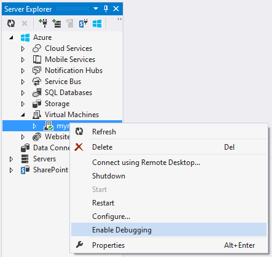
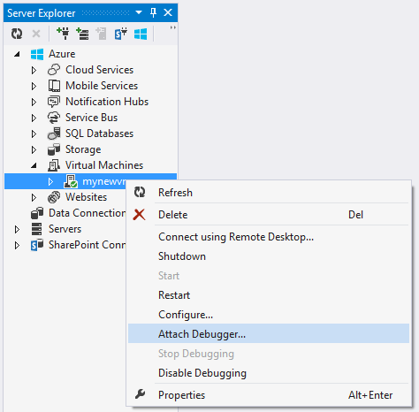
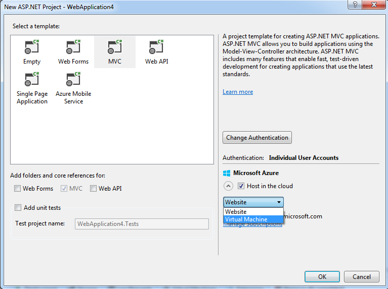
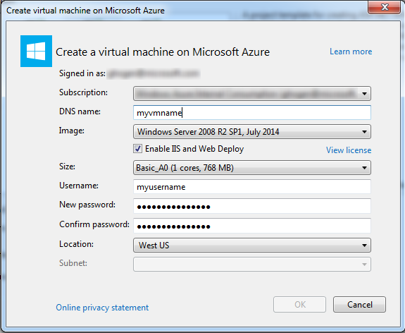

<properties 
    pageTitle="Ein Azure-Cloud-Dienst oder virtuellen Computern in Visual Studio debuggen | Microsoft Azure"
    description="Debuggen eines Cloud-Dienst oder virtuellen Computern in Visual Studio"
    services="visual-studio-online"
    documentationCenter="na"
    authors="TomArcher"
    manager="douge"
    editor="" />
<tags 
    ms.service="visual-studio-online"
    ms.devlang="multiple"
    ms.topic="article"
    ms.tgt_pltfrm="multiple"
    ms.workload="na"
    ms.date="08/15/2016"
    ms.author="tarcher" />

# Für das Debuggen einer Azure-Cloud-Dienst oder virtuellen Computern in Visual Studio

Visual Studio bietet verschiedene Optionen für das Debuggen Azure-Cloud-Diensten und virtuellen Computern.

## Debuggen des Cloud-Diensts auf Ihrem lokalen computer

Können Sie Zeit sparen und Geld mithilfe der Azure Emulator in der Cloud-Dienst auf einem lokalen Computer Debuggen zu berechnen. Durch das Debuggen von eines Diensts lokal vor der Bereitstellung, können Sie Zuverlässigkeit und Leistung ohne bezahlen zum Berechnen Mal zu verbessern. Jedoch einige mögliche Fehler nur beim Cloud-Dienst in Azure ausführen selbst. Sie können diese Fehler debuggen, wenn Sie remote Debuggen, wenn Sie den Dienst veröffentlichen und dann Sie eine Instanz der Rolle Debuggen aktivieren.

Der Emulator simuliert den Dienst Azure zu berechnen und in Ihrer lokalen Umgebung ausgeführt wird, damit Sie testen und Debuggen von Ihrem Cloud-Dienst vor der Bereitstellung können. Der Emulator des Lebenszyklus von Ihrer Rolleninstanzen verarbeitet und ermöglicht den Zugriff auf simulierten Ressourcen, wie z. B. lokale Speicher. Beim Debuggen oder den Dienst von Visual Studio ausführen, automatisch startet den Emulator als Hintergrund-Anwendung, und klicken Sie dann in den Emulator einsetzt des Diensts. Den Emulator können den Dienst anzeigen, wenn sie in der lokalen Umgebung ausgeführt wird. Sie können die Vollversion oder der express-Version des Emulators ausführen. (Beginnend mit Azure 2.3, ist die ausdrückliche Version des Emulators die Standardeinstellung.) Finden Sie unter [Emulator mit Express ausführen und einen Clouddienst lokal Debuggen](https://msdn.microsoft.com/library/dn339018.aspx).

### In der Cloud-Dienst auf dem lokalen Computer Debuggen

1. Wählen Sie in der Menüleiste **Debuggen**, **Debuggen starten** , um das Projekt Azure-Cloud-Dienst ausführen. Alternativ können Sie F5 drücken. Eine Meldung wird angezeigt, die der Serveremulator gestartet wird. Wenn der Emulator gestartet wird, wird das Taskleisten-Symbol es bestätigt.

    

1. Anzuzeigen Sie die Benutzeroberfläche für die Serveremulator, öffnen das Kontextmenü für das Azure-Symbol im Benachrichtigungsbereich, und wählen Sie **Berechnen Emulator-Benutzeroberfläche anzeigen**.

    Im linken Bereich der Benutzeroberfläche zeigt die Dienste, die zurzeit bereitgestellt werden, der Serveremulator und die Rolleninstanzen, die jeden Dienst ausgeführt wird. Wählen Sie den Dienst oder die Rollen Lebenszyklus, Protokollierung und Diagnoseinformationen im rechten Bereich angezeigt. Wenn Sie den Fokus in der am oberen Rand eines Fensters enthalten setzen, wird die Größe des füllen Sie im rechten Bereich.

1. Durchlaufen Sie die Anwendung, indem Sie die Befehle im Menü **Debuggen** und Festlegen von Haltepunkten im Code aus. Wenn Sie die Anwendung im Debugger schrittweise ausführen, werden die Bereiche mit den aktuellen Status der Anwendung aktualisiert. Wenn Sie das Debuggen beenden, wird die Bereitstellung der Anwendung gelöscht. Wenn Ihre Anwendung eine Webrolle enthält, und Sie die Eigenschaft Start Aktion So starten Sie den Webbrowser festgelegt haben, startet Visual Studio Ihrer Webanwendung im Browser. Wenn Sie die Anzahl der Instanzen einer Rolle in die Dienstkonfiguration ändern, müssen Sie Ihre Cloud-Dienst beenden und neu starten für das Debuggen, damit Sie diese neuen Instanzen der Rolle Debuggen können.

    **Hinweis:** Wenn Sie Beenden des Diensts Debuggen oder ausführen, sind nicht den lokalen Computer und der Speicheremulator abgebrochen. Sie müssen diese explizit aus dem Infobereich beenden.

## Einen Clouddienst in Azure Debuggen

Um einen Cloud-Dienst von einem Remotecomputer Debuggen zu können, müssen Sie diese Funktionen explizit aktivieren, wenn Sie Ihre Cloud-Dienst bereitstellen, sodass die erforderlichen Dienste (beispielsweise msvsmon.exe) auf den virtuellen Computern installiert werden, die Ihre Rolleninstanzen ausgeführt werden. Wenn Sie remote Debuggen aktivieren haben, wenn Sie den Dienst veröffentlicht, müssen Sie den Dienst mit aktiviertem remote Debuggen zentral.

Wenn Sie remote Debuggen für einen Clouddienst aktivieren, wird nicht es Leistung verringert oder fallen zusätzliche Gebühren. Verwenden Sie nicht remote-Debuggen auf einen Dienst Herstellung, da Clients, die den Dienst verwenden beeinträchtigt werden können.

>[AZURE.NOTE] Wenn Sie einen Cloud-Dienst von Visual Studio veröffentlichen, können Sie **IntelliTrace** für alle Rollen in diesen Dienst aktivieren, die auf .NET Framework 4 oder .NET Framework 4.5 ausgerichtet. Mithilfe von **IntelliTrace**können Sie untersuchen Ereignisse, die in einer Instanz der Rolle in der Vergangenheit liegt und den innerhalb dieses Zeitraums reproduzieren. Finden Sie unter [Debuggen eines veröffentlichten Cloud-Diensts mit IntelliTrace und Visual Studio](http://go.microsoft.com/fwlink/?LinkID=623016) und [IntelliTrace verwenden](https://msdn.microsoft.com/library/dd264915.aspx).

### So aktivieren Sie remote Debuggen für einen Clouddienst

1. Öffnen Sie das Kontextmenü für das Projekt Azure, und wählen Sie dann auf **Veröffentlichen**.

1. Wählen Sie aus der **Staging** -Umgebung und die Konfiguration **Debuggen** .

    Dies ist nur eine Richtlinie. Sie können auch Ihre Test-Umgebungen in einer Umgebung für die Herstellung ausführen. Allerdings können Sie Benutzer beeinträchtigen, wenn Sie remote-Debuggen auf dieser Umgebung aktivieren. Sie können die Release-Konfiguration auswählen, aber die Konfiguration Debuggen macht Debuggen vereinfacht.

    

1. Führen Sie die üblichen Schritte aus, aber **Remotedebugger für alle Rollen aktivieren** das Kontrollkästchen auf der Registerkarte **Erweiterte Einstellungen** .

    

### Um das Debuggen für einen Clouddienst in Azure

1. Erweitern Sie im Server-Explorer den Knoten für Ihren Clouddienst aus.

1. Öffnen Sie das Kontextmenü für die Rolle oder eine Instanz der Rolle, die Sie anfügen möchten, und wählen Sie dann auf **Debugger anfügen**.

    Wenn Sie eine Rolle Debuggen, debuggt den Visual Studio für jede Instanz dieser Rolle. Der wird auf eine fortzuschreiten für die erste Instanz der Rolle Debugger, die ausgeführt wird dieser Zeile des Codes und alle Probleme im Zusammenhang mit dieser fortzuschreiten entspricht. Wenn Sie Debuggen eine Instanz, der Debugger fügt nur die Instanz und Seitenumbrüche auf einem fortzuschreiten nur, wenn die jeweilige Instanz ausgeführt dieser Zeile des Codes wird und der fortzuschreiten des Bedingungen entsprechen.

    

1. Nachdem eine Instanz der Debugger angehängt wird, Debuggen Sie wie gewohnt ein. Der Debugger fügt automatisch an den entsprechenden Hostprozess für Ihre Rolle. Je nachdem, was die Rolle ist wird der Debugger w3wp.exe, WaWorkerHost.exe oder WaIISHost.exe aus. Um den Vorgang überprüfen, mit dem der Debugger verbunden ist, erweitern Sie im Server-Explorer Instanz. Weitere Informationen zu Azure Prozessen finden Sie unter [Azure Rolle Architektur](http://blogs.msdn.com/b/kwill/archive/2011/05/05/windows-azure-role-architecture.aspx) .

    

1. Um die Prozesse zu identifizieren, die der Debugger verbunden ist, öffnen Sie das Dialogfeld Prozesse durch, klicken Sie auf der Menüleiste, Debuggen, Windows und Prozessen auswählen. (Tastatur: Strg + Alt + Z) Wenn Sie um einen bestimmten Prozess zu trennen, öffnen Sie das Kontextmenü zu, und wählen Sie dann auf **Prozess trennen**. Oder, suchen Sie den Instanz-Knoten im Server-Explorer, suchen Sie den Prozess, öffnen Sie das Kontextmenü zu, und wählen Sie dann auf **Prozess trennen**.

    

>[AZURE.WARNING] Vermeiden Sie lange Stopps an Haltepunkten beim remote Debuggen. Azure behandelt ein Prozesses, das wurde für mehr als ein paar Minuten als nicht reagiert und stoppt Datenverkehr auf diese Instanz zu senden. Wenn Sie zu lange beenden, trennt msvsmon.exe aus dem Prozess.

Um den Debugger von allen Prozessen in Ihrer Instanz oder einer Rolle zu trennen, öffnen Sie das Kontextmenü für die Rolle oder Instanz, die Sie für das Debuggen sind, und wählen Sie dann auf **Debugger trennen**.

## Schwächen remote Debuggen in Azure

Remote-Debuggen von Azure SDK 2.3 gelten die folgenden Einschränkungen aus.

- Mit aktiviertem remote Debuggen, können nicht Sie einen Clouddienst veröffentlichen, in dem Rolle maximal 25 Instanzen aufweist.

- Der Debugger verwendet Ports 30400 zu 30424, 31400 zu 31424 und 32400 zu 32424. Wenn Sie versuchen, verwenden Sie eine der folgenden Ports, nicht möglich den Dienst veröffentlichen, und eine der folgenden Fehlermeldungen angezeigt wird in der Aktivität Log für Azure angezeigt: 

    - Fehler beim Überprüfen der Datei .cscfg gegen die .csdef-Datei. 
    Reservierte Port Bereich 'Bereich' für Endpunkt überlappt Microsoft.WindowsAzure.Plugins.RemoteDebugger.Connector der Rolle 'Rolle' mit einem bereits definierten Port oder Datenbereich.
    - Fehler bei der Zuteilung. Später erneut versuchen, den virtueller Speicher oder die Anzahl der Rolleninstanzen verringern oder versuchen Sie es in ein anderes Region bereitstellen.

## Für das Debuggen Azure-virtuellen Computern

Sie können Programme debuggen, die auf Azure-virtuellen Computern, die mithilfe der Server-Explorer in Visual Studio ausgeführt werden. Wenn Sie auf eine Azure-virtuellen Computern remote Debuggen aktivieren, installiert Azure die remote Debuggen Erweiterung des virtuellen Computers. Dann können Sie anfügen an Prozesse des virtuellen Computers und Debuggen wie gewohnt ein.

>[AZURE.NOTE] Durch den Stapel der Ressource Azure-Manager erstellte Maschinen können Remote Debuggen mithilfe der Cloud-Explorer in Visual Studio 2015. Weitere Informationen finden Sie unter [Verwalten von Azure Ressourcen mit Cloud-Explorer](http://go.microsoft.com/fwlink/?LinkId=623031).

### Debuggen einer Azure-virtuellen Computern

1. Im Server-Explorer erweitern Sie den Knoten virtuelle Computer, und wählen Sie den Knoten des virtuellen Computers, die Sie debuggen möchten.

1. Öffnet das Kontextmenü, und wählen Sie **Debuggen aktivieren**. Wenn Sie aufgefordert werden, wenn Sie genau wissen, wenn Sie auf dem virtuellen Computer Debuggen aktivieren möchten, wählen Sie **Ja**.

    Azure installiert die remote Debuggen Erweiterung des virtuellen Computers zu debuggen zu aktivieren.

    

    

1. Nach Beendigung die remote Debuggen Erweiterung installieren, öffnen Sie des virtuellen Computers Kontextmenü zu, und wählen Sie **Debugger anfügen**

    Azure erhält eine Liste der Prozesse des virtuellen Computers und zeigt sie an den Prozess klicken Sie im Dialogfeld anhängen.

    

1. Wählen Sie im Dialogfeld **an den Prozess anhängen** , **Wählen** Sie zum Einschränken der Liste Suchergebnisse, um nur die Typen des Codes anzuzeigen, die Sie debuggen möchten. Sie können die 32 - oder 64-Bit-verwalteten Code, systemeigenen Code oder beides Debuggen.

    

1. Wählen Sie die Prozessen, die Sie auf dem virtuellen Computer debuggen, und wählen Sie dann **Anfügen**möchten. Beispielsweise können Sie den Prozess w3wp.exe auswählen, wenn Sie eine Web-app auf dem virtuellen Computer debuggen möchten. Weitere Informationen finden Sie unter [Debuggen eine oder mehrere Prozesse in Visual Studio](https://msdn.microsoft.com/library/jj919165.aspx) und [Azure Rolle Architektur](http://blogs.msdn.com/b/kwill/archive/2011/05/05/windows-azure-role-architecture.aspx) .

## Erstellen eines Projekts und einer virtuellen Computern für das Debuggen

Vor dem Veröffentlichen des Projekts Azure, kann es hilfreich sein, die für das Debuggen und Testen von Szenarien unterstützt, und das, wo Sie installieren können, testen und Überwachen von Programmen, in einer Umgebung enthaltenen testen. Eine Möglichkeit hierfür ist Ihre app auf einem virtuellen Computer Remote-Debuggen.

Visual Studio ASP.NET Projekte bieten eine Option zum praktischen virtuellen Computers zu erstellen, die Sie zum Testen der app verwenden können. Des virtuellen Computers enthält Endpunkte wie PowerShell, Remotedesktop und WebDeploy häufig erforderlich.

### Zum Erstellen eines Projekts und einer virtuellen Computern für das Debuggen

1. Erstellen Sie eine neue ASP.NET Web-Anwendung in Visual Studio.

1. Wählen Sie im Dialogfeld Neues Projekt von ASP.NET im Abschnitt Azure- **virtuellen Computern** in der Dropdown-Listenfeld aus. Lassen Sie das Kontrollkästchen **remote-Ressourcen erstellen** ausgewählt. Wählen Sie **OK** , um den Vorgang fortzusetzen.

    Das **Erstellen von virtuellen Computern auf Azure** -Dialogfeld wird angezeigt.

    

    **Hinweis:** Sie werden aufgefordert, Ihr Azure-Konto anmelden, wenn Sie noch nicht angemeldet sind.

1. Wählen Sie die verschiedenen Einstellungen für den virtuellen Computer, und wählen Sie dann auf **OK**. Weitere Informationen finden Sie unter [virtuellen Computern]( http://go.microsoft.com/fwlink/?LinkId=623033) .

    Der Name, den Sie für die DNS-Namen eingeben, werden der Name des virtuellen Computers. 

    

    Azure der virtuellen Computern und Vorschriften erstellt und konfiguriert die Endpunkte, wie etwa Remote Desktop und Web bereitstellen

1. Nachdem der virtuellen Computern vollständig konfiguriert ist, wählen Sie des virtuellen Computers-Knoten im Server-Explorer.

1. Öffnet das Kontextmenü, und wählen Sie **Debuggen aktivieren**. Wenn Sie aufgefordert werden, wenn Sie genau wissen, wenn Sie auf dem virtuellen Computer Debuggen aktivieren möchten, wählen Sie **Ja**. 

    Azure installiert die remote Debuggen Erweiterung virtuellen Computer für das Debuggen aktivieren.

    

    

1. Das Projekt veröffentlichen, wie umrandet [wie: Bereitstellen eines Web Project mithilfe von nur einem Klick Veröffentlichen in Visual Studio](https://msdn.microsoft.com/library/dd465337.aspx). Da Sie Debuggen des virtuellen Computers, auf **der Einstellungsseite im Assistenten **Web veröffentlichen** ** möchten wählen Sie **Debuggen** als die Konfiguration an. Dadurch wird sichergestellt, dass beim Debuggen Codesymbole verfügbar sind.

    

1. Aktivieren Sie in der **Datei Veröffentlichungsoptionen** **zusätzliche Dateien am Ziel entfernen** , wenn das Projekt bereits zu einem früheren Zeitpunkt bereitgestellt wurde.

1. Nachdem Sie das Projekt veröffentlicht, des virtuellen Computers Kontextmenü die Option im Server-Explorer, wählen Sie **Debugger anfügen**

    Azure erhält eine Liste der Prozesse des virtuellen Computers und zeigt sie an den Prozess klicken Sie im Dialogfeld anhängen.

    

1. Wählen Sie im Dialogfeld **an den Prozess anhängen** , **Wählen** Sie zum Einschränken der Liste Suchergebnisse, um nur die Typen des Codes anzuzeigen, die Sie debuggen möchten. Sie können die 32 - oder 64-Bit-verwalteten Code, systemeigenen Code oder beides Debuggen.

    

1. Wählen Sie die Prozessen, die Sie auf dem virtuellen Computer debuggen, und wählen Sie dann **Anfügen**möchten. Beispielsweise können Sie den Prozess w3wp.exe auswählen, wenn Sie eine Web-app auf dem virtuellen Computer debuggen möchten. Weitere Informationen finden Sie unter [Debuggen eine oder mehrere Prozesse in Visual Studio](https://msdn.microsoft.com/library/jj919165.aspx) .

## Nächste Schritte

- Verwenden Sie **Intellitrace** , um ein Protokoll Anrufe und Ereignisse von einem Releaseserver sammeln. [Für das Debuggen eines veröffentlichten Cloud-Diensts mit IntelliTrace und Visual Studio](http://go.microsoft.com/fwlink/?LinkID=623016)finden Sie unter.
- Verwenden Sie **Azure-Diagnose** , um detaillierte Informationen Code ausgeführt werden, in Rollen, melden Sie sich, ob die Rollen in der Entwicklungsumgebung oder in Azure ausgeführt werden. Finden Sie unter [Sammeln Protokollierung Daten mithilfe von Azure-Diagnose](http://go.microsoft.com/fwlink/p/?LinkId=400450).
