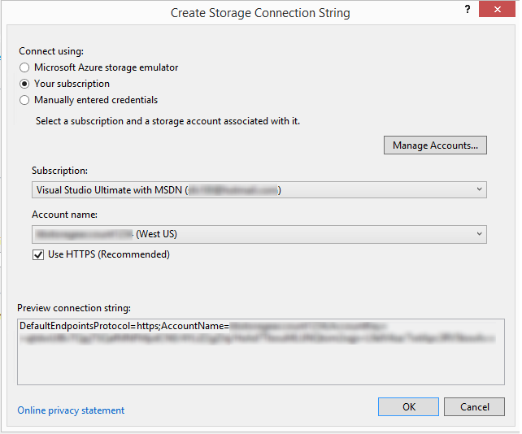
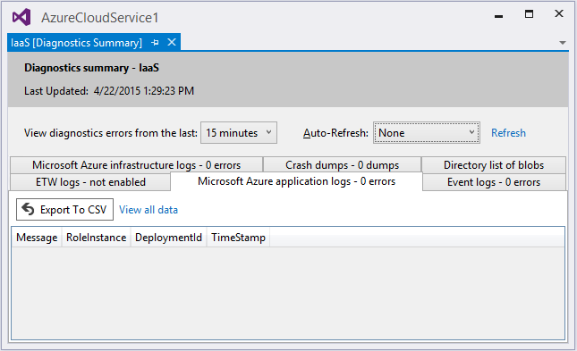

<properties
   pageTitle="Konfigurieren von Diagnose für Azure-Cloud-Diensten und virtuellen Computern | Microsoft Azure"
   description="Beschreibt, wie Diagnoseinformationen für das Debuggen Azure Cloude Services und in Visual Studio-virtuellen Computern (virtuelle Computer) zu konfigurieren."
   services="visual-studio-online"
   documentationCenter="na"
   authors="TomArcher"
   manager="douge"
   editor="" />
<tags
   ms.service="multiple"
   ms.devlang="dotnet"
   ms.topic="article"
   ms.tgt_pltfrm="na"
   ms.workload="multiple"
   ms.date="08/15/2016"
   ms.author="tarcher" />

# <a name="configuring-diagnostics-for-azure-cloud-services-and-virtual-machines"></a>Konfigurieren von Diagnose für Azure-Cloud-Diensten und virtuellen Computern

Wenn Sie eine Azure-Cloud-Dienst oder Azure-virtuellen Computern beheben müssen, können Sie mithilfe von Visual Studio einfacher Azure Diagnose konfigurieren. Azure Diagnose erfasst Systemdaten und Protokollierung von Daten auf virtuellen Computern und Instanzen von virtuellen Computern, die Ihre Cloud-Dienst ausgeführt werden und die Daten in ein Speicherkonto Ihrer Wahl weiterleitet. Weitere Informationen zur Protokollierung in Azure Diagnose finden Sie unter [Aktivieren von Web apps in Azure-App-Verwaltungsdienst das Diagnoseprotokoll](./app-service-web/web-sites-enable-diagnostic-log.md) .

In diesem Thema wird gezeigt, wie aktivieren und Konfigurieren der Azure-Diagnose in Visual Studio beide vor und nach der Bereitstellung und in Azure-virtuellen Computern. Es werden auch so markieren Sie die Typen von Diagnoseinformationen zu sammeln und wie die Informationen angezeigt werden, nachdem es gesammelt wurden.

Sie können auf folgende Weise Azure-Diagnose konfigurieren:

- Sie können die Konfiguration der Diagnose über das Dialogfeld **Diagnosekonfiguration** in Visual Studio ändern. Die Einstellungen werden in einer Datei namens diagnostics.wadcfgx (diagnostics.wadcfg in Azure SDK 2.4 oder einer früheren Version) gespeichert. Alternativ können Sie die Konfigurationsdatei direkt ändern. Wenn Sie die Datei manuell aktualisiert werden, die Konfiguration Änderungen werden wirksam das nächste Mal, die Sie bereitstellen die Cloud in Azure service oder führen Sie den Dienst im Emulator.

- Verwenden Sie **Cloud Explorer** oder **Server-Explorer** in Visual Studio, um die Diagnose für einen laufenden Clouddienst oder virtuellen Computern ändern.

## <a name="azure-26-diagnostics-changes"></a>Azure 2.6 Diagnose Änderungen

Die folgenden Änderungen wurden Azure SDK 2.6 Projekte in Visual Studio vorgenommen. (Diese Änderungen gelten auch für spätere Versionen von Azure SDK.)

- Der lokale Emulator unterstützt jetzt Diagnose. Sie können also Diagnosedaten sammeln und stellen Sie sicher, dass es sich bei Ihrer Anwendung ist die richtigen Spuren erstellen, während Sie entwickeln und Testen in Visual Studio. Die Verbindungszeichenfolge `UseDevelopmentStorage=true` Diagnose Datensammlung ermöglicht, während Sie Ihr Projekt Cloud-Dienst in Visual Studio ausführen mithilfe von Azure Speicheremulator. Alle Diagnosedaten werden im Speicher (Entwicklung Speicher) Konto erfasst.

- Die Verbindungszeichenfolge für Diagnose Speicher-Konto (Microsoft.WindowsAzure.Plugins.Diagnostics.ConnectionString) wird erneut in der Dienstkonfigurationsdatei (.cscfg) gespeichert. In Azure SDK 2,5 wurde das Diagnose Speicher-Konto in der Datei diagnostics.wadcfgx angegeben.

Es gibt einige wichtige Unterschiede zwischen wie die Verbindungszeichenfolge in Azure SDK 2.4 und früher gearbeitet haben und Funktionsweise in Azure SDK 2.6 und höher.

- In Azure SDK 2.4 und früher, wurde die Verbindungszeichenfolge als eine Laufzeit das Plug-in Diagnose verwendet können Sie die Kontoinformationen Speicher für die Übertragung von Diagnose Protokolle zu gelangen.

- In Azure SDK 2.6 und höher ist die Verbindungszeichenfolge Diagnose so konfigurieren Sie die Diagnose Erweiterung mit den entsprechenden Speicher Kontoinformationen während der Veröffentlichung von Visual Studio verwendet. Die Verbindungszeichenfolge können Sie verschiedene Speicherkonten für unterschiedliche Service Konfigurationen definieren, die beim Veröffentlichen Visual Studio verwendet wird. Da der Diagnose-Plug-in (nach Azure SDK 2,5) nicht mehr verfügbar ist, kann nicht die .cscfg Datei allein die Erweiterung Diagnose aktivieren. Sie müssen die Erweiterung separat mithilfe von Tools wie Visual Studio oder PowerShell zu aktivieren.

- Zum Konfigurieren der Diagnose Erweiterung mit PowerShell vereinfachen, enthält die Ausgabe Paket aus Visual Studio auch die öffentliche Konfigurations-XML für die Diagnose Erweiterung für jede Rolle aus. Visual Studio verwendet die Verbindungszeichenfolge Diagnose die Kontoinformationen Speicher im öffentlichen Konfiguration präsentieren gefüllt wird. Die öffentliche Config-Dateien werden in den Ordner Extensions erstellt und Muster PaaSDiagnostics folgen. &lt;RoleName >. PubConfig.xml. Alle Basis PowerShell-Bereitstellungen können dieses Muster jede Konfiguration zu einer Rolle zuordnen.

- Die Verbindungszeichenfolge in der Datei .cscfg wird auch von der [Azure-Portal](http://go.microsoft.com/fwlink/p/?LinkID=525040) zum Zugriff auf die Diagnosedaten, sodass es auf der Registerkarte **Überwachung** angezeigt werden kann. Die Verbindungszeichenfolge ist zum Konfigurieren des Diensts zum Anzeigen von ausführlicher Überwachung Daten im Portal erforderlich.

## <a name="migrating-projects-to-azure-sdk-26-and-later"></a>Migrieren von Projekten auf Azure SDK 2.6 und höher

Beim Migrieren von aus Azure SDK 2,5 auf Azure SDK 2.6 oder höher, wenn Sie eine Diagnose Speicher-Konto in der Datei .wadcfgx angegebenen hatten aus, klicken Sie dann bleibt es. Wenn Sie die Flexibilität der Verwendung von verschiedenen Speicherkonten für verschiedene Speicherkonfigurationen nutzen zu können, müssen Sie die Verbindungszeichenfolge manuell zu Ihrem Projekt hinzufügen. Wenn Sie ein Projekt aus Azure SDK 2.4 oder einer früheren Version auf Azure SDK 2.6 migrieren, bleiben die Diagnose Verbindungszeichenfolgen. Beachten Sie jedoch die Änderungen in wie Verbindungszeichenfolgen in Azure SDK 2.6 gemäß Angabe im vorherigen Abschnitt behandelt werden.

### <a name="how-visual-studio-determines-the-diagnostics-storage-account"></a>Wie bestimmt Visual Studio Diagnose-Speicher-Konto

- Wenn eine Diagnose Verbindungszeichenfolge in der Datei .cscfg angegeben wird, von Visual Studio so konfigurieren Sie die Diagnose Erweiterung beim Veröffentlichen und beim öffentlichen Konfiguration XML-Dateien beim Packen generieren verwendet.

- Wenn keine Diagnose Verbindungszeichenfolge in der Datei .cscfg angegeben ist, fällt dann Visual Studio wieder mit der in der Datei .wadcfgx angegebenen Speicher-Konto so konfigurieren Sie die Diagnose Erweiterung beim Veröffentlichen und Generieren von öffentlichen Konfiguration XML-Dateien beim Packen.

- Die Diagnose Verbindungszeichenfolge in der Datei .cscfg hat Vorrang vor dem Speicherkonto in der Datei .wadcfgx. Wenn eine Diagnose Verbindungszeichenfolge in der Datei .cscfg angegeben ist, klicken Sie dann Visual Studio verwendet werden, und des Speicherkontos .wadcfgx ignoriert.

### <a name="what-does-the-update-development-storage-connection-strings-checkbox-do"></a>Was bedeutet "Update Entwicklung Speicher Verbindungszeichenfolgen..." Führen Sie das Kontrollkästchen?

Das Kontrollkästchen **Aktualisieren Entwicklung Speicher Verbindungszeichenfolgen für Diagnose und Zwischenspeichern mit Microsoft Azure-Speicher Anmeldeinformationen beim Veröffentlichen in Microsoft Azure** bietet Ihnen eine bequeme Möglichkeit, jede beliebige Entwicklung Speicher Konto Verbindungszeichenfolge mit dem angegebenen während der Veröffentlichung Azure-Speicher-Konto zu aktualisieren.

Beispiel: Aktivieren Sie dieses Kontrollkästchen, und die Verbindungszeichenfolge Diagnose gibt `UseDevelopmentStorage=true`. Wenn Sie das Projekt Azure veröffentlichen, wird Visual Studio automatisch die Verbindungszeichenfolge Diagnose mit dem Speicherkonto aktualisieren, die Sie in den Veröffentlichen-Assistenten angegeben haben. Wenn jedoch eine reale Speicher als die Verbindungszeichenfolge Diagnose angegeben wurde, ist dann diesem Konto stattdessen verwendet.

## <a name="diagnostics-functionality-differences-between-azure-sdk-24-and-earlier-and-azure-sdk-25-and-later"></a>Diagnose Funktionsunterschiede zwischen Azure SDK 2.4 und früher und Azure SDK 2,5 und höher

Wenn Sie Ihr Projekt aus Azure SDK 2.4 Azure SDK 2,5 oder höher aktualisieren, sollten Sie die folgenden Diagnose Funktionsunterschiede Beachten Sie Folgendes.

- **Konfigurations-APIs sind veraltet** – programmgesteuerten Konfiguration von Diagnose steht in Azure SDK 2.4 oder einer früheren Version, jedoch wird nicht mehr unterstützt in Azure SDK 2,5 und höher. Wenn Ihre Diagnosekonfiguration derzeit in Code definiert ist, müssen Sie diese Einstellungen im Projekt in Reihenfolge für Diagnose migrierte völlig weiterzuarbeiten neu zu konfigurieren. Konfigurationsdatei Diagnose für Azure SDK 2.4 ist diagnostics.wadcfg und diagnostics.wadcfgx für Azure SDK 2,5 und höher.

- **Diagnose für Cloud-dienstanwendungen kann nur Ebene der Rolle Ebene Instanz nicht konfiguriert werden.**

- **Die Diagnosekonfiguration wird aktualisiert, jedes Mal, wenn Sie Ihre app bereitstellen** – Dies kann Unstimmigkeit Probleme verursachen, wenn Sie Ihre Diagnosekonfiguration vom Server-Explorer ändern, und klicken Sie dann Ihre app erneut.

- **In der Konfigurationsdatei Diagnose nicht im Code in Azure SDK 2,5 und höher, einem Absturz speichert konfiguriert sind** – Wenn Sie Absturz speichert Code konfiguriert haben, müssen Sie die Konfiguration von Code auf der Konfigurationsdatei manuell zu übertragen, da die Speicherabbilder während der Migration in Azure SDK 2.6 übertragen werden nicht.

## <a name="enable-diagnostics-in-cloud-service-projects-before-deploying-them"></a>Aktivieren Sie in der Cloud-Dienstprojekte Diagnose vor der Bereitstellung

Sie können in Visual Studio Sammeln von Diagnosedaten für Rollen, die in Azure ausgeführt werden, wenn Sie den Dienst vor der Bereitstellung im Emulator ausführen auswählen. Alle Änderungen in Visual Studio-Diagnose werden in der Konfigurationsdatei diagnostics.wadcfgx gespeichert. Diese Einstellungen Konfiguration geben Sie an der Stelle, an der Diagnosedaten gespeichert wird, wenn Sie Ihre Cloud-Dienst bereitstellen Speicher-Konto.

### <a name="to-enable-diagnostics-in-visual-studio-before-deployment"></a>So aktivieren Sie die Diagnose in Visual Studio vor der Bereitstellung

1. Klicken Sie auf das Kontextmenü für die Rolle aus, die Sie interessiert, wählen Sie **Eigenschaften**aus, und wählen Sie im **Eigenschaftenfenster** die Rolle des auf die Registerkarte **Konfiguration** .

1. Klicken Sie im Abschnitt **Diagnose** stellen Sie sicher, dass das Kontrollkästchen **Diagnose aktivieren** aktiviert ist.

    

1. Wählen Sie das Auslassungszeichen (...), um Speicher-Konto anzugeben, wo Sie die Diagnosedaten gespeichert werden soll. Das Speicherkonto ausgewählt haben, ist das Verzeichnis, Diagnosedaten gespeichert ist.

    

1. Klicken Sie im Dialogfeld **Erstellen Speicher Verbindungszeichenfolge** geben an, ob Sie eine Verbindung herstellen mit Azure Speicheremulator eines Azure-Abonnements oder manuell Anmeldeinformationen eingegebenen.

    

  - Falls gewünscht das Microsoft Azure Speicheremulator Option, die Verbindungszeichenfolge ist auf UseDevelopmentStorage festgelegt = wahr.

  - Wenn Sie auswählen, die Ihrer Abonnement haben, können Sie die zu verwendende Azure-Abonnement und den Namen des Kontos auswählen. Sie können die Schaltfläche Konten verwalten zum Verwalten Ihrer Abonnements Azure auswählen.

  - Wenn Sie die Option manuell eingegebenen Anmeldeinformationen auswählen, werden Sie aufgefordert, geben Sie den Namen und Schlüssel der Azure Firma, die Sie verwenden möchten.

1. Wählen Sie die Schaltfläche **Konfigurieren** , um das Dialogfeld **Diagnosekonfiguration** anzuzeigen. Jede Registerkarte (mit Ausnahme von **allgemeinen** und **Log Verzeichnissen**) steht für einer Diagnoseprotokollen Datenquelle, die Sie erfassen können. Die Standardregisterkarte **Allgemein**, bietet Ihnen die folgenden Optionen für Diagnose die Datensammlung: **nur Fehler**, **alle Informationen**und **benutzerdefinierte planen**. Die Standardoption, **nur Fehler**, dauert am wenigsten Speicherplatz aus, da es Warnungen oder Tracing Nachrichten übertragen wird nicht. Die Option für alle Informationen werden die meisten Daten übertragen und daher in Bezug auf Speicher den günstigsten ist.

    

1. Wählen Sie in diesem Beispiel die Option **Benutzerdefiniert planen** , damit Sie die erfassten Daten anpassen können.

1. Das Feld **Datenträgerkontingent in MB** gibt an, wie viel Speicherplatz in Ihrem Speicherkonto zugeordnet werden, für die Diagnosedaten soll. Wenn Sie möchten, können Sie den Standardwert ändern.

1. Wählen Sie auf jeder Registerkarte Diagnose-Daten, die Sie sammeln möchten, deren **Aktivieren der übertragen <log type> ** das Kontrollkästchen. Wenn Sie die Anwendungsprotokolle sammeln möchten, wählen Sie beispielsweise das Kontrollkästchen **ermöglichen Übertragung der Anwendung von Protokollen** auf der Registerkarte **Protokolle Anwendung** . Geben Sie auch andere Informationen durch jeden Datentyp Diagnose erforderlich. Finden Sie im Abschnitt **Konfigurieren Diagnose Datenquellen** weiter unten in diesem Thema Informationen zur Konfiguration, klicken Sie auf jeder Registerkarte.

1. Nachdem Sie Auflistung aller Diagnose Daten aktiviert haben, werden soll, wählen Sie die Schaltfläche **OK** .

1. Führen Sie Ihr Projekt der Azure-Cloud-Dienst in Visual Studio wie gewohnt ein. Wie Sie eine Anwendung verwenden, wird die Protokollinformationen, die Sie aktiviert mit dem Konto Azure-Speicher gespeichert, die Sie angegeben haben.

## <a name="enable-diagnostics-in-azure-virtual-machines"></a>Aktivieren der Diagnose in Azure-virtuellen Computern

Sie können in Visual Studio Diagnose Datensammlung für Azure-virtuellen Computern auswählen.

### <a name="to-enable-diagnostics-in-azure-virtual-machines"></a>So aktivieren Sie die Diagnose in Azure-virtuellen Computern

1. Wählen Sie im **Server-Explorer**den Azure-Knoten aus und dann Herstellen einer Verbindung mit Ihrem Azure-Abonnement, wenn Sie noch nicht verbunden sind.

1. Erweitern Sie den Knoten **virtuellen Computern** aus. Sie können einen neuen virtuellen Computer erstellen, oder wählen Sie eine, die bereits vorhanden ist.

1. Wählen Sie im Kontextmenü des virtuellen Computers, das Sie interessiert, **Konfigurieren**. Zeigt das Dialogfeld Konfiguration des virtuellen Computers.

    

1. Falls es noch nicht installiert ist, fügen Sie die Microsoft Agent-Diagnose Überwachung Erweiterung hinzu. Diese Erweiterung können Sie die Diagnosedaten für die Azure-virtuellen Computern sammeln. Klicken Sie in der Liste Extensions installiert Wählen Sie eine verfügbare Erweiterung Dropdownmenü auswählen, und wählen Sie dann Microsoft Agent-Diagnose für die Überwachung.

    

    >[AZURE.NOTE] Andere Diagnose Erweiterungen stehen für die virtuellen Computer. Weitere Informationen finden Sie unter Azure-virtuellen Computer-Erweiterungen und Funktionen.

1. Wählen Sie die Schaltfläche **Hinzufügen** , fügen Sie die Erweiterung und zugehöriges Dialogfeld **Diagnosekonfiguration** anzeigen aus.

1. Wählen Sie die Schaltfläche **Konfigurieren** , geben Sie ein Speicherkonto, und wählen Sie dann auf die Schaltfläche **OK** aus.

    Jede Registerkarte (mit Ausnahme von **allgemeinen** und **Log Verzeichnissen**) steht für einer Diagnoseprotokollen Datenquelle, die Sie erfassen können.

    

    Die Standardregisterkarte **Allgemein**, bietet Ihnen die folgenden Optionen für Diagnose die Datensammlung: **nur Fehler**, **alle Informationen**und **benutzerdefinierte planen**. Die Standardoption, **nur Fehler**, dauert am wenigsten Speicherplatz aus, da es Warnungen oder Tracing Nachrichten übertragen wird nicht. Die Option **alle Informationen** werden die meisten Daten übertragen und daher in Bezug auf Speicher den günstigsten ist.

1. Wählen Sie in diesem Beispiel die Option **Benutzerdefiniert planen** , damit Sie die erfassten Daten anpassen können.

1. Das **Datenträgerkontingent in MB** -Feld gibt an, wie viel Speicherplatz in Ihrem Speicherkonto zugeordnet werden, für die Diagnosedaten soll. Wenn Sie möchten, können Sie den Standardwert ändern.

1. Wählen Sie auf jeder Registerkarte Diagnose-Daten, die Sie sammeln möchten, deren **Aktivieren der übertragen <log type> ** das Kontrollkästchen.

    Wenn Sie die Anwendungsprotokolle sammeln möchten, wählen Sie beispielsweise das Kontrollkästchen **ermöglichen Übertragung der Anwendung von Protokollen** auf der Registerkarte **Protokolle Anwendung** . Geben Sie auch andere Informationen durch jeden Datentyp Diagnose erforderlich. Finden Sie im Abschnitt **Konfigurieren Diagnose Datenquellen** weiter unten in diesem Thema Informationen zur Konfiguration, klicken Sie auf jeder Registerkarte.

1. Nachdem Sie Auflistung aller Diagnose Daten aktiviert haben, werden soll, wählen Sie die Schaltfläche **OK** .

1. Speichern Sie das aktualisierte Projekt.

    Eine Nachricht in das Fenster **Microsoft Azure Aktivität Log** sehen Sie, dass die virtuellen Computern aktualisiert wurde.

## <a name="configure-diagnostics-data-sources"></a>Konfigurieren der Diagnose von Datenquellen

Nachdem Sie Diagnose Datensammlung aktiviert haben, können Sie auswählen, genau welche Datenquellen, die Sie erfassen möchten, und welche Informationen gesammelt werden. Im folgenden finden eine Liste der Registerkarten in das Dialogfeld **Konfiguration für Diagnose** und die einzelnen Konfiguration Optionen.

### <a name="application-logs"></a>Von Anwendungsprotokollen

**Anwendungsprotokolle** enthalten Diagnoseinformationen gefertigt von einer Webanwendung. Wenn Sie die Anwendungsprotokolle erfassen möchten, wählen Sie das Kontrollkästchen **Übertragung der Anwendungsprotokolle aktivieren** . Sie können vergrößern oder verkleinern die Anzahl der Minuten, wenn die Anwendungsprotokolle übertragen werden, bei Ihrem Speicherkonto durch Ändern des Werts **Übertragen Periode (min)** . Sie können auch die Menge der Informationen in das Protokoll erfasst werden, indem Sie die Ebene Log-Wert ändern. Beispielsweise können Sie auswählen, **ausführlich** Abrufen weiterer Informationen oder wählen Sie **kritisch** , um nur kritische Fehler zu erfassen. Wenn Sie einen bestimmten Diagnoseanbieter haben, die Anwendungsprotokolle gibt aus, können Sie zu erfassen, indem Sie im Feld **GUID Anbieter** GUID des Anbieters hinzufügen.

  

  Weitere Informationen zur von Anwendungsprotokollen finden Sie unter [Aktivieren von Web apps in Azure-App-Verwaltungsdienst das Diagnoseprotokoll](./app-service-web/web-sites-enable-diagnostic-log.md) .

### <a name="windows-event-logs"></a>Windows-Ereignisprotokollen

Wenn Sie die Windows-Ereignisprotokollen erfassen möchten, wählen Sie das Kontrollkästchen **Aktivieren Übertragung des Windows-Ereignisprotokollen** . Sie können vergrößern oder verkleinern die Anzahl der Minuten, wenn die Ereignisprotokollen übertragen werden, bei Ihrem Speicherkonto durch Ändern des Werts **Übertragen Periode (min)** . Wählen Sie die Kontrollkästchen für die Arten von Ereignissen, die Sie nachverfolgen möchten.

  

Wenn Sie Azure SDK 2.6 oder höher verwenden und eine benutzerdefinierten Datenquelle angeben möchten, geben Sie ihn in den **<Data source name>** Text im Feld, und wählen Sie dann auf die Schaltfläche **Hinzufügen** neben dem Eintrag. Die Datenquelle ist die Datei diagnostics.cfcfg hinzugefügt.

Wenn Sie Azure SDK 2,5 und eine benutzerdefinierten Datenquelle angeben möchten, können Sie es zum Hinzufügen der `WindowsEventLog` Abschnitt der diagnostics.wadcfgx-Datei, beispielsweise wie im folgenden Beispiel gezeigt.

```
<WindowsEventLog scheduledTransferPeriod="PT1M">
   <DataSource name="Application!*" />
   <DataSource name="CustomDataSource!*" />
</WindowsEventLog>
```
### <a name="performance-counters"></a>-Datenquellen

Informationen zur Performance Zähler hilft Ihnen Systemengpässen suchen und System und Anwendung Leistung optimieren. Weitere Informationen finden Sie unter [Erstellen und verwenden Leistungsindikatoren in Azure-Anwendung](https://msdn.microsoft.com/library/azure/hh411542.aspx) . Wenn Sie die Leistungsindikatoren erfassen möchten, wählen Sie das Kontrollkästchen **ermöglichen Übertragung der Leistungsindikatoren** . Sie können vergrößern oder verkleinern die Anzahl der Minuten, wenn die Ereignisprotokollen übertragen werden, bei Ihrem Speicherkonto durch Ändern des Werts **Übertragen Periode (min)** . Wählen Sie die Kontrollkästchen für die Leistungsindikatoren, die Sie nachverfolgen möchten.

  

Um einen Leistungsindikator zu verfolgen, der nicht aufgeführt ist, geben Sie es mithilfe der vorgeschlagenen Syntax ein, und wählen Sie dann auf die Schaltfläche **Hinzufügen** . Das Betriebssystem des virtuellen Computers bestimmt, welche Leistungsindikatoren Sie verfolgen können. Weitere Informationen zur Syntax finden Sie unter [Festlegen eines Pfads Zähler](https://msdn.microsoft.com/library/windows/desktop/aa373193.aspx).

### <a name="infrastructure-logs"></a>Infrastruktur von Protokollen

Aktivieren Sie das Kontrollkästchen **ermöglichen Übertragung der Infrastrukturprotokolle** , Infrastrukturprotokolle, erfassen, die Informationen zu den Azure diagnostic Infrastructure, das Modul RAS und das Modul RemoteForwarder enthalten, werden soll. Sie können vergrößern oder verkleinern die Anzahl der Minuten, wenn die Protokolle übertragen werden, bei Ihrem Speicherkonto durch Ändern des Werts übertragen Periode (min).

  

  Weitere Informationen finden Sie unter [Protokollierung Daten sammeln von Azure-Diagnose verwenden](https://msdn.microsoft.com/library/azure/gg433048.aspx) .

### <a name="log-directories"></a>Log Verzeichnisse durchsuchen

Wenn Sie auf Log Verzeichnisse für Internet Information Services (IIS) Anfragen erfassten Daten enthalten Log Verzeichnisse durchsuchen, aufnehmen möchten, Fehler bei Anfragen oder Ordner, die Sie auswählen möchten, aktivieren das Kontrollkästchen **ermöglichen Übertragung der Log Verzeichnisse durchsuchen** . Sie können vergrößern oder verkleinern die Anzahl der Minuten, wenn die Protokolle übertragen werden, bei Ihrem Speicherkonto durch Ändern des Werts **Übertragen Periode (min)** .

Sie können die Felder für die Protokolle auswählen, die Sie sammeln, z. B. **IIS-Protokolle** und Protokolle **Fehler beim Anfordern** möchten. Standardnamen für Speicher-Container stehen zur Verfügung, aber Sie können die Namen ändern, wenn Sie möchten.

Darüber hinaus können Sie die Protokolle aus einem beliebigen Ordner erfassen. Geben Sie den Pfad nur im Abschnitt **Protokoll aus absoluten Verzeichnis** , und wählen Sie dann auf die Schaltfläche **Verzeichnis hinzufügen** . Die Protokolle werden auf die angegebenen Container erfasst werden.

  

### <a name="etw-logs"></a>ETW-Protokolle

Wenn Sie [Event Tracing for Windows](https://msdn.microsoft.com/library/windows/desktop/bb968803(v=vs.85).aspx) (ETW) verwenden und ETW Protokolle erfassen möchten, aktivieren Sie das Kontrollkästchen **Übertragung von ETW Protokolle aktivieren** . Sie können vergrößern oder verkleinern die Anzahl der Minuten, wenn die Protokolle übertragen werden, bei Ihrem Speicherkonto durch Ändern des Werts **Übertragen Periode (min)** .

Ereignisquellen und Ereignis Manifeste, die Sie angeben, werden die Ereignisse erfasst. Um eine Quelle angeben möchten, geben Sie einen Namen im Abschnitt **Ereignisquellen** , und wählen Sie dann auf die Schaltfläche **Quelle hinzufügen** . Sie können auf ähnliche Weise angeben eine Ereignismanifestdatei im Abschnitt **Ereignis-Manifeste** und wählen Sie dann auf die Schaltfläche **Hinzufügen Ereignis Manifest** .

  

  Das ETW Framework wird in ASP.NET über Klassen in [System.Diagnostics.aspx] (https://msdn.microsoft.com/library/system.diagnostics (v=vs.110) Namespace. unterstützt. Den Namespace Microsoft.WindowsAzure.Diagnostics, die von erbt und erweitert Standard [System.Diagnostics.aspx] (https://msdn.microsoft.com/library/system.diagnostics (v=vs.110) Klassen, ermöglicht die Verwendung von [System.Diagnostics.aspx] (https://msdn.microsoft.com/library/system.diagnostics (v=vs.110) als Rahmen Protokollierung in der Azure-Umgebung. Weitere Informationen finden Sie unter [Steuerelement Optimieren der Protokollierung werden und Tracing in Microsoft Azure](https://msdn.microsoft.com/magazine/ff714589.aspx) und [Diagnose in Azure-Cloud-Diensten und virtuellen Computern aktivieren](./cloud-services/cloud-services-dotnet-diagnostics.md).

### <a name="crash-dumps"></a>Speichert abstürzen

Wenn Sie Informationen, wenn eine Instanz der Rolle stürzt ab erfassen möchten, wählen Sie das Kontrollkästchen **Übertragung von Abstürzen sichert aktivieren** . (Da ASP.NET die meisten Ausnahmen behandelt, ist dies in der Regel nur für Worker-Rollen sinnvoll.) Sie können vergrößern oder verkleinern den Prozentsatz des Speicherplatzes für die Speicherabbilder durch Ändern des Werts **Directory Kontingent (%)** . Sie können den Speichercontainer ändern, wobei die Speicherabbilder gespeichert werden und Sie können auswählen, ob Sie eine **vollständige** oder **Minisymbolleiste** Abbild erfassen möchten.

Die Prozessen, die aktuell überwacht werden aufgeführt. Wählen Sie die Kontrollkästchen neben den Prozessen, die Sie erfassen möchten. Wenn Sie einem anderen Prozess verwendet zur Liste hinzufügen möchten, geben Sie den Namen des Prozesses, und wählen Sie dann auf die Schaltfläche **Prozess hinzufügen** .

  

  Finden Sie unter [Steuerelement Optimieren der Protokollierung werden und Tracing in Microsoft Azure](https://msdn.microsoft.com/magazine/ff714589.aspx) und [Microsoft Azure Diagnose Teil 4: benutzerdefinierte Protokollierung Komponenten und Azure-Diagnose 1.3 Änderungen](http://justazure.com/microsoft-azure-diagnostics-part-4-custom-logging-components-azure-diagnostics-1-3-changes/) für Weitere Informationen.

## <a name="view-the-diagnostics-data"></a>Zeigen Sie die Diagnosedaten

Nachdem Sie die Diagnosedaten für einen Clouddienst oder eines virtuellen Computers gesammelt haben, können Sie es anzeigen.

### <a name="to-view-cloud-service-diagnostics-data"></a>Cloud-Dienst Diagnosedaten anzeigen

1. Bereitstellen Sie der Cloud-Dienst wie üblich, und führen Sie sie.

1. Sie können die Diagnosedaten in einen Bericht, den von Visual Studio generiert oder Tabellen in Ihr Speicherkonto anzeigen. Zum Anzeigen der Daten in einem Bericht öffnen Sie **Cloud Explorer** oder **Server-Explorer**zu, öffnen Sie das Kontextmenü des Knotens für die Rolle aus, die Sie interessiert, und wählen Sie dann auf **Diagnosedaten anzeigen**.

    

    Bericht mit ein die verfügbaren Daten angezeigt wird.

    

    Wenn Sie die neuesten Daten nicht angezeigt werden, müssen Sie möglicherweise die Übertragung bis zum verstreichen müssen, warten.

    Wählen Sie die Verknüpfung **Aktualisieren** , um die Daten sofort zu aktualisieren, oder wählen Sie ein Intervall in der Dropdown-Listenfeld **Automatische Aktualisierung** , dass die Daten automatisch aktualisiert. Um die Fehlerdaten zu exportieren, wählen Sie die Schaltfläche **in CSV exportieren** , um eine CSV-Datei zu erstellen, die in einem Arbeitsblatt geöffnet werden kann.

    Öffnen Sie in der **Cloud Explorer** oder **Server-Explorer**Speicher-Konto, das der Bereitstellung zugeordnet ist.

1. Öffnen Sie die Diagnose Tabellen in der Tabelle-Viewer, und überprüfen Sie dann die Daten, die Sie gesammelt. IIS-Protokolle und benutzerdefinierte Protokolle können Sie einen Container Blob öffnen. Überprüfen Sie in der folgenden Tabelle, finden Sie den Tabelle oder Blob-Container, der die Daten enthält, die Sie interessiert. Zusätzlich zu den Daten für die Protokolldatei, die Tabelleneinträge enthalten EventTickCount, DeploymentId, Rolle und RoleInstance, damit Sie bestimmen, welche virtuellen Computern und Rolle die Daten generiert und wann. 

  	|Diagnose Daten|Beschreibung|Speicherort|
  	|---|---|---|
  	|Von Anwendungsprotokollen|Protokolle, die von Code, indem Sie Methoden der System.Diagnostics.Trace-Klasse generiert.|WADLogsTable|
  	|Ereignisprotokollen|Diese Daten werden von den Windows-Ereignisprotokollen auf den virtuellen Computern. Windows speichert die Informationen in diesen Protokollen, aber Anwendungen und Dienste auch diese zum Melden von Fehlern verwenden oder Informationen protokollieren.|WADWindowsEventLogsTable|
  	|-Datenquellen|Sie können auf einen beliebigen Leistungsindikator Sammeln von Daten, die auf dem virtuellen Computer zur Verfügung. Das Betriebssystem stellt die Leistungsindikatoren, die viele Statistiken wie z. B. Arbeitsspeicher Verwendung und Prozessor Zeit enthalten.|WADPerformanceCountersTable|
  	|Infrastruktur von Protokollen|Diese Protokolle werden aus der Diagnose Infrastruktur selbst generiert.|WADDiagnosticInfrastructureLogsTable|
  	|IIS-Protokolle|Diese Protokolle aufzeichnen Web Serviceanfragen. Wenn Ihre Cloud-Dienst sehr viel Datenverkehr erhält, können diese Protokolle abgebildet, sein, damit Sie sammeln und speichern Sie diese Daten nur bei Bedarf sollte.|Sie können Fehler beim Anfrage im Container Blob unter Wad-Iis-Failedreqlogs unter einem Pfad für die Bereitstellung, Rolle und Instanz Protokolle suchen. Sie können vollständige Protokolle unter Wad-Iis-Protokolldateien suchen. Die Einträge für jede Datei, die in der Tabelle WADDirectories vorgenommen wurden.|
  	|Absturz speichert|Diese Informationen stellen binäre Bilder von Ihrem Cloud-Dienst Prozess (in der Regel eine Worker-Rolle).|WAD-Inhalt-speichert Blob-container|
  	|Benutzerdefinierte Protokolldateien|Die Protokolle der Daten, die Sie vordefinierte.|Sie können im Code den Speicherort der benutzerdefinierten Protokolldateien in Ihr Speicherkonto angeben. Beispielsweise können Sie einen benutzerdefinierten Blob Container angeben.|

1. Abgeschnittene Daten eines beliebigen Typs können Sie versuchen, den Puffer für diese Daten erhöhen Typ oder verkürzen der Zeitraum zwischen Übermittlungen Daten virtuellen Computer aus bei Ihrem Speicherkonto.

1. (optional) Bereinigen von Daten aus dem Speicherkonto gelegentlich, Speicher-Gesamtkosten zu verringern.

1. Wenn Sie eine vollständige Bereitstellung ausführen, wird die diagnostics.cscfg-Datei (.wadcfgx für Azure SDK 2,5) in Azure aktualisiert, und der Cloud-Dienst nimmt Änderungen an der Diagnosekonfiguration. Wenn Sie stattdessen eine vorhandene Bereitstellung aktualisieren, wird nicht die .cscfg-Datei in Azure aktualisiert. Sie können Diagnose, jedoch weiterhin ändern, anhand der Schritte im nächsten Abschnitt. Weitere Informationen zur Durchführung einer vollständigen bereitstellungs und Aktualisieren einer vorhandenen bereitstellungs finden Sie unter [Veröffentlichen Azure-Anwendung-Assistenten](vs-azure-tools-publish-azure-application-wizard.md).

### <a name="to-view-virtual-machine-diagnostics-data"></a>Virtuellen Computern Diagnosedaten anzeigen

1. Wählen Sie im Kontextmenü des virtuellen Computers **Diagnose anzeigen von Daten**aus.

    

    Daraufhin wird das Fenster **Zusammenfassung Diagnose** .

      

    Wenn Sie die neuesten Daten nicht angezeigt werden, müssen Sie möglicherweise die Übertragung bis zum verstreichen müssen, warten.

    Wählen Sie die Verknüpfung **Aktualisieren** , um die Daten sofort zu aktualisieren, oder wählen Sie ein Intervall in der Dropdown-Listenfeld **Automatische Aktualisierung** , dass die Daten automatisch aktualisiert. Um die Fehlerdaten zu exportieren, wählen Sie die Schaltfläche **in CSV exportieren** , um eine CSV-Datei zu erstellen, die in einem Arbeitsblatt geöffnet werden kann.

## <a name="configure-cloud-service-diagnostics-after-deployment"></a>Konfigurieren Sie nach der Bereitstellung Cloud-Service-Diagnose

Wenn Sie ein Problem mit einem Cloud untersuchen sind service, die bereits ausgeführt, sollten Sie zum Sammeln von Daten, die Sie angegeben haben, bevor Sie die Rolle ursprünglich bereitgestellt. In diesem Fall können Sie die Daten mit den Einstellungen im Server-Explorer erfassen beginnen. Sie können für eine einzelne Instanz oder alle Instanzen Diagnose in einer Rolle, je nachdem, ob Sie das Dialogfeld Diagnosekonfiguration aus dem Kontextmenü für die Instanz oder die Rolle öffnen konfigurieren. Wenn Sie den Rolle Knoten konfiguriert haben, wenden Sie Änderungen auf alle Instanzen aus. Wenn Sie den Knoten Instanz konfiguriert haben, wenden Sie Änderungen auf nur diese Instanz aus.

### <a name="to-configure-diagnostics-for-a-running-cloud-service"></a>So konfigurieren Sie die Diagnose für einen laufenden Clouddienst

1. Im Server-Explorer Erweitern des **Cloud Services** -Knotens, und dann Knoten zum Suchen der Rolle und/oder Instanz, die Sie ermitteln möchten.

    

1. Klicken Sie im Kontextmenü für eine Instanz oder eine Rolle Knoten wählen Sie **Die Diagnose Einstellungen aktualisieren**aus, und wählen Sie dann die diagnoseeinstellungen, die Sie erfassen möchten.

    Informationen zu den Einstellungen für die Konfiguration finden Sie unter **Konfigurieren Diagnose von Datenquellen** in diesem Thema. Informationen dazu, wie Sie die Diagnosedaten anzeigen finden Sie unter **anzeigen die Diagnosedaten** in diesem Thema.

    Wenn Sie eine Sammlung von Daten im **Server-Explorer**ändern, bleiben diese Änderungen wirksam, bis Sie Ihre Cloud-Dienst vollständig erneut bereitstellen. Wenn Sie die Standardeinstellung verwenden veröffentlichungseinstellungen die Änderungen werden nicht überschrieben, da die Standardeinstellung veröffentlichen Einstellung ist, führen Sie eine vollständige erneute, anstatt die vorhandene Bereitstellung aktualisieren. Um sicherzustellen, dass die Einstellungen zum Zeitpunkt der Bereitstellung deaktivieren, wechseln Sie zur Registerkarte **Erweiterte Einstellungen** des Veröffentlichen-Assistenten, und deaktivieren Sie das Kontrollkästchen **Bereitstellung aktualisieren** . Wenn Sie mit dieser Kontrollkästchen deaktiviert erneut bereitstellen, werden die Einstellungen auf die in der Datei .wadcfgx (oder .wadcfg) als festlegen, über den Eigenschaften-Editor für die Rolle zurückgesetzt. Wenn Sie eine Bereitstellung aktualisieren, behält Azure die alten Einstellungen aus.

## <a name="troubleshoot-azure-cloud-service-issues"></a>Behandlung von Problemen beim Azure-Cloud-Dienst

Wenn auftreten Probleme mit Ihren Cloud-Dienst Projekten, beispielsweise eine Rolle aus, die in einem Status "beschäftigt" hängenbleibt wiederholt-Freigabe oder löst einen Interner Serverfehler, es gibt Tools und Techniken, die Sie verwenden können, um diagnostizieren und Beheben dieser Probleme. Spezielle Beispiele häufig auftretende Probleme und Lösungen sowie einen Überblick über die Konzepte und Tools für diagnose und Beheben dieser Fehler finden Sie unter [Azure PaaS berechnen Diagnosedaten](http://blogs.msdn.com/b/kwill/archive/2013/08/09/windows-azure-paas-compute-diagnostics-data.aspx).

## <a name="q--a"></a>F & A

**Was ist die Puffergröße, und wie groß sollte es sein?**

Klicken Sie auf jede Instanz virtuellen Computern beschränken Kontingente diagnostic Datenmenge auf dem lokalen Dateisystem gespeichert werden kann. Darüber hinaus geben Sie eine Puffergröße für jede Art von Diagnoseprotokollen Daten, die zur Verfügung. Dieser Puffergröße verhält sich wie ein individuelles Kontingent für diese Art von Daten. Überprüfen Sie den unteren Rand des Dialogfelds, können Sie ermitteln, insgesamt Kontingents und die Speichermenge bleibt. Wenn Sie größere Puffer oder mehrere Arten von Daten angeben, werden Sie insgesamt Kontingents nähern. Sie können das gesamte Kontingent durch Ändern der diagnostics.wadcfg/.wadcfgx Konfigurationsdatei ändern. Die Diagnosedaten werden im gleichen Dateisystem als Ihrer Anwendung Daten gespeichert, wenn die Anwendung zahlreiche Speicherplatz verwendet, können Sie das Kontingent für insgesamt Diagnose dürfen nicht erhöhen.

**Was ist der Zeitraum, durchstellen, und wie lange sollten sie?**

Die Übertragung Periode ist die Zeitdauer verstrichen ist zwischen Daten erfasst werden. Nach jeder Periode durchstellen werden Daten von einem lokalen Dateisystem auf einem virtuellen Computer zu Tabellen in Ihr Speicherkonto verschoben. Wenn die Menge der gesammelten Daten vor dem Ende einer Periode durchstellen Kontingents überschreitet, werden ältere Daten verworfen. Möglicherweise möchten Sie die Übertragung Periode zu verkleinern, wenn Sie Daten verlieren sind, weil die Daten der Puffergröße oder der gesamten Kontingent überschreitet.

**Welche Zeitzone sind die Zeitstempel in?**

Die Zeitstempel sind in der lokalen Zeitzone des Centers Daten, die dem Clouddienst hostet. Die folgenden drei Timestamp-Spalten in Tabellen Log verwendet werden.

  - **PreciseTimeStamp** ist der ETW Zeitstempel des Ereignisses. D. h., die Uhrzeit, die das Ereignis im Desktopclient angemeldet ist.

  - **Zeitstempel** ist PreciseTimeStamp der Upload Häufigkeit Grenze abgerundet. Ja, wenn der Upload Häufigkeit 5 Minuten und das Ereignis Uhrzeit 00:17:12 ist, TIMESTAMP 00:15:00 sein.

  - **Zeitstempel** ist der Zeitstempel, die Entität in Azure Table erstellt wurde.

**Wie verwalte ich Kosten, wenn Diagnoseinformationen sammeln?**

Die Standardeinstellungen (**Logebene** auf **Fehler** und **übertragen Zeitraum** festlegen auf **1 Minute**) sollen Kosten zu minimieren. Die Kosten berechnen erhöht, wenn Sie weitere Diagnose Daten sammeln oder verringern die Übertragung Periode. Sammeln Sie nicht mehr Daten, als Sie benötigen, und vergessen Sie nicht, Datensammlung deaktivieren, wenn Sie nicht mehr benötigen. Sie können immer dann erneut, auch zur Laufzeit aktivieren wie im vorherigen Abschnitt dargestellt.

**Wie sammeln ich Fehler beim Anforderung Protokolle von IIS?**

Standardmäßig wird nicht IIS Fehler beim Anforderung Protokolle erfasst. Sie können IIS so konfigurieren sie gesammelt werden, wenn Sie die Datei web.config für Ihre Webrolle bearbeiten.

**Ich erhalte keine Spur Informationen aus RoleEntryPoint Methoden wie OnStart. Was ist los?**

Die Methoden der RoleEntryPoint werden im Zusammenhang mit WAIISHost.exe, nicht IIS bezeichnet. Daher die Konfigurationsinformationen in web.config, die nicht normal ermöglicht Spur angewendet werden. Um dieses Problem zu beheben, Hinzufügen einer config-Datei zum Projekt Rolle Web, und nennen Sie die Datei, um die Ausgabe übereinstimmen, die den RoleEntryPoint Code enthält. Standard Web Rolle im Projekt wäre der Namen der config-Datei WAIISHost.exe.config. Fügen Sie dann die folgenden Zeilen zu dieser Datei:

```
<system.diagnostics>
  <trace>
      <listeners>
          <add name “AzureDiagnostics” type=”Microsoft.WindowsAzure.Diagnostics.DiagnosticMonitorTraceListener”>
              <filter type=”” />
          </add>
      </listeners>
  </trace>
</system.diagnostics>
```

Legen Sie nun im **Eigenschaftenfenster** der **Copy to Output Directory** -Eigenschaft auf **immer kopieren**.

## <a name="next-steps"></a>Nächste Schritte

Wenn Sie weitere Informationen zur Protokollierung in Azure Diagnose finden Sie unter [Aktivieren der Diagnose in Azure-Cloud-Diensten und virtuellen Computern](./cloud-services/cloud-services-dotnet-diagnostics.md) und [Aktivieren Sie das Diagnoseprotokoll für Web apps in Azure-App-Dienst](./app-service-web/web-sites-enable-diagnostic-log.md).
