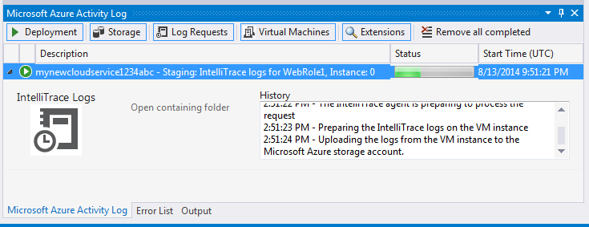

<properties 
   pageTitle="Für das Debuggen eines veröffentlichten Cloud-Diensts mit IntelliTrace und Visual Studio | Microsoft Azure"
   description="Für das Debuggen eines veröffentlichten Cloud-Diensts mit IntelliTrace und Visual Studio"
   services="visual-studio-online"
   documentationCenter="n/a"
   authors="TomArcher"
   manager="douge"
   editor="" />
<tags 
   ms.service="visual-studio-online"
   ms.devlang="multiple"
   ms.topic="article"
   ms.tgt_pltfrm="multiple"
   ms.workload="na"
   ms.date="08/15/2016"
   ms.author="tarcher" />

# Für das Debuggen eines veröffentlichten Cloud-Diensts mit IntelliTrace und Visual Studio

##(Übersicht)

Mit IntelliTrace können Sie umfangreichen Debuggen Informationen für eine Instanz der Rolle protokollieren, wenn es in Azure ausgeführt wird. Wenn Sie die Ursache eines Problems zu ermitteln müssen, können Sie die Protokolle IntelliTrace, Code in Visual Studio durchgehen, als wäre er in Azure ausgeführt wurden. IntelliTrace Datensätze wichtiger, Ausführung von Code und Umgebungsdaten beim Azure-Anwendung, die als Cloud-Dienst in Azure ausgeführt wird, und ermöglicht Ihnen die aufgezeichneten Daten aus Visual Studio wiedergeben. Alternativ können Sie remote Debuggen direkt auf einen Clouddienst anfügen, die in Azure ausgeführt wird. [Für das Debuggen Cloud Services](http://go.microsoft.com/fwlink/p/?LinkId=623041)finden Sie unter.

>[AZURE.IMPORTANT] IntelliTrace Debuggen nur für Szenarios vorgesehen ist, und nicht für die Herstellung Bereitstellung verwendet werden.

>[AZURE.NOTE] Sie können IntelliTrace, wenn Sie Visual Studio Enterprise installiert haben und Ihre Ziele Azure-Anwendung .NET Framework 4 oder höher verwenden. IntelliTrace sammelt Informationen für Ihre Azure Rollen. Die virtuellen Computer für diese Rollen immer 64-Bit-Betriebssysteme ausführen.

## So konfigurieren Sie die Anwendung Azure für IntelliTrace

Um IntelliTrace für eine Azure-Anwendung zu aktivieren, müssen Sie erstellen und veröffentlichen Sie die Anwendung aus einem Visual Studio Azure-Projekt. Sie müssen IntelliTrace für eine Anwendung Azure vor der Veröffentlichung in Azure konfigurieren. Wenn Sie veröffentlichen Sie die Anwendung ohne IntelliTrace konfigurieren, aber dann entscheiden, dass Sie erledigen möchten, müssen Sie die Anwendung von Visual Studio erneut veröffentlichen. Weitere Informationen finden Sie unter [Veröffentlichen einer mithilfe der Tools Azure-Cloud-Dienst](http://go.microsoft.com/fwlink/p/?LinkId=623012).

1. Wenn Sie bereit sind, Ihre Azure-Anwendung bereitgestellt haben, stellen Sie sicher, dass das Projekt erstellen auf **Debuggen**festgelegt sind.

1. Öffnen Sie das Kontextmenü für das Projekt Azure in Lösung-Explorer, und wählen Sie **Veröffentlichen**.
 
    Der Azure-Anwendung veröffentlichen-Assistent wird angezeigt.

1. Um IntelliTrace Protokolle für eine Anwendung zu erfassen, wenn sie in der Cloud veröffentlicht wird, wählen Sie das Kontrollkästchen **IntelliTrace aktivieren** aus.

    >[AZURE.NOTE] Sie können IntelliTrace oder Profil erstellen, wenn Sie Ihre Azure-Anwendung veröffentlichen aktivieren. Sie können beide nicht aktivieren.

1. Wählen Sie zum Anpassen der grundlegenden IntelliTrace Konfigurations des Links **Einstellungen** aus.

    Einstellungsdialogfeld IntelliTrace angezeigt wird, wie in der folgenden Abbildung gezeigt. Sie können angeben, welche Ereignisse Log, ob für das Erfassen, welche Module und Prozessen zum Sammeln von meldet für, und wie viel Speicherplatz die Aufzeichnung zugeordnet werden soll. Weitere Informationen zu IntelliTrace finden Sie unter [Debuggen mit IntelliTrace](http://go.microsoft.com/fwlink/?LinkId=214468).

    

Das Protokoll IntelliTrace ist eine kreisförmiger Protokolldatei die maximale Größe in den IntelliTrace-Einstellungen (Standardgröße ist 250 MB) angegeben. IntelliTrace Protokolle werden in eine Datei im Dateisystem des virtuellen Computers erfasst. Wenn Sie die Protokolle anfordern, ist eine Momentaufnahme zu diesem Zeitpunkt geöffnet und mit Ihrem lokalen Computer heruntergeladen.

Nachdem die Azure-Anwendung in Azure veröffentlicht wurde, können Sie feststellen, ob IntelliTrace aus dem Berechnen von Azure-Knoten im Server-Explorer aktiviert wurde wie in der folgenden Abbildung dargestellt:

## Herunterladen von IntelliTrace Protokolle für eine Instanz der Rolle

Sie können IntelliTrace Protokolle für eine Instanz der Rolle aus der **Cloud Services** -Knoten im **Server-Explorer**herunterladen. Erweitern Sie den **Cloud Services** -Knoten, bis die Instanz suchen, die, der Sie interessiert sind, öffnen Sie das Kontextmenü für diese Instanz, und wählen Sie **IntelliTrace-Protokolle anzeigen**. Die Protokolle IntelliTrace werden in einer Datei in ein Verzeichnis auf Ihrem lokalen Computer heruntergeladen. Jedes Mal, wenn Sie den IntelliTrace anfordern anmeldet, wird eine neue Momentaufnahme erstellt.

Wenn die Protokolle heruntergeladen werden, zeigt Visual Studio den Fortschritt des Vorgangs Azure Aktivität Log-Fenster an. Wie in der folgenden Abbildung gezeigt wird, können Sie den Artikel für den Vorgang an mehr Details finden Sie unter erweitern.

Sie können weiterhin in Visual Studio arbeiten, während die Protokolle IntelliTrace herunterladen. Wenn das Protokoll Download abgeschlossen ist, wird es automatisch in Visual Studio geöffnet.

>[AZURE.NOTE] Die Protokolle IntelliTrace möglicherweise Ausnahmen enthalten, die im Rahmen generiert und anschließend behandelt. Interner Frameworkcode generiert diese Ausnahmen als Teil eines normalen, sodass Sie diese ignorieren möglicherweise von einer Rolle zu starten.

## Siehe auch

[Für das Debuggen Cloud Services](https://msdn.microsoft.com/library/ee405479.aspx)

