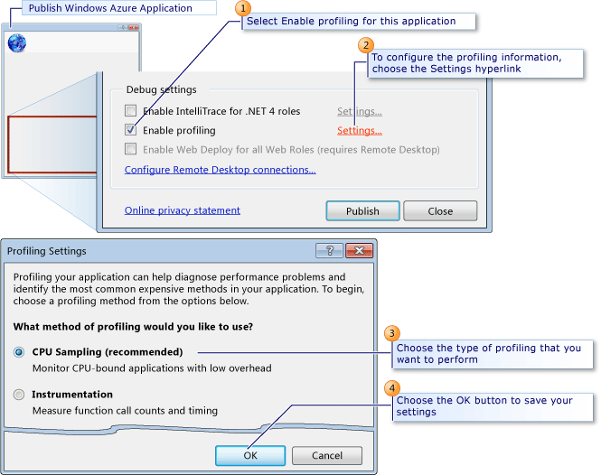

<properties 
   pageTitle="Überprüfen der Leistung der Cloud-Dienst | Microsoft Azure"
   description="Testen Sie die Leistung von einem Cloud-Dienst, mit dem Visual Studio profiler"
   services="visual-studio-online"
   documentationCenter="n/a"
   authors="TomArcher"
   manager="douge"
   editor="" />
<tags 
   ms.service="visual-studio-online"
   ms.devlang="multiple"
   ms.topic="article"
   ms.tgt_pltfrm="multiple"
   ms.workload="na"
   ms.date="08/15/2016"
   ms.author="tarcher" />

# Überprüfen der Leistung der Cloud-Dienst 

##(Übersicht)

Sie können die Leistung von einen Cloud-Service wie folgt testen:

- Verwenden Sie zum Sammeln von Informationen zu Anfragen und Verbindungen und Website Statistik überprüfen, die zeigen, wie der Dienst aus der Sicht eines führt Azure-Diagnose. Um mit anzufangen, finden Sie unter [Konfigurieren von Diagnose für Azure-Cloud-Diensten und virtuellen Computern]( http://go.microsoft.com/fwlink/p/?LinkId=623009).

- Mithilfe des Visual Studio-Profilers, erhalten eine genaue Analyse der Berechnung Aspekte wie der Dienst ausgeführt wird. Wie in diesem Thema beschrieben, können Sie den Profiler verwenden, um die Leistung zu erfassen, wie ein Dienst in Azure ausgeführt wird. Informationen darüber, wie Sie den Profiler verwenden, um die Leistung zu erfassen, wie ein Dienst lokal in einer Serveremulator ausgeführt wird finden Sie unter [Testen der Leistung von einer Azure Cloud Service lokal in der berechnen Emulator mit Visual Studio Profiler](http://go.microsoft.com/fwlink/p/?LinkId=262845).

## Auswählen einer Performance-Tests Methode

###Verwenden Sie zum Erfassen von Azure-Diagnose:###

- Statistik auf Webseiten oder Dienste, wie Besprechungsanfragen und Verbindungen.

- Statistik Rollen, z. B., wie oft eine Rolle neu gestartet wurde.

- Festlegen von Informationen über die Verwendung von Arbeitsspeicher, wie der Prozentsatz der Zeit, die den Garbagecollector benötigt, oder den Speicher insgesamt einer laufenden Rolle.

###Verwenden Sie den Visual Studio Profiler an:###

- Bestimmen Sie, welche Funktionen optimal Zeit in Anspruch nehmen.

- Messen Sie, wie viel Zeit jeden Teil eines Programms rechenintensive benötigt.

- Vergleichen Sie detaillierte von Leistungsberichten für zwei Versionen von einem Dienst an.

- Analysieren Sie arbeitsspeicherzuteilung ausführlicher als einzelner Arbeitsspeicher Zuweisungen der Ebene an.

- Analysieren Sie Probleme in Multithreadcode.

Wenn Sie den Profiler verwenden, können Sie Daten sammeln, wenn Sie ein Clouddienst lokal oder Azure ausgeführt wird.

###Sammeln Sie lokal Profilerstellungsdaten zu:###

- Testen Sie die Leistung eines Teils des einen Clouddienst, wie die Ausführung von bestimmter Worker-Rolle, die eine realistische simulierte Last setzt voraus.

- Testen Sie die Leistung von einem Cloud-Dienst isoliert, unter Umständen gesteuert.

- Testen Sie die Leistung von einem Cloud-Dienst, bevor Sie es in Azure bereitstellen.

- Testen Sie die Leistung von einem Cloud-Dienst privat, ohne die vorhandenen Bereitstellungen stören.

- Testen Sie die Leistung des Diensts, ohne dabei Gebühren für die in Azure ausgeführt.

###Listen Sie Profilerstellungsdaten in Azure zu:###

- Testen Sie die Leistung von einem Cloud-Dienst eines simulierten oder real Auslastung.

- Verwenden Sie die Instrumentationsmethode der Sammeln von Profilerstellungsdaten, wie weiter unten in diesem Thema werden.

- Testen Sie die Leistung des Diensts in derselben Umgebung wie bei der Dienst in der Herstellung ausgeführt wird.

Sie simulieren, in der Regel eine Last Test Cloud Services unter Normal oder Belastung.

## Einen Clouddienst in Azure ein Profil erstellen

Wenn Sie Ihre Cloud-Dienst von Visual Studio veröffentlichen, können Sie Profil für den Dienst und geben Sie Profilerstellungsdaten, mit die Sie die Informationen erhalten, die gewünschten Einstellungen. Eine Profilerstellungsdatendatei Sitzung ist für jede Instanz von einer Rolle gestartet. Weitere Informationen dazu, wie Sie den Dienst aus Visual Studio veröffentlichen finden Sie unter [Funktionen zum Veröffentlichen in einer Azure-Cloud-Dienst von Visual Studio](https://msdn.microsoft.com/library/azure/ee460772.aspx).

Weitere Informationen zu Performance-Profils in Visual Studio finden Sie unter [Anfänger-Leitfaden für Performance-Profils](https://msdn.microsoft.com/library/azure/ms182372.aspx) und [Analysieren von Leistung der Anwendung von verwenden](https://msdn.microsoft.com/library/azure/z9z62c29.aspx).

>[AZURE.NOTE] Sie können IntelliTrace oder Profil erstellen, wenn Sie Ihre Cloud-Dienst veröffentlichen aktivieren. Sie können beide nicht aktivieren.

###Profiler Websitesammlung Methoden

Andere Methoden können für ein Profil erstellen, Sie basierend auf Ihre Leistungsprobleme:

- **CPU-werden** – diese Methode sammelt Anwendungsstatistiken, die für ursprüngliche Analyse der CPU-Auslastungsproblemen hilfreich sind. CPU-Stichproben ist die vorgeschlagenen Methode zum Starten von den meisten Leistung Untersuchungen. Es gibt eine geringe Auswirkung auf die Anwendung, die Sie ein Profil beim Sammeln von CPU-Stichproben von Daten erstellen aus.

- **Instrumentation** – diese Methode sammelt detaillierte Anzeigedauer-Daten, die für die markierten Analyse und zum Analysieren von/Ausgang Leistungsprobleme sinnvoll ist. Die Instrumentationsmethode Einträge jeden Eintrag, beenden und Funktionsaufrufs der Funktionen in dem Modul, während ein Profil ausführen. Diese Methode empfiehlt sich für die Anzeigedauer detaillierte Informationen über einen Codeabschnitt gesammelt und Grundlegendes zu den Einfluss von Eingabe- und Vorgängen zur Leistung der Anwendung. Diese Methode ist für einen Computer mit einem 32-Bit-Betriebssystem deaktiviert. Diese Option steht nur, wenn Sie den Cloud-Dienst in der Serveremulator nicht lokal in Azure, ausführen.

- **.NET Arbeitsspeicherzuteilung** – diese Methode sammelt .NET Framework Daten mithilfe der Samplingprofilerstellungsmethode. Die gesammelten Daten enthält, die Anzahl und die Größe von zugeordneten Objekten.

- **Parallelität** – diese Methode sammelt Konflikte Ressourcendaten und Prozess und Thread Ausführung von Daten, die Analyse von multi-threaded und mehreren Prozessen Applikationen eignet. Die Parallelitätsmethode erfasst Daten für jedes Ereignis, blockiert die Ausführung des Codes, wie z. B., wenn ein Thread wartet Zugriff auf eine Ressource freigegeben werden gesperrt. Diese Methode empfiehlt sich zum Analysieren von Multithreadanwendungen.

- Sie können auch **In Interaktion Profil erstellen**, Aktivieren der ruft Weitere Informationen zu den aufgezeichneten Zeiten von synchroner ADO.NET in mehreren Ebenen Applikationen-Funktionen, die mit einer oder mehreren Datenbanken kommunizieren bereitstellt. Sie können mithilfe einer der Profilerstellungsmethoden Ebeneninteraktionsdaten sammeln. Weitere Informationen zur Stufe Interaktion Profil erstellen finden Sie unter [Ebene Interaktionen anzeigen](https://msdn.microsoft.com/library/azure/dd557764.aspx).

## Konfigurieren von Profilerstellungsdaten Einstellungen

Die folgende Abbildung zeigt so konfigurieren Sie Ihre Profilerstellungsdaten Einstellungen im Dialogfeld Azure-Anwendung veröffentlichen.

>[AZURE.NOTE] Zum aktivieren das Kontrollkästchen **aktivieren, ein Profil erstellen** , müssen Sie den Profiler auf dem lokalen Computer, den Sie verwenden, um Ihre Cloud-Dienst veröffentlichen installiert haben. Standardmäßig ist der Profiler zusammen mit Visual Studio installiert.

### So konfigurieren Sie Profilerstellungsdaten Einstellungen

1. Öffnen Sie im Explorer-Lösung das Kontextmenü für ein Projekt Azure, und wählen Sie dann auf **Veröffentlichen**. Weitere Informationen dazu, wie Sie einen Clouddienst zu veröffentlichen finden Sie unter [Veröffentlichen einer Cloud-service mit Azure-Tools](http://go.microsoft.com/fwlink/p?LinkId=623012).

1. Klicken Sie im Dialogfeld **Azure-Anwendung veröffentlichen** ignoriert die Registerkarte **Erweiterte Einstellungen** .

1. Damit sich ein Profil erstellen, wählen Sie das Kontrollkästchen **aktivieren, ein Profil erstellen** .

1. Wählen Sie den Link für **Einstellungen** zum Konfigurieren der Einstellungen für Profilerstellungsdaten aus. Das Dialogfeld Einstellungen Profil erstellen wird angezeigt.

1. Wählen Sie aus der Optionsfelder **Welche Methode zum Profil erstellen möchten Sie verwenden** den Typ des, Sie müssen ein Profil erstellen.

1. Aktivieren Sie das Kontrollkästchen **Aktivieren in Interaktion ein Profil erstellen** , zum Sammeln von Profilerstellungsdaten Interaktion Ebene.

1. Wählen Sie die Schaltfläche **OK** , um die Einstellungen zu speichern.

    Wenn Sie diese Anwendung veröffentlichen, werden diese Einstellungen zum Erstellen der Profilerstellungstools Sitzung für jede Rolle verwendet.

## Anzeigen von Berichten ein Profil erstellen

Eine Profilerstellungsdatendatei Sitzung ist für jede Instanz von einer Rolle in der Cloud-Dienst erstellt. Zum Anzeigen Ihrer Profilerstellungsberichte jeder Visual Studio-Sitzung können Sie Server-Explorer-Fenster anzeigen, und wählen Sie dann den Knoten Azure zu berechnen, um eine Instanz von einer Rolle auswählen. Sie können die Profilerstellungsbericht dann anzeigen, wie in der folgenden Abbildung gezeigt.

### Profilerstellungsberichte anzeigen

1. Wählen Sie zum Anzeigen des Server-Explorer-Fensters in Visual Studio in der Menüleiste Ansicht, Server-Explorer.

1. Wählen Sie den Knoten Azure zu berechnen, und wählen Sie dann den Knoten Azure-Bereitstellung für den Clouddienst, den Sie zum Profil ausgewählt, wenn Sie von Visual Studio veröffentlicht.

1. Wählen Sie die Rolle des Diensts Profilerstellungsberichte für eine Instanz um anzuzeigen, öffnen Sie das Kontextmenü für eine bestimmte Instanz und wählen Sie dann **Ein Profil erstellen Bericht anzeigen**.

    VSP-Datei, klicken Sie im Bericht werden jetzt aus Azure heruntergeladen und der Status des Downloads im Azure Aktivitätsprotokoll angezeigt. Wenn der Download abgeschlossen ist, wird die Profilerstellungsbericht auf einer Registerkarte im Editor für Visual Studio mit dem Namen <Role name> _<Instance Number>_ <identifier>VSP. Zusammenfassungsdaten für den Bericht wird angezeigt.

1. Wenn verschiedene Ansichten des Berichts, in der Liste Aktuelle Ansicht anzeigen möchten, wählen Sie den Typ der Ansicht die gewünschten. Weitere Informationen finden Sie unter [Tools Bericht-Ansichten ein Profil erstellen](https://msdn.microsoft.com/library/azure/bb385755.aspx).

## Nächste Schritte

[Für das Debuggen Cloud Services](https://msdn.microsoft.com/library/azure/ee405479.aspx)

[Veröffentlichen auf einem Azure-Cloud-Dienst von Visual Studio](https://msdn.microsoft.com/library/azure/ee460772.aspx)

