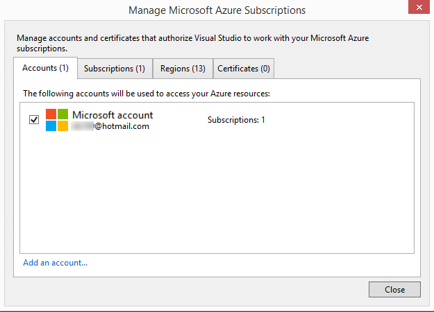
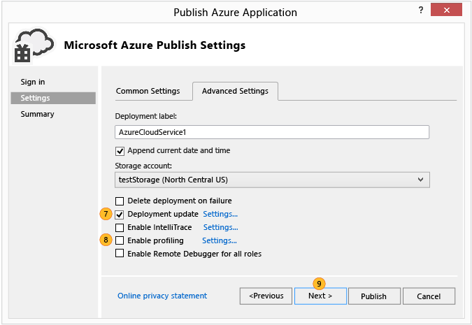
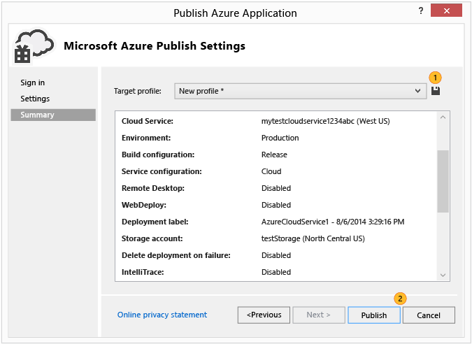

<properties 
   pageTitle="Veröffentlichen von Azure-Anwendung-Assistenten | Microsoft Azure"
   description="Veröffentlichen von Azure-Anwendung-Assistenten"
   services="visual-studio-online"
   documentationCenter="na"
   authors="TomArcher"
   manager="douge"
   editor="" />
<tags 
   ms.service="multiple"
   ms.devlang="multiple"
   ms.topic="article"
   ms.tgt_pltfrm="na"
   ms.workload="na"
   ms.date="08/15/2016"
   ms.author="tarcher" />

# Veröffentlichen von Azure-Anwendung-Assistenten

## (Übersicht)

Nachdem Sie eine Webanwendung in Visual Studio entwickelt haben, können Sie die Anwendung einfacher zu einem Azure-Cloud-Dienst mithilfe des Assistenten zum **Veröffentlichen von Azure-Anwendung** veröffentlichen. Der erste Abschnitt erläutert die Schritte, die Sie ausführen müssen, bevor Sie den Assistenten verwenden und die restlichen Abschnitten erläutern Sie die Funktionen des Assistenten.

>[AZURE.NOTE] In diesem Thema wird zum Bereitstellen in der Cloud Services nicht auf Websites. Informationen zum Bereitstellen auf Websites finden Sie unter [Gewusst wie: Bereitstellen einer Azure-Website](https://social.msdn.microsoft.com/Search/windowsazure?query=How%20to%20Deploy%20an%20Azure%20Web%20Site&Refinement=138&ac=4#refinementChanges=117&pageNumber=1&showMore=false).

## Erforderliche Komponenten

Bevor Sie Ihre Webanwendung mit Azure veröffentlichen können, müssen Sie ein Microsoft-Konto und ein Azure-Abonnement verfügen und müssen Sie die Webanwendung mit einer Azure-Cloud-Dienst zuordnen. Wenn Sie diese Aufgaben bereits abgeschlossen haben, können Sie mit dem nächsten Abschnitt überspringen.

1. Erhalten eines Microsoft-Konto und ein Azure-Abonnement. Versuchen Sie, ein kostenloses Azure kostenlosen einen Monat-Abonnement [hier](https://azure.microsoft.com/pricing/free-trial/)

1. Erstellen Sie einen Clouddienst und einem Speicherkonto auf Azure ein. Sie können dem Server-Explorer in Visual Studio oder mithilfe der [Azure klassischen Portal](http://go.microsoft.com/fwlink/?LinkID=213885)ausführen.

1. Aktivieren der Web-Anwendungs für Azure. Zum Aktivieren der Web-Anwendungs von Visual Studio Azure veröffentlicht werden soll, müssen Sie es mit einem Azure-Cloud-Service-Projekt in Visual Studio zugeordnet werden soll. Um das Projekt zugeordneten Cloud-Dienst zu erstellen, öffnen Sie das Kontextmenü für das Projekt für eine Webanwendung, und wählen Sie dann auf konvertieren, **Konvertieren in Azure Cloud Service Project**.

1. Nachdem das Projekt für den Cloud-Dienst zu Ihrer Lösung hinzugefügt wurde, öffnen Sie im Kontextmenü die Option erneut, und wählen Sie dann auf **Veröffentlichen**. Weitere Informationen zum Aktivieren von Applications für Azure finden Sie unter [wie: Migrieren und Veröffentlichen einer Web-Anwendung zu Azure-Cloud-Dienst von Visual Studio](https://msdn.microsoft.com/library/azure/hh420322.aspx).

>[AZURE.NOTE] Achten Sie darauf, um Visual Studio mit Administratorberechtigungen (als Administrator ausführen) zu starten.

1. Wenn Sie bereit sind, veröffentlichen die Anwendung, öffnen Sie das Kontextmenü für das Projekt Azure-Cloud-Dienst, und wählen Sie dann auf **Veröffentlichen**. Die folgenden Schritte durch Anzeigen den Azure-Anwendung Veröffentlichen-Assistenten.

## Ihr Abonnement auswählen

### Auswählen ein Abonnements

1. Bevor Sie den Assistenten zum ersten Mal verwenden, müssen Sie sich anmelden. Wählen Sie den Link **Melden Sie sich** an. Melden Sie sich bei der Azure-Portal, wenn Sie aufgefordert werden, und geben Sie Ihre Azure-Benutzernamen und Ihr Kennwort ein. 

    

    Die Liste der Abonnements füllt mit der Abonnements, die mit Ihrem Konto verbunden sind. Sie möglicherweise auch Abonnements aus einem beliebigen Abonnementdateien angezeigt, die Sie zuvor importiert.

1. Wählen Sie das Abonnement für diese Bereitstellung verwendet werden soll, in der Liste **Wählen Sie Ihr Abonnement** .

   Wenn Sie **<... verwalten >**auswählen, wird das Dialogfeld **Abonnements verwalten** , und Sie können auswählen, das Abonnement und das Benutzerkonto, das Sie verwenden möchten. Die Registerkarte **Firmen** zeigt alle Ihre Konten, und die Registerkarte **Abonnements** zeigt alle Abonnements mit den Konten verbunden sind. Sie können auch einen Bereich aus dem Azure Ressourcen, als auch erstellen oder Importieren von Zertifikaten für Ihr Abonnement vom Azure-Portal auswählen. Wenn Sie alle Abonnements aus einer Abonnementdatei importiert haben, werden die zugeordneten Zertifikate, klicken Sie auf die Registerkarte **Zertifikate** angezeigt. Wenn Sie fertig sind, wählen Sie die Schaltfläche **Schließen** .

    

    >[AZURE.NOTE] Eine Abonnementdatei kann mehrere Abonnements enthalten.

1. Wählen Sie die Schaltfläche **Weiter** , um den Vorgang fortzusetzen. 

    Wenn Sie Ihr Abonnement keine Cloud Services, müssen Sie einen Clouddienst in Ihrem Projekt hosten Azure erstellen. Das Dialogfeld **Cloud-Dienst erstellen und Speicher-Konto** angezeigt wird.

    Geben Sie einen neuen Namen für die Cloud-Dienst an. Der Name muss in Azure eindeutig sein. Geben Sie dann eine Region oder die Zugehörigkeit Gruppe für eine Data Center, die Sie oder die meisten Kunden ist. Dieser Name wird auch für ein neues Speicherkonto verwendet, die für Ihre Cloud-Dienst Azure erstellt wird.

1. Ändern Sie die Änderungen an den Einstellungen für diese Bereitstellung, und veröffentlichen sie Sie dann, indem Sie auf die Schaltfläche " **Veröffentlichen** " (im nächste Abschnitt enthält ausführliche Informationen zu den verschiedenen Einstellungen). So prüfen Sie die Einstellungen vor dem Veröffentlichen, wählen Sie die Schaltfläche **Weiter** aus.

    >[AZURE.NOTE] Wenn Sie in diesem Schritt veröffentlichen ausgewählt haben, können Sie den Status dieser Bereitstellung in Visual Studio überwachen.

Sie können allgemeine und erweiterte Einstellungen für eine Bereitstellung mithilfe des Assistenten zum **Veröffentlichen von Azure-Anwendung** ändern. Beispielsweise können Sie auswählen, eine Einstellung, um die Anwendung in einer Umgebung bereitstellen, bevor Sie es freigeben. Die folgende Abbildung zeigt die Registerkarte **Allgemeine Einstellungen** für eine Azure-Bereitstellung.

## Konfigurieren der Einstellungen veröffentlichen

### So konfigurieren Sie die Einstellungen veröffentlichen

1. Führen Sie in der Liste **Cloud-Dienst** eine der folgenden Schritte aus:

   1. Wählen Sie in der Dropdown-Listenfeld einen vorhandenen Clouddienst aus. Die Position der Mitte Daten für den Dienst wird angezeigt. Notieren Sie sich diesen Speicherort, und stellen Sie sicher, dass es sich bei Ihrem Konto-Speicherort befindet sich in derselben Data Center.

    1. Wählen Sie **Neu erstellen** auf einen Clouddienst, Azure hostet erstellen. Geben Sie im Dialogfeld **Cloud-Dienst erstellen** einen Namen für den Dienst, und geben Sie dann eine Region oder die Zugehörigkeit Gruppe an die Position des Mittelpunkts Daten, die diese Cloud-Dienst gehostet werden soll. Der Name muss in Azure eindeutig sein.

1. Wählen Sie in der Liste **Umgebung** entweder **Herstellung** oder **Staging**aus. Wenn Sie die Anwendung in einer Umgebung bereitstellen möchten, wählen Sie die staging-Umgebung. Sie können Ihrer Anwendung zu dieser Umgebung später verschieben.

1. Wählen Sie in der Liste **erstellen Konfiguration** **Debuggen** oder **Release**aus.

1. Wählen Sie in der Liste **Dienstkonfiguration** **Cloud** oder **lokale**aus.

    Aktivieren Sie das Kontrollkästchen **Remotedesktop für alle Rollen aktivieren** , wenn die Verbindung zum Dienst Remote hergestellt werden soll. Diese Option wird hauptsächlich zur Behandlung dieses Problems. Wenn Sie dieses Kontrollkästchen aktivieren, wird das Dialogfeld **Remote Desktop-Konfiguration** angezeigt. Wählen Sie den Link Einstellungen so ändern Sie die Konfiguration aus.

    Wählen Sie das Kontrollkästchen **Aktivieren Web für alle Webrollen bereitstellen** , um die Web-Bereitstellung für den Dienst aktivieren. Sie müssen Remotedesktop verwenden Sie dieses Feature aktivieren. Weitere Informationen finden Sie unter [[Veröffentlichen einer mithilfe der Tools Azure-Cloud-Dienst](https://msdn.microsoft.com/library/azure/ff683672.aspx)](https://msdn.microsoft.com/library/azure/ff683672.aspx). Weitere Informationen zur Web bereitstellen finden Sie unter [[Veröffentlichen einer mithilfe der Tools Azure-Cloud-Dienst](https://msdn.microsoft.com/library/azure/ff683672.aspx)](https://msdn.microsoft.com/library/azure/ff683672.aspx).

1. Wählen Sie die Registerkarte **Erweiterte Einstellungen** aus. Übernehmen Sie den Standardnamen, oder geben Sie einen Namen Ihrer Wahl im Feld **Beschriftung der Bereitstellung** . Wenn Sie das Datum an die Bereitstellung Bezeichnung angefügt werden soll, lassen Sie das Kontrollkästchen aktiviert.

    

1. Wählen Sie in der Liste **Speicher-Konto** das Speicherkonto für diese Bereitstellung verwendet werden soll. Vergleichen Sie die Speicherorte der der Data Center für Ihre Cloud-Dienst und Ihre Speicher-Konto an. Diese Orte sollte idealerweise identisch sein.

    >[AZURE.NOTE] Das Konto Azure-Speicher speichert das Paket für die Bereitstellung der Anwendung. Nachdem die Anwendung bereitgestellt wird, wird das Paket aus dem Speicherkonto entfernt.

1. Aktivieren Sie das Kontrollkästchen **Bereitstellung aktualisieren** , wenn Sie nur die aktualisierte Komponenten bereitstellen möchten. Diese Art der Bereitstellung kann als eine vollständige Bereitstellung schneller sein. Wählen Sie den **Einstellungen** Link öffnen Sie im Dialogfeld **Bereitstellung aktualisieren** , in der folgenden Abbildung gezeigt. 

    

    Sie können eine der beiden Optionen für die Bereitstellung von Update, inkrementell oder gleichzeitiges auswählen. Eine inkrementelle Bereitstellung aktualisiert einer bereitgestellte Instanz nacheinander, sodass die Anwendung online und für die Benutzer verfügbar bleibt. Eine Bereitstellung von gleichzeitige aktualisiert alle bereitgestellte Instanzen gleichzeitig an. Gleichzeitiges aktualisieren schneller als inkrementell aktualisieren, aber wenn Sie diese Option auswählen, eine Anwendung möglicherweise nicht zur Verfügung für die Aktualisierung auswählen.

    Sie sollten das Kontrollkästchen aktivieren, wenn Bereitstellung nicht aktualisiert werden kann, führen Sie eine vollständige Bereitstellung Sie bei Bedarf die endgültige Bereitstellung automatisch erfolgen, wenn eine Update-Bereitstellung fehlschlägt. Eine vollständige Bereitstellung setzt die virtuelle IP-Adresse (VIP) Adresse für den Clouddienst zurück. Weitere Informationen finden Sie unter [So: behalten Sie eine Konstante virtuelle IP-Adresse für einen Cloud-Dienst](https://msdn.microsoft.com/library/azure/jj614593.aspx).

1. Zum Debuggen von Ihrem Diensts **IntelliTrace aktivieren** das Kontrollkästchen oder wählen Sie Sie eine Konfiguration **Debuggen** bereitstellen und den Clouddienst in Azure debuggen möchten, das Kontrollkästchen **Aktivieren Remotedebugger für alle Rollen** Debuggen Remoteprozeduraufruf Dienste bereitstellen.

2. Um ein Profil die Anwendung, wählen Sie das Kontrollkästchen **aktivieren, ein Profil erstellen** aus, und wählen Sie dann auf den Link **Einstellungen** , um die Profilerstellungsdaten Optionen anzuzeigen. 

    >[AZURE.NOTE] Müssen Sie Visual Studio Ultimate aktivieren IntelliTrace "oder" Ebene Interaktion Profil erstellen (TIP) verwenden, und beide gleichzeitig können nicht aktiviert werden.

    Weitere Informationen finden Sie unter [Debuggen mit IntelliTrace und Visual Studio eine veröffentlicht Cloud-Dienst](https://msdn.microsoft.com/library/azure/ff683671.aspx) und [Testen Sie die Leistung von einem Cloud-Dienst](https://msdn.microsoft.com/library/azure/hh369930.aspx).

1. Wählen Sie auf **nächste** Seite "Zusammenfassung" für die Anwendung anzeigen.

## Veröffentlichen der Anwendung

1. Sie können auswählen, in den Einstellungen für die Veröffentlichung Profil zu erstellen, die Sie ausgewählt haben. Sie können beispielsweise ein Profil für eine testumgebung und einen anderen für die Herstellung erstellen. Wählen Sie das Symbol **Speichern** aus, um dieses Profil zu speichern. Der Assistent erstellt das Profil und im Visual Studio-Projekt gespeichert. Um den Profilnamen zu ändern, öffnen Sie die Liste der **Ziel-Profil** , und wählen Sie dann auf **<... verwalten >**.

    

    >[AZURE.NOTE] Das Profil für die Veröffentlichung wird im Explorer der Lösung in Visual Studio, und die einräumen in eine Datei mit der Erweiterung .azurePubxml geschrieben werden. Als Attribute von XML-Tags gespeichert werden.

1. Wählen Sie dann **Veröffentlichen** Ihrer Anwendung veröffentlichen. Sie können die Prozessstatus im **Ausgabefenster in Visual Studio** überwachen.

## Siehe auch

[So: Migrieren und veröffentlichen eine Webanwendung mit einem Azure-Cloud-Dienst von Visual Studio](https://msdn.microsoft.com/library/azure/hh420322.aspx)

[Veröffentlichen einer mithilfe der Tools Azure-Cloud-Dienst](https://msdn.microsoft.com/library/azure/ff683672.aspx)

[Für das Debuggen eines veröffentlichten Cloud-Diensts mit IntelliTrace und Visual Studio](https://msdn.microsoft.com/library/azure/ff683671.aspx)

[Überprüfen der Leistung der Cloud-Dienst](https://msdn.microsoft.com/library/azure/hh369930.aspx)

