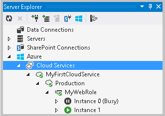

<properties
   pageTitle="Veröffentlichen einer Cloud-Dienst mithilfe der Tools Azure | Microsoft Azure"
   description="Informationen Sie zum Veröffentlichen von Azure-Cloud-Dienstprojekte mit Visual Studio."
   services="visual-studio-online"
   documentationCenter="na"
   authors="TomArcher"
   manager="douge"
   editor="" />
<tags
   ms.service="multiple"
   ms.devlang="dotnet"
   ms.topic="article"
   ms.tgt_pltfrm="na"
   ms.workload="multiple"
   ms.date="08/15/2016"
   ms.author="tarcher" />

# Veröffentlichen einer mithilfe der Tools Azure-Cloud-Dienst

Mithilfe der Azure-Tools für Microsoft Visual Studio zu verwenden, können Sie Ihre Azure-Anwendung direkt in Visual Studio veröffentlichen. Visual Studio unterstützt integrierte Veröffentlichung entweder das Staging oder dieser Umgebung der Cloud-Dienst an.

Bevor Sie eine Azure-Anwendung veröffentlichen können, müssen Sie ein Azure-Abonnement verfügen. Sie müssen ein Cloud-Dienst und Speicher-Konto einrichten, von Ihrer Anwendung verwendet werden soll. Sie können diese in dem [Azure klassischen Portal](http://go.microsoft.com/fwlink/?LinkID=213885)einrichten.

>[AZURE.IMPORTANT] Wenn Sie veröffentlichen möchten, können Sie Deployment-Umgebung für Ihre Cloud-Dienst auswählen. Sie müssen außerdem ein Speicherkonto auswählen, mit dem das Anwendungspaket für Bereitstellung speichern. Das Anwendungspaket wird nach der Bereitstellung von Speicherkonto entfernt.

Wenn Sie entwickeln und Testen der Anwendung Azure, können Web bereitstellen Sie Änderungen inkrementell für Ihre Webrollen veröffentlicht werden. Nachdem Sie die Anwendung in einer Umgebung Bereitstellung veröffentlichen, bietet Ihnen ein Web bereitstellen Änderungen direkt auf den virtuellen Computern bereitstellen, die die Web-Rolle ausgeführt wird. Sie müssen nicht packen und veröffentlichen Sie die gesamte Azure-Anwendung jedes Mal Ihre Webrolle So testen Sie die Änderungen aktualisiert werden sollen. Bei diesem Ansatz haben Sie die verfügbaren Web Rolle Änderungen in der Cloud zu Testzwecken ohne warten auf Ihrer Anwendung zu einer Umgebung für die Bereitstellung veröffentlicht haben.

So veröffentlichen Sie Ihre Azure-Anwendung und eine Webrolle mithilfe von Web bereitstellen zu aktualisieren, gehen Sie folgendermaßen vor:

- Veröffentlichen oder Packen einer Azure-Anwendung von Visual Studio

- Aktualisieren einer Webrolle als Teil der Entwicklung und Testen Kreis

## Veröffentlichen oder Packen einer Azure-Anwendung von Visual Studio

Wenn Sie Ihre Azure-Anwendung veröffentlichen, können Sie eine der folgenden Aufgaben ausführen:

- Erstellen Sie ein Paket Dienst: Sie können dieses Paket und die Konfiguration Dienstdatei Ihrer Anwendung in einer Umgebung für die Bereitstellung vom [Klassischen Azure-Portal](http://go.microsoft.com/fwlink/?LinkID=213885)veröffentlicht.

- Veröffentlichen von Visual Studio Projekt Azure: um eine Anwendung direkt in Azure veröffentlichen möchten, verwenden Sie den Veröffentlichen-Assistenten. Informationen finden Sie unter [Veröffentlichen Azure-Anwendung-Assistenten](vs-azure-tools-publish-azure-application-wizard.md).

### So erstellen Sie ein Service-Paket aus Visual Studio

1. Wenn Sie die Anwendung veröffentlichen bereit sind, öffnen Sie Lösung Explorer, öffnen Sie das Kontextmenü für das Azure Projekt, das Ihre Rollen enthält, und wählen Sie veröffentlichen.

1. Gehen Sie folgendermaßen vor, um ein Service-Paket zu erstellen:  

  1. Wählen Sie im Kontextmenü für das Projekt Azure **Paket**aus.

  1. Wählen Sie die Dienstkonfiguration, für die Sie ein Paket erstellen möchten, und wählen Sie dann auf die Generator-Konfiguration, klicken Sie im Dialogfeld **Verpacken Azure-Anwendung** .

  1. (optional) Zum Aktivieren Remotedesktop für den Clouddienst, nachdem Sie ihn um seine Erlaubnis, aktivieren Sie das Kontrollkästchen **Remotedesktop für alle Rollen aktivieren** , und wählen Sie dann die **Einstellungen** so konfigurieren Sie Remotedesktop. Wenn Sie Ihre Cloud-Dienst debuggen, nachdem Sie diese veröffentlichen möchten, aktivieren Sie remote-Debuggen durch **Aktivieren Remotedebugger für alle Rollen**auswählen.

      Weitere Informationen finden Sie unter [Verwenden von Remotedesktop mit Azure Rollen](vs-azure-tools-remote-desktop-roles.md).

  1. Wählen Sie den **Paket** -Link, um das Paket zu erstellen.

      Datei-Explorer zeigt den Dateispeicherort des neu erstellten Pakets. So, dass Sie diese aus dem [Azure klassischen Portal](http://go.microsoft.com/fwlink/?LinkID=213885)verwenden können, können Sie diesen Speicherort kopieren.

  1. Um dieses Paket in einer Umgebung für die Bereitstellung veröffentlichen möchten, müssen Sie diesen Speicherort als Speicherort des Pakets verwenden, beim Erstellen eines Cloud-Diensts und dieses Paket in einer Umgebung mit dem [Azure klassischen Portal](http://go.microsoft.com/fwlink/?LinkID=213885)bereitstellen.

1. (Optional) Um den Bereitstellungsprozess im Kontextmenü für das Element Zeile in der Log Aktivität abzubrechen, wählen Sie **Abbrechen und entfernen**aus. Dies hält den Bereitstellungsprozess und löscht die Umgebung für die Bereitstellung von Azure.

    >[AZURE.NOTE] Um diese Bereitstellung Umgebung entfernen möchten, nachdem sie bereitgestellt wurde, müssen Sie das [Azure klassischen Portal](http://go.microsoft.com/fwlink/?LinkID=213885)verwenden.

1. (Optional) Nachdem Ihre Rolleninstanzen gestartet haben, zeigt Visual Studio Deployment-Umgebung automatisch in die **Cloud Services** -Knoten im Server-Explorer. Hier können Sie den Status der einzelnen Rolleninstanzen anzeigen. Finden Sie unter [Verwalten von Azure Ressourcen mit Cloud-Explorer](vs-azure-tools-resources-managing-with-cloud-explorer.md). Die folgende Abbildung zeigt die Rolleninstanzen, während Sie sich noch im Initialisierung Zustand befinden:

    

## Aktualisieren einer Webrolle als Teil der Entwicklung und Testen Kreis

Wenn die Back-End-Infrastruktur Ihrer app unveränderliche ist, aber die Webrollen benötigen mehr häufigere aktualisieren, können Web bereitstellen Sie um nur eine Webrolle im Projekt zu aktualisieren. Dies ist hilfreich, wenn Sie nicht neu erstellen und erneut die Back-End-Worker-Rollen bereitstellen möchten, oder wenn Sie über mehrere Webrollen verfügen und nur eine der Webrollen aktualisiert werden sollen.

### Anforderungen

Hier sind die Anforderungen zum Bereitstellen von Web verwenden, um Ihre Webrolle aktualisieren:

- **Nur für Test- und Zwecke:** Direkt auf den virtuellen Computern sind die Änderungen vorgenommen, wenn die Web-Rolle ausgeführt wird. Wenn diese virtuellen Computern sind wiederverwendet werden, sind die Änderungen verloren, da das ursprüngliche Paket, das Sie veröffentlicht verwendet wird, um die Rolle des virtuellen Computers neu zu erstellen. Sie müssen eine Anwendung, um die neuesten Änderungen für die Web-Rolle erhalten erneut veröffentlichen.

- **Können nur die Webrollen aktualisiert werden:** Worker-Rollen können nicht aktualisiert werden. Darüber hinaus können Sie die RoleEntryPoint im Web role.cs nicht aktualisieren.

- **Unterstützt nur eine Instanz des Web-Rolle:** Sie können nicht in Ihrer Umgebung für die Bereitstellung mehrerer Instanzen von einer bestimmten Webrolle haben. Mehrere Webrollen jede nur eine Instanz werden jedoch unterstützt.

- **Müssen Sie remote desktop-Verbindungen aktivieren:** Dies ist erforderlich, sodass Web bereitstellen können der Benutzername und Kennwort Verbinden mit des virtuellen Computers die Änderungen auf dem Server bereitstellen, die Internet Information Services (IIS) ausgeführt wird. Darüber hinaus müssen Sie die Verbindung des virtuellen Computers zu ein vertrauenswürdiges Zertifikat IIS auf diesem virtuellen Computer hinzufügen. (Dies wird sichergestellt, dass die Verbindung für IIS, mit dem Web bereitstellen sicher ist.)

Im folgende Verfahren wird davon ausgegangen, dass Sie mit dem **Azure-Anwendung veröffentlichen** -Assistenten verwenden.

### Zum Aktivieren der Web bereitstellen, wenn Sie die Anwendung veröffentlichen

1. Um die **Aktivieren Web bereitstellen** für alle Web Rollen Kontrollkästchen zu aktivieren, müssen Sie zuerst remote desktop-Verbindungen konfigurieren. Wählen Sie für alle Rollen **Remotedesktop aktivieren** aus, und geben Sie die Anmeldeinformationen für die zu verwendenden Verbindung Remote im Feld **Remote Desktop-Konfiguration** , die angezeigt wird. Weitere Informationen finden Sie unter [Verwenden von Remotedesktop mit Azure Rollen](vs-azure-tools-remote-desktop-roles.md) .

1. Wählen Sie zum Aktivieren der Web bereitstellen für die Webrollen in der Anwendung **Aktivieren Web bereitstellen für alle Webrollen**aus.

    Ein gelben Warndreieck angezeigt wird. Web bereitstellen wird standardmäßig, was nicht empfohlen wird für das Hochladen vertrauliche Daten ein nicht vertrauenswürdiger, selbst signiertes Zertifikat verwendet. Wenn Sie diese Verfahrensweise für vertrauliche Daten sichern müssen, können Sie ein Zertifikat einer Zertifizierungsstelle für Verbindungen Web bereitstellen zu verwendende hinzufügen. Dieses Zertifikat muss eines vertrauenswürdigen Zertifikats werden. Informationen darüber, wie Sie dies tun finden Sie im Abschnitt, **Um Stellen Web Secure bereitstellen** , weiter unten in diesem Thema.

1. Wählen Sie **Weiter** auf den Bildschirm **Zusammenfassung** anzeigen aus, und wählen Sie dann auf **Veröffentlichen** , um die Cloud-Dienst bereitstellen.

    Cloud-Dienst veröffentlicht wird. Die virtuellen Computern, die erstellt wird verfügt über remote-Verbindungen für IIS aktiviert, sodass Web bereitstellen verwendet werden können, Ihre Webrollen zu aktualisieren, ohne erneut veröffentlichen.

    >[AZURE.NOTE] Wenn Sie mehr als eine Instanz für eine Webrolle konfiguriert haben, wird eine Warnung angezeigt, die besagt, dass jede Webrolle auf eine Instanz nur in das Paket begrenzt werden, die erstellt wird, wenn Sie die Anwendung veröffentlichen. Wählen Sie **OK** , um den Vorgang fortzusetzen. Wie im Abschnitt Anforderungen angegeben wird, können Sie mehrere Web-Funktion jedoch nur eine Instanz der einzelnen Rollen verfügen.

### Zum Aktualisieren Ihres Aufgabenbereichs Web mithilfe von Web bereitstellen

1. Zum Bereitstellen von Web verwenden möchten, stellen Sie Code Änderungen des Projekts nach jedem der Web-Rollen in Visual Studio, die Sie veröffentlichen möchten, und klicken Sie dann mit der rechten Maustaste in der Lösung dieses Projektknoten und zeigen Sie auf **Veröffentlichen**möchten. Das Dialogfeld " **Web veröffentlichen** " wird angezeigt.

1. (Optional) Wenn Sie ein Zertifikat einer vertrauenswürdiges Zertifizierungsstelle für remote-Verbindungen für IIS verwendet hinzugefügt haben, können Sie das Kontrollkästchen **nicht vertrauenswürdiges Zertifikat zulassen** deaktivieren. Informationen darüber, wie Sie ein Zertifikat zum Bereitstellen von Web sicher gestalten hinzufügen finden Sie im Abschnitt, die später in diesem Thema **Zu stellen Web bereitstellen Secure** .

1. Zum Bereitstellen von Web verwenden zu können, benötigt das Veröffentlichen Verfahren, den Benutzernamen und das Kennwort ein, die Sie für Ihre remote desktop-Verbindung eingerichtet, wenn Sie zuerst das Paket veröffentlicht.

  1. Geben Sie im Feld **Benutzername**den Benutzernamen ein.

  1. Geben Sie im Feld **Kennwort**das Kennwort ein.

  1. (Optional) Wenn Sie dieses Kennwort in dieses Profil speichern möchten, wählen Sie **Kennwort speichern**.

1. Um die Änderungen auf Ihre Webrolle veröffentlichen möchten, wählen Sie **Veröffentlichen**aus.

    Statuszeile zeigt **Schritte veröffentlichen**. Wenn die Veröffentlichung abgeschlossen ist, wird die **Veröffentlichen erfolgreich** angezeigt. Die Änderungen wurden jetzt in die Web-Rolle auf Ihre virtuellen Computern bereitgestellt. Jetzt können Sie Ihre Azure-Anwendung in der Azure-Umgebung zum Testen der Änderungen starten.

### Bereitstellen von Web sicher gestalten

1. Web bereitstellen wird standardmäßig, was nicht empfohlen wird für das Hochladen vertrauliche Daten ein nicht vertrauenswürdiger, selbst signiertes Zertifikat verwendet. Wenn Sie diese Verfahrensweise für vertrauliche Daten sichern müssen, können Sie ein Zertifikat einer Zertifizierungsstelle für Verbindungen Web bereitstellen zu verwendende hinzufügen. Dieses Zertifikat muss ein vertrauenswürdiges Zertifikat werden, die Sie von einer Zertifizierungsstelle (CA) erhalten.

    Um Web bereitstellen für jeden virtuellen Computer für jede Ihrer Webrollen zu sichern, müssen Sie das vertrauenswürdige Zertifikat, das Sie für das Web verwenden möchten hochladen [Azure klassischen Portal](http://go.microsoft.com/fwlink/?LinkID=213885)bereitstellen. Dadurch wird sichergestellt, dass das Zertifikat des virtuellen Computers hinzugefügt wird, die für die Web-Rolle erstellt wird, wenn Sie die Anwendung veröffentlichen.

1. Gehen Sie folgendermaßen vor, um ein Zertifikat einer vertrauenswürdigen Zertifizierungsstelle IIS für remote-Verbindungen verwendet werden soll hinzuzufügen:

  1. Zum Verbinden mit den virtuellen Computern, die die Web-Rolle ausgeführt wird, wählen Sie die Instanz der Webrolle in der **Cloud Explorer** oder **Server-Explorer**, und wählen Sie dann auf den Befehl **Verbinden mit Remotedesktop** . Weitere Informationen zum Herstellen einer Verbindung mit den virtuellen Computern finden Sie unter [Verwenden von Remotedesktop mit Azure Rollen](vs-azure-tools-remote-desktop-roles.md).

      Ihr Browser fordert Sie zum Herunterladen eines. RDP-Datei.

  1. Öffnen Sie zum Hinzufügen eines SSL-Zertifikats den Verwaltungsdienst im IIS-Manager. Aktivieren Sie im IIS-Manager SSL durch Öffnen der Verknüpfung **Bindungen** im Bereich **Aktion** ein. Das Dialogfeld **Bindung der Website hinzufügen** wird angezeigt. Wählen Sie **Hinzufügen**aus, und wählen Sie dann in der Dropdownliste **Typ** HTTPS. Wählen Sie in der Liste **SSL-Zertifikat** das SSL-Zertifikat, dass Sie von einer Zertifizierungsstelle angemeldet haben und Sie [Azure klassischen Portal](http://go.microsoft.com/fwlink/?LinkID=213885)hochgeladen. Weitere Informationen finden Sie unter [Verbindungseinstellungen für die Verwaltungsdienst konfigurieren](http://go.microsoft.com/fwlink/?LinkId=215824).

      >[AZURE.NOTE] Wenn Sie ein Zertifikat einer vertrauenswürdiges Zertifizierungsstelle hinzufügen, wird der gelben Warndreieck des **Veröffentlichen-Assistenten**nicht mehr angezeigt.

## Dateien in den Dienstpaket einschließen

Möglicherweise müssen Sie bestimmte Dateien in Ihrem Dienst Paket einschließen, damit sie auf dem virtuellen Computer zur Verfügung stehen, die für eine Rolle erstellt wird. Sie möchten beispielsweise möglicherweise hinzufügen eine .exe oder eine MSI-Datei, die durch ein Startskript zu Ihrem Servicepaket verwendet wird. Oder Sie müssen eine Assembly hinzuzufügen, die ein Web-Rolle oder Arbeitskollegen Rolle Projekt erforderlich sind. Zum Einschließen von Dateien müssen sie die Lösung für eine Azure-Anwendung hinzugefügt werden.

### Hinzufügen von Dateien in das Service-Paket

1. Um eine Assembly zu einem Servicepaket hinzuzufügen, gehen Sie folgendermaßen vor:

  1. Öffnen Sie im **Explorer Lösung** den Projektknoten für das Projekt, das die referenzierte vorhanden ist.

  1. Wenn die Assembly zum Projekt hinzufügen möchten, öffnen Sie das Kontextmenü für den Ordner **Verweise** aus, und wählen Sie dann **Verweis hinzufügen**. Das Dialogfeld Verweis hinzufügen wird angezeigt.

  1. Wählen Sie den Bezug aus, den Sie hinzufügen, und wählen Sie dann auf die Schaltfläche **OK** möchten.

      Der Bezug wird in der Liste unter dem Ordner **Verweise** hinzugefügt.

  1. Öffnen Sie das Kontextmenü für die Assembly, die Sie hinzugefügt haben, und wählen Sie **Eigenschaften**aus. **Das Eigenschaftenfenster** wird angezeigt.

      Wählen Sie diese Assembly in das Paket Dienst, in der **Liste Lokale Kopie** **Wahr**zum einschließen.

1. Öffnen Sie im **Explorer Lösung** den Projektknoten für das Projekt, das die referenzierte vorhanden ist.

1. Wenn die Assembly zum Projekt hinzufügen möchten, öffnen Sie das Kontextmenü für den Ordner **Verweise** aus, und wählen Sie dann **Verweis hinzufügen**. Das Dialogfeld **Verweis hinzufügen** wird angezeigt.

1. Wählen Sie den Bezug aus, den Sie hinzufügen, und wählen Sie dann auf die Schaltfläche **OK** möchten.

    Der Bezug wird in der Liste unter dem Ordner **Verweise** hinzugefügt.

1. Öffnen Sie das Kontextmenü für die Assembly, die Sie hinzugefügt haben, und wählen Sie **Eigenschaften**aus. Das Eigenschaftenfenster wird angezeigt.

1. Wählen Sie **True**aus, um diese Assembly in das Paket Dienst, in der Liste **Lokale Kopie** aufnehmen möchten.

1. Zum Einschließen von Dateien in das Service-Paket, die zum Projekt Rolle Web hinzugefügt wurden, öffnen Sie das Kontextmenü für die Datei, und wählen Sie dann auf **Eigenschaften**. Wählen Sie im **Eigenschaftenfenster** **Inhalt** im Listenfeld **Aktion erstellen** .

1. Zum Einschließen von Dateien in das Service-Paket, die zum Projekt Rolle Worker hinzugefügt wurden, öffnen Sie das Kontextmenü für die Datei, und wählen Sie dann auf **Eigenschaften**. Wählen Sie aus dem Fenster **Eigenschaften** im Listenfeld **Kopieren in die Ausgabeverzeichnis** **Kopieren, wenn neuer** aus.

## Nächste Schritte

Um weitere Informationen zur Veröffentlichung in Azure von Visual Studio finden Sie unter [Veröffentlichen Azure-Anwendung-Assistenten](vs-azure-tools-publish-azure-application-wizard.md).
