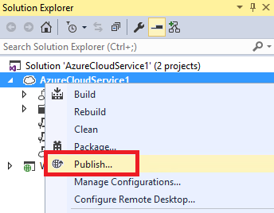

<properties 
   pageTitle="Mithilfe von Remotedesktop mit Azure Rollen | Microsoft Azure"
   description="Verwenden von Remotedesktop mit Azure Rollen"
   services="visual-studio-online"
   documentationCenter="na"
   authors="TomArcher"
   manager="douge"
   editor="" />
<tags 
   ms.service="multiple"
   ms.devlang="multiple"
   ms.topic="article"
   ms.tgt_pltfrm="na"
   ms.workload="na"
   ms.date="08/15/2016"
   ms.author="tarcher" />

# Verwenden von Remotedesktop mit Azure Rollen

Mithilfe der Azure SDK und Remote Desktop Services können Sie zugreifen, Azure Rollen und virtuellen Computern, die von Azure gehostet werden. Sie können in Visual Studio Remote Desktop Services aus einem Azure-Projekt konfigurieren. Um Remote Desktop-Dienste zu aktivieren, müssen Sie erstellen ein Arbeitsprojekt, die eine oder mehrere Rollen enthält und anschließend Azure veröffentlichen.

>[AZURE.IMPORTANT] Sie sollten eine Azure-Rolle für die Problembehandlung oder nur Entwicklung zugreifen. Der Zweck der einzelnen virtuellen Computer ist auf eine bestimmte Rolle der Azure-Anwendung, nicht zu anderen Clientanwendungen ausführen ausgeführt werden. Wenn Sie möchten Azure verwenden, um einen virtuellen Computer zu hosten, den Sie für einen bestimmten Zweck verwenden können, finden Sie unter Zugreifen auf Azure virtuellen Computern vom Server-Explorer.

## Aktivieren und Verwenden von Remote Desktop für eine Azure-Rolle

1. Öffnen Sie im Explorer-Lösung das Kontextmenü für ein Projekt, und wählen Sie dann auf **Veröffentlichen**.

    Der **Azure-Anwendung veröffentlichen** -Assistent wird angezeigt.

    

1. Wählen Sie am unteren Rand einer **Microsoft Azure veröffentlichen Einstellungen** Seite des Assistenten den **Remotedesktop aktivieren** das Kontrollkästchen Rollen aus. 

    Das **Konfiguration des Remotedesktop** -Dialogfeld wird angezeigt.

1. Wählen Sie die unten im Dialogfeld **Remote Desktop-Konfiguration** auf die Schaltfläche **Weitere Optionen** aus. 
 
    Dadurch werden einem Dropdown-Listenfeld, mit dem Sie erstellen, oder wählen Sie ein Zertifikat, sodass die Verschlüsselung der Anmeldeinformationen Informationen beim über remote Desktop verbinden können.

1. Wählen Sie in der Dropdown-Liste ** &lt;erstellen >**, oder wählen Sie eine vorhandene aus der Liste aus. 

    Wenn Sie ein vorhandenes Zertifikat auswählen, überspringen Sie die folgenden Schritte aus.

    >[AZURE.NOTE] Die Zertifikate, die Sie für eine Remotedesktop-Verbindung müssen unterscheiden sich von der Zertifikate, die Sie für andere Azure Operationen verwenden. Das Zertifikat RAS müssen einen privaten Schlüssel.

    Das Dialogfeld **Zertifikat erstellen** wird angezeigt.

    1. Geben Sie einen Anzeigenamen für das neue Zertifikat, und wählen Sie dann auf die Schaltfläche **OK** . Das neue Zertifikat wird in der Dropdown-Listenfeld angezeigt.

    1. Geben Sie im Dialogfeld **Remote Desktop-Konfiguration** einen Benutzernamen und das Kennwort ein.
    
        Sie können kein vorhandenes Konto verwenden. Geben Sie Administrator nicht als der Benutzername für das neue Konto an.

        >[AZURE.NOTE] Wenn das Kennwort nicht die Komplexität Anforderungen entspricht, wird ein rotes Symbol neben dem Kennworttextfeld angezeigt. Das Kennwort muss Großbuchstaben, Kleinbuchstaben, und Zahlen oder Symbole enthalten.

    1. Wählen Sie ein Datum aus, auf der das Konto abläuft und nach die remote desktop-Verbindungen blockiert werden.

    1. Nachdem Sie alle erforderlichen Informationen zur Verfügung gestellt haben, wählen Sie die Schaltfläche **OK** .
    
        Die Dateien .cscfg und .csdef werden mehrere Einstellungen, mit denen Remote Access Services hinzugefügt.

1. Wählen Sie die **Einstellungen mit Microsoft Azure veröffentlichen** -Assistenten die Schaltfläche **OK** , wenn Sie bereit sind, veröffentlichen Ihre Cloud-Dienst.

    Wenn Sie noch nicht veröffentlicht werden soll, wählen Sie die Schaltfläche **Abbrechen** . Konfiguration werden gespeichert, und Sie können Ihre Cloud-Dienst später veröffentlichen.

## Herstellen einer Verbindung mit einer Rolle Azure mithilfe von Remotedesktop

Nachdem Sie Ihre Cloud-Dienst auf Azure veröffentlicht haben, können Sie Server-Explorer, zur Anmeldung bei den virtuellen Computern, Azure hostet. 

1. Erweitern Sie den Knoten **Azure** im Server-Explorer, und dann den Knoten für einen Clouddienst und eine der zugehörigen Rollen, um eine Liste der Instanzen anzuzeigen.

1. Öffnen Sie das Kontextmenü für eine Instanz Knoten, und wählen Sie dann auf **Verbinden Remotedesktop verwenden**.

    

1. Geben Sie den Benutzernamen und das Kennwort ein, die Sie zuvor erstellt haben. Sie sind jetzt in der remote-Sitzung angemeldet.

