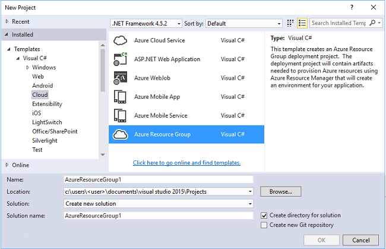
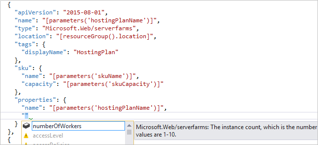
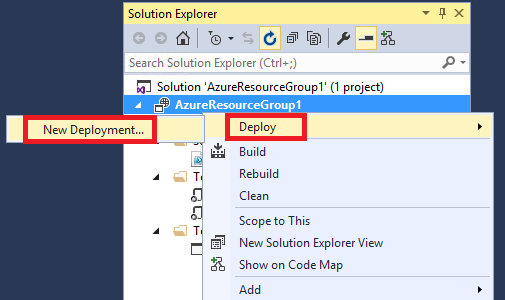
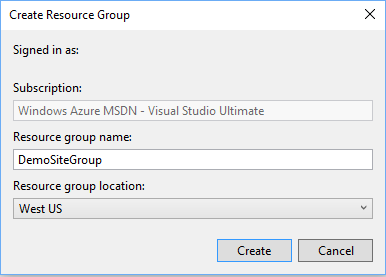
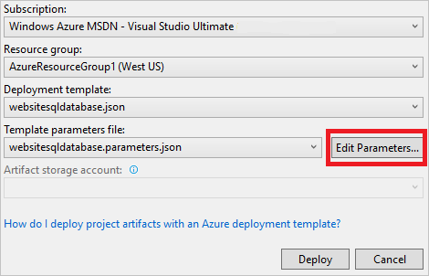
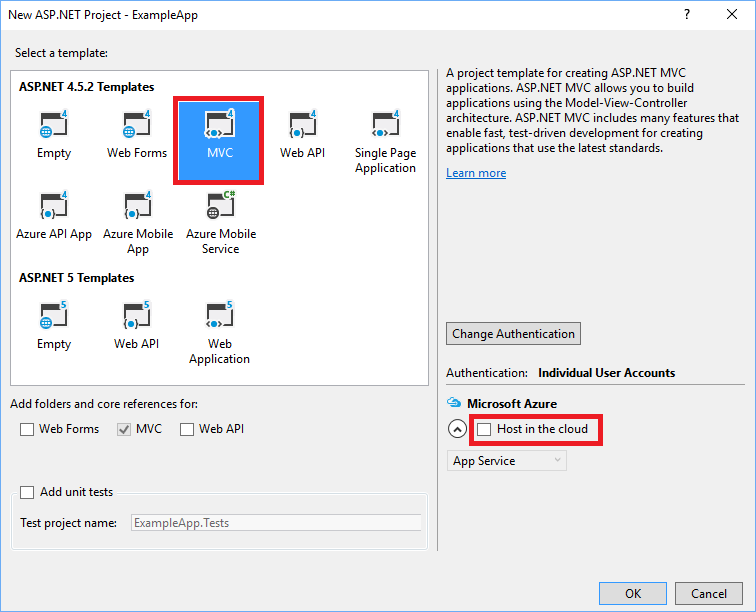
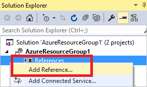
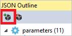
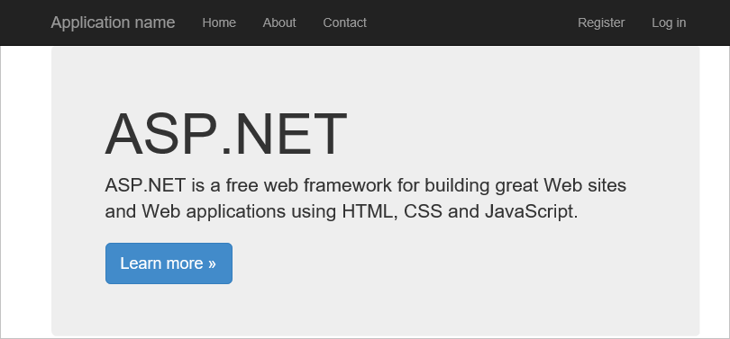

<properties
   pageTitle="Azure Ressource Gruppe Visual Studio-Projekten | Microsoft Azure"
   description="Verwenden Sie Visual Studio in einem Gruppenprojekt Azure Ressource erstellen und die Ressourcen für Azure bereitstellen."
   services="azure-resource-manager"
   documentationCenter="na"
   authors="tfitzmac"
   manager="timlt"
   editor="tysonn" />
<tags
   ms.service="azure-resource-manager"
   ms.devlang="multiple"
   ms.topic="get-started-article"
   ms.tgt_pltfrm="na"
   ms.workload="na"
   ms.date="09/20/2016"
   ms.author="tomfitz" />

# Erstellen und Bereitstellen von Azure-Ressourcengruppen über Visual Studio

Mit Visual Studio und das [Azure SDK](https://azure.microsoft.com/downloads/)können Sie ein Projekt erstellen, die Ihre Infrastruktur und Code in Azure bereitstellt. Beispielsweise können Sie die Web-Host, der Website und der Datenbank für Ihre app definieren und Bereitstellen dieser Infrastruktur zusammen mit den Code. Alternativ können Sie einen virtuellen Computern, virtuellen Netzwerk und Speicher-Konto definieren und Bereitstellen dieser Infrastruktur zusammen mit einem Skript, klicken Sie auf virtuellen Computern ausgeführt wird. Das Projekt **Ressourcengruppe Azure** -Bereitstellung können Sie die benötigten Ressourcen in einem einzigen, wiederholt Vorgang bereitstellen. Weitere Informationen zum Bereitstellen und Verwalten von Ressourcen finden Sie unter [Übersicht Azure Ressourcenmanager](azure-resource-manager/resource-group-overview.md).

Ressourcengruppe Azure Projekte enthalten Azure Ressourcenmanager JSON-Vorlagen, die die Ressourcen definieren, die Sie in Azure bereitstellen. Finden Sie Informationen zu den Elementen der Vorlage Ressourcenmanager [Azure Ressourcenmanager Authoring-Vorlagen](resource-group-authoring-templates.md)aus. Visual Studio können Sie diese Vorlagen bearbeiten und stellt Tools, die Arbeit mit Vorlagen zu vereinfachen.

In diesem Thema stellen Sie eine Web app und SQL-Datenbank. Die Schritte sind jedoch fast identisch für alle Ressourcen geben. Sie können als einfach eines virtuellen Computers und deren zugehörige Ressourcen bereitstellen. Visual Studio bietet viele verschiedene Starter-Vorlagen für die Bereitstellung von häufige Szenarien.

Dieser Artikel zeigt Visual Studio 2015 Update 2 und Microsoft Azure SDK für .NET 2.9 an. Wenn Sie mit Azure SDK 2.9 Visual Studio 2013 verwenden, ist Ihre Erfahrungen weitgehend identisch. Sie können Versionen von Azure SDK von 2.6 oder höher verwenden. Ihre Erfahrung der Benutzeroberfläche anders als in diesem Artikel werden die Benutzeroberfläche möglicherweise. Es wird dringend empfohlen, dass Sie die neueste Version des [Azure SDK](https://azure.microsoft.com/downloads/) installieren, bevor Sie die Schritte. 

## Erstellen von Azure Ressourcengruppe Projekt

In diesem Verfahren erstellen Sie ein Projekt Azure Ressourcengruppe mit einer **Web app + SQL** -Vorlage aus.

1. Wählen Sie in Visual Studio aus **Datei**, **Neues Projekt**, wählen Sie **c#** oder **Visual Basic**. Wählen Sie die **Cloud**, und wählen Sie dann die **Ressourcengruppe Azure** -Projekt.

    

1. Wählen Sie die Vorlage, die Sie zum Azure Ressourcenmanager bereitstellen möchten. Beachten Sie, dass es sind verschiedene Optionen basierend auf den Typ des Projekts, die Sie bereitstellen möchten. Wählen Sie für dieses Thema die **Web app + SQL** -Vorlage aus.

    

    Die Vorlage, die Sie auswählen ist nur als Ausgangspunkt. Sie können hinzufügen und Entfernen von Ressourcen, um zu Ihrem Szenario erfüllen.

    >[AZURE.NOTE] Visual Studio ruft eine Liste der verfügbaren Vorlagen online ab. Die Liste kann geändert werden.

    Visual Studio erstellt eine Ressource Bereitstellung Gruppenprojekt für das Web app und SQL-Datenbank.

1. Um anzuzeigen, was Sie erstellt haben, erweitern Sie die im Bereitstellungsprojekt.

    

    Da wir haben, die Web app + SQL-Vorlage für dieses Beispiel entschieden, sehen Sie die folgenden Dateien: 

  	|Dateiname|Beschreibung|
  	|---|---|
  	|Bereitstellen von AzureResourceGroup.ps1|Ein PowerShell-Skript, die PowerShell-Befehlen in Azure Ressourcenmanager bereitgestellt wird aufgerufen. **Notiz** Visual Studio verwendet diese PowerShell-Skript für die Bereitstellung Ihrer Vorlage ein. Alle Änderungen, die Sie an dieses Skript Einfluss auf die Bereitstellung in Visual Studio, achten Sie.|
  	|WebSiteSQLDatabase.json|Die Ressourcenmanager-Vorlage, die Infrastruktur definiert, Sie Azure und die Parameter, die Sie während der Bereitstellung bereitstellen können bereitstellen möchten. Darüber hinaus definiert die Abhängigkeiten zwischen den Ressourcen, damit Ressourcenmanager die Ressourcen in der richtigen Reihenfolge bereitstellt.|
  	|WebSiteSQLDatabase.parameters.json|Eine Parameterdatei, die durch die Vorlage benötigten Werte enthält. Sie übergeben Parameter Werte in jeder Bereitstellung anpassen.|

    Alle Ressourcen gruppieren Bereitstellung von Projekten enthalten die folgenden grundlegenden Dateien. Andere Projekte enthalten möglicherweise zusätzliche Dateien, um weitere Funktionen zu unterstützen.

## Passen Sie die Vorlage Ressourcenmanager

Sie können ein Bereitstellungsprojekt anpassen, indem Sie dabei die JSON-Vorlagen, in denen die Ressourcen beschrieben, die Sie bereitstellen möchten. JSON steht für JavaScript Object Notation, und ist ein serialisierten Daten-Format, das einfach konzipiert ist. Die JSON-Dateien mithilfe von Schemas, die Sie am oberen Rand jeder Datei verweisen. Wenn Sie das Schema zu verstehen möchten, können Sie herunterladen und Analysieren es. Das Schema definiert, welche Elemente gültig sind die Typen und Formate für die Felder, die möglichen Werte für die aufgezählten Werte usw.. Finden Sie Informationen zu den Elementen der Vorlage Ressourcenmanager [Azure Ressourcenmanager Authoring-Vorlagen](resource-group-authoring-templates.md)aus.

Um auf Ihre Vorlage arbeiten möchten, öffnen Sie **WebSiteSQLDatabase.json**.

Der Visual Studio-Editor stellt Tools, um Unterstützung bei der Bearbeitung der Vorlage Ressourcenmanager. Übersichtsfenster **JSON** erleichtert die Elemente in der Vorlage definierten anzeigen.

Auswählen eines der Elemente in der Gliederung gelangen Sie zum diesen Teil der Vorlage und die entsprechende JSON hervorgehoben.

Sie können eine Ressource hinzufügen, indem Sie die Schaltfläche **Hinzufügen Ressource** am oberen Rand des Fensters Gliederung JSON auswählen oder indem Sie mit der rechten Maustaste **Ressourcen** klicken und **Eine neue Ressource hinzu**.

In diesem Lernprogramm wählen Sie **Speicher-Konto** aus, und geben sie einen Namen. Geben Sie einen Namen, der nicht mehr als 11 Zeichen und enthält nur Zahlen und Kleinbuchstaben.

Benachrichtigung, die nicht nur die Ressource hinzugefügt wurde, sondern auch einen Parameter für das Typ Speicher-Konto, und eine Variable für den Namen des Speicherkontos.

Der Parameter **StorageType** ist vordefinierte zulässige Typen und einen Standardtyp. Sie können diese Werte lassen oder für Ihr Szenario bearbeiten. Wenn Sie nicht jede Person ein **Premium_LRS** Speicher-Konto mithilfe dieser Vorlage bereitstellen möchten, trennen sie die zulässigen Typen. 

    "storageType": {
      "type": "string",
      "defaultValue": "Standard_LRS",
      "allowedValues": [
        "Standard_LRS",
        "Standard_ZRS",
        "Standard_GRS",
        "Standard_RAGRS"
      ]
    }

Visual Studio bietet auch Intellisense, damit Sie verstehen, welche Eigenschaften verfügbar sind, wenn die Vorlage bearbeiten. Zum Bearbeiten der Eigenschaften für Ihre App-Serviceplan navigieren Sie zu der Ressource **HostingPlan** , und fügen Sie einen Wert für die **Eigenschaften**aus. Beachten Sie, dass Intellisense zeigt die verfügbaren Werte und enthält eine Beschreibung des Werts.

Sie können **NumberOfWorkers** auf 1 festgelegt.

    "properties": {
      "name": "[parameters('hostingPlanName')]",
      "numberOfWorkers": 1
    }

## Bereitstellen der Ressourcengruppe Projekts Azure

Sie können nun das Projekt bereitstellen. Wenn Sie ein Projekt Ressourcengruppe Azure bereitstellen, stellen Sie es in eine Azure Ressourcengruppe ein. Die Ressourcengruppe ist eine logische Gruppierung von Ressourcen, die einen allgemeinen Lebenszyklus freigeben.

1. Wählen Sie im Kontextmenü den Projektknoten Bereitstellung **Bereitstellen** > **Neue Bereitstellung**.

    

    Das Dialogfeld **Bereitstellen Ressourcengruppe** wird angezeigt.

    

1. Klicken Sie im Dropdownmenü **Ressourcengruppe** wählen Sie eine vorhandene Ressourcengruppe oder erstellen Sie einen neuen. Um eine Ressourcengruppe zu erstellen, öffnen Sie das Dropdownmenü **Ressourcengruppe** aus, und wählen Sie **Neu erstellen**.

    

    Das Dialogfeld **Ressourcengruppe erstellen** wird angezeigt. Geben Sie einen Namen und Speicherort der Gruppe, und wählen Sie die Schaltfläche **Erstellen** .

    
   
1. Bearbeiten Sie die Parameter für die Bereitstellung, indem Sie die Schaltfläche **Bearbeiten Parameter** auswählen.

    

1. Geben Sie Werte für die Parameter leer, und wählen Sie die Schaltfläche **Speichern** . Die leeren Parameter sind **HostingPlanName**, **AdministratorLogin**, **AdministratorLoginPassword**und **Datenbankname**.

    **HostingPlanName** gibt einen Namen für die [App-Serviceplan](./app-service/azure-web-sites-web-hosting-plans-in-depth-overview.md) zu erstellen. 
    
    **AdministratorLogin** gibt an, der Benutzername für den SQL Server-Administrator. Allgemeine Administrator dürfen wie **sa** oder **Administrator**nicht verwendet werden. 
    
    Die **AdministratorLoginPassword** gibt ein Kennwort für SQL Server-Administrator an. Die Option zum **Speichern von Kennwörtern als nur-Text in der Parameterdatei** ist nicht sicher; daher, wählen Sie diese Option nicht. Da das Kennwort nicht als nur-Text gespeichert wurde, müssen Sie dieses Kennwort erneut während der Bereitstellung angeben. 
    
    **Datenbankname** gibt einen Namen für die Datenbank zu erstellen. 

    
    
1. Wählen Sie die Schaltfläche **Bereitstellen** , um das Projekt in Azure bereitzustellen. PowerShell-Konsole, die außerhalb der Visual Studio-Instanz wird geöffnet. Geben Sie das Administratorkennwort für SQL Server in der PowerShell-Konsole, wenn Sie dazu aufgefordert werden. **Die PowerShell-Konsole möglicherweise durch andere Elemente verdeckt oder in der Taskleiste minimiert werden.** Suchen Sie nach dieser Konsole, und wählen Sie ihn, das Kennwort einzugeben.

    >[AZURE.NOTE] Visual Studio kann aufgefordert werden, die Azure PowerShell-Cmdlets zu installieren. Sie benötigen die Azure PowerShell-Cmdlets Ressourcengruppen erfolgreich bereitstellen. Wenn Sie dazu aufgefordert werden, installieren Sie sie.
    
1. Die Bereitstellung kann einige Minuten dauern. In der **Ausgabe** -Fenster wird den Status der Bereitstellung. Wenn die Bereitstellung abgeschlossen ist, zeigt die letzte Nachricht mit ähnlichem zu einer erfolgreichen Bereitstellung an:

        ... 
        18:00:58 - Successfully deployed template 'c:\users\user\documents\visual studio 2015\projects\azureresourcegroup1\azureresourcegroup1\templates\websitesqldatabase.json' to resource group 'DemoSiteGroup'.

1. Öffnen Sie in einem Browser der [Azure-Portal](https://portal.azure.com/) zu, und melden Sie sich bei Ihrem Konto. Wählen Sie zum Anzeigen der Ressourcengruppe **Ressourcengruppen** und die Ressourcengruppe aus, die, der Sie auf bereitgestellt.

    

1. Sie können alle bereitgestellten Ressourcen anzeigen. Beachten Sie, dass der Name des Speicherkontos nicht genau ist, was Sie angegeben haben, wenn diese Ressource hinzufügen. Das Speicherkonto muss eindeutig sein. Die Vorlage fügt automatisch eine Zeichenfolge auf den Namen, die, den Sie zur Verfügung gestellt, um einen eindeutigen Namen bereit. 

    

1. Wenn Sie Änderungen vornehmen und das Projekt erneut bereitstellen möchten, wählen Sie die vorhandene Ressourcengruppe aus dem Kontextmenü von Azure Ressource Gruppenprojekt. Klicken Sie im Kontextmenü auf Wählen Sie **Bereitstellen**, und wählen Sie dann die Ressourcengruppe aus, die Sie bereitgestellt.

    

## Bereitstellen von Code mit Ihrer Infrastruktur

An diesem Punkt haben Sie die Infrastruktur für Ihre app bereitgestellt, aber kein tatsächlichen Code mit dem Projekt bereitgestellt. In diesem Thema wird gezeigt, wie eine Web app und SQL-Datenbanktabellen während der Bereitstellung bereitstellen. Wenn Sie einen virtuellen Computer anstelle einer Web app bereitstellen, entsprechendem Code, der als Teil der Bereitstellung von auf dem Computer ausgeführt werden soll. Der Vorgang zum Bereitstellen von Code für eine Web app oder zum Einrichten eines virtuellen Computers ist fast identisch.

1. Fügen Sie ein Projekt in der Visual Studio-Lösung. Mit der rechten Maustaste in der Lösung, und wählen Sie **Hinzufügen** > **Neues Projekt**.

    

1. Fügen Sie eine **ASP.NET-Webseite**hinzu. 

    
    
1. Wählen Sie **MVC** aus, und deaktivieren Sie das Feld für **Host in der Cloud** , da die Ressource Gruppenprojekt diesen Vorgang ausführt.

    
    
1. Nachdem Visual Studio Web app erstellt hat, sehen Sie beide Projekte in der Lösung.

    

1. Nun müssen Sie sicherstellen, dass Ihre Ressourcen Gruppenprojekt des neuen Projekts bekannt sind. Wechseln Sie zurück zum Projekt Gruppe Ressource (AzureResourceGroup1). Mit der rechten Maustaste **Verweise** , und wählen Sie **Verweis hinzufügen**.

    

1. Wählen Sie das Web-app-Projekt, das Sie erstellt haben.

    
    
    Durch Hinzufügen eines Verweises an, die Project Web app mit der Ressource Gruppenprojekt verknüpfen, und drei Haupteigenschaften automatisch festgelegt. Sie finden diese Eigenschaften im Fenster **Eigenschaften** für den Verweis.

      
    
    Die Eigenschaften sind:

    - Die **Zusätzliche Eigenschaften** enthält das Webbereitstellungspaket staging Speicherort, der auf den Azure-Speicher abgelegt wird. Beachten Sie die Ordner (ExampleApp) und den Dateinamen (package.zip). Sie werden diese Werte als Parameter angeben, wenn Sie die app bereitstellen. 
    - Der **Dateipfad einschließen** enthält den Pfad, in dem das Paket erstellt wird. Die **Ziele einbeziehen** enthält den Befehl, den Bereitstellung ausgeführt wird. 
    - Erstellen der Standardwert des **; Paket** ermöglicht die Bereitstellung zu erstellen, und erstellen ein Web-Bereitstellungspaket (package.zip).  
    
    Sie brauchen kein Veröffentlichungsprofil, wie die Bereitstellung die erforderlichen Informationen aus den Eigenschaften, die zum Erstellen des Pakets bezieht.
      
1. Hinzufügen einer Ressource zu der Vorlage.

    

1. Wählen Sie dieses Mal **Web Bereitstellen von Web Apps**. 

    
    
1. Erneut bereitstellen Sie Projekt Gruppe Ressourcen der Ressourcengruppe. Diesmal sind einige neue Parameter vorhanden. Sie müssen nicht die Werte für **_artifactsLocation** oder **_artifactsLocationSasToken** bereitzustellen, da Visual Studio automatisch diese Werte generiert. Jedoch müssen Sie den Ordner und den Dateinamen auf den Pfad festgelegt, die das Bereitstellungspaket (als **ExampleAppPackageFolder** und **ExampleAppPackageFileName** in der folgenden Abbildung gezeigt) enthält. Geben Sie die Werte, die Sie zuvor in die Verweiseigenschaften (**ExampleApp** und **package.zip**) gesehen haben.

    
    
    Wählen Sie für das **Element Speicher-Konto**den aus, die mit diesem Ressourcengruppe bereitgestellt.
    
1. Nachdem die Bereitstellung abgeschlossen ist, wählen Sie Web app im Portal aus. Wählen Sie die URL zu der Website wechseln.

    

1. Beachten Sie, dass Sie die standardmäßigen ASP.NET app erfolgreich bereitgestellt haben.

    

## Nächste Schritte

- Weitere Informationen zum Verwalten von Ressourcen über das Portal, finden Sie unter [Verwenden des Azure Portals zum Verwalten Ihrer Azure Ressourcen](./azure-portal/resource-group-portal.md).
- Weitere Informationen zu Vorlagen finden Sie unter [Azure Ressourcenmanager Authoring-Vorlagen](resource-group-authoring-templates.md).
