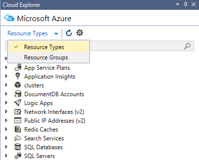
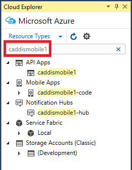

<properties 
   pageTitle="Verwalten von Azure Ressourcen mit Cloud Explorer | Microsoft Azure"
   description="Informationen Sie zum Verwenden der Cloud Explorer durchsuchen und Verwalten von Azure Ressourcen in Visual Studio."
   services="visual-studio-online"
   documentationCenter="na"
   authors="TomArcher"
   manager="douge"
   editor="" />
<tags 
   ms.service="multiple"
   ms.devlang="dotnet"
   ms.topic="article"
   ms.tgt_pltfrm="na"
   ms.workload="multiple"
   ms.date="08/15/2016"
   ms.author="tarcher" />

# Verwalten von Azure Ressourcen mit Cloud-Explorer

##(Übersicht)

Cloud-Explorer gestaltet, damit Sie schnell und einfach einfacher durchsuchen und verwalten Sie Ihre Azure Ressourcen innerhalb der Visual Studio IDE. Sie können, beispielsweise, sie verwenden, um eine Web app im [Azure-Portal](http://go.microsoft.com/fwlink/p/?LinkID=525040) oder in einem Browser zu öffnen, oder einen Debugger darauf, oder Sie können die Eigenschaften eines Containers Blob anzeigen und öffnen im Blob Container-Editor.

Cloud-Explorer basiert auf den Stapel der Azure Ressource-Manager, wie das [Azure-Portal](http://go.microsoft.com/fwlink/p/?LinkID=525040). Es versteht Ressourcen wie Azure Ressourcengruppen und Azure-Diensten wie Logik apps und API-apps und [rollenbasierte Access-Steuerelements](./active-directory/role-based-access-control-configure.md) (RBAC) unterstützt. Wählen Sie die Schaltfläche ' **Aktualisieren** ' auf der Symbolleiste Cloud-Explorer um Azure Ressourcen anzuzeigen, die hinzugefügt oder geändert wurden, aus.

Cloud-Explorer wird als Teil der Visual Studio-Tools für Azure SDK 2.7 installiert. 

## Erforderliche Komponenten

- Visual Studio 2015 RTM.

- Visual Studio-Tools für Azure SDK. 
- Sie müssen ein Azure-Konto und darin zur Azure Ressourcenansicht in der Cloud Explorer angemeldet sein. Wenn Sie eine besitzen, können Sie ein Konto in nur ein paar Minuten erstellen. Wenn Sie ein MSDN-Abonnement verfügen, finden Sie unter [Azure Vorteile für MSDN-Abonnenten](https://azure.microsoft.com/pricing/member-offers/msdn-benefits-details/). Andernfalls finden Sie unter [Erstellen eines kostenloses Testversion-Kontos](https://azure.microsoft.com/pricing/free-trial/).

- Wenn Cloud-Explorer nicht sichtbar ist, können Sie es anzeigen, indem Sie auf **Ansicht**, **Andere Windows** **Explorer Cloud** in der Menüleiste.

## Verwalten von Azure Konten und Abonnements

Wenn Ihre Azure Ressourcen in der Cloud Explorer anzeigen möchten, müssen Sie zu einem Azure-Konto mit einem oder mehreren aktiven Abonnements anmelden. Wenn Sie mehr als ein Azure-Konto verfügen, können diese in die Cloud Explorer hinzufügen und wählen Sie dann die Abonnements, die in der Cloud Explorer Ressourcenansicht enthalten sein sollen.

Wenn Sie nicht vor dem Azure verwendet haben, oder Sie noch nicht die erforderlichen Konten Visual Studio hinzugefügt, werden Sie dazu aufgefordert werden.

## So Cloud Explorer Azure-Konten hinzufügen

1. Wählen Sie das Symbol Einstellungen, klicken Sie auf der Symbolleiste des Cloud-Explorers aus.

1. Wählen Sie den Link zum **Hinzufügen eines Kontos** aus. Melden Sie sich bei der Azure-Konto, dessen Ressourcen, die Sie suchen möchten. Das Konto, das Sie gerade hinzugefügt haben, sollten in der Dropdownliste des Kontos Datumsauswahl ausgewählt sein. Die Abonnements für dieses Konto werden unter den Kontoeintrag angezeigt.

    

    

1. Wählen Sie die Kontrollkästchen für die Kontoabonnements, die Sie suchen, und wählen Sie dann auf die Schaltfläche **anwenden** möchten.

    Die Azure Ressourcen für die ausgewählten Abonnements, die im Cloud-Explorer angezeigt werden.

## So entfernen Sie ein Azure-Konto

1. Wählen Sie die **Datei**, die **Kontoeinstellungen** in der Menüleiste aus.

1. Wählen Sie im Dialogfeld **Konten-Einstellungen** im Abschnitt **Alle Konten** Befehl **Entfernen** neben dem Konto, dass Sie entfernen möchten. Beachten Sie, dass dieser Befehl nur das Konto aus Visual Studio – It entfernt wirkt sich nicht auf den Azure-Konto selbst aus.

## Anzeigen von Ressourcentypen oder Gruppen

Um Ihre Azure Ressourcen anzuzeigen, können Sie entweder **Ressourcentypen** oder **Ressource** Gruppenansicht auswählen.

- **Ressourcentypen** anzeigen, die auch die allgemeine Ansicht im [Portal Azure](http://go.microsoft.com/fwlink/p/?LinkID=525040)verwendet, zeigt Ihre Azure Ressourcen nach Typ, z. B. Web apps, Speicherkonten und virtuellen Computern eingestuft. Dies ist ähnlich wie Azure Ressourcen im Server-Explorer angezeigt werden.

- Gruppen Ressourcenansicht kategorisiert Azure Ressourcen nach der Azure Ressourcengruppe, denen, der Sie zugeordnet sind.

 
    Eine Ressourcengruppe ist bündeln Azure Ressourcen, die in der Regel von einer bestimmten Anwendung verwendet. Wenn Sie weitere Informationen zur Azure Ressourcengruppen finden Sie unter [Azure Ressourcenmanager Übersicht](./resource-group-overview.md).

## Anzeigen von und Navigieren von Ressourcen

Zum Navigieren Sie zu einer Ressource Azure und die entsprechenden Informationen in der Cloud Explorer anzuzeigen, erweitern Sie des Artikels Typ oder zugeordneten Ressourcengruppe aus, und wählen Sie dann die Ressource. Wenn Sie eine Ressource auswählen, werden die Informationen in den beiden Registerkarten am Fuß des Cloud-Explorer angezeigt.

- Die Registerkarte **Aktionen** zeigt die Aktionen, die Sie ergreifen können, in der Cloud Explorer für die ausgewählte Ressource an. Sie können auch im Kontextmenü der Ressource Verfügbare Aktionen anzeigen.

- Die Registerkarte " **Zelleigenschaften** " zeigt die Eigenschaften der Ressource, z. B. deren Typ, Gebietsschema und Ressourcen-Gruppe aus, zugeordnet ist.

Jeder Ressource hat die Aktion **im Portal geöffnet**. Wenn Sie diese Aktion auswählen, zeigt Cloud Explorer die ausgewählte Ressource im [Azure-Portal](http://go.microsoft.com/fwlink/p/?LinkID=525040)an. Dieses Feature eignet sich besonders zum Navigieren zu bestimmten tief geschachtelt Ressourcen.

Weitere Aktionen und Immobilienwerte, die möglicherweise auch basierend auf der Azure Ressource angezeigt. Beispielsweise verfügen über Web apps und Logik apps auch die Aktionen, die **im Browser öffnen** und **Anfügen Debugger** zusätzlich **Portal öffnen**. Aktionen Editoren öffnen angezeigt werden, wenn Sie eine BLOB-Speicher-Konto, Warteschlange oder Tabelle auswählen. Azure apps besitzen **URL** und **Status** Eigenschaften, Speicherressourcen Schlüssel und Verbindungszeichenfolge-Eigenschaften.

## Suche Ressourcen

Ressourcen mit einem bestimmten Namen in Ihrer Kontoabonnements Azure-zu finden, geben Sie den Namen in das Suchfeld in der Cloud-Explorer.

Während Sie Zeichen in das Suchfeld eingeben, werden nur die Ressourcen, die mit diesen Zeichen übereinstimmen in der Ressourcenstruktur angezeigt.

