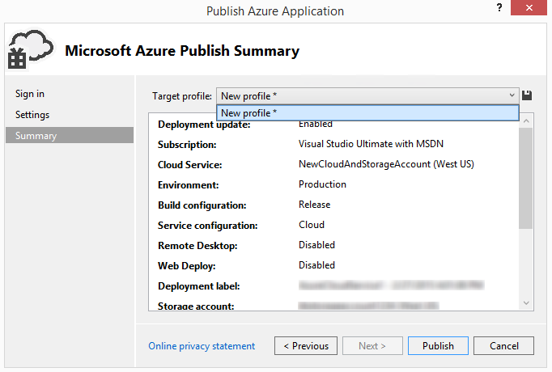

<properties
   pageTitle="Zum Dienstkonfigurationen und Profile verwalten | Microsoft Azure"
   description="Informationen zum Arbeiten mit Dateien für Dienst Konfigurationen und Profile Konfiguration | die Einstellungen für die Bereitstellung Umgebungen speichern und Veröffentlichen von Einstellungen für Clouddienste."
   services="visual-studio-online"
   documentationCenter="na"
   authors="TomArcher"
   manager="douge"
   editor="" />
<tags
   ms.service="multiple"
   ms.devlang="dotnet"
   ms.topic="article"
   ms.tgt_pltfrm="na"
   ms.workload="multiple"
   ms.date="08/15/2016"
   ms.author="tarcher" />

# Zum Dienstkonfigurationen und Profile verwalten

## (Übersicht)

Wenn Sie einen Clouddienst veröffentlichen, speichert Visual Studio Informationen in zwei Arten von Konfigurationsdateien: service Konfigurationen und Benutzerprofilen. Dienstkonfigurationen (.cscfg-Dateien) Speichern der Einstellungen für die Bereitstellung Umgebungen für einen Azure-Cloud-Dienst. Azure zum diese Konfigurationsdateien verwalten Ihrer Clouddienste verwendet. Andererseits, Profile (.azurePubxml-Dateien) Store Einstellungen für Cloud Services veröffentlichen. Diese Einstellungen sind eine Aufzeichnung, was Sie auswählen, wenn Sie des Veröffentlichen-Assistenten mithilfe, und von Visual Studio lokal verwendet werden. In diesem Thema wird erläutert, wie beide Dateitypen Konfiguration konzipiert.

## Dienstkonfigurationen

Sie können mehrere Dienstkonfigurationen für jede Ihrer Bereitstellung Umgebungen mit erstellen. Sie möglicherweise beispielsweise eine Dienstkonfiguration für eine lokale Umgebung erstellen, die Sie verwenden, um auszuführen und Testen der Anwendung Azure und einem anderen Dienstkonfiguration Ihrer Umgebung Herstellung.

Sie können hinzufügen, löschen Sie, Umbenennen Sie und ändern Sie diesen Dienstkonfigurationen Ihren Anforderungen entsprechend. Sie können diesen Dienstkonfigurationen von Visual Studio verwalten, wie in der folgenden Abbildung gezeigt.

Sie können auch im Dialogfeld **Konfigurationen verwalten** von Rolle des Eigenschaftenseiten öffnen. Öffnen Sie die Eigenschaften für eine Rolle im Projekt Azure, öffnen Sie das Kontextmenü für diese Rolle aus, und wählen Sie dann auf **Eigenschaften**. Erweitern Sie die Liste **Dienstkonfiguration** , und wählen Sie dann auf **Verwalten** , um das Dialogfeld **Konfigurationen verwalten** zu öffnen, klicken Sie auf der Registerkarte **Einstellungen** .

### Hinzufügen eine Dienstkonfiguration

1. Klicken Sie im Explorer-Lösung öffnen Sie das Kontextmenü für das Projekt Azure, und wählen Sie dann **Konfigurationen verwalten**.

    Das Dialogfeld **Dienstkonfigurationen verwalten** wird angezeigt.

1. Um eine Dienstkonfiguration hinzufügen zu können, müssen Sie eine Kopie einer vorhandenen Konfiguration erstellen. Wählen Sie hierzu die Konfiguration, die Sie kopieren aus der Liste Name, und wählen Sie dann auf **Kopie erstellen**möchten.

1. (Optional) Um der Dienstkonfiguration einen anderen Namen zu geben, wählen Sie die neue Dienstkonfiguration aus der Liste aus, und wählen Sie dann auf **Umbenennen**. Geben Sie in das Textfeld **Name** den Namen, den Sie verwenden möchten, verwenden Sie für diesen Dienstkonfiguration, und wählen Sie dann auf **OK**.

    Eine neue Konfiguration Dienstdatei mit dem Namen ServiceConfiguration. [Name der neuen] .cscfg wird der Azure Projekt im Solution Explorer hinzugefügt.

### So löschen Sie eine Dienstkonfiguration

1. Klicken Sie im Explorer-Lösung öffnen Sie das Kontextmenü für das Projekt Azure, und wählen Sie dann **Konfigurationen verwalten**.

    Das Dialogfeld **Dienstkonfigurationen verwalten** wird angezeigt.

1. Um eine Dienstkonfiguration löschen möchten, wählen Sie die Konfiguration, die Sie verwenden möchten, löschen Sie aus der Liste **Name** , und wählen Sie dann auf **Entfernen**. Um sicherzustellen, dass diese Konfiguration gelöscht werden soll, wird ein Dialogfeld angezeigt.

1. Wählen Sie **Löschen**aus.

     Die Konfiguration Dienstdatei wird aus dem Azure-Projekt in der Lösung Explorer entfernt.

### Zum Umbenennen einer Dienstkonfiguration

1. Öffnen Sie im Explorer-Lösung das Kontextmenü für das Projekt Azure, und wählen Sie dann auf **Konfigurationen verwalten**.

    Das Dialogfeld **Dienstkonfigurationen verwalten** wird angezeigt.

1. Um eine Dienstkonfiguration umbenennen möchten, wählen Sie die neue Dienstkonfiguration aus **der Liste** aus, und wählen Sie dann auf **Umbenennen**. Klicken Sie in das Textfeld **Name** Geben Sie den Namen, den Sie für diese Dienstkonfiguration verwenden möchten, und wählen Sie dann auf **OK**.

    Der Name der Konfigurationsdatei Service wird in der Azure Projekt im Solution Explorer geändert.

### So ändern Sie eine Dienstkonfiguration

- Wenn Sie eine Dienstkonfiguration ändern möchten, öffnen Sie das Kontextmenü für die Rolle aus, die Sie im Projekt Azure ändern möchten, und wählen Sie dann auf **Eigenschaften**. Finden Sie unter [So: Konfigurieren Sie die Rollen für einen Azure-Cloud-Dienst mit Visual Studio](https://msdn.microsoft.com/library/azure/hh369931.aspx) für Weitere Informationen.

## Nehmen Sie Kombinationen anderen festlegen mithilfe von Benutzerprofilen vor

Mithilfe eines Profils können Sie automatisch im **Veröffentlichen-Assistenten** mit verschiedenen Kombinationen der Einstellungen für verschiedene Zwecke ausfüllen. Beispielsweise können Sie ein Profil für das Debuggen haben und eine andere Version erstellt. In diesem Fall Ihres Profils **Debuggen** müssten **IntelliTrace** aktiviert und die ausgewählte **Debuggen** -Konfiguration, und Ihr Profil **Release** müssten **IntelliTrace** deaktiviert und die **Release** -Konfiguration ausgewählt. Sie können auch unterschiedliche Profile für die Bereitstellung eines Diensts mit einem anderen Speicherkonto verwenden.

Wenn Sie den Assistenten zum ersten Mal ausführen, wird ein Standardprofil erstellt. Visual Studio speichert das Profil in einer Datei, die eine Erweiterung .azurePubXml weist das Projekt Azure unter dem Ordner **Profile** hinzugefügt wird. Wenn Sie beim Ausführen des Assistenten später manuell verschiedene Darstellungsweisen angeben, wird die Datei automatisch aktualisiert. Bevor Sie das folgende Verfahren ausführen, sollten Sie bereits Ihre Cloud-Dienst mindestens einmal veröffentlicht haben.

### Hinzufügen eines Profils

1. Öffnen Sie das Kontextmenü für ein Projekt Azure, und wählen Sie dann auf **Veröffentlichen**.

1. Wählen Sie neben der Liste **Zielprofil** der Schaltfläche **Speichern Profil** wie die folgende Abbildung zeigt ein. Dadurch wird ein Profil für Sie erstellt.

    

1. Nachdem das Profil erstellt wurde, wählen Sie in der Liste **Zielprofil** **<... verwalten >** .

    Das Dialogfeld **Profile verwalten** wird angezeigt, wie die folgende Abbildung zeigt.

    

1. Wählen Sie ein Profil in der Liste **Name** , und wählen Sie dann auf **Kopie erstellen**.

1. Wählen Sie die Schaltfläche **Schließen** aus.

    Neue Profil wird in der Zielliste Profil angezeigt.

1. Wählen Sie in der Liste **Ziel-Profil** das Profil, das Sie gerade erstellt haben. Die Einstellungen des Veröffentlichen-Assistenten werden mit der Auswahl aus dem Profil ausgefüllt, die Sie ausgewählt haben.

1. Wählen Sie die Schaltflächen **zurück** und **Weiter** , um jede Seite des Veröffentlichen-Assistenten anzuzeigen, und klicken Sie dann Anpassen der Einstellungen für dieses Profil. Informationen finden Sie unter [Veröffentlichen Azure-Anwendung-Assistenten](http://go.microsoft.com/fwlink/p/?LinkID=623085) .

1. Nach dem Beenden die Einstellungen anpassen, wählen Sie **Weiter** um zu der Seite Einstellungen zurückzukehren. Wenn Sie den Dienst mithilfe dieser Einstellungen veröffentlichen oder wenn Sie neben der Liste der Profile **Speichern** aktivieren, wird das Profil gespeichert.

### Umbenennen oder Löschen eines Profils

1. Öffnen Sie das Kontextmenü für ein Projekt Azure, und wählen Sie dann auf **Veröffentlichen**.

1. Wählen Sie in der Liste **Zielprofil** **Verwalten**aus.

1. Klicken Sie im Dialogfeld **Profile verwalten** wählen Sie das Profil, das Sie löschen möchten, und wählen Sie dann auf **Entfernen**.

1. Klicken Sie im Bestätigungsdialogfeld, das angezeigt wird, wählen Sie **OK**.

1. Wählen Sie auf **Schließen**.

### Ändern ein Profils

1. Öffnen Sie das Kontextmenü für ein Projekt Azure, und wählen Sie dann auf **Veröffentlichen**.

1. Wählen Sie in der Liste **Ziel-Profil** das Profil, das Sie ändern möchten.

1. Wählen Sie die Schaltflächen **zurück** und **Weiter** , um jede Seite des Veröffentlichen-Assistenten anzuzeigen, und klicken Sie dann ändern Sie die gewünschten Einstellungen. Informationen finden Sie unter [Veröffentlichen Azure-Anwendung-Assistenten](http://go.microsoft.com/fwlink/p/?LinkID=623085) .

1. Klicken Sie nach dem Ändern der Einstellungen wählen Sie **Weiter** um zu der Seite **Einstellungen** zurückzukehren.

1. (Optional) wählen **Veröffentlichen** in den Cloud-Dienst verwenden die neuen Einstellungen zu veröffentlichen. Wenn Sie nicht der Cloud-Dienst zu diesem Zeitpunkt veröffentlichen möchten, und Sie den Veröffentlichen-Assistenten zu schließen, fragt Visual Studio Sie, ob Sie die Änderungen auf das Profil speichern möchten.

## Nächste Schritte

Weitere Informationen zum Konfigurieren von anderen Teile Azure Projekt aus Visual Studio, finden Sie unter [Konfigurieren von Azure-Projekt](http://go.microsoft.com/fwlink/p/?LinkID=623075)
