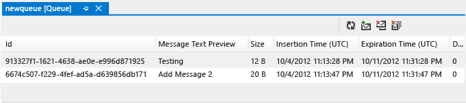
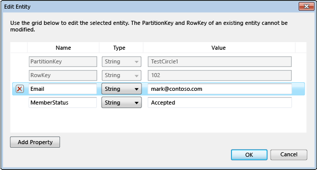

<properties
   pageTitle="Durchsuchen und Verwalten von Speicherressourcen mit Server-Explorer | Microsoft Azure"
   description="Durchsuchen und Verwalten von Speicherressourcen mit Server-Explorer"
   services="visual-studio-online"
   documentationCenter="na"
   authors="TomArcher"
   manager="douge"
   editor="" />
<tags
   ms.service="storage"
   ms.devlang="multiple"
   ms.topic="article"
   ms.tgt_pltfrm="na"
   ms.workload="na"
   ms.date="07/18/2016"
   ms.author="tarcher" />

# Durchsuchen und Verwalten von Speicherressourcen mit Server-Explorer

[AZURE.INCLUDE [storage-try-azure-tools](../includes/storage-try-azure-tools.md)]

## (Übersicht)
Wenn Sie die Azure-Tools für Microsoft Visual Studio installiert haben, können Sie Blob, Warteschlange und Tabellendaten aus Ihren Speicherkonten für Azure anzeigen. Der Knoten Azure-Speicher im Server-Explorer zeigt Daten, die in Ihrem lokalen Speicher Emulator Konto und Ihren anderen Konten der Azure-Speicher.

Server-Explorer in Visual Studio, in der Menüleiste anzeigen möchten, wählen Sie die **Ansicht**, **Server-Explorer**. Der Speicherknoten zeigt alle Speicherkonten, die unter jeder Azure-Abonnement-Zertifikat vorhanden sind, die, denen Sie mit verbunden sind. Wenn Ihr Speicherkonto angezeigt wird, können Sie es anhand der Anweisungen [Weiter unten in diesem Thema](#add-storage-accounts-by-using-server-explorer)hinzufügen.

Starten in Azure SDK 2.7, können Sie auch mithilfe der neuen Cloud-Explorer zum Anzeigen und Verwalten von Azure Ressourcen. Weitere Informationen finden Sie unter [Verwalten von Azure Ressourcen mit Cloud-Explorer](./vs-azure-tools-resources-managing-with-cloud-explorer.md) .

## Anzeigen und Verwalten von Speicherressourcen in Visual Studio

Server-Explorer wird eine Liste der Blobs, Queues und Tabellen automatisch in Ihrem Speicher Emulator Konto. Das Speicher Emulator Konto wird im Server-Explorer unter dem Knoten Speicher als den Knoten **Development** aufgeführt.

Um das Speicher Emulator Konto Ressourcen anzuzeigen, erweitern Sie den Knoten **Development** aus. Wenn der Speicheremulator noch nicht gestartet wurde, wenn Sie den Knoten **Development** erweitern, wird es automatisch gestartet. Dies kann einige Sekunden dauern. Sie können weiterhin in anderen Bereichen von Visual Studio arbeiten, während der Speicheremulator gestartet wird.

Zum Anzeigen von Ressourcen in einem Speicherkonto, erweitern Sie die Speicher-Konto in Server-Explorer. Die folgenden untergeordnete Knoten angezeigt:

- BLOBs

- Warteschlangen

- Tabellen

## Arbeiten mit Blob-Ressourcen

Der Blobs Knoten zeigt eine Liste der Container für das ausgewählte Speicherkonto an. BLOB-Container enthalten BLOB-Dateien, und Sie können diese Blobs in Ordnern und Unterordnern organisieren. Weitere Informationen finden Sie unter [So BLOB-Speicher von .NET verwenden](./storage/storage-dotnet-how-to-use-blobs.md) .

### Erstellen eines Containers blob

1. Öffnen Sie das Kontextmenü für den Knoten **Blobs** , und wählen Sie dann auf **Blob-Container erstellen**.

1. Geben Sie den Namen des neuen Containers im Dialogfeld **Blob-Container erstellen** , und wählen Sie dann auf **Ok**

    >[AZURE.NOTE] Der Name der Blob-Container muss mit einer Ziffer (0-9) oder Kleinbuchstaben (a-Z) beginnen.

### Entfernen eines Containers blob

- Öffnen Sie das Kontextmenü für den Blob-Container zu entfernen, und wählen Sie dann auf **Löschen**.

### Um eine Liste der in einem Container Blob enthaltenen Elemente anzuzeigen

- Öffnen Sie das Kontextmenü für einen Blob Containernamen in der Liste, und wählen Sie dann die **Ansicht Blob Container**.

    Wenn Sie den Inhalt eines Containers Blob anzeigen, wird er auf einer Registerkarte bekannt als Blob Containeransicht angezeigt.

    

    Sie können mithilfe der Schaltflächen in der oberen rechten Ecke der Ansicht Container Blob auf Blobs die folgenden Aktionen ausführen:

    - Geben Sie einen Filterwert und anwenden

    - Aktualisieren Sie die Liste der Blobs im container

    - Hochladen einer Datei

    - Löschen eines BLOBs

      >[AZURE.NOTE] Löschen einer Datei aus einem Container Blob löschen nicht die zugrunde liegende Datei; Es werden nur aus dem Blob-Container entfernt.

    - Öffnen Sie einen blob

    - Speichern eines BLOBs auf den lokalen computer

### So erstellen Sie einen Ordner oder Unterordner in einer Blob-container

1. Wählen Sie den Container Blob in Server-Explorer aus. Klicken Sie im Container wählen Sie die Schaltfläche **Blob hochladen** aus.

    

1. Klicken Sie im Dialogfeld **Neue Datei hochladen** wählen Sie die Schaltfläche **Durchsuchen** , um die Datei anzugeben, die Sie hochladen möchten, und geben Sie dann einen Ordnernamen ein im **Ordner (optional)** .

    Sie können Unterordner im Container Ordner hinzufügen, indem Sie denselben Schritten folgen. Wenn Sie einen Ordnernamen ein nicht angeben, wird die Datei auf der obersten Ebene des Containers Blob hochgeladen werden. Die Datei wird in dem angegebenen Ordner im Container.

    

1. Doppelklicken Sie auf den Ordner, oder drücken Sie die EINGABETASTE, um den Inhalt des Ordners anzuzeigen. Innerhalb des Containers Ordner können, können Sie wieder werden im Stammordner des Containers navigieren, indem Sie auf die Schaltfläche **Öffnen übergeordnete Verzeichnis** (Pfeil nach oben).

### So löschen Sie einen Containerordner

 - Löschen Sie aller Dateien in den Ordner

    >[AZURE.NOTE] Da Ordner im Container Blob virtuelle Ordner sind, können Sie einen leeren Ordner erstellen, noch können Sie einen Ordner, um deren Dateiinhalt löschen Löschen. Sie müssen den gesamten Inhalt eines Ordners So löschen Sie den Ordner löschen.

### Zum Filtern von Blobs in einem container

Sie können die Blobs filtern, die angezeigt werden, indem Sie ein gemeinsames Präfix angeben.

Beispielsweise, wenn Sie das Präfix eingeben `hello` Filter Text im Feld, und wählen Sie dann auf **Ausführen** (**!**) Schaltfläche angezeigt nur Blobs, die mit "Hallo" beginnen.

>[AZURE.NOTE] Das Feld "Filter" Groß-/Kleinschreibung beachtet wird und Filtern mithilfe von Platzhalterzeichen unterstützt nicht. BLOBs können nur nach Präfix gefiltert werden. Das Präfix möglicherweise ein Trennzeichen enthalten, wenn Sie ein Trennzeichen Blobs in eine virtuelle Hierarchie organisieren verwenden. Beispielsweise Filtern auf das Präfix HelloFabric / gibt alle Blobs diese Zeichenfolge ab.

### Herunterladen von BLOB-Daten

- Öffnen Sie in **Server-Explorer**das Kontextmenü für einen oder mehrere Blobs und klicken Sie dann auswählen zu **Öffnen**, wählen Sie den Namen der Blob und dann wählen Sie die Schaltfläche " **Öffnen** " oder doppelklicken Sie auf den Namen der Blob.

    Der Fortschritt eines Blob-Downloads wird im **Azure Aktivität Log** -Fenster angezeigt.

    Das Blob wird in der Standard-Editor für diesen Dateityp geöffnet. Wenn das Betriebssystem, das den Dateityp erkennt, öffnet die Datei in einer lokal installierten Anwendung; Andernfalls werden Sie aufgefordert, eine Anwendung auswählen, die für den Typ des Blob geeignet ist. Die lokale Dateien, die erstellt wird, wenn Sie einen Blob herunterladen wird als schreibgeschützt markiert.

    BLOB-Daten lokal zwischengespeicherten und der Blob des zuletzt geändert im Blob-Dienst verglichen. Wenn das Blob aktualisiert wurde, da sie zuletzt heruntergeladen wurde, wird es erneut heruntergeladen werden; Andernfalls wird das Blob von der lokalen Festplatte geladen. Standardmäßig wird ein Blob in ein temporäres Verzeichnis heruntergeladen. Um ein bestimmtes Verzeichnis Blobs herunterladen möchten, öffnen Sie das Kontextmenü für die ausgewählten Blob-Namen, und wählen Sie **Speichern unter**. Wenn Sie einen Blob auf diese Weise speichern, die Blobdatei kann nicht geöffnet werden, und lokale Dateien mit Lese-und Schreibzugriff Attributen erstellt wird.

### Blobs hochladen

- Wählen Sie die Schaltfläche **Blob hochladen** aus, wenn der Container für die Anzeige in der Ansicht der Blob-Container geöffnet ist.

    Sie können eine oder mehrere Dateien zum Hochladen auswählen, und Sie können Dateien eines beliebigen Typs hochladen. Der **Azure Aktivität Log** zeigt den Fortschritt des Uploads. Weitere Informationen zum Arbeiten mit BLOB-Daten finden Sie unter [der Azure Blob-Speicherdienst in .NET verwenden](http://go.microsoft.com/fwlink/p/?LinkId=267911).

### Anzeigen von Protokollen in Blobs übertragen

- Wenn Sie die Daten aus Azure-Anwendung melden Sie sich mit Azure-Diagnose und Sie haben die Protokolle bei Ihrem Speicherkonto übertragen, sehen Sie Container, die von Azure für diese Protokolle erstellt wurden. Anzeigen von diese Protokolle in Server-Explorer ist eine einfache Möglichkeit zum Identifizieren von Problemen mit der Anwendung, insbesondere dann, wenn es in Azure bereitgestellt wurde, wird. Weitere Informationen zur Azure-Diagnose finden Sie unter [Sammeln Protokollierung Daten von Azure-Diagnose verwenden](https://msdn.microsoft.com/library/azure/gg433048.aspx).

### Die URL für ein Blob abrufen

- Öffnen Sie der im BLOB-Kontextmenü zu, und wählen Sie dann die **URL kopieren**.

### So bearbeiten Sie einen blob

- Wählen Sie das Blob aus, und wählen Sie dann auf die Schaltfläche **Öffnen Blob** .

    Die Datei wird an einem temporären Speicherort heruntergeladen und auf dem lokalen Computer geöffnet. Nachdem Sie Änderungen vorgenommen haben, müssen Sie erneut das Blob hochladen.

## Arbeiten mit Warteschlange-Ressourcen

Speicher Services Warteschlangen in einem Azure-Speicher-Konto verwaltet werden, und können sie Ihre Cloud Service Rollen miteinander und mit anderen Diensten durch eine Nachricht-Übergabemechanismus kommunizieren dürfen. Sie können die Warteschlange programmgesteuert über einen Clouddienst und über einen Webdienst für externe Clients zugreifen. Sie können auch die Warteschlange zugreifen, direkt vom Server-Explorer in Visual Studio verwenden.

Bei der Entwicklung eines Cloud-Diensts, der Warteschlangen verwendet werden, können Sie Visual Studio Warteschlange erstellen und Arbeiten mit ihnen interaktiv auf, während Sie entwickeln und Testen Sie den Code verwenden möchten.

Im Server-Explorer können Sie Warteschlangen in einem Speicherkonto anzeigen, erstellen und Löschen von Warteschlangen, öffnen eine Warteschlange zum Anzeigen von Nachrichten und Nachrichten an eine Warteschlange hinzufügen. Wenn Sie eine Warteschlange zur Anzeige öffnen, können Sie einzelnen Nachrichten anzeigen, und Sie können mithilfe der Schaltflächen in der oberen linken Ecke die folgenden Aktionen in der Warteschlange ausführen:

- Aktualisieren Sie die Ansicht in der Warteschlange

- Fügen Sie eine Nachricht in der Warteschlange

- Die oberste Nachricht aus Warteschlange entfernt werden.

- Deaktivieren Sie die gesamte Warteschlange

Die folgende Abbildung zeigt eine Warteschlange, die zwei Nachrichten enthält.

Für Weitere Informationen zu Speicher Warteschlangen services, finden Sie unter [How to: Verwenden der Warteschlange-Speicherdienst](http://go.microsoft.com/fwlink/?LinkID=264702). Finden Sie Informationen über den Webdienst für Speicher Services Warteschlangen [Warteschlange Dienst Konzepte](http://go.microsoft.com/fwlink/?LinkId=264788)aus. Informationen zum Senden von Nachrichten an eine Speicher Services Warteschlange mit Visual Studio finden Sie unter [Senden von Nachrichten an eine Speicher Services Warteschlange](https://msdn.microsoft.com/library/azure/jj649344.aspx).

>[AZURE.NOTE] Speicher Services Warteschlangen unterscheiden sich von Bus Servicewarteschlangen. Weitere Informationen zu Bus Servicewarteschlangen finden Sie unter Bus Servicewarteschlangen, Themen und Abonnements.

## Arbeiten mit Ressourcen Tabelle

Der Speicherdienst Azure Tabelle speichert große Mengen von strukturierten Daten. Der Dienst ist, dass die akzeptiert NoSQL Datenspeicher Anrufe von innerhalb und außerhalb der Azure Cloud authentifiziert. Azure Tabellen eignen sich zum Speichern von strukturierten, nicht relationalen Daten.

### Erstellen eine Tabelle

1. Klicken Sie in Server Explorer wählen Sie für das Speicherkonto ein Knoten **Tabellen** , und wählen Sie die **Tabelle erstellen**.

1. Geben Sie im Dialogfeld **Tabelle erstellen** einen Namen für die Tabelle ein.

### Anzeigen von Tabellendaten

1. Klicken Sie in Server Explorer öffnen Sie den **Azure** -Knoten, und dann den Knoten **Speicher** .

1. Öffnen Sie den Speicher Konto Knoten, dem Sie interessiert sind, und öffnen Sie den Knoten **Tabellen** , um eine Liste der Tabellen für das Speicherkonto anzuzeigen.

1. Öffnen Sie des Kontextmenüs für eine Tabelle, und wählen Sie dann auf **Tabelle anzeigen**.

    

Die Tabelle wird nach Personen (siehe in Zeilen) und Eigenschaften (siehe in Spalten) angeordnet. Die folgende Abbildung zeigt beispielsweise, in dem **Tabellen-Designer**aufgeführte Personen an:

### So bearbeiten Sie Tabellendaten

1. Öffnen Sie in den **Tabellen-Designer**das Kontextmenü für eine Entität (eine einzelne Zeile) oder eine Eigenschaft (eine einzelne Zelle), und wählen Sie dann auf **Bearbeiten**.

    

    Elemente in einer einzelnen Tabelle nicht erforderlich, dass die gleiche Gruppe von Eigenschaften (Spalten). Beachten Sie die folgenden Einschränkungen auf anzeigen und Bearbeiten von Tabellendaten dass.
    - Sie können keine Daten anzeigen oder bearbeiten binary (byte[]) Typ, aber Sie können sie in einer Tabelle speichern.

    - Sie können die Werte **PartitionKey** oder **RowKey** nicht bearbeiten, da in Azure Tabellenspeicher dieser Vorgang nicht unterstützt.

    - Sie können eine Eigenschaft namens Timestamp, Azure Storage Services verwenden eine Eigenschaft mit diesem Namen.

    - Wenn Sie einen DateTime-Wert eingeben, müssen Sie ein Format, das an den Einstellungen Region und Sprache des Computers geeignet ist folgen (z. B. MM/TT/JJJJ hh: mm: [Uhr | PM] für US-Englisch).

### Hinzufügen von Personen

1. Wählen Sie in dem **Tabellen-Designer**die Schaltfläche **Entität hinzufügen** , die in der Nähe der oberen rechten Ecke der Tabellenansicht ist ein.

    

1. Geben Sie im Dialogfeld **Entität hinzufügen** die Werte der Eigenschaften **PartitionKey** und **RowKey** ein.

    

    Geben Sie die Werte sorgfältig, da Sie diese geändert werden kann, nachdem das Dialogfeld schließen, es sei denn, Sie löschen die Entität, und fügen Sie ihn erneut hinzu.

### Um Elemente zu filtern.

Sie können den Satz von Personen, die in einer Tabelle angezeigt werden, wenn Sie den Abfrage-Generator verwenden, anpassen.

1. Öffnen Sie eine Tabelle für die Anzeige, um den Abfrage-Generator zu öffnen.

1. Wählen Sie die Schaltfläche auf der Symbolleiste der Tabellenansicht ganz rechts aus.

    Klicken Sie im Dialogfeld **Abfrage-Generator** wird angezeigt. Die folgende Abbildung zeigt eine Abfrage, die erstellt wird im Abfrage-Generator an.

    

1. Wenn Sie damit fertig sind Erstellen der Abfrage, um das Dialogfeld schließen. Die resultierende Textform der Abfrage wird in ein Textfeld als Filter WCF Data Services.

1. Wählen Sie das Symbol grünes Dreieck aus um die Abfrage auszuführen.

    Sie können auch Entitätsdaten filtern, die im **Tabellen-Designer** angezeigt wird, wenn Sie geben eine WCF Data Services Filterzeichenfolge direkt in das Feld "Filter". Diese Art von Zeichenfolge ähnelt einer SQL WHERE-Klausel jedoch als eine HTTP-Anforderung an den Server gesendet wird. Informationen zum von Filterzeichenfolgen erstellen finden Sie unter [Filtern von Zeichenfolgen für den Tabellen-Designer erstellen](https://msdn.microsoft.com/library/azure/ff683669.aspx).

    Die folgende Abbildung zeigt ein Beispiel für eine Zeichenfolge gültigen Filter:

    

### Aktualisieren von Speicherdaten

Wenn Server-Explorer eine Verbindung herstellt oder Daten von einem Speicherkonto Ruft, kann es sich in eine Minute um zum Abschließen des Vorgangs dauern. Wenn keine Verbindung herstellen können, kann der Vorgang Timeout. Während die Daten abgerufen werden, können Sie weiterhin in anderen Bereichen von Visual Studio entwickelt. Um den Vorgang abzubrechen, wenn es zu lange dauert, wählen Sie die Schaltfläche **Aktualisieren beenden** , klicken Sie auf der Symbolleiste für den Server-Explorer aus.

#### So aktualisieren Sie Blob Container Daten

- Wählen Sie den Knoten **Blobs** unterhalb **Speicher** , und wählen Sie die Schaltfläche ' **Aktualisieren** ' auf der Symbolleiste für den Server-Explorer.

- Um die Liste der Blobs zu aktualisieren, die angezeigt wird, wählen Sie die Schaltfläche **Ausführen** .

#### Aktualisieren von Tabellendaten

- Wählen Sie den Knoten **Tabellen** unterhalb **Speicher** aus, und wählen Sie die Schaltfläche **Aktualisieren** .

- Wählen Sie zum Aktualisieren der Liste der Personen, die in den **Tabellen-Designer**angezeigt wird, auf dem **Tabellen-Designer**auf die Schaltfläche **Ausführen** .

#### Aktualisieren von Daten aus der Warteschlange

- Wählen Sie den Knoten **Warteschlangen** aus, und wählen Sie dann auf die Schaltfläche **Aktualisieren** .

#### Alle Elemente in einem Speicherkonto aktualisieren

- Wählen Sie den Namen des Kontos aus, und wählen Sie dann die Schaltfläche ' **Aktualisieren** ' auf der Symbolleiste für Server Explorer.

### Hinzufügen von Speicherkonten mithilfe von Server-Explorer

Es gibt zwei Methoden zum Hinzufügen von Speicherkonten mithilfe von Server-Explorer. Sie können ein neues Speicherkonto in Ihrem Abonnement Azure erstellen, oder Sie können ein vorhandenes Speicherkonto anfügen.

#### So erstellen Sie ein neues Speicherkonto mit Server-Explorer

1. Öffnen Sie im Server-Explorer das Kontextmenü für den Speicher-Knoten, und wählen Sie dann Speicher-Konto erstellen.

    

1. Wählen Sie aus, oder geben Sie die folgende Informationen für das neue Speicherkonto im Dialogfeld **Speicher-Konto erstellen** .

    - Das Azure-Abonnement, das Sie das Speicherkonto hinzufügen möchten.

    - Der Name, den Sie für das neue Speicherkonto verwenden möchten.

    - Die Region oder die Zugehörigkeit Gruppe (z. B. Westen US oder Ostasien).

    - Den Typ der Replikation für den Speicherkonto, beispielsweise Geo redundante verwendet werden soll.

1. Wählen Sie **Erstellen**aus.

    Das neue Speicherkonto wird in der Liste **Speicher** Lösung Explorer.

#### Ein vorhandenes Speicherkonto anzufügende mithilfe der Server-Explorer

1. Öffnen Sie im Server-Explorer das Kontextmenü für den Knoten Azure-Speicher, und wählen Sie dann auf **Externspeicher anfügen**.

    

1. Wählen Sie aus, oder geben Sie die folgende Informationen für das neue Speicherkonto im Dialogfeld **Speicher-Konto erstellen** .

    - Der Name der vorhandenen Speicher Firma, die Sie anfügen möchten. Sie können Geben Sie einen Namen, oder wählen Sie ihn aus der Liste aus.

    - Der Schlüssel für das ausgewählte Speicherkonto. Dieser Wert ist in der Regel für Sie bereitgestellt, wenn Sie ein Speicherkonto auswählen. Wenn Visual Studio gewünscht für den Speicher kontoschlüssel Denken Sie daran, aktivieren Sie das Speichern Konto Key.

    - Das Protokoll für die Verbindung mit dem Speicherkonto, wie z. B. HTTP, HTTPS oder einen benutzerdefinierten Endpunkt verwendet werden soll. Weitere Informationen zu benutzerdefinierten Endpunkten finden Sie unter [So konfigurieren Sie Verbindungszeichenfolgen](https://msdn.microsoft.com/library/azure/ee758697.aspx) .

### Der sekundäre Endpunkte anzeigen

- Wenn Sie eine mit der **Lesezugriff Geo redundante** Replikationsoption Speicher-Konto erstellt haben, können Sie die Endpunkte des sekundären anzeigen. Öffnen Sie das Kontextmenü für den Namen des Kontos, und wählen Sie dann auf **Eigenschaften**.

    

### So entfernen Sie ein Speicherkonto vom Server-Explorer

- Klicken Sie im Server-Explorer öffnen Sie des Kontextmenüs für den Namen des Kontos, und wählen Sie dann auf **Löschen**. Wenn Sie ein Speicherkonto löschen, wird auch alle gespeicherten wichtige Informationen für dieses Konto entfernt.

    >[AZURE.NOTE] Wenn Sie ein Speicherkonto vom Server-Explorer löschen, nicht es Einfluss auf Ihr Speicherkonto oder alle darin enthaltenen Daten. einfach entfernt den Bezug aus Server-Explorer. Verwenden Sie zum endgültigen Löschen ein Kontos Speicher im [Azure klassischen Portal](http://go.microsoft.com/fwlink/?LinkID=213885)aus.

## Nächste Schritte

Weitere Informationen zur Funktionsweise Azure-Speicherservices verwenden, finden Sie unter [Zugriff auf Webdienste der Azure-Speicher](https://msdn.microsoft.com/library/azure/ee405490.aspx).
