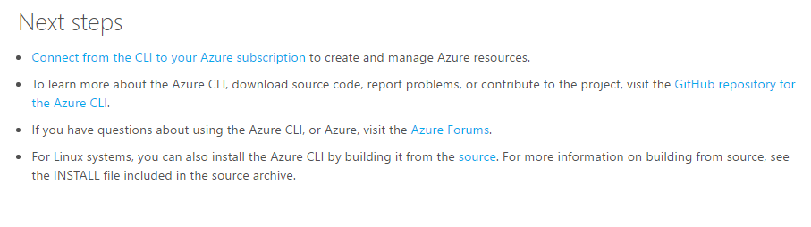

# Qualitätskriterien für Abruf Anforderung überprüfen

Diese Kriterien dienen für Autoren, die erstellen und Verwalten von technischen Artikeln und Abruf Anforderung Bearbeitern, wer Inhalt Abruf Anfragen zu überprüfen. Wenn Abruf Anforderung für [automatische Zusammenführen](contributor-guide-pull-request-etiquette.md#in-a-hurry-submit-prs-that-can-be-accepted-automatically)nicht qualifiziert, wird es von einem personenbezogenen Abruf Anforderung Bearbeiter überprüft werden. Ziehen Sie die Anforderung, dass Prüfer grundsätzlich überprüfen nur was neue oder geänderte ist. Ziehen Sie die Anforderung, dass Bearbeiter Änderungen in einer Anforderung Abruf entsprechend der blockierende und nicht blockierende Qualität überprüfen Elemente in diesem Artikel beschriebenen ausgewertet werden.

## Blockieren von Inhalten Qualität Elemente

Die Updates in der Besprechungsanfrage Abruf müssen zusammengeführt werden die folgenden Kriterien entsprechen. Abruf Anforderung Prüfer Ihr Feedback in Abruf Anforderung Kommentare für diese Elemente und Typ `#hold-off` in der Besprechungsanfrage ziehen, um es Ihnen (dem Autor) mit Feedback zurückzukehren.

| Kategorie | Qualität überprüfen Element |
|----------|---------------------|
|Erforderliche Komponenten| Die "sofort-zu-zusammenführen" und "Überprüfung erfolgreich verlaufen ist" Etiketten werden die Pr. zugewiesen|
|Erforderliche Komponenten| Die Anfrage Abruf kann durch einen Zusammenführungskonflikt blockiert werden.|
|REPO Integrität|    Abruf Anforderung enthält keine offensichtlichen Inhalten Regressionen an.|
|REPO Integrität|    Abruf Anforderung umfasst eine eingebettete Repo oder ungewöhnlichen, irrelevanten Dateien nicht.|
|REPO Integrität |Abruf Anforderung enthält weniger als 100 geänderte Dateien, es sei denn, die Kurs absichtlich einen Zweig Version von Master-Shape aktualisiert. (Tatsächlich ein Kurs sollten enthalten weit weniger als, jedoch nach 100 geänderte Dateien nicht GitHub angezeigt, die Diffs).|
|Benennen |Dateinamen für neue Dateien führen Sie die [Datei benennen Richtlinien](file-names-and-locations.md).|
|Benennen |Neuer Ordner, die in Repo folgen die [Ordner naming Richtlinien](file-names-and-locations.md#folder-names-in-the-repo)eingeführt werden.|
|Inhalt    |Im Artikel ist ein technisches Dokument, und können daher in den richtigen Inhalt erstellen. Finden Sie unter der [enthaltenen Elemente Where Anleitungen](content-channel-guidance.md).|
|Inhalt    |Der Gegenstand im technischen Dokument ist für einen technischen Artikel geeignet. Finden Sie unter der [enthaltenen Elemente Where Anleitungen](content-channel-guidance.md).|
|Inhalt    |Der Artikel enthält eine Einführung Absatz und einer Stelle zu Vorgehensweisen oder konzeptionelle Inhalte an. Im Artikel muss ausreichend, vollständige Inhalte, die als Artikel eigenständigen auf enthalten. Sie sollten keine kleine Fragment der Informationen. (Ausnahme: ein Thema "Grenzwerte" ist es im Kontext einer großen Artikel, die alle Grenzwerte eines Diensts Listen.)|
|Inhalt| Elemente, die Nummerierung sollten nummeriert sind, Elemente, die Listen ungeordnet sein sollte, sind mit Aufzählungszeichen. Hierbei handelt es sich um grundlegende Nutzbarkeit.|
|Inhalt| Ungewöhnliche oder neuartige Grafiken, Informationsarchitektur oder Strukturen oder offensichtlich nicht standardmäßige Designs mit den Lead Kurs Bearbeiter überprüft werden müssen. Teams, die mit neuen Dinge experimentiert werden müssen ein Problem/Lösung Zeichenbereich oder Plan direkte Auswertung Versuche sein.|
|Websitedesigns/Funktionalität| Switchers werden nur für einen Wechsel über mehrere Versionen des gleichen Artikels verwendet.|
|Websitedesigns/Funktionalität| Die Titel der Switchered Artikel enthalten Informationen, die jeder Artikel von Artikeln festlegen Switchered unterscheidet.|
|Websitedesigns/Funktionalität| Manuell erstellte sind Inhaltsverzeichnissen nicht zulässig. Im Artikel muss auf H2s für seine on-Page-Inhaltsverzeichnis verlassen.|
|Websitedesigns/Funktionalität| Wenn H2 Überschriften vorhanden sind, enthält der Artikel mindestens zwei H2 Überschriften aus. Verwenden ein H2 Überschrift erstellt einen einzelnes Element Artikel Inhaltsverzeichnis. H2 Überschriften müssen vor H3 Überschriften verwendet werden, um sicherzustellen, dass ein Inhaltsverzeichnis erstellt wird.|
|Abzug| HTML: Quellinhalt HTML Ebene der blockieren – Nebenversionen Inline enthält keine, HTML-Code zulässig ist, wie z. B. hochgestellt, tiefgestellt, Sonderzeichen und andere kleinere Dinge, die Sie mit Abzug können –. HTML-Tabellen dürfen nur, wenn die Tabelle enthält die Aufzählung oder nummerierte Listen, aber dies ist in der Regel eine Angabe, die der Inhalt muss vereinfacht werden, damit die Quelle in Abzug codiert werden kann.|
|Abzug   |Benutzerdefinierte Abzug Elemente werden gegebenenfalls verwendet. Ex: Sind Notizen codierten der AZURE verwenden. Hinweis Erweiterung nicht als nur-Text.|
|SEO    |Die "& #124; Microsoft Azure"Websitebezeichner ist erforderlich.|
|SEO    |Der Titel H1 enthält genügend Informationen, um den Inhalt dieses Artikels, um ihn von anderen Azure Artikeln zu unterscheiden und Kunden prognostizieren Schlüsselwörter zuordnen zu beschreiben. "Übersicht" als Titel H1 beträgt beispielsweise ein Fehler auf.|
|Terminologie| Die Verwendung der Cloud Akronym, Version 1 oder 2 als Verweise auf das klassische und Ressourcenmanager Bereitstellungsmodelle ist einem blockierenden Terminologie Element.|
|Bilder |Animierte GIF-Dateien werden nicht in die Repo akzeptiert.|
|Bilder | Bilder löschen Auflösung hat, sind kostenlos falsch geschriebene Wörter und enthalten keine privaten Informationen | 
|Staging|Die Vorschau Artikel muss auf Staging aufräumen. Es kann keine Formatierung Probleme offensichtlich enthalten:   -Eine Nummerierung oder Aufzählung als Absatz angezeigten Liste   -Code in einem Codeblock angezeigte teilweise im Codeblock und teilweise außerhalb  -Nummerierten Schritte, die aufgrund von fehlerhaften Einzug falsch nummeriert|

## Nicht blockierende Inhalte Qualität Elemente

Für diese Elemente bieten Abruf Anforderung Bearbeitern Feedback und Anweisungen für den Autor zur nachverfolgung mit Korrekturen in einer späteren Abruf Anforderung. Dieses Feedback blockiert jedoch nicht die Entscheidung zum Zusammenführen. Autoren befolgen innerhalb von 3 Arbeitstagen mit Korrekturen.

| Kategorie | Qualität überprüfen Element |
|----------|---------------------|
|Inhalt|Artikel sollte "Nächste Schritte" am Ende mit 1 bis 3 relevante und ansprechende weitere Schritte haben. Kurze Text einbezogen werden soll Ihnen dabei hilft, den Kunden zu verstehen, warum die nächsten Schritte relevant sind. (Nur neue Beiträge). Beispiel: <https://azure.microsoft.com/en-us/documentation/articles/xplat-cli-install/> |
|Inhalt|Rechtschreibung und Grammatik andere Probleme Writing - möglicherweise Abruf Anforderung Prüfer ihr Feedback auf einige kleinere Probleme als nicht blockierenden Feedback lassen. Wenn mehr als ein paar editorial Probleme vorliegen, melden Sie sich Bearbeitern eine Anforderung bearbeiten im Artikel für eine nach der Publikation bearbeiten.|
|Bilder|Bilder verwenden Sie den richtigen Stil und die Farbe und Screenshots die richtige Formatvorlage für Rahmen und Platzhalter. [Finden Sie in der Abbildung Anleitung](https://github.com/Azure/azure-content/blob/master/contributor-guide/create-images-markdown.md).|
|Bilder|Bilder einschließen Alt-Text. [Finden Sie in der Abbildung Anleitung](https://github.com/Azure/azure-content/blob/master/contributor-guide/create-images-markdown.md).|
|Websitedesigns/Funktionalität|H2 Überschriften, wenn im Inhaltsverzeichnis, klicken Sie auf der Seite gerendert sollte idealerweise auf nicht mehr als 2 Zeilen umbrochen werden. Mehr Überschriften Stellen im Inhaltsverzeichnis-Artikel schwieriger zu scannen.|
|Typografische Elemente|Alle Titel und Überschriften werden im Satz großschreiben Groß-/Kleinschreibung pro Azure-Formatvorlage.|
|Prozess|Wenn die Anfrage Abruf einfach neu konfiguriert wurden konnte um PRmerger Automatisierung nutzen zu können, geben Sie Abruf Anforderung Bearbeitern Feedback an den Autor zur Verwendung von Verzweigungen, damit die Änderungen automatisch zusammengeführt werden konnten. Finden Sie [im Kurs Etikette Artikel](https://github.com/Azure/azure-content/blob/master/contributor-guide/contributor-guide-pull-request-etiquette.md#in-a-hurry-submit-prs-that-can-be-accepted-automatically)aus.|
|Prozess|Wenn Sie löschen oder ein Artikels umbenennen, stellen Sie sicher, dass Sie den Vorgang ausgewählt haben. Ziehen Sie die Anforderung, dass Prüfer den folgenden Kommentar und den Link in einem Kommentar hinzufügen sollten:  *Überprüfen Sie den Prozess der Mitwirkenden Leitfaden zum Löschen von Artikeln gefolgt: <https://github.com/Azure/azure-content/blob/master/contributor-guide/retire-or-rename-an-article.md> .*|

## Zusammenhang

- [Ziehen Sie die Anfrage Etikette sowie optimale Methoden für Microsoft Mitwirkenden](contributor-guide-pull-request-etiquette.md)

- [Ziehen Sie die Anfrage Kommentar Automatisierung](contributor-guide-pull-request-comments.md)
