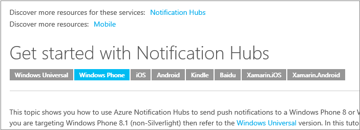

<properties
    title="required"
    pageTitle="Benutzerdefinierte Abzug Erweiterungen in unseren technischen Artikeln verwendet werden"
    description="Listet die benutzerdefinierten Abzug Erweiterungen, die eingebettete Videos, Notizen und Tipps, wieder verwendbaren Inhalt und anderen Elementen in azure.microsoft.com technische Artikel zu aktivieren."
    services=""
    solutions=""
    documentationCenter=""
    authors="tysonn"
    manager="carolz"
    editor=""/>

<tags
    ms.service="contributor-guide"
    ms.devlang=""
    ms.topic="article"
    ms.tgt_pltfrm=""
    ms.workload=""
    ms.date="01/22/2015"
    ms.author="tysonn"/>

## Abzug für Azure.microsoft.com

Allgemeine Abzug Tipps finden Sie unter [Abzug Grundlagen](https://help.github.com/articles/markdown-basics/) und unsere [Abzug Spickzettel](./media/documents/markdown-cheatsheet.pdf?raw=true). Wenn Sie Artikel Querverbindungen Abzug erstellen müssen, finden Sie unter [verknüpfen Anleitungen] (. / create-links-markdown.md#markdown-syntax-for-acom-relative-links.md/).

Azure.Microsoft.com unterstützt [Geländer Codeblöcke](https://help.github.com/articles/github-flavored-markdown/#fenced-code-blocks) und [Syntax hervorheben](https://help.github.com/articles/github-flavored-markdown/#syntax-highlighting). ACOM unterstützt jedoch nur eine Syntax Hervorhebung Farbschema, unabhängig von der Sprache, die Sie in einem Codeblock angeben.

## Benutzerdefinierte Abzug Erweiterungen in unseren technischen Artikeln verwendet werden

Unsere Artikel verwenden GitHub flavored Abzug für die meisten Artikel Formatierung - Absätze, links, Listen, usw. Überschriften. Aber wir verwenden benutzerdefinierter Abzug Erweiterungen, benötigen wir umfangreichere Formatierung in den gerenderten Seiten azure.microsoft.com. So sieht die Erweiterungen, die derzeit verwendeten aus:

+ [Notizen und Tipps]
+ [Enthält]
+ [Eingebettete videos]
+ [Technologie und Plattform Selektoren]

## Notizen und Tipps

Sie können die 4 Arten von Notizen und Tipps auswählen:

- AZURE. NOTIZ
- AZURE. WARNUNG
- AZURE. TIPss
- AZURE. WICHTIGE

###Verwendung
Im Allgemeinen verwenden Sie, Notizen und Tipps überall auf Ihre Artikel nur in Ausnahmefällen. Wenn Sie diese verwenden, wählen Sie den entsprechenden Hinweis oder Tipp:

- Verwenden von AZURE. Hinweis um neutrale oder positive Informationen hervorzuheben, die Schwerpunkt auf oder ergänzenden Informationen Hauptargumente Hauptfenster Text ein. Eine Notiz liefert Informationen, die nur in Ausnahmefällen angewendet wird.

  

- Verwenden von AZURE. Warnung an den Benutzer, eine Bedingung zu benachrichtigen, die in der Zukunft ein Problem verursachen können. Beispielsweise möglicherweise eine bestimmte Option auswählen oder eine bestimmte Auswahl treffen dauerhaft Sie eines bestimmten Szenarios sperren.

  

- Verwenden von AZURE. Tipp, damit Ihre Benutzer die Methoden und in den Text auf ihre speziellen Bedürfnisse beschriebenen Verfahren anwenden. Ein Tipp möglicherweise auch alternative Methoden vorschlagen, die möglicherweise nicht eindeutig. Tipps, sind jedoch nicht unbedingt die grundlegende Kenntnisse über den Text.

  

- Verwenden von AZURE. WICHTIGE Informationen bereitzustellen, die für den Abschluss eines Vorgangs ankommt.

  

Während diese Notizen und Tipps Codeblöcke, Bilder, Listen und Links unterstützen, versuchen Sie, Ihre Notizen und Tipps einfach und übersichtlich zu halten. Wenn Sie sich selbst komplexe Notizen mit vielen Formatierung erstellen gefunden haben, möglicherweise, die bei der Anmeldung, dass Sie nur einen anderen Teil in den Textkörper des Artikels benötigen. Und zu viele Notizen in einem Artikel stören und schwer zu scannen oder gelesen werden.

###Beispiel für Abzug

Die alle Beispielen wird eine AZURE. HINWEIS. Um ein Tipp, Warnung oder wichtig verwenden, ersetzen Sie "Notiz" in den Abzug aus:

    > [AZURE.TIP]

    > [AZURE.WARNING]

    > [AZURE.IMPORTANT]

Einzelnen Absatz:

    > [AZURE.NOTE] Um dieses Lernprogramms abgeschlossen haben, müssen Sie ein aktives Microsoft Azure-Konto verfügen. Wenn Sie kein Konto haben, können Sie ein kostenloses Testversion Konto nur wenigen Minuten erstellen.

Multiparagraph:

    > [AZURE.NOTE] Um dieses Lernprogramms abgeschlossen haben, müssen Sie ein aktives Microsoft Azure-Konto verfügen.
    >
    > Wenn Sie kein Konto haben, können Sie den [ein kostenloses Testversion Konto erstellen](http://www.windowsazure.com/pricing/free-trial/) , in nur ein paar Minuten.

## Enthält

Wieder verwendbare Text in unseren GitHub Repository befindet sich in Dateien, dass wir nennen "enthält". Wenn Sie Text, die in mehreren Artikeln verwendet werden vorliegt, fügen Sie einen Verweis auf die Datei wieder verwendbaren Informationen aus. Die einschließen selbst ist eine einfache Abzug (.md)-Datei. Sie können eine gültige Abzug, einschließlich Text, Bildern und Links enthalten. Alle Dateien in muss Abzug enthalten [der / Verzeichnis enthält](https://github.com/Azure/azure-content/tree/master/includes) im Stammverzeichnis des Repositorys. Wenn im Artikel veröffentlicht wird, ist der Text einschließen nahtlos in der veröffentlichten Thema integriert.

- Wir verwenden eine spezielle Syntax in Bezug auf eine einschließen.

- Mediendateien, die Sie in einer einschließen ablegen müssen in einem Medienordner speziell für das erstellt werden. Enthält Ordner für Medien in [den Ordner Azure-Inhalt/umfasst/Medien](https://github.com/Azure/azure-content/tree/master/includes/media)gehören. Medien Verzeichnis sollte keine Bilder in ihre Root enthalten. Wenn das nicht Bilder verfügt, ist ein entsprechendes Medien Verzeichnis nicht erforderlich.

###Verwendung

- Verwenden Sie enthält Stelle benötigten denselben Text mehrere Artikel, die angezeigt werden sollen.

- Enthält für signifikante Inhaltsmengen - eines Absatzes oder zwei, eine freigegebene Prozedur oder eines freigegebenen Abschnitts verwendet werden sollen. Verwenden Sie diese nicht für kleinere Einheit als einen Satz. **sie sind nicht für Produktnamen**.

- Vergewissern Sie sich alle der Text in einer einschließen in vollständige Sätze oder Ausdrücke, die nicht auf vorherige Text oder folgenden Text im Artikel, die das verweist abhängen geschrieben ist. Dieser Leitfaden ignorieren erstellt eine nicht übersetzbare Zeichenfolge im Artikel, die mit der lokalisierten Umbrüche. 

- Einbetten nicht enthält, die in den anderen enthält. Sie werden von der Veröffentlichung System DPS nicht unterstützt.

- Freigeben von Medien zwischen Dateien nicht. Verwenden Sie eine separate Datei mit einem eindeutigen Namen für jede einschließen und Artikel aus. Speichern der Media-Datei im Ordner Media das zugeordnet.

- Verwenden Sie eine einschließen nicht als nur der Inhalt des einen Artikel aus.  Enthält zusätzliche auf den Inhalt in den Rest dieses Artikels werden sollen.

- Da umfasst alle muss der / umfasst Directory, der Pfad für eine einschließen aus einem Artikel ist immer

    .. / enthält

- Wiederholen Sie einen Link oder Bild Filename Verweis in die Artikel und in das nicht. Hinzufügen von "-einschließen" auf den Link Bezug oder Medien Dateinamen Vermeiden von bekannten Bezug:

 **Hyperlink-Referenz**

 Ändern: odata.org zu: odata.org einbeziehen

 **Bild-Referenz**

 Änderung: table.png an: include.png-Tabelle

###Beispiel für Abzug
Die Syntax für das Hinzufügen einer einschließen zu einem Artikel Dokumentation lautet:

    [AZURE.INCLUDE [include-short-name](../includes/include-file-name.md)]

Beispiel

    [AZURE.INCLUDE [howto-blob-storage](../includes/howto-blob-storage.md)]

Im erste Teil der einschließen ist der Name einschließen, ohne den Pfad und ohne die Erweiterung .md. Die zweite Komponente ist der relative Pfad zu der einschließen in der / Verzeichnis mit der Erweiterung .md enthält.

###Darstellen

Das wird in der Seite gerenderten GitHub wie folgt gerendert:

 [AZURE. EINSCHLIEßEN Sie so wird's gemacht-Blob-Speicher]

Im gerenderten HTML auf azure.microsoft.com, der HTML-Code aus der umfasst die restlichen Dokuments HTML zusammengeführt. Der HTML-Code enthält jedoch eine HTML Kommentar mit dem Original einschließen Abzug Filename und den GitHub Commit Hash. Dieser Kommentar ist für die Problembehandlung, damit der Inhalt der Quelle einfach zu identifizieren und zu Sie im GitHub finden enthalten:

  

## Eingebettete videos

Unsere technische Artikel unterstützen Embeddeded Videos in technischen Artikeln, solange die Videos auf der Microsoft- [Channel 9](http://channel9.msdn.com/) -Website befinden. Die Videos von Channel 9 müssen mit [der azure.microsoft.com Video Center](http://azure.microsoft.com/documentation/videos/home/)integriert werden. Wir unterstützen derzeit keine eingebettete YouTube-Videos. Wenn Sie einen Mitwirkenden Community sind, können Sie Willkommen auf YouTube verknüpfen, wenn das Video an, die, das Sie bereitstellen möchten, es veröffentlicht wird. Microsoft Mitwirkenden sollten Channel 9 und im Video Center verwenden.

### Verwendung

- Stellen Sie sicher, dass das Video im Video Center ist.

- Kopieren Sie die video-ID aus die benutzerfreundliche URL des Videos auf Kanal 9 oder aus der Mitte der Azure-Video. Die video-ID für das Video am [http://azure.microsoft.com/documentation/videos/azure-scheduler-unusual-schedules/](http://azure.microsoft.com/documentation/videos/azure-scheduler-unusual-schedules/) beträgt beispielsweise **Azure-Scheduler-ungewöhnliche-Zeitpläne**.

### Syntax

    > [AZURE.VIDEO video-id-string]

### Darstellen

Auf GitHub: [https://github.com/Azure/azure-content-pr/blob/master/articles/web-sites-backup.md](https://github.com/Azure/azure-content-pr/blob/master/articles/web-sites-backup.md)

Veröffentlichten Artikel: [http://azure.microsoft.com/documentation/articles/web-sites-backup/](http://azure.microsoft.com/documentation/articles/web-sites-backup/)

## Technologie und Plattform Selektoren

Verwenden Sie Technologie und Plattform Switchers in technische Artikel, wenn Sie mehrere Arten von im gleichen Hilfeartikel Adresse Unterschiede bei Implementierung über Technologien oder Plattformen erstellen. Dies gilt in der Regel am häufigsten für unsere mobilen Plattform Inhalte für Entwickler. Es gibt derzeit zwei verschiedene Arten von Selektoren, [einfachen Selektoren](#simple-selectors) und [bidirektionale Selektoren](#two-way-selectors).

Da die gleichen Ansichtsauswahl Abzug in den einzelnen Themen in die Markierung gesendet werden, empfehlen wir eine einschließen die Auswahl für Ihr Thema versehen wird und anschließend die einschließen aller Themen, in denen eine Auswahl verwendet.

###Einfache Selektoren

Einfache (unidirektionale) Selektoren Rendern als eine Reihe von Optionsfeldern direkt unterhalb des Titels. Verwenden Sie diese Schaltflächen, wenn Kunden von Themen in einer einzelnen Plattform oder Technologie festlegen, wie .NET, Node.js und Java auswählen müssen.  Verwenden Sie die benutzerdefinierten Abzug Erweiterung für alle Selektoren: Verwenden Sie keine HTML-Code für Selektoren.  

Finden Sie unter [Erste Schritte mit Benachrichtigung Hubs](http://azure.microsoft.com/documentation/articles/notification-hubs-windows-phone-get-started/) zu sehen, wie der Autor 8-Versionen der gleichen Artikel, aber verwendeten Selektoren zum Aktivieren der Navigation über alle erstellt.

####Syntax

    > [AZURE.SELECTOR]
    - [1 # Etikett verknüpfen](link #1 url)
    - [Bezeichnung Link #2](link #2 url)

Beispiel:

    > [AZURE.SELECTOR]
    - [Universal Windows](../articles/notification-hubs-windows-store-dotnet-get-started/)
    - [Windows Phone](../articles/notification-hubs-windows-phone-get-started/)
    - [iOS](../articles/notification-hubs-ios-get-started/)
    - [Android](../articles/notification-hubs-android-get-started/)
    - [Kindle](../articles/notification-hubs-kindle-get-started/)
    - [Baidu](../articles/notification-hubs-baidu-get-started/)
    - [Xamarin.iOS](../articles/partner-xamarin-notification-hubs-ios-get-started/)
    - [Xamarin.Android](../articles/partner-xamarin-notification-hubs-android-get-started/)

#### Darstellen

Die vorstehende Abbildung zeigt die Wiedergabe auf azure.microsoft.com an. Auf den Seiten gerenderten GitHub gerendert werden die Selektoren als Aufzählung von Links ein.

###Bidirektionale Selektoren

Bidirektionale Selektoren ermöglicht Benutzern einer Themen aus einer zwei-Wege-Matrix. Dies ist wichtig, wenn eine Azure Technologie, wie etwa Mobile Dienste mehrere Back-End-Plattformen als auch mehrere Clients unterstützt. Beachten Sie Folgendes:

- Während des Entwurfs wurde als `(Platform | Backend)`, der Text Dropwdown jetzt angepasst werden kann.
- Ein Listenelement für jeden Punkt in der Matrix nicht benötigen, aber haben Sie nur ein Element, in dem Thema URL vorhanden ist und nicht doppelt.
- Die Verknüpfung kann eine URL sein, obwohl es in der Regel ein anderes GitHub Thema ist.

Finden Sie unter [Erste Schritte mit Mobile-Dienste](http://azure.microsoft.com/en-us/documentation/articles/mobile-services-ios-get-started/) um zu sehen, wie der Autor 15 Versionen der gleichen Artikel (9 Mobilclient Plattformen und 2 Back-End-Plattformen), aber die verwendeten Auswahlzeiger Navigation über alle aktivieren erstellt. Beachten Sie, dass 3 Artikel beide Back-End-Versionen nicht.

####Syntax

    > [AZURE. ANSICHTSAUSWAHL-Liste (Dropdown1 | Dropdown2)]     -  [(Dropdown1Text1 | Dropdown2Text1)](../articles/dropdown1-text1-dropdown2-text1.md)
    - [(Dropdown1Text1 | Dropdown2Text2)](../articles/dropdown1-text1-dropdown2-text1.md)
    - [(Dropdown1Text2 | Dropdown2Text3)](../articles/dropdown1-text1-dropdown2-text1.md)
    - [(Dropdown1Text3 | Dropdown2Text4)](../articles/dropdown1-text1-dropdown2-text1.md)

Beispiel:

    > [AZURE. ANSICHTSAUSWAHL-Liste (Plattform | Back-End-])     -  [(iOS | .NET)](./mobile-services-dotnet-backend-ios-get-started-push.md)
    - [(iOS | JavaScript)](./mobile-services-javascript-backend-ios-get-started-push.md)
    - [(Windows universeller c# | .NET)](./mobile-services-dotnet-backend-windows-universal-dotnet-get-started-push.md)
    - [(Windows universeller c# | JavaScript)](./mobile-services-javascript-backend-windows-universal-dotnet-get-started-push.md)
    - [(Windows Phone | .NET)](./mobile-services-dotnet-backend-windows-phone-get-started-push.md)
    - [(Windows Phone | JavaScript)](./mobile-services-javascript-backend-windows-phone-get-started-push.md)
    - [(Android | .NET)](./mobile-services-dotnet-backend-android-get-started-push.md)
    - [(Android | JavaScript)](./mobile-services-javascript-backend-android-get-started-push.md)
    - [(iOS Xamarin | JavaScript)](./partner-xamarin-mobile-services-ios-get-started-push.md)
    - [(Xamarin Android | JavaScript)](./partner-xamarin-mobile-services-android-get-started-push.md)

#### Darstellen

Die vorstehende Abbildung zeigt die Wiedergabe auf azure.microsoft.com. Auf den Seiten gerenderten GitHub gerendert werden die Selektoren als Aufzählung von Links ein.

<!--Anchors-->
[Notizen und Tipps]: #notes-and-tips
[Enthält]: #includes
[Eingebettete videos]: #embedded-videos
[Technologie und Plattform Selektoren]: #technology-and-platform-selectors

###Mitwirkenden Leitfaden für Links

- [Artikel (Übersicht)](./../README.md)
- [Index der Artikel mit Hinweisen](./contributor-guide-index.md)
