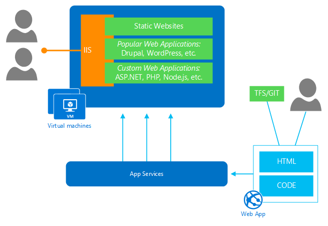

## Infos zur app-Dienst

Azure-virtuellen Computern kann eine Vielzahl von Aufgaben Hostinganbieter Cloud behandeln. Erstellen und Verwalten einer virtuellen Computer-Infrastruktur erfordert spezielle Fachkenntnisse und erheblichen Aufwand jedoch. Wenn Sie Kontrolle über die virtuellen Computern müssen nicht, die ausgeführt werden vollständige, Web apps, mobile-app Downloadzeit, API apps usw., ist es eine Lösung einfachere (und kostengünstigere): *Plattform als Service* (PaaS). Mit PaaS übernimmt Azure die meisten Management Aufgaben für die virtuellen Computern, die Ihre Programme ausgeführt werden. [App-Verwaltungsdienst Azure](../articles/app-service/app-service-value-prop-what-is.md) ist, dass eine vollständig verwaltete PaaS Geschenk mit ermöglicht es Ihnen, erstellen und Bereitstellen skalieren unternehmensweite apps in Sekunden an.

App-Dienst ist die beste Wahl für viele Arten von Auslastung. Einem Unternehmen sollten erstellen oder Migrieren einer kommerziellen Websites, die kann Millionen von Treffer Woche behandeln und in mehreren Data Center auf der ganzen Welt bereitgestellt. Die zum selben Unternehmen möglicherweise auch eine Line-of-Business-app, die verfolgt Kostenberichte für authentifizierte Benutzer aus Active Directory des Unternehmens, und die app ist eine Komponente mobilen Gerät, und verbinden, um Ressourcen und Geschäftsprozessen lokal. Kostenberichte erfordern möglicherweise regelmäßigen Hintergrundaufträge zu berechnen und zusammenfassen große Mengen von Informationen. IT-Berater möglicherweise eine gängiger open Source-Anwendung zum Einrichten einer Content Management-System für ein kleines Unternehmen anpassen. Die folgende Abbildung zeigt einige der Arten von Web apps, die in der App-Verwaltungsdienst Azure ausgeführt werden können.

**Abbildung: Azure App-Verwaltungsdienst unterstützt statische Webseiten, beliebte Webanwendungen und benutzerdefinierte Webanwendungen mit verschiedenen Technologien erstellt. Sie können auch mobile Downloadzeit, API-app und Berechnen von nicht-Auslastung (mit WebJobs) ausführen.**

Mit Azure-App-Verwaltungsdienst können Sie auch alle Arten von berechnen Arbeitsbelastung mithilfe der Funktion [WebJobs](../articles/app-service-web/websites-webjobs-resources.md) ausführen.

Azure-App-Dienst bietet Ihnen die Möglichkeit, auf freigegebenen virtuellen Computern, die mehrere apps, die von mehreren Benutzern erstellte enthalten oder auf virtuellen Computern, die von Ihnen verwendeten ausgeführt. Virtuellen Computern sind ein Bestandteil von Azure-App-Verwaltungsdienst verwaltet Ressourcenpools und somit hohe Zuverlässigkeit und Fehlertoleranz erlauben.

Erste Schritte ist einfach. Benutzer können mit Azure-App-Verwaltungsdienst wählen Sie aus einer Reihe von Applications, Framework und Vorlage und erstellen Sie eine Web-app in Sekunden. Dann können Sie ihre bevorzugten Development Tools (WebMatrix, Visual Studio, alle anderen Text-Editor) und -Optionen steuern Quelle auf fortlaufende Integration einrichten und im Team entwickeln. Programme, die auf einer MySQL-DB aufsetzen können einer MySQL nutzen, die Dienst für Azure ClearDB, indem Sie einen Microsoft-Partner zur Verfügung gestellt.

Entwickler können große, skalierbare Webanwendungen mit Azure-App-Verwaltungsdienst erstellen. Die Technologie unterstützt das Erstellen von Applications mit ASP.NET, PHP, Node.js und Python. Applikationen können Kurznotizen Sitzungen, beispielsweise und viele vorhandene Web apps können diese Cloud-Plattform mit keine Änderungen verschoben werden. Web apps auf App-Verwaltungsdienst Azure aufgebaut können weitere Aspekte des Azure, z. B. Dienstbus, SQL-Datenbank und Blob-Speicher. Sie können auch mehrere Kopien der Anwendung in anderen virtuellen Computern, mit Azure App-Verwaltungsdienst automatisch laden Lastenausgleich Anfragen über diese ausführen. Und da neue Instanzen der Web-app in virtuellen Computern, die bereits vorhanden sind erstellt werden, beginnen eine neue Anwendungsinstanz sehr schnell geschieht; Es ist wesentlich größer als Warten eines neuen virtuellen Computers erstellt werden.

Wie in der [Abbildung](#appservice_diagram) oben gezeigt wird, können Sie Code und andere von Webinhalten auf verschiedene Weise in Azure-App-Verwaltungsdienst veröffentlichen. Sie können FTP, FTPS oder Microsoft WebDeploy-Technologie verwenden. Azure App-Verwaltungsdienst unterstützt auch für die Veröffentlichung Code aus der Quelle Steuerungssysteme, einschließlich Git, GitHub, CodePlex, BitBucket, Dropbox, weshalb, Team Foundation Server und cloudbasierten Team Foundation-Dienst.
