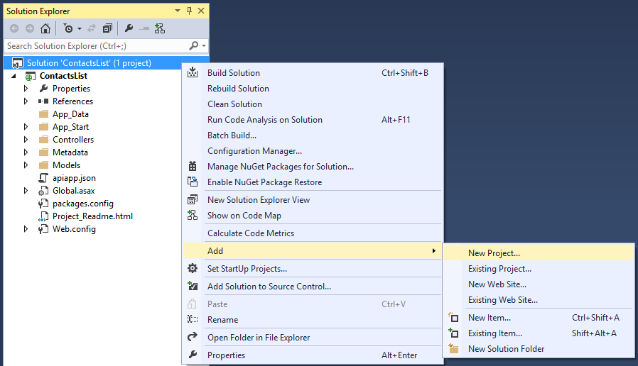
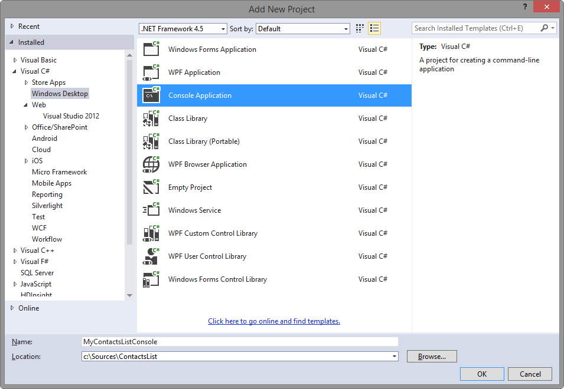
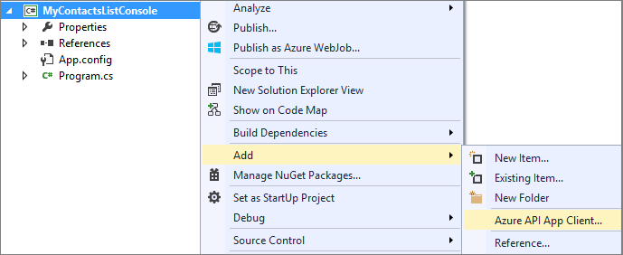
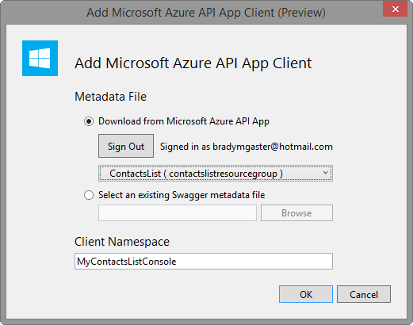
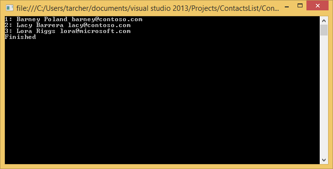

## Generieren eines app-Clients-API 

Die API App-Tools in Visual Studio erleichtern C#-Code generieren, die vom Desktop, Store und mobile-apps zu Ihrer Azure-API Apps Anrufe. 

1. Öffnen Sie in Visual Studio die Lösung, die die API app aus dem [app erstellen API](../articles/app-service-api/app-service-dotnet-create-api-app.md) Thema enthält. 

2. **Lösung-Explorer**mit der rechten Maustaste in der Lösung, und aktivieren Sie das **Hinzufügen** > **Neues Projekt**.

    

3. Führen Sie die folgenden Schritte aus, klicken Sie im Dialogfeld **Neues Projekt hinzufügen** :

    1. Wählen Sie die **Windows-Desktop** -Kategorie ein.
    
    2. Wählen Sie die **Anwendung Console** -Projektvorlage aus.
    
    3. Nennen Sie das Projekt an.
    
    4. Klicken Sie auf **OK** , um das neue Projekt in Ihre vorhandene Lösung generieren.
    
    

4. Mit der rechten Maustaste in des neu erstellten Console-Anwendung-Projekts, und wählen Sie **Hinzufügen** > **Client-Azure-API App**. 

    
    
5. Führen Sie im Dialogfeld **Microsoft Azure API App-Client hinzufügen** die folgenden Schritte aus: 

    1. Wählen Sie die Option **herunterladen** . 
    
    2. Wählen Sie aus der Dropdownliste die API-app, die Sie zuvor erstellt haben. 
    
    3. Klicken Sie auf **OK**. 

    

    Der Assistent die API-Metadaten-Datei nicht herunterladen und generieren eine eingegebene Schnittstelle zum Aufrufen der API-App.

    

    Sobald der zweiten Generation Code abgeschlossen ist, sehen Sie einen neuen Ordner im Explorer-Lösung mit dem Namen der app API. Dieser Ordner enthält den Code, der Client und Datenmodelle implementiert. 

    

6. Öffnen Sie die Datei **Program.cs** der Stammwebsitesammlung Projekt, und Ersetzen Sie die **Main** -Methode mit den folgenden Code: 

        static void Main(string[] args)
        {
            var client = new ContactsList();
    
            // Send GET request.
            var contacts = client.Contacts.Get();
            foreach (var c in contacts)
            {
                Console.WriteLine("{0}: {1} {2}",
                    c.Id, c.Name, c.EmailAddress);
            }
    
            // Send POST request.
            client.Contacts.Post(new Models.Contact
            {
                EmailAddress = "lkahn@contoso.com",
                Name = "Loretta Kahn",
                Id = 4
            });
    
            Console.WriteLine("Finished");
            Console.ReadLine();
        }

## Testen des app-Clients-API

Nachdem der codierten API-app ist es Zeit zum Testen des Codes.

1. Öffnen Sie die **Lösung Explorer**.

2. Mit der rechten Maustaste in der Console-Anwendungs, die Sie im vorherigen Abschnitt erstellt haben.

3. Wählen Sie im Kontextmenü der Console-Anwendung **Debuggen > neue Instanz starten**. 

4. Einem Windows Console sollte geöffnet und zeigt alle Kontakte. 

    

5. Drücken Sie die **EINGABETASTE** , um das Console-Fenster zu schließen.          
