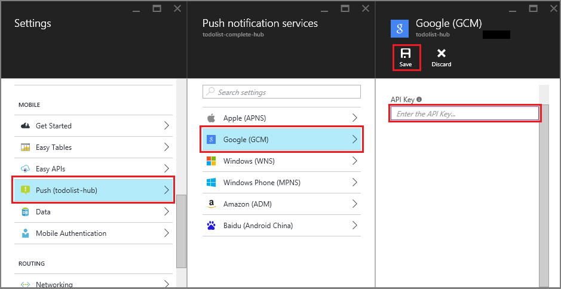

1. Klicken Sie im [Azure-Portal](https://portal.azure.com/)auf **Alle durchsuchen** > **App Services** > Ihre Mobile-App Back-End. Klicken Sie unter **Einstellungen**auf **App Dienst Pushbenachrichtigungen**klicken Sie auf die Namen der Benachrichtigung Hub.

2. Wählen Sie in **Google (GCM)**, geben Sie den Wert von **Server-Taste** , den Sie im vorangehenden Verfahren von Firebase erhalten haben, dann klicken Sie auf **Speichern**.

    

Die Mobile-App Back-End-ist jetzt so konfiguriert, dass die Firebase Cloud Messaging verwenden, um Pushbenachrichtigungen zu Ihrer Anwendung ausführen auf einem Android-Gerät verwenden den Benachrichtigung Hub zu senden.

<!-- URLs. -->

<!-- images -->
