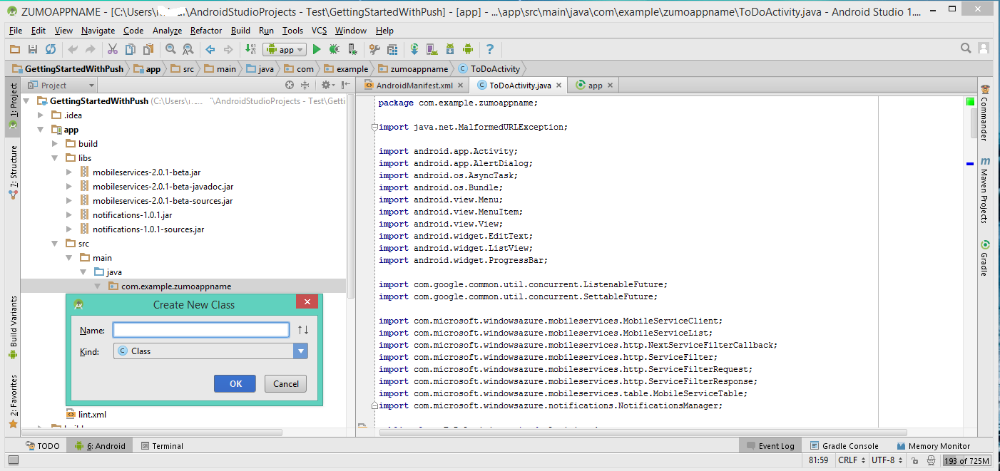

1. Öffnen Sie die Datei in Ihrem Projekt **app** `AndroidManifest.xml`. Ersetzen Sie den Code in den beiden nächsten Schritten, _`**my_app_package**`_ mit dem Namen des app-Pakets für ein Projekt, das ist der Wert von der `package` Attribut von der `manifest` Kategorie.

2. Fügen Sie die folgenden neuen Berechtigungen nach den vorhandenen `uses-permission` Element:

        <permission android:name="**my_app_package**.permission.C2D_MESSAGE"
            android:protectionLevel="signature" />
        <uses-permission android:name="**my_app_package**.permission.C2D_MESSAGE" />
        <uses-permission android:name="com.google.android.c2dm.permission.RECEIVE" />
        <uses-permission android:name="android.permission.GET_ACCOUNTS" />
        <uses-permission android:name="android.permission.WAKE_LOCK" />

3. Fügen Sie den folgenden Code nach der `application` Kategorie Öffnen:

        <receiver android:name="com.microsoft.windowsazure.notifications.NotificationsBroadcastReceiver"
                                        android:permission="com.google.android.c2dm.permission.SEND">
            <intent-filter>
                <action android:name="com.google.android.c2dm.intent.RECEIVE" />
                <category android:name="**my_app_package**" />
            </intent-filter>
        </receiver>

4. Öffnen Sie die Datei *ToDoActivity.java*, und fügen Sie die folgenden Import-Anweisung hinzu:

        import com.microsoft.windowsazure.notifications.NotificationsManager;

5. Fügen Sie die folgende private Variable zur Klasse: Ersetzen _`<PROJECT_NUMBER>`_ mit die Nummer des Projekts, Ihre app im vorangehenden Verfahren von Google zugewiesen:

        public static final String SENDER_ID = "<PROJECT_NUMBER>";

6. Ändern der Definition der *MobileServiceClient* von **private** in **öffentlichen statischen**, sodass sie jetzt wie folgt aussieht:

        public static MobileServiceClient mClient;

7. Als Nächstes müssen wir fügen Sie eine neue Klasse um Benachrichtigungen zu behandeln. Öffnen Sie im Projekt-Explorer, die **Src** => **Hauptfenster** => **Java** -Knoten und der rechten Maustaste auf den Knoten des Pakets Namen: Klicken Sie auf **neu**, und klicken Sie auf **Java-Klasse**.

8. **Name** geben `MyHandler`, klicken Sie dann auf **OK**.

    

9. Ersetzen Sie in der Datei MyHandler mit die Class-Deklaration

        public class MyHandler extends NotificationsHandler {

10. Nehmen Sie die folgenden Import-Anweisung für die `MyHandler` Class:

        import com.microsoft.windowsazure.notifications.NotificationsHandler;
        import android.app.NotificationManager;
        import android.app.PendingIntent;
        import android.content.Context;
        import android.content.Intent;
        import android.os.AsyncTask;
        import android.os.Bundle;
        import android.support.v4.app.NotificationCompat;

11. Als Nächstes fügen Sie dieses Mitglied zu den `MyHandler` Klasse:

        public static final int NOTIFICATION_ID = 1;

12. In der `MyHandler` Klasse, fügen Sie den folgenden Code ein, um die **OnRegistered** -Methode, die Ihrem Gerät mit den mobilen Dienst Benachrichtigung Hub registriert, außer Kraft setzen.

        @Override
        public void onRegistered(Context context,  final String gcmRegistrationId) {
            super.onRegistered(context, gcmRegistrationId);

            new AsyncTask<Void, Void, Void>() {

                protected Void doInBackground(Void... params) {
                    try {
                        ToDoActivity.mClient.getPush().register(gcmRegistrationId);
                        return null;
                    }
                    catch(Exception e) {
                        // handle error             
                    }
                    return null;            
                }
            }.execute();
        }

13. In der `MyHandler` Klasse, fügen Sie den folgenden Code ein, um die Methode **OnReceive** außer Kraft setzen, wodurch die Benachrichtigung anzeigen, wenn es eingegangen ist.

        @Override
        public void onReceive(Context context, Bundle bundle) {
                String msg = bundle.getString("message");

                PendingIntent contentIntent = PendingIntent.getActivity(context,
                        0, // requestCode
                        new Intent(context, ToDoActivity.class),
                        0); // flags

                Notification notification = new NotificationCompat.Builder(context)
                        .setSmallIcon(R.drawable.ic_launcher)
                        .setContentTitle("Notification Hub Demo")
                        .setStyle(new NotificationCompat.BigTextStyle().bigText(msg))
                        .setContentText(msg)
                        .setContentIntent(contentIntent)
                        .build();

                NotificationManager notificationManager = (NotificationManager)
                        context.getSystemService(Context.NOTIFICATION_SERVICE);
                notificationManager.notify(NOTIFICATION_ID, notification);
        }

14. Aktualisieren Sie die **OnCreate** -Methode der Klasse *ToDoActivity* zum Registrieren der Benachrichtigung Ereignishandler Klasse, klicken Sie in der Datei TodoActivity.java. Vergewissern Sie sich diesen Code hinzufügen, nachdem die *MobileServiceClient* instanziiert wird.

        NotificationsManager.handleNotifications(this, SENDER_ID, MyHandler.class);

    Die app wurde aktualisiert, um Pushbenachrichtigungen zu unterstützen.
